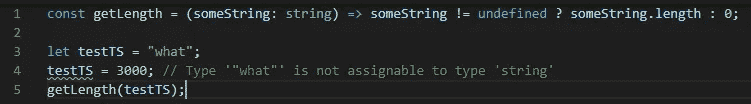
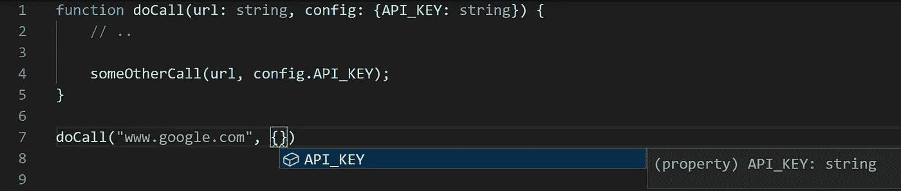
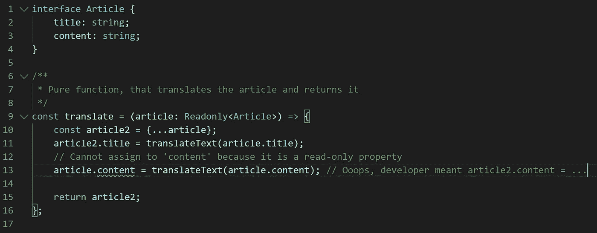

# 使用 TypeScript 而不是普通 JavaScript 的 10 个理由

> 原文：<https://betterprogramming.pub/10-reasons-to-use-typescript-over-vanilla-javascript-a49256e527d3>

## 静态类型语言的优势

[法托斯 Bytyqi](https://unsplash.com/@fatosi?utm_source=medium&utm_medium=referral) 在 [Unsplash](https://unsplash.com?utm_source=medium&utm_medium=referral) 上的照片。

最近，我读了一篇很受欢迎的文章，名为 [7 个不使用打字稿的好理由](https://medium.com/javascript-in-plain-english/7-really-good-reasons-not-to-use-typescript-166af597c466)。虽然有些观点确实很有趣，但我在这里向您提出使用 TypeScript 的 10 个惊人的理由！

# 它降低了代码被窃听的风险

犯错误是任何开发人员的天性。一半的时间，我们都在试图找出为什么一个解决方案(还)行不通。在 JavaScript 中，原因可能只是简单的打字错误。例如，使用一个刚刚设置为数字的变量作为字符串，在 JavaScript 中完全可以，但在 TypeScript 中不能编译。JavaScript 开发人员已经有这个问题很长时间了。甚至引入了严格模式来减少这些错误。

如果您使用 TypeScript，上面的代码没有意义，也不会出现在您的代码库中。然而，如果您使用 JavaScript，这些行可能会在您的存储库中结束。尽管 TypeScript 不能保护您免受运行时类型错误的影响，但它确实降低了您编写错误代码的风险。

# 快速失效原则

在您的代码可以在任何地方运行之前，TypeScript 引入了一个新的强制步骤:将您的代码转换成 JavaScript。当编写新代码时，这一步每天可能会失败几次。拥有一种非静态类型的语言会延迟错误的失败和检测，直到你运行你的代码。对于任何现代语言来说，可空类型都是非常重要的，并且有助于扩展你的代码。

Adrian Colyer 在 2017 年写了一篇非常有趣的文章，我推荐:[键入还是不键入:量化 JavaScript 中可检测的 bugs】。在文章的最后，你可以找到一个实验，Eric 调查了 JavaScript 项目中的 400 个公共 bug。其中的 59 个(15%)可能已经被捕获，因此从未通过使用打字稿或](https://blog.acolyer.org/2017/09/19/to-type-or-not-to-type-quantifying-detectable-bugs-in-javascript/)[流](https://github.com/facebook/flow)将其投入生产。注意:在本文中，只考虑了减少 bug 代码。在本文中，我们将进一步讨论 TypeScript 的优势。

# 代码库中的更多信息/文档

编写可重用的代码和可重用的组件是目前前端开发的主题。重新发明轮子容易出错，而且成本太高。因此，最好使用现有的库或现有的代码。TypeScript 向您的代码中添加了附加信息以及应该如何使用它，并且它强制执行这种用法。附带的 TypeScript 代码固有地包含更多非常相关的信息，例如类型化签名。这是我经常阅读 JavaScript 代码时感到困惑的事情之一。您要么需要以 JSDoc 的形式提供信息，要么在某种外部文档中提供信息(不在代码内部)。这将降低开发人员大量重用现有代码的速度。

当然，阅读和编写文档仍然是必不可少的，但是打字的启发使您的代码更具可读性。对于那些还不太适合你的代码库的人来说尤其如此。Intellisense 功能对 Typescript 更有用，因为您可以访问类型化的签名信息。

Visual Studio 代码可以自动建议 API_KEY 作为一个属性，因为它知道`doCall`希望它出现在 config 对象中。

从短期来看，使用 TypeScript 有时意味着更多的输入工作。此外，由于 TypeScript 被转换成 JavaScript，并与 JavaScript 代码库混合在一起，所以有时您不得不与它斗争，并在某些地方关闭它。但是从长远来看，TypeScript 是可伸缩的，而 JavaScript 却不是。今天使用 TypeScript 将有助于您将来的初级和高级开发人员。

# TypeScript 比 JavaScript 拥有更多的特性

TypeScript 提供了比 JavaScript 更多的特性。虽然静态类型检查显然是最相关的一种，但它并没有就此结束。TypeScript 最初在 JavaScript 之前提供的大多数特性现在都已经在 JavaScript 中实现了。然而，TypeScript 仍然有优势，因为它比 JavaScript 运行得更快。其他特性包括:接口、名称空间、泛型、抽象类、数据修饰符、选项、函数重载、装饰器、类型实用程序和关键字`readonly`。涵盖所有这些特性并不是本文的一部分，但是这里有一个关于`readonly` TypeScript util 的漂亮例子:

# 更好的重构和工具

重构类型脚本代码比使用非类型语言要容易得多。我目睹过 JavaScript 开发人员在整个存储库中使用搜索和替换来重命名变量，之后有几个单元测试立即失败。使用 TypeScript，您可以在代码中获得额外的语义。当使用一个接口或类时，你让编译器知道你的对象将包含什么字段。现在，重命名接口、类或枚举的字段比以往任何时候都容易。只需使用 VSCode 或 IntelliJ 的重构功能，就能见证文件之间的美妙之处。

# 它被许多大公司使用，有一个大的社区，并且是 Angular 的主要语言

一项广为流传的技术拥有近乎无限的学习资源。TypeScript 肯定是这种情况，因为它有一个庞大的社区。因此，TypeScript 进入了关于顶层 JavaScript 框架的官方文档。

如果你正在考虑使用 Angular，你别无选择，只能选择 TypeScript。从 Angular 2 开始，Google 完全采用 TypeScript 作为它的主要语言。例如，如果您不使用 Angular，而是使用 React with TypeScript，这将极大地降低将来加入 Angular 项目的复杂性。

# 修复 JavaScript 中静态类型问题的替代尝试

JavaScript 没有静态类型是一个很久以前就发现的问题。这个问题在过去困扰过其他人，这些项目也在进行中。试图将静态类型添加到 JavaScript 中所付出的巨大工程努力显示了它的相关性。

例如，React 为它们的组件发布了 [PropTypes](https://reactjs.org/docs/typechecking-with-proptypes.html) ，以减少开发阶段的类型错误 TypeScript 完全涵盖了这一特性。脸书也有自己的静态类型检查库([流](https://github.com/facebook/flow))，本质上做着与 TypeScript 相同的工作。2014 年，谷歌提出了一种基于 JavaScript 的脚本语言，它扩展了 TypeScript，称为 [AtScript](https://en.wikipedia.org/wiki/AtScript) 。

# 关于 TypeScript 的其他惊人的事情

*   TypeScript 由微软编写和维护。这是一个科技巨头承诺的严肃项目，这给了这种语言一种安全感。
*   TypeScript 不仅在 MIT 许可下完全开源，而且该项目还提供了透明的路线图和提交特性请求的能力。
*   TypeScript 编译器完全是用 TypeScript 编写的，所以一旦您对这种语言有了信心，您甚至可以为代码库做出贡献并扩展它的功能！

# 结论

JavaScript 是非常宽容的，它允许开发人员编写松散的、不可读的、有潜在漏洞的代码。TypeScript 提高了可读性，毫无疑问地减少了错误，或者至少更快地捕捉到了错误——甚至在编写或运行任何单元测试之前。JavaScript 无疑正朝着正确的方向前进，但是静态类型语言的优势还没有完全显现出来。当可选的静态类型成为 JavaScript 的一部分时，使用 TypeScript 是最好的准备。

我希望我能够让您更好地理解 TypeScript 提供的优势。感谢阅读。一定要让我知道你的想法！