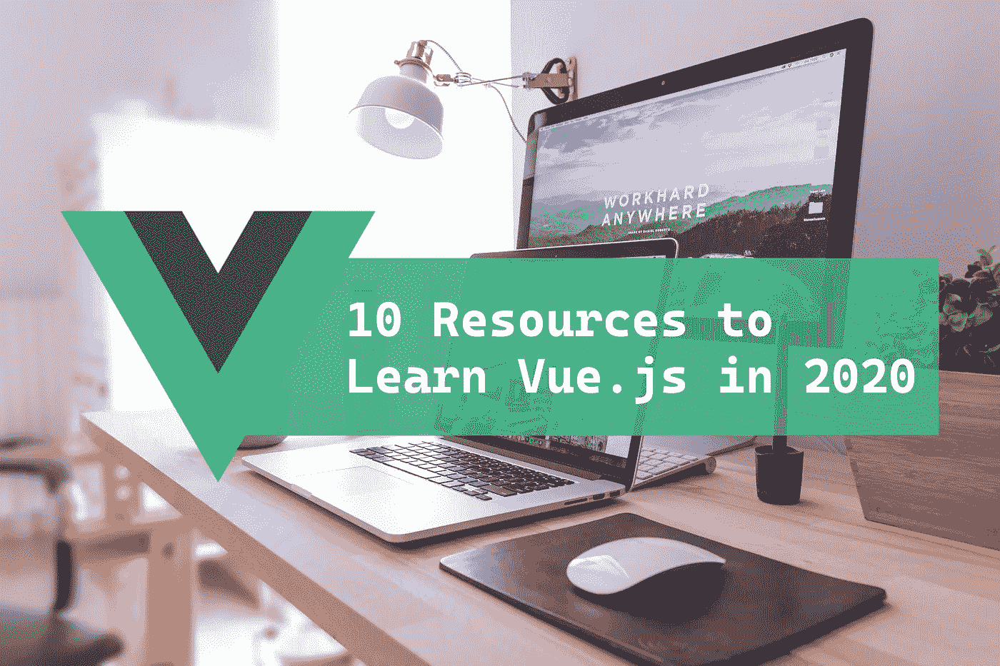
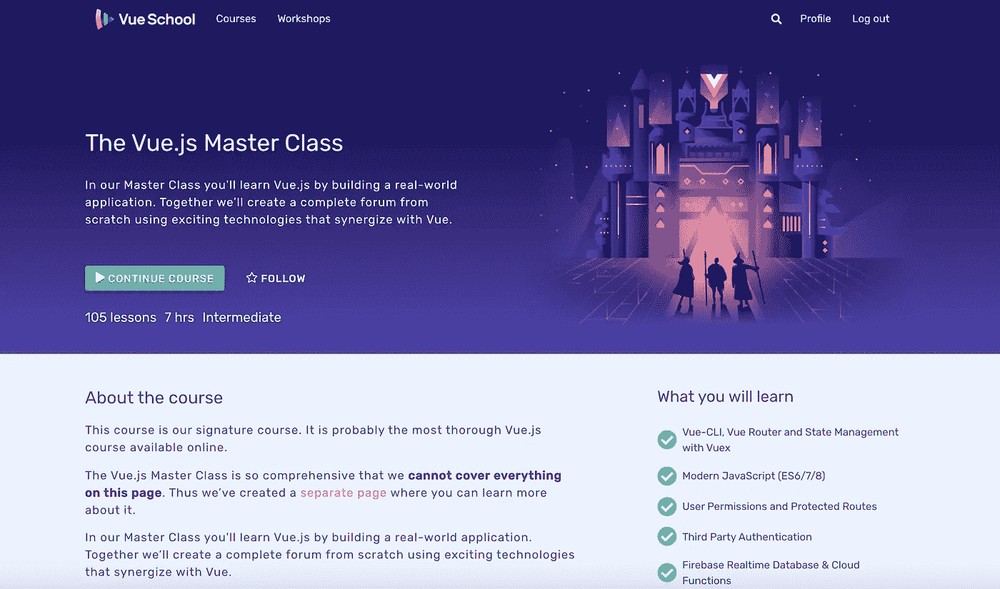
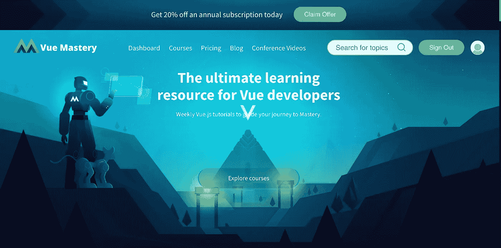
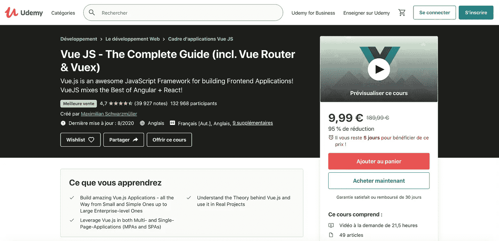
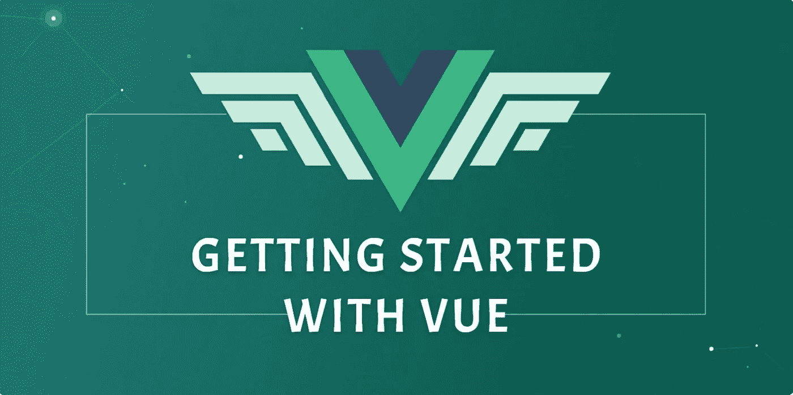
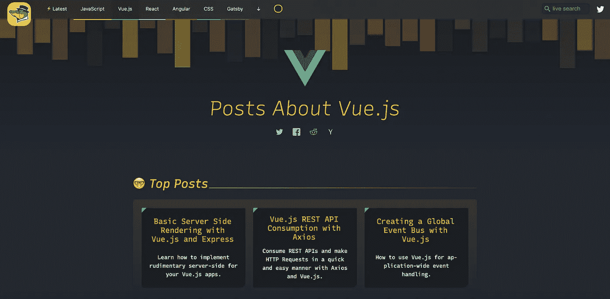
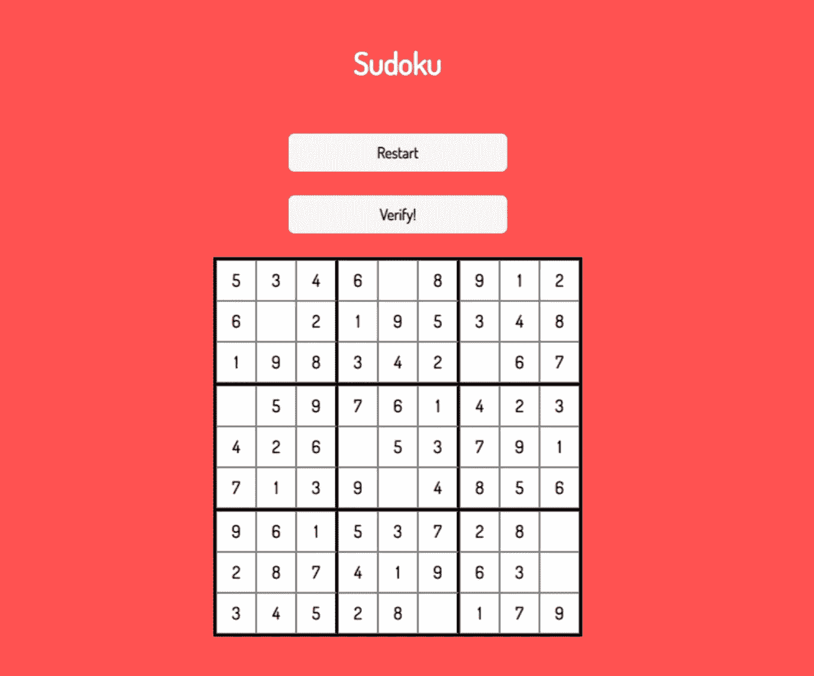
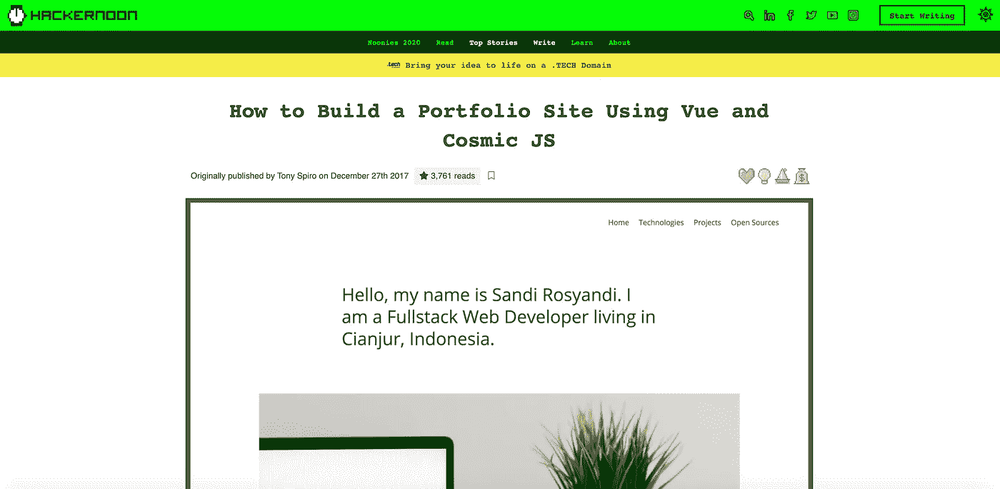

# 学习 Vue.js 的 10 个资源

> 原文：<https://betterprogramming.pub/10-resources-to-learn-vue-js-in-2020-c596e070772>

## 成为 hirable Vue.js 开发者的完整指南

Domenico Loia 在 [Unsplash](https://unsplash.com/?utm_source=unsplash&utm_medium=referral&utm_content=creditCopyText) 上拍摄的背景照片。

在与 React 合作了几年后，我对 [Vue](https://vuejs.org/) 及其不断发展的生态系统越来越好奇。我很高兴我现在可以把我的全部时间都奉献给它，我最近加入了一家使用 Vue 作为其所有前端的公司。

太棒了！与 React 相比，学习曲线算不了什么。感觉一切都井井有条，最后，我发现保持应用程序的整洁、可读性、可维护性和可伸缩性比使用 React 要容易得多。当然，这是我个人的观点，我仍然认为使用 React 有很多好处。然而，在过去的几周里和 Vue 一起工作的快乐，出乎我的意料，让我走上了不归路，从现在开始我会写更多关于 Vue 的东西。

虽然 React 目前确实拥有最大的社区，但它也为我们开发人员带来了在 Vue 生态系统中发挥作用的巨大机会。这将产生巨大的影响，因为我个人相信 Vue 将在未来几年占据更大的市场份额。

觉得兴奋？我知道我是，作为开始，这里有十个学习 Vue.js 的好资源(不要忘记他们非常高质量的官方文档),这样你也可以踏上那段令人敬畏和充满希望的旅程！

# Vue 学校

Vue 学校平台完全致力于 Vue，是我发现的最详尽和定性的平台之一。课程从非常初级的水平开始，带你一路成为一名 hirable Vue.js 开发人员。定期添加新的课程，这有助于了解生态系统的最新动态。你可能听说过 Vue 3，这将是一个巨大的。此外，Vue 3 大师班是 Vue 学校的“进展中的工作”。

在发现初级课程的基本概念后， [Vue.js 大师班](https://vueschool.io/courses/the-vuejs-master-class)将带你进入下一个阶段。本课程将教你关于 Vue 的所有知识，同时使用 Vue-CLI 构建一个生产就绪的论坛应用程序，单文件组件，Vue 路由器，使用 Vuex 管理状态，构建 Vue 插件，添加第三方认证和使用 Firebase 的实时数据库(如果你已经查看了[我的其他文章](https://medium.com/@clairechabas)，你会知道我对 Firebase 的热爱)，以及更多。它提供了所有这些，同时向您传授了关于干净、可伸缩和可维护的 Vue 应用程序架构的最佳实践。

*费用:有些课程是免费的，完全免费每月 25 美元。*

[Vue 学堂](https://vueschool.io/courses/the-vuejs-master-class)—Vue . js 大师班

# Vue 掌握

如果你知道代码学校，你会认出它的前创始人格雷格·波拉克。他得到了几位 Vue.js 核心团队成员和其他高技能开发人员的支持。除此之外，我最喜欢 Vue Mastery 的一点是，格雷格和他的团队会定期邀请尤雨溪(Vue.js 的创始人)深入探讨 Vue 建筑的核心、运作方式和发展方向。它为 Vue 带来了宝贵的洞察力，以掌握它的核心。

它还从最基础的开始，以我发现非常平衡的速度向更高级的主题发展。

*费用:有些课程是免费的，全部课程是 19 美元/月。*

[Vue 掌握度](https://www.vuemastery.com/)

# Udemy: Vue JS —完整指南(包括 Vue 路由器和 Vuex)

如果你是一个 Udemy 学习者，有一个 Udemy 课程，由我最喜欢的老师之一 Maximilian Schwarzüller 教授。这是一门基于项目的课程，涵盖了从最基础的每一个主题。我个人没有尝试过，但是我学过马克西米利安的几门课程，一直很喜欢他的课程质量。此外，它在近 40K 的成绩中有 4.7/5 的分数，这使它成为目前 Udemy 上最热门的 Vue.js 课程。如果你遵循了它，不要犹豫，在评论中分享你的想法。

费用:和 Udemy 上的任何课程一样，你可以在打折时花 10 美元或更少的钱买到它。

[Vue JS —由](https://www.udemy.com/course/vuejs-2-the-complete-guide/)[马克西米利安·施瓦茨米勒](https://www.udemy.com/user/maximilian-schwarzmuller/)教授的课程的完整指南(包括 Vue 路由器& Vuex】

# Scrimba:免费学习 Vue.js

[Scrimba](https://scrimba.com/) 是我最近才发现的一个学习平台。它们涵盖了广泛的主题，所以我肯定会尝试其中的一些。他们有按课程付费的定价模式，有点像 Udemy。他们的一些课程是免费的，比如 Vue 上的这个课程。

有趣的是，他们使用了交互式在线编辑器。因此，你正在观看一个视频课程，但在任何时候，你都可以跳到屏幕上的代码来完成一个练习，这使得它非常具有动手能力和吸引力。

这个免费的 Vue 课程并没有涵盖太多，所以它更多的是一种方式，让你看看你是否喜欢 Scrimba 作为一个学习平台。如果是这样的话，你可以订阅 19 美元/月，跟着他们的 [Vue Bootcamp](https://scrimba.com/course/gvue) ，要彻底的多。

成本:每月 19 美元的免费增值。

Scrimba — [免费学习 vue . js](https://scrimba.com/g/glearnvue)课程

# scotch . io:vue . js 入门

[Scotch.io](https://scotch.io/) 是一个很棒的学习平台，主要面向前端开发者，但也涵盖了一些后端/API 主题。例如，他们有一个关于用 Deno 构建 API 的新课程，我很快就会看到。他们的[vue . js](https://scotch.io/courses/getting-started-with-vuejs?ref=home-start-here)入门课程确实是为初学者准备的，所以这是一个很好的起点。我喜欢他们在这门课中的教学方法，因为他们向你展示了一个特性如何用普通的 JS 构建，然后用 Vue 构建。

不过，它只处理基础知识，所以你需要继续学习他们的中级课程，在那里你将学习在构建一个在线商店时用 Vuex 路由和管理状态。然后，你需要转移到更完整的平台，如 Vue Mastery 或 Vue School。

成本:自从被 DigitalOcean 收购后，所有关于苏格兰威士忌的课程都完全免费。

scotch . io—[vue . js 入门](https://scotch.io/courses/getting-started-with-vuejs?ref=home-start-here)课程

# Alligator.io — Vue.js 部分

鳄鱼是一个完全免费的博客平台，在任何前端都有大量的帖子。[他们在 Vue.js](https://alligator.io/vuejs/) 上的部分非常宽，你可以滚动到它的最底部，从 Hello World 开始，一路向上到更复杂的概念，如延迟加载、在线/离线处理、使用第三方工具(谷歌分析、Firebase、谷歌地图、Socket.io 等)。)，或者使用 Apollo 和 GraphQL。

他们的许多文章最初都发布在 DigitalOcean 的博客上，所以如果一些链接(尤其是旧的)重定向到它，不要感到惊讶。

*费用:免费*

Alligator.io — [Vue.js 部分](https://alligator.io/vuejs/)

# freeCodeCamp:Learn vue . js——初学者的完整课程

正如我们可以从我们行业中最完整的学习平台之一期待的那样，freeCodeCamp 在 Vue.js 上提供了一个[三小时的免费视频课程。](https://www.freecodecamp.org/news/vue-js-full-course/)

在我看来，这门课程远不如列表中的其他课程吸引人。无论如何，它非常全面，如果你想快速覆盖尽可能多的 Vue 概念，这本书将在三个小时内介绍你开始一个 Vue 项目所需的所有知识。

*成本:免费*

freeCodeCamp — [Learn Vue.js —初学者的完整课程](https://www.freecodecamp.org/news/vue-js-full-course/)课程由 [Beau Carnes](https://www.freecodecamp.org/news/author/beau/) 提供

# Medium:如何在 Vue.js 中构建数独

我喜欢致力于从头开始构建有趣项目的帖子。没有比实践更好的学习方法了，我非常愿意在将来写一些类似的基于项目的文章。如果你想学习如何用 Vue 或 React 构建项目，请不要犹豫，在评论中分享吧！

通过阅读由 Francesco Bonizzi[撰写的](https://medium.com/@fbonizzi.90)[这篇文章](https://medium.com/better-programming/how-to-build-sudoku-in-vue-js-f97509b523ed)，你将能够使用 Vue 构建一个完整的数独游戏。多酷啊。

*费用:免费*

Medium — [如何在 Vue.js 中构建数独](https://medium.com/better-programming/how-to-build-sudoku-in-vue-js-f97509b523ed)作者 [Francesco Bonizzi](https://medium.com/@fbonizzi.90)

# freeCodeCamp:如何用 Vue.js 构建内存卡游戏

沿着边建设边学习的道路前进，freeCodeCamp 有一个由[图沙尔·古纳尼](https://www.freecodecamp.org/news/author/tushar/)撰写的[构建记忆卡游戏的完整指南。](https://www.freecodecamp.org/news/how-to-build-a-memory-card-game-with-vuejs/)

*费用:免费*

freeCodeCamp — [如何用 Vue.js](https://www.freecodecamp.org/news/how-to-build-a-memory-card-game-with-vuejs/) 制作记忆卡游戏 [Tushar Gugnani](https://www.freecodecamp.org/news/author/tushar/)

# Hackernoon:如何使用 Vue 和 Cosmic JS 构建一个作品集网站

一旦你掌握了被聘用为 Vue.js 开发人员所需的所有技能，你就需要一份作品集，让公司和招聘人员了解你新的 Vue.js 敏锐度。[本最终教程](https://hackernoon.com/how-to-build-portfolio-site-using-vue-and-cosmic-js-5832bce7e7dc)将帮助你做到这一点:使用 Vue.js 构建你自己的作品集网站——并在此过程中发现无头 CMS [Cosmic J](https://www.cosmicjs.com/) 。

*成本:免费*

Hackernoon — [如何使用 Vue 和 Cosmic JS](https://hackernoon.com/how-to-build-portfolio-site-using-vue-and-cosmic-js-5832bce7e7dc) 构建一个作品集网站

# 结论

我希望你能在这些资源中找到你最喜欢的资源，并像我一样喜欢学习 Vue.js。如果你有其他你认为应该包含在这里的资源，请在评论中分享给大家欣赏。

快乐学习！