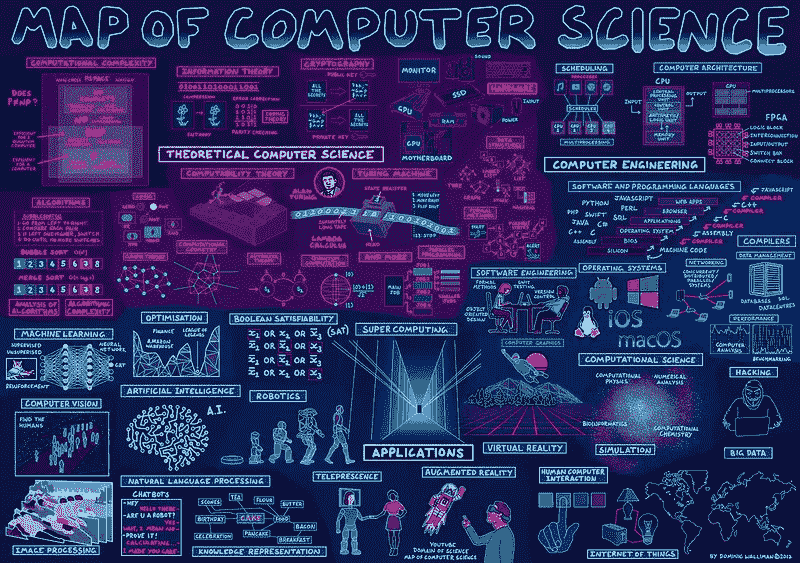
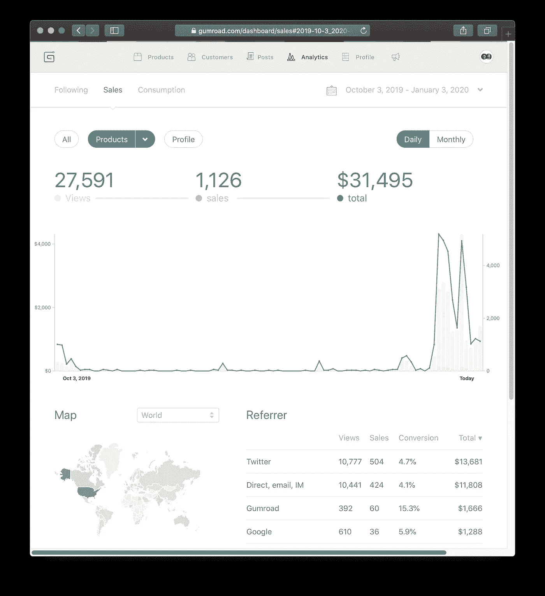
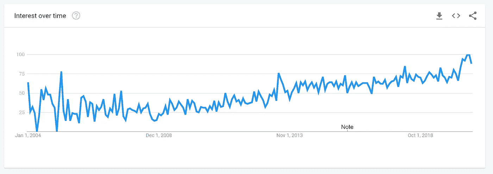
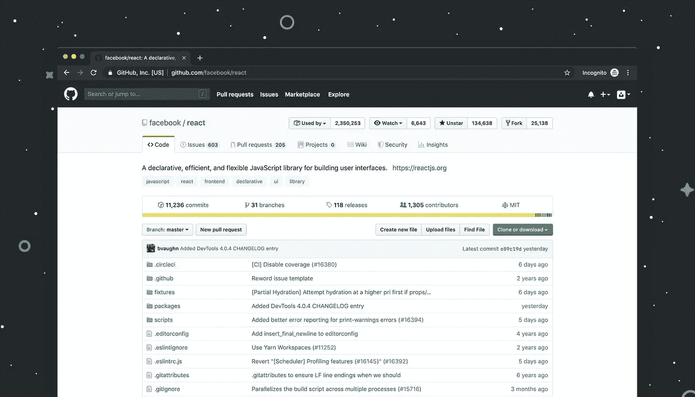

# 10 Side 以软件工程师的身份努力赚外快

> 原文：<https://betterprogramming.pub/10-side-hustles-to-make-extra-money-as-a-software-engineer-a290e66c7ce9>

## 如何在日常工作之外赚钱

照片由[编年史颜](https://unsplash.com/@chronisyan?utm_source=medium&utm_medium=referral)在 [Unsplash](https://unsplash.com?utm_source=medium&utm_medium=referral)

在过去的 10 年里，我钻研了各种各样的风险投资。有些成功了，有些没那么成功——但结果是我学到了很多。下面，我将回顾我的经历，并分析你如何利用自己作为工程师的技能为自己创造额外收入。

# **1。建立教育课程**

我们的学习方式正在发生变化，今天的教育格局与 10 年前相比有了很大的不同。大学教育正变得令人生疑，因为大量的在线内容在很多情况下提供了比非常昂贵的学位更大的价值，而学位一旦完成就不能保证有工作。

在 [Unsplash](https://unsplash.com/@onezonestudio?utm_source=unsplash&utm_medium=referral&utm_content=creditCopyText) 上 [One zone 工作室](https://unsplash.com/@onezonestudio?utm_source=unsplash&utm_medium=referral&utm_content=creditCopyText)拍摄的照片

对于一个人来说，花 500 美元去上几门由该领域的专家教授的课程要比一个通常没有行业经验的讲师便宜得多，这些专家每天都在 It 领域工作。

结果是，以课程和基于订阅的业务形式创建付费教育内容的机会非常大。更令人印象深刻的是，这是一个并非不可能进入的领域，因为你有一个与众不同的地方:你的个性和潜在的教学风格。

人们喜欢不同的风格和个性，从不同的教学风格中学得更好。你要做的就是做你自己，教书育人，提供价值，你会因此赚钱。

虽然这需要更多的工作，但我建议你建立自己的平台来销售你的课程，因为你对定价、品牌等有更多的控制权。这将是真正让你成功的。

## 例子

[Yaroslav Shmarov](https://www.indiehackers.com/Yareki) 创建了一个课程并在 Udemy 上发布，[在 100 天内创造了 420 笔销售](https://www.indiehackers.com/post/100-days-on-udemy-420-sales-my-stats-28ceac4f61)。他提出了一些非常好的观点和更多避免使用 Udemy 等平台的理由。

*   在 [Udemy](https://www.udemy.com/) 上举办课程是免费的，但是准备好以 10 美元的价格出售并获得 2-7 美元
*   在 Udemy 上，你无法访问学生的电子邮件/电话(所以你无法创建自己的社区，也无法很好地交叉销售)
*   如果你的潜在受众群体很大，在 Udemy 上托管是个好主意
*   教师唯一能与活跃的学生互动的是课程中的问答部分
*   总的来说，在 Udemy 上销售课程可以被认为是被动收入，发布课程后只需要最低限度的参与

## **挑战**

课程创作可以赚大钱——需求很高，而且还在增长。课程创建的主要问题如下:

*   受众:建立初始受众可能是一个挑战，但并非不可能。这可以做到，其实很容易，但它需要大量的工作和一致性，创造免费内容，为您的登录页面提供流量
*   **课程质量很重要:**这真的不足为奇，但是你的课程质量会影响它的成功。你必须做好失败的准备，你创建的最初几门课程会失败；然而，如果你慢慢来，有耐心，并准备好学习，那么你可以克服这一点，并大大增加你成功的机会。

# 2.创建内容平台/博客

创建某种基于内容的网站是开发者可以利用的另一个机会来赚取额外收入。计算机科学和发展的许多领域都可以为你提供一个很好的主题来作为你内容的基础。

多米尼克·沃利曼在 [Flickr](https://www.flickr.com/photos/95869671@N08/36231833334)

自制内容/博客平台的一个很好的例子就是[无 CS 学位](https://www.nocsdegree.com/)。它由 [@petecodes](https://twitter.com/petecodes) 创建，每月经常性收入达到 2500 美元。

产品本身是对没有学位的开发人员的采访，仅此而已——没什么复杂的。也可以免费注册无 CS 学位邮件列表。

“这些平台哪里赚钱？”我听到你问了。它要么来自网站上的广告收入，要么来自电子邮件广告的赞助交易。

## **挑战**

*   写内容需要大量的时间，因为你需要做研究，以便为你的读者提供最大的价值
*   找到一个合适的位置——一个好的位置——会对你大有帮助。尽可能专攻某个领域。
*   寻找赞助商——这通常可以通过接触潜在的追求者来获得你的广告位，或者使用类似于[谷歌 AdSense](https://www.google.com/intl/en_uk/adsense/start/) 的东西在你的页面上添加广告来解决
*   在创建任何东西时，驱动流量是一个常见的问题。同样，这可以通过花时间在 Twitter 等平台上建立追随者或者通过[提高你网站的 SEO](https://www.quicksprout.com/ways-to-improve-seo-ranking/) 排名来克服。

# 3.创建论坛/社区

由于 [Discord](https://discord.com) 、 [Patreon、](https://www.patreon.com/)和 [Discourse](https://www.discourse.org/) 等平台的兴起，付费论坛和社区是一个新兴的机会。这些平台使得建立社区和整合支付变得非常容易，使其成为一个机会的金矿。

图片由[普里西拉·杜·普里兹](https://unsplash.com/photos/W3SEyZODn8U)在 [Unsplash](https://unsplash.com/) 上拍摄

为什么会这样？人们希望与有相似兴趣、愿望和需求的人交流和交往。本质上，通过建立一个社区，你提供了一个平台。

## 一些例子

*   [彼得关卡](https://twitter.com/levelsio)建立[游牧者列表](https://nomadlist.com/)，为数字游牧者提供一个社区。该企业现在每月创收 24，000 美元。
*   安妮-劳雷·勒康夫建立了[内斯实验室，](https://nesslabs.com/)一个健康企业家的社区，每月创收 9600 美元。

为什么不利用上面提到的免费开源工具，开始创建自己的社区呢？你甚至可以编写额外的功能，让你为潜在用户创造一些很棒的功能，真正帮助尽可能多的人。

## **挑战**

*   由于被称为 [*社会证明*](https://en.wikipedia.org/wiki/Social_proof#:~:text=Social%20proof%2C%20a%20term%20coined,behavior%20in%20a%20given%20situation.) *的东西的生理影响，社区建设极具挑战性但却非常有益。*本质上，很难让前 100 名用户加入你的社区，但随着人数的增长，吸引更多用户变得更容易——因为价值就在社区中。诀窍是坚持下去。
*   你需要高参与度，这会耗费你大量的时间
*   管理社区以避免垃圾邮件并在社区内保持良好的内容也将是一个挑战

注意:建立一个社区是最难的事情之一；然而，它会带来巨大的回报。你不仅可以赚一大笔钱(由于口碑)，而且你真的可以帮助很多人。

# 4.创作一本电子书

作为软件工程师，我们拥有很多人想要学习的大量技术知识。传递这些信息的一个很好的方式是以电子书的形式。

电子书的好处是写起来相当快，如果你选择一个你感兴趣的主题，那么制作起来会很有趣。

你可以使用一个平台，比如 gum road 来托管你的电子书，并负责销售。

**注**:电子书可以成为一棵巨大的摇钱树，你可以用它来赚钱，这些钱可以投资到其他事业/生意中。它们也是一个很棒的项目，可以持续几个月，每天写一点。

## 例子

*   [《AWS 的精彩部分》](https://gumroad.com/l/aws-good-parts/indiehackers):丹尼尔·瓦塞尔和乔希·普肖尔所写的电子书，仅在第一周就卖出了 1000 多本，创造了 31000 美元的销售额。
*   [《创客奴才:创客、皮条客和企业家的 101 种自动化》](https://www.producthunt.com/posts/maker-minions-ebook):迈克尔·吉尔[写的一本电子书](https://twitter.com/gill_works)赚了 5000 美元，而且还在增长。

图片由[丹尼尔·瓦萨洛](https://www.indiehackers.com/dvassallo)

## **挑战**

*   研究和计划会占用你大部分的时间
*   建立读者群(你可以在发布的时候着手这项工作——建立电子书有更大的灵活性，因为你可以在亚马逊等平台上出版)
*   为你的书创建一个结构也是一个挑战，但是花一些时间来解决这个问题是一个简单的方法

# 5.当自由职业者

啊，自由职业——可能是软件工程师赚外快最明显的形式之一。这个模型很简单:出售你的时间来获得额外的现金。

图片由[内森·达席尔瓦](https://unsplash.com/@silvawebdesigns)在 [Unsplash](https://unsplash.com/) 上拍摄

自由职业的好消息是，你可以为你的时间获得丰厚的报酬，尤其是如果你能为自己找到一家资金充足的初创公司。

坏消息是，不像这篇文章中的大多数其他方面，它让你最终没有一个产品。这意味着在扩展时你会受到限制，因为你与时间和金钱有直接关系。

然而，如果你决定转行做全职工作，它会给你一个很好的选择，如果你喜欢的话，你可以转行做代理。

**注**:我自己做过自由职业者，发现这是一种非常棒的赚钱方式，可以投资到其他事情上，或者用来创造更多的自由时间。诀窍在于找到好的客户。

## 例子

*   苏珊·彭(Susanne Peng)是一名开发商和设计师，她通过自由职业构建了自己的梦想生活——她的故事很值得一读
*   格伦·斯托瓦尔是一名应用程序开发者，他也通过自由职业来创造更多的自由。

## **挑战**

*   建立客户关系是关键，而且管理起来很有挑战性，因为你必须与多个客户保持良好的关系
*   创建有效的方法来管理你的时间在一开始可能是一个挑战，但是在你做了一段时间后会变得容易得多
*   寻找客户也是一大挑战。像 Upwork 这样的地方已经今非昔比，你将很难在那里找到像样的客户。我会推荐使用 LinkedIn 作为一个潜在客户创造工具(搜索科技创业公司，接触那里的人)。

# Ghost 博客主题

Ghost 是一款功能强大的博客内容管理系统，面向内容创作者、创业者和开发者。为了让人们对它的增长有所了解，仅在这一周，就有 5933 名作家、播客和视频创作者用 Ghost 建立了网站，在网上发布新闻，并向他们的观众发送时事通讯。

在 [Unsplash](https://unsplash.com/) 上 [NeONBRAND](https://unsplash.com/@neonbrand) 拍摄的照片

我自己也用 Ghost，因为它是一个如此强大的平台，而且它有一些美丽的主题。不过，对你来说，好消息是主题供应也严重短缺——最近在[幽灵论坛](https://forum.ghost.org/t/lack-of-ghost-themes/8028)上的帖子证实了这一点。

这为 Ghost 提供了一个建立主题的黄金机会，在 Ghost 的官方网站上，主题的平均零售价为 59 美元。Ghost 主题是使用以下堆栈构建的:

*   节点. js
*   结构化查询语言
*   Handlebars.js

Geekinsta 上的这篇文章是一个很好的向导，可以带你上路。

## 例子

*   **fueko** :卖各种主题的小公司。他们在 7 月 6 日推出了一个幽灵主题。他们推出的主题零售价为 59 美元，在过去的三个月里，他们卖出了 94 本，净收入 5546 美元。

## **挑战**

*   Ghost 论坛上有很多支持，但是找到有用的教程视频和第三方文档可能是一个挑战。好消息是，如果你了解把手和节点，那么你应该成功了。
*   为你的主题选择一个合适的位置可以帮助你创造一个特定观众会喜欢的主题，并有可能增加你的销售。这可能是一个挑战，但这是一个相对不拥挤的市场。
*   主题零售价平均在 29-99 美元之间。这意味着对价格有一个预期，导致潜在的价格上限。然而，如果你创造了一个特殊的主题，有足够的空间收取更高的费用。

# 7.Shopify 应用程序

随着最近直运、生活方式业务的趋势，以及独立零售商店转向在线的推动，Shopify 为美国开发者开辟了另一个绝佳的机会。

罗伯特·科尔特斯在 [Unsplash](https://unsplash.com/@robertocortese) 上拍摄的照片

Shopify 应用商店在 Shopify 店主中广受欢迎，因为它为用户提供了一个改善客户体验的地方，并有助于增加他们的业务收入。

这些应用程序可能是一个很好的被动收入来源，因为它们倾向于照顾自己——当然，情况并不总是如此，但它仍然是一个很好的收入建设者。

## 例子

*   Filippo Mursia 开发了 [Tailry](https://tailry.com/) ，这是一个 Shopify 应用程序，帮助用户管理他们的商店和库存。它目前每月产生 2800 美元的收入，是一个很好的例子，说明如何在 Shopify 的 platfrom 上构建一个应用程序，并将其转化为一个有利可图的副业。

## **挑战**

*   一旦你建立了应用程序，处理持续的更新可能是一个需要管理的[可能的挑战](https://blog.littledata.io/2018/05/07/six-challenges-developing-shopify-integration/)。有很多方法可以让这成为一个优雅的过程，但在开始构建 Shopify 应用程序之前，这绝对值得研究一下。

# 8.构建 API 即服务

我们生活在一个[数据驱动的时代](https://en.wikipedia.org/wiki/Information_Age#:~:text=The%20Information%20Age%20(also%20known,primarily%20based%20upon%20information%20technology.)，在这个时代，信息、注意力和内容为王——给你一些视角，每天有 [2.5 万亿字节](https://www.forbes.com/sites/bernardmarr/2018/05/21/how-much-data-do-we-create-every-day-the-mind-blowing-stats-everyone-should-read/#74f6756360ba)的数据被创造出来。

图片由 [Luca Bravo](https://unsplash.com/@lucabravo) 在 [Unsplash](https://unsplash.com/@lucabravo) 上拍摄

从这些数据中提取一些，并将其转化为某种形式的有价值的收藏，可能是一种很好的赚钱方式。企业几乎每天都在做出数据驱动的决策，并乐意为任何能提供价值/增加潜在利润的东西买单。

API 提供了一个很好的平台，允许各种企业访问数据，那么为什么不创建一个并对访问权限收费呢？

你可以创建一个 [web scraper](https://www.webharvy.com/articles/what-is-web-scraping.html#:~:text=Web%20Scraping%20(also%20termed%20Screen,in%20table%20(spreadsheet)%20format.) 来收集有用的数据，然后创建一个 [Rest](https://www.smashingmagazine.com/2018/01/understanding-using-rest-api/) / [基于 GraphQL](https://graphql.org/) 的 API 来覆盖数据，提供对数据的访问。

如果你需要灵感，任何营销、社交或产品相关的数据对很多人来说都有巨大的价值。亚马逊、易贝和其他电子商务平台也是收集见解的好地方。这些是可供电子商务企业家分析的有用数据集。

## 例子

*   加雷思·富勒开发了一个非常简单的[石油价格 API](https://www.oilpriceapi.com/) ，每月产生 370 美元的收入。考虑到它是一家多么年轻的公司和增长空间，这还不错。
*   [塞巴斯蒂安·杜蒙](https://twitter.com/sebd86)开发了一个 [WordPress 相关的 API](https://cocart.xyz/) 来处理前端 WooComerce。它目前每月收入 900 美元，并且还在增长，下载量达到 2 万次。

## **挑战**

*   在实施任何解决方案之前，构建数据集可能需要进行大量的研究。这是因为您首先需要找到它如何提供价值，以及提供数据的最佳形式是什么。《编写 VC 代码》有一篇非常好的文章[,对如何克服这一挑战提供了很好的见解，并给出了一些很好的技巧。](https://www.codingvc.com/the-value-of-data-part-2-building-valuable-datasets)

# **9。**成为在线讲师

当谈到 2020 年试图成为软件工程师的人时，供应并不短缺，所以为什么不抓住这一趋势，通过成为在线讲师来帮助他们呢？

我自己过去也这样做过，确实提供了一大笔钱。根据你所教授的内容，你通常可以收取 50-130 美元/小时的费用，这是一种获得额外收入的好方法，同时也为可能需要的人提供了很多价值。

图片由[乔治菲尔德](https://twitter.com/home)拍摄。全球谷歌“成为开发者”的趋势

像 [Codementor](https://www.codementor.io/) 这样的平台正在为匹配导师和学生提供很好的服务，在社交媒体上找到寻找导师的人变得越来越容易。

## 例子

*   Suresh Atta 是一名软件工程师，他已经在 Codementor 上以每小时 60 美元的价格完成了 1781 次会话
*   塞维多夫·林内克有 3079 份工作，每小时 80 美元

## **挑战**

*   聚集动力可能会稍微困难一些，因为你需要做大约 10 次会议来向其他人提供社交证明(我发现提供很多价值，并且提供免费的 15 分钟会议设法帮助我获得一些牵引力)。
*   竞争很激烈，这可能是一个绊脚石，尤其是当人们可以降低每小时的要价时。就我个人而言，我会把这些平台作为一种建立受众的手段——这些平台会试图阻止你，但通常会有办法绕过它。

# 10.构建样板代码库

想想你开始一个项目的次数，忘记做好每件事所花的时间。这是很多工程师都有的问题，我们都喜欢快速的解决方案——以至于有时我们甚至准备为已经建立的简单解决方案付费。

图片由[卢克·切瑟](https://unsplash.com/@lukechesser)在 [Unsplash](https://unsplash.com/) 上拍摄

构建一个涵盖特定设置的所有基础的样板可以为我们软件开发人员提供巨大的价值，使用付费样板可以让我们专注于重要的部分，而不是专注于设置。

现在构建样板文件的一个非常好的地方是 web 应用程序的世界。构建一个 React/Vue UI，并将其与一个负责身份验证、数据库、配置和常见 API 服务(如 Firebase、SendGrid、Twilio)的节点后端相耦合，这可能是一个进入被动收入领域的好方法。

## 例子

*   Kyle Gawley 构建了 Gravity，这是一个 React 和 Node SAAS 样板，在 MRR 每月产生 3700 美元的收入。Kyle 已经构建了一个非常简单、干净的 UI，并配有一个设计优雅的后端，您可以使用自己喜欢的数据库对其进行配置。

## **挑战**

*   创建一个干净的用户界面将是一个耗时的过程，但是任何值得做的事情都需要时间和耐心
*   与其他开发人员建立信任是很难的——尽管如果你从自己是开发人员的角度来推销，这是可以解决的
*   创建好的文档是您可能需要记住的另一项重要工作

# 结论

如今，你可以通过很多方式在网上赚钱，尤其是作为一名开发者——如果利用得当，这基本上是一种超级力量，也是通往财务自由的大门。我希望你有一个美好的一天，感谢你花时间阅读这篇文章。