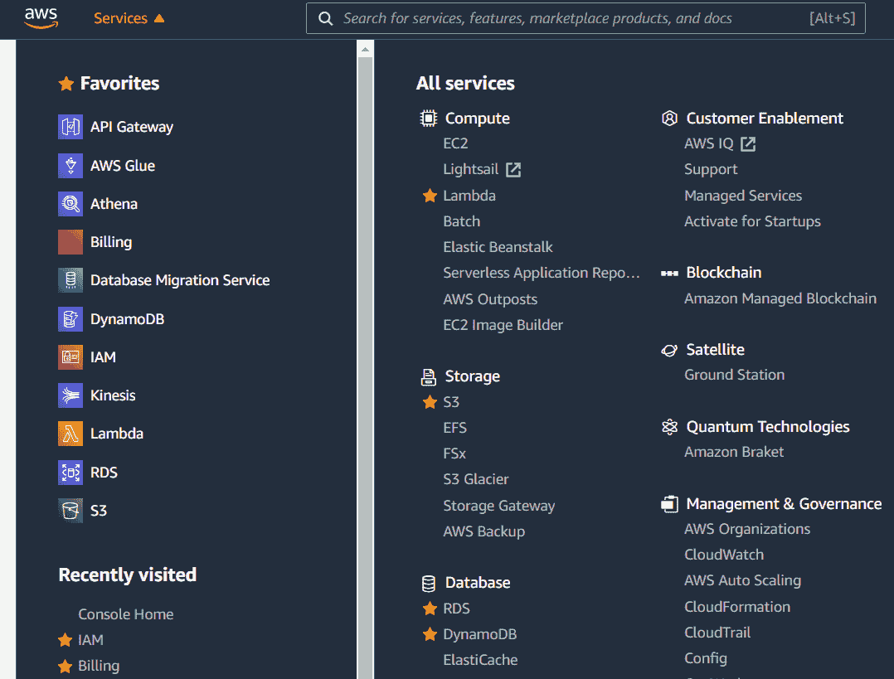
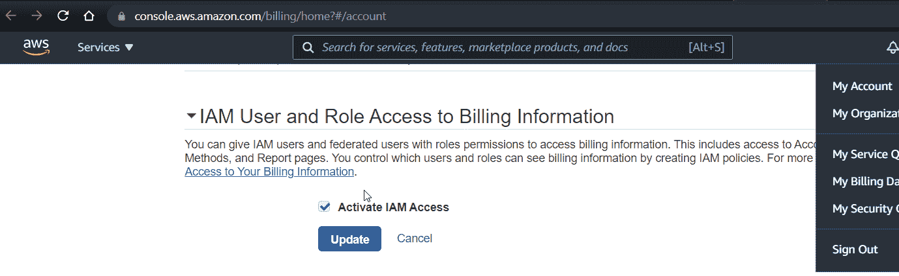
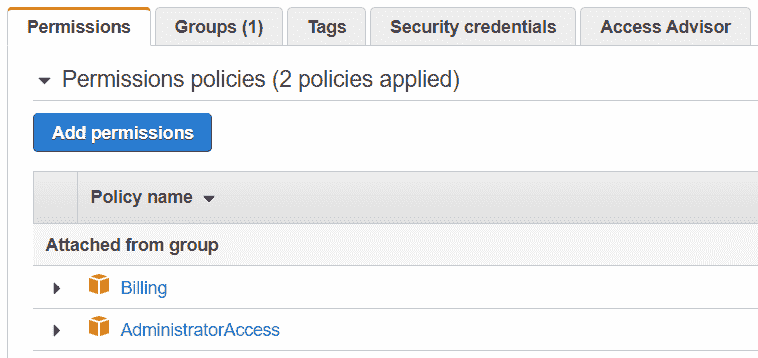
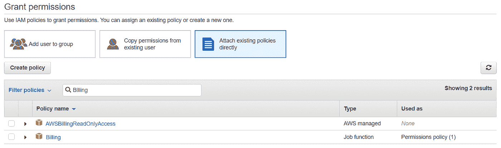
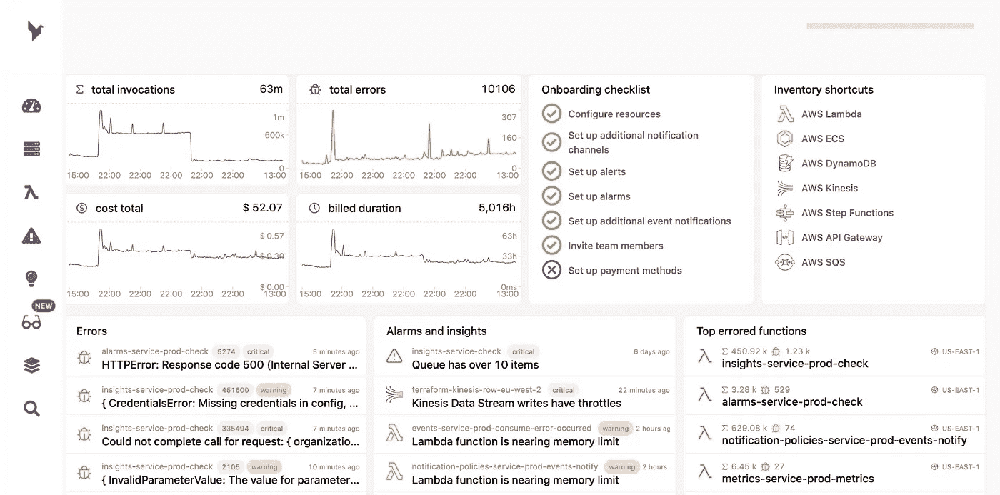
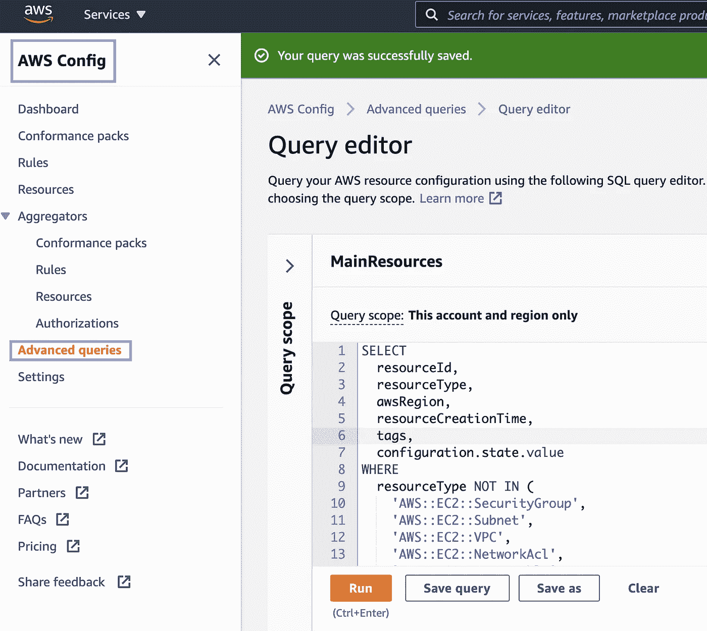
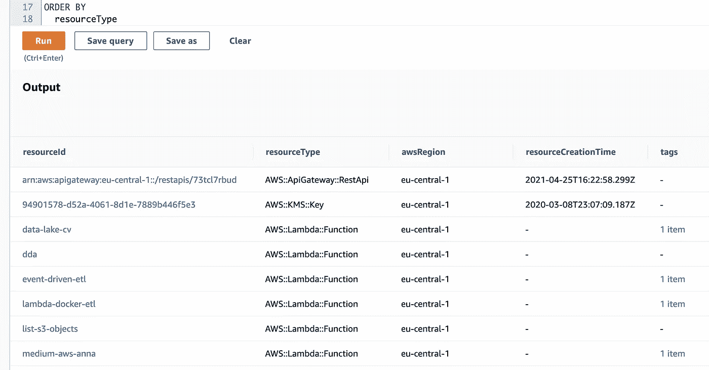
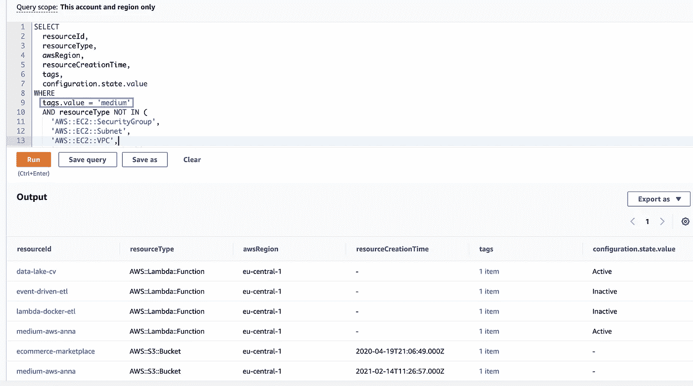

# 10 个简单的技巧，让你在使用 AWS 时超级高效

> 原文：<https://betterprogramming.pub/10-simple-hacks-that-will-make-you-super-productive-when-using-aws-98b9e919acb>

## 使用 AWS 时节省时间的有用技巧


照片由[马里·梅德尔](https://www.pexels.com/@mali?utm_content=attributionCopyText&utm_medium=referral&utm_source=pexels)从[派克斯](https://www.pexels.com/photo/man-near-painting-110818/?utm_content=attributionCopyText&utm_medium=referral&utm_source=pexels)拍摄。

*注:* [*品牌内容披露*](https://www.annageller.com/disclosure)

如果你经常使用 AWS，你可能已经意识到 AWS 上的一切都是 API 调用。因此，一切都可以自动化。

本文将讨论在 AWS 云中执行日常任务时节省时间的几个技巧。确保读到最后，因为我把最有趣的留到了最后。

# 1.在对生产资源执行任何任务之前，请在 AWS CLI 中使用- dryrun 标志

如果您曾经必须执行一些 S3 迁移任务，或者想要通过命令行对其他现有的 AWS 资源进行更改，那么利用`--dryrun`标志来确保您的 CLI 操作如您所愿是非常有用的。例如，在将一堆 CSV 文件上传到 S3 之前，您可能想要检查您的命令是否只对 CSV 文件起作用，而没有将其他文件移动到 S3:

```
aws s3 cp /path/to/local/files/ s3://demo-datasets/path/ --exclude "*" --include "*.csv" --dryrun
```

由于有了`--dryrun`标志，命令行输出提供了关于哪些文件将被复制到 S3 的信息。这个输出有助于验证我们的命令是否按预期工作。

# 2.使用- dryrun 检查两个 S3 存储桶是否同步

想象一下，您必须将数百个文件从爱尔兰的一个地区迁移到法兰克福的一个地区。将对象移动到新的 S3 存储桶后，您可能想要检查是否所有文件都已正确无误地拷贝到新区域。

通过使用`aws s3 sync`命令，您可以检查 S3 桶(或特定路径)是否同步:

```
aws s3 sync s3://bucket1 s3://bucket2 --dryrun
```

如果有任何差异，`--dryrun`标志会在控制台中显示出来，而不会传送任何内容。通过使用这个技巧，您可以轻松地确定两个桶的内容之间的差异，而无需自己费力地比较文件。你甚至不需要下载这些文件来执行检查。

# 3.使用- dryrun 检查 S3 存储桶和本地文件夹是否同步

与前面的场景类似，我们可以在将 S3 的文件与本地计算机或远程主机的文件进行比较时使用相同的命令:

```
aws s3 sync /Users/.../path/ s3://mybucket --dryrun
```

如果您必须仅将特定文件类型和文件夹与 S3 同步，此命令特别有用。

# 4.从 S3 快速下载许多文件

最后一个 S3 命令是`aws s3 cp`，它允许我们从指定的 S3 路径下载所有文件:

```
aws s3 cp s3://mybucket /Users/anna/path/ --recursive --storage-class STANDARD
```

同样，我们可以上传一堆文件，同时指定最适合这些对象的 S3 存储类:

```
aws s3 cp /Users/.../path/ s3://mybucket  --recursive --storage-class STANDARD
```

# 5.在 AWS CLI 中使用- profile 标志来管理多个帐户

假设您有一个不同的 IAM 用户用于`dev`和`prod`环境。在这两者之间切换可能会很痛苦，除非你使用`--profile`标志。如果配置了 CLI，您应该会在目录位置看到一个包含凭据的文本文件:

*   `~/.aws/credentials`在 Linux 和 Mac 上
*   `%USERPROFILE%\.aws\credentials`在 Windows 上

一个有用的设置是将您的`dev`凭证设置为默认配置文件。那么，`prod`必须被明确地指定。下面是`credentials`文件的样子:

```
[default]
aws_access_key_id=ASDFGHJJKLQWERTZUIOP
aws_secret_access_key=YXCVBNMasdfghjkl123456789

[prod]
aws_access_key_id=POIUZTREWQLKJHGFDSA
aws_secret_access_key=MNBVCXYasdfghjkl987654321
```

您可以使用以下命令创建任何新的配置文件:

```
aws configure --profile yourProfileName
```

通过使用下面的命令，我们将收到默认(dev)概要文件的结果:

```
aws s3 ls
```

相反，当添加`--profile prod`时，结果将只显示生产资源:

```
aws s3 ls --profile prod
```

# 6.锁定您最常用的服务

如果您只是经常使用一些服务，您可以将它们标记为个人收藏。随着服务越来越多，你可能会发现它很有用。

“最近访问的”(显示在“收藏夹”下方)提供了类似的概述:



然而，由于 AWS 实现了优秀的搜索栏，您可能会认为“收藏夹”栏有点多余。

# 7.计费联盟

创建 AWS 帐户后，您将作为帐户所有者(即根用户)登录。AWS 建议我们不要在日常活动中使用该帐户。相反，我们应该创建我们的第一个 IAM 用户并使用它与 AWS 一起工作。然后，我们将作为根用户登录，只执行服务管理任务，如更改我们的帐户或支付细节。

如果您遵循这一最佳实践，您可能仍然会时不时地以 root 用户身份登录来查看您的 AWS 账单，因为默认情况下，账单信息只对 root 用户可用。

但是，有更好的办法。您可以将*计费和成本管理*控制台访问权授予您的 IAM 用户。完成后，您将能够从非 root 用户访问“计费”控制台。下面是如何将计费访问“联合”给 IAM 用户。

首先，您必须在[账户设置](https://console.aws.amazon.com/billing/home?#/account)中激活 IAM 访问:



然后，您可以将计费策略附加到您的 IAM 用户:



您可以选择完全访问或只读访问:



有关计费联盟的更详细描述，请参见 [AWS 文档](https://docs.aws.amazon.com/IAM/latest/UserGuide/tutorial_billing.html)。

# 8.监控您的资源

如果您使用过 AWS Lambda、SQS 队列、SNS 主题、DynamoDB 表、Kinesis 数据流、AWS Step 函数或 ECS 服务，您可能已经意识到监控无服务器资源具有挑战性。虽然 CloudWatch 将日志记录集中到单个服务中，但在数十个日志组之间切换以分析单个应用程序的性能可能是困难且耗时的。错误通知也是如此。

为了改善您的开发体验并节省时间，您可以开始使用 [Dashbird](https://dashbird.io/) 。两分钟设置后，您就可以访问观察平台，该平台为您提供:

*   关于作业执行、持续时间、冷启动、重试和事件的可视化。
*   格式优美的日志(而不是纯 JSON)。
*   项目视图允许您按项目而不是按 AWS 服务对资源进行分组。
*   高度可定制的警报。
*   对您的无服务器资源遵守 AWS 良好架构框架的程度进行评分。



图片由 [Dashbird.io](https://dashbird.io/) 提供。

# 9.了解云形成或地形

作为代码的基础设施在最近几年获得了很大的发展势头，这是有充分理由的。一旦您学会了如何以编程方式部署或修改您的资源，您在使用 AWS 时就会变得更加高效。

例如，假设您使用 CloudFormation 模板或 Terraform 配置文件为开发环境构建了所有资源。为了为生产构建相同的资源，您只需要更改声明文件中的特定值，它将为新环境复制设置。此外，您可以为新项目或恢复方案应用相同的编程定义的基础结构设置。

# 10.在 AWS 配置中使用 SQL 查询关于 AWS 资源的元数据

AWS Config 允许您一目了然地查看所有云资源，跟踪它们的配置如何随时间变化，并建立配置规则，自动检查您的服务是否与所需的配置设置匹配。任何违反您定义的规则的行为都会触发警报，通知您不符合规则的资源。

但是 AWS Config 不仅仅是一个很好的强制遵从的资源。它还为您提供了 AWS 帐户中所有资源的概述。我最近在 AWS 上遇到的最令人印象深刻的特性之一是 AWS 配置中的 SQL 查询编辑器。它允许您轻松地按服务对资源进行分组，或者只过滤特定区域的资源。

例如，在下面的查询中，我们检索所有资源及其相应的 ID、区域名称、创建时间、标记和当前状态，同时过滤掉所有网络和安全组资源:

下面是它在 AWS 管理控制台中的样子:



AWS 配置查询

输出显示符合查询条件的所有资源:



AWS 配置查询结果

这个 SQL 编辑器中最酷的事情之一是你可以用特定的标签查询资源。通常，我们使用标签作为键值对，将资源与特定的项目或组织单元相关联，这有利于成本分配。但是也可以利用它来确保在特定项目完成时终止所有资源。例如，下面是我们如何找到与标签`“medium”`相关联的所有资源:



AWS 配置:查询带有特定标记的资源

更多 SQL 示例，请查看 [AWS 配置文档](https://docs.aws.amazon.com/config/latest/developerguide/query-using-sql-editor-console.html)。

# 摘要

在本文中，我们研究了在使用 AWS 资源时节省时间的十个有用技巧。

在对实时资源执行 CLI 操作之前，`--dryrun`标志对于测试任何 CLI 操作非常有用。类似地，如果我们经常需要在几个 AWS 帐户之间切换(例如， *dev* 和 *prod* )，那么`--profile`标志会很有用。即使作为非根用户，计费联盟也允许您查看您的 AWS 成本。 [Dashbird](https://dashbird.io/) 让您只需进行一次两分钟的设置，即可可视化、监控和观察无服务器资源的状态。AWS CloudFormation 和 Terraform 通过将基础设施用作代码，为您提供了自动配置和修改资源的构建模块。

最后，AWS Config 允许您使用简单的 SQL 查询来查询所有 AWS 资源及其状态，以便您可以有效地跟踪您的资源。

感谢您的阅读！