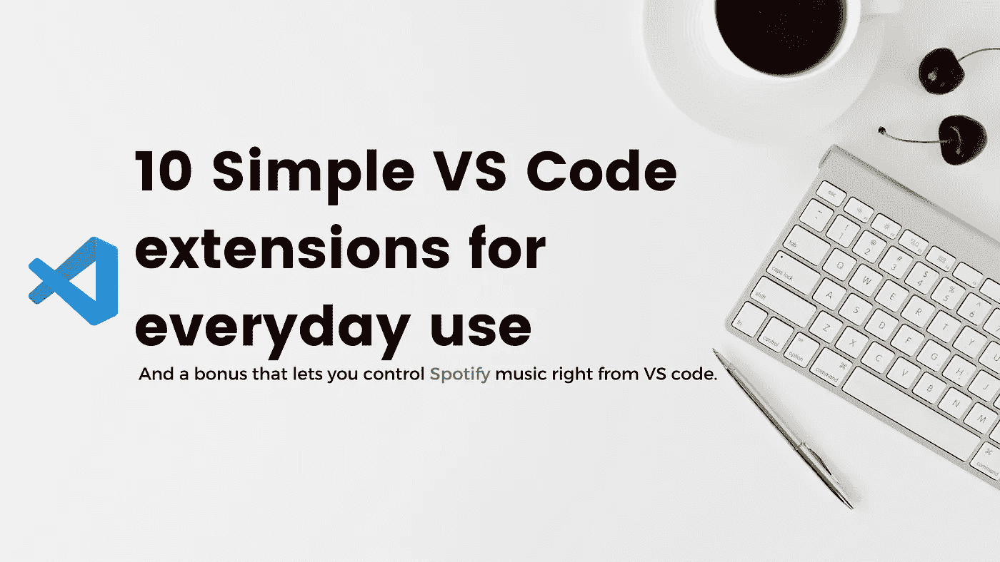
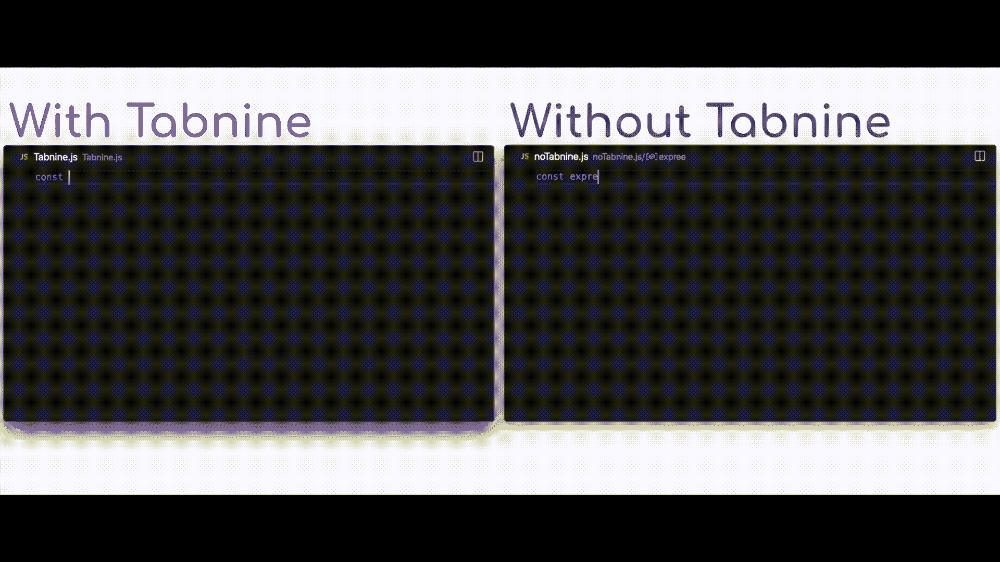
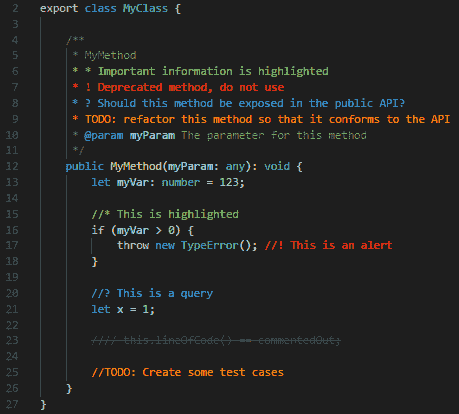
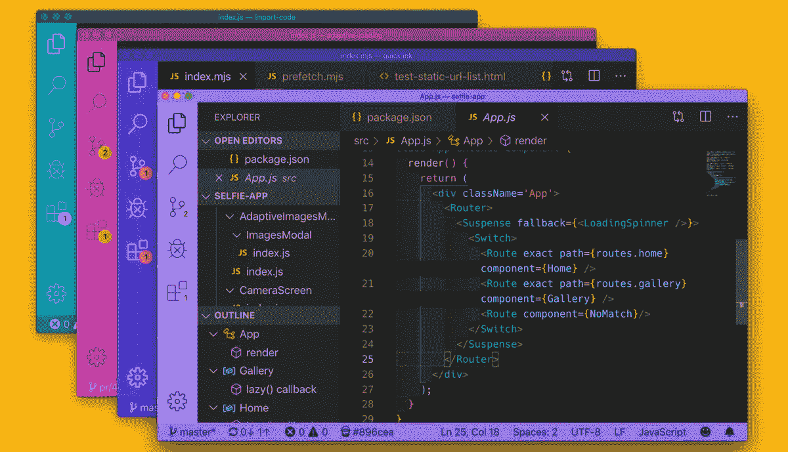
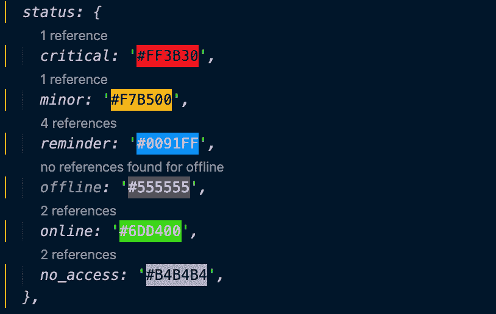
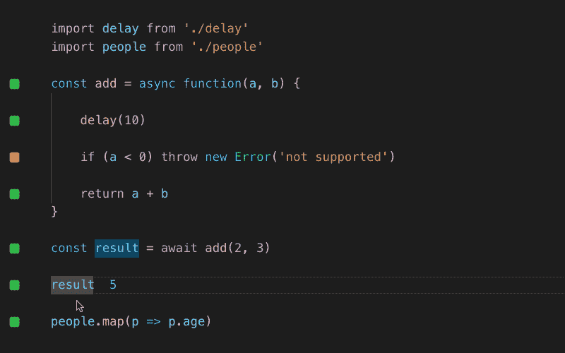
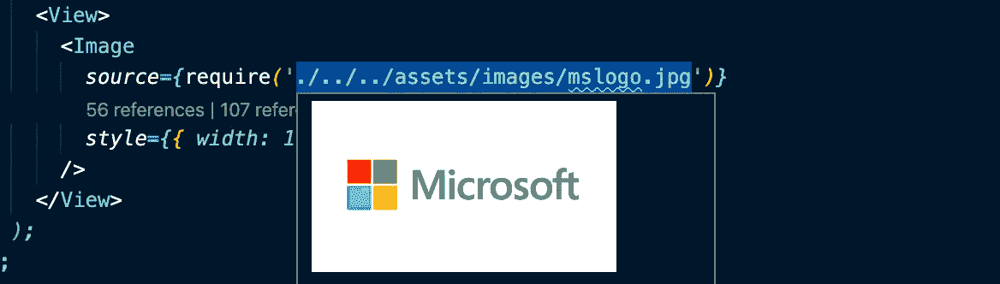
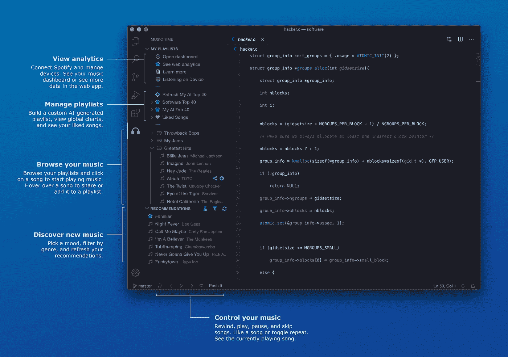

# 日常使用的 10 个简单 VS 代码扩展

> 原文：<https://betterprogramming.pub/10-simple-vs-code-extensions-for-everyday-use-9c987afe4775>

## 每个开发人员都应该拥有的强大的 VS 代码扩展

背景图像—无飞溅

如果你是一名开发人员，你不需要 Visual Studio 代码入门，或者大多数人所说的 [VS 代码](https://code.visualstudio.com/)。它是全世界开发人员中使用最多的代码编辑器之一。作为一个免费的、开源的、跨平台的代码编辑器，由一个大公司(微软)支持只会增加它的受欢迎程度。使用它的开发人员越多，它的社区就越大，这反过来会导致为编辑器发布更多的扩展。在这篇文章中，我们将讨论一些专门针对 web 开发的非常有用的扩展。

# 1.自动完成人工智能

我们都使用特定于语言的扩展来自动完成代码片段。大多数情况下，这些代码片段是预定义的，您可以从可用的代码片段集合中选择一个来使用。但是，如果有一个扩展可以自动补全任何语言，学习您的编码模式，并预测每个场景所需的自动补全，那会怎么样呢？

[Tabnine](https://marketplace.visualstudio.com/items?itemName=TabNine.tabnine-vscode) 正是通过研究公开共享的代码和使用人工智能深度学习算法来做到这一点。它有能力预测你下一步的编码需求，并建议一键完成代码。如果你担心你的代码的隐私，你会放心地知道 Tabnine 的建议是基于使用数百万行开源代码训练的模型，你的代码没有一部分用于训练模型或存储在任何地方。

用制表符自动完成

# 2.更好的评论

另一个不言自明的工具， [Better Comments](https://marketplace.visualstudio.com/items?itemName=aaron-bond.better-comments) 扩展将帮助你在代码中添加更多人性化的注释。它允许你将你的评论分为提醒、询问、待办事项、重点等。即使被注释掉的代码也可以被特别设计，以清楚地表明该代码不应该出现在那里。它还允许用户在设置中添加自定义注释样式。

使用更好的注释编写的注释示例

# 3.自动重命名标签

这个工具的名称是不言自明的。[自动重命名标签](https://marketplace.visualstudio.com/items?itemName=formulahendry.auto-rename-tag)自动重命名代码中的标签，帮助您节省时间。如果你曾经试图重命名一个标签，并且花了比实际重命名更多的时间来寻找另一个标签，那么这个扩展就是为你准备的。在一个地方改变你的标签名(开始或结束),扩展会处理另一个地方。不再需要搜索，也不再需要忘记重命名标签而导致代码出错。

自动重命名标签的演示

# 4.雄孔雀

我们都经历过，在多个 VS 代码实例中同时打开多个项目。在实例之间切换时识别项目并不容易，在大多数情况下，您必须打开它并读取项目名称，或者如果项目名称相似，甚至读取代码。 [Peacock](https://marketplace.visualstudio.com/items?itemName=johnpapa.vscode-peacock) 让你改变 VS 代码工作区的颜色，并且在窗口间切换时轻松识别项目。当您使用 VS Live Share 或 VS Code 的远程功能时，它也会很有帮助。

使用孔雀的 VS 代码实例的特殊颜色

# 5.结尾空白

似乎大多数简单的扩展都是不言自明的。名单上的另一个是[尾随空格](https://marketplace.visualstudio.com/items?itemName=shardulm94.trailing-spaces)。这个扩展突出显示并删除代码中所有的尾随空格。您可以通过按 F1 并运行尾随空格:Delete 命令或通过在将运行命令*的设置中创建 VS 代码快捷方式来删除空格。*它还在处理空白时允许很多定制，比如只删除修改过的行，忽略语法等等。

# 6.彩色高光

[Color Highlight](https://marketplace.visualstudio.com/items?itemName=naumovs.color-highlight) 扩展非常简单，只需要一行代码就可以理解:它对代码中的 CSS/web 颜色进行样式化。

CSS 中突出显示的颜色

# 7.Quokka.js

[Quokka.js](https://marketplace.visualstudio.com/items?itemName=WallabyJs.quokka-vscode) 是一个扩展，允许在用 JavaScript 或 TypeScript 编写代码时快速调试。它可以在变量本身旁边添加变量值，或者打印控制台日志语句的值，而不必运行代码。当您键入时，运行时值会更新并显示在 IDE 中您的代码旁边。它也有一个付费版本，有更多的功能。

Quokka.js 在行动

# 8.涡轮控制台日志

如果您像大多数开发人员一样，从调试到测试都依赖于控制台日志，那么这是对您的完美扩展。拥有多个控制台日志会使理解什么来自代码的哪个部分变得混乱，没有人有时间或耐心在控制台日志中写详细的消息。输入 [Turbo 控制台日志](https://marketplace.visualstudio.com/items?itemName=ChakrounAnas.turbo-console-log)，这是一个扩展，可以自动添加控制台日志，其中包括一条包含所有必要细节的消息。只需选择一个或多个变量，按 CTRL+ALT+ L，就会自动添加一个控制台日志，打印变量所属的类和函数的名称(如果有)、变量名*、*及其值，格式如下:

console . log(" selectedvariableinclosingclass name-> selectedvariableinclosingfunctionname-> selected variable "，SelectedVariableValue)

Turbo 控制台日志为多个变量自动添加控制台日志

# 9.波拉科德

Polacode 是一个非常简单的扩展，它允许你生成整洁的代码片段截图，而不需要离开 VS 代码。您可以选择任何一段代码，并使用 Polacode 运行它，以生成可以与其他开发人员、博客或演示文稿共享的屏幕截图。它还允许在主题和颜色方面进行定制。

使用 Polacode 生成代码截图

# 10.图像预览

[图片预览](https://marketplace.visualstudio.com/items?itemName=kisstkondoros.vscode-gutter-preview)是另一个简单的扩展，正如它的名字所说。图像预览将向您显示预览的图像资产中引用的代码在檐槽或当您悬停。

悬停时显示的图像

# 额外收获:Spotify 的音乐时间

如果你曾经搜索过完美的曲目来帮助你专注于编写代码，或者想在不离开 VS 代码的情况下控制你的音乐播放器， [Music Time for Spotify](https://marketplace.visualstudio.com/items?itemName=softwaredotcom.music-time) 是对你的扩展。文档列出了大量的特性:

*   **集成播放器控制**:直接从编辑器的状态栏控制音乐。
*   **嵌入式播放列表**:从编辑器中浏览并播放您的 Spotify 播放列表和歌曲。
*   **AI 播放列表**:获取使用机器学习生成的个性化 AI 播放列表，帮助你集中注意力。
*   **指标简介**:了解音乐的基本指标(包括速度、响度、语速、能量和效价)如何影响你的编码方式。
*   **个人前 40 名**:在你的每周前 40 名中，每周都能看到你最高产的歌曲、艺术家和流派。
*   **每周音乐仪表盘**:在编码时，通过生产力评分和播放次数查看每周热门歌曲、艺术家和流派。
*   **全球 40 强**:在我们的软件 40 强播放列表中发现来自世界各地开发者的新音乐。
*   **Slack 集成**:连接 Slack，在工作区的频道中共享歌曲和播放列表。

VS 代码中的音乐时间控件

让我在这篇文章的最后放一个免责声明，声明我个人与上面提到的任何扩展都没有关系，也没有收到任何推广它们的激励。欢迎在评论中添加更多你认为有用的扩展。也可以阅读《更好的编程》上发表的 [*VS 代码扩展帮助你写出更好的代码*](https://medium.com/better-programming/8-vs-code-extensions-to-help-you-write-better-code-3f3fa56a3a52) 了解更多非常有用的扩展。