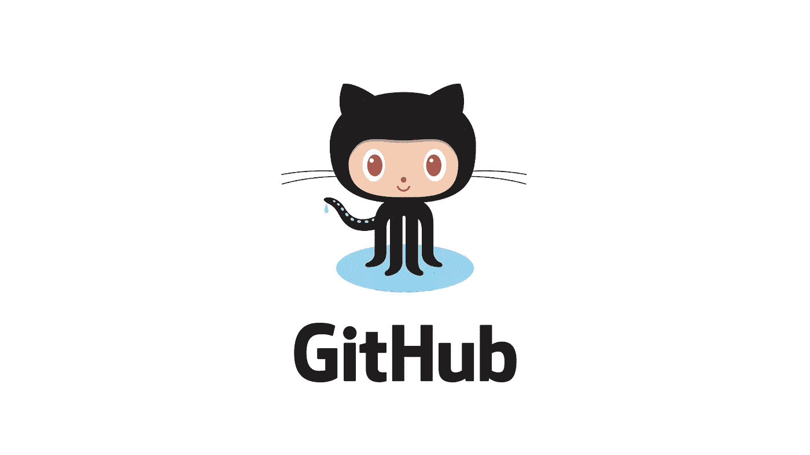
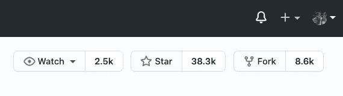
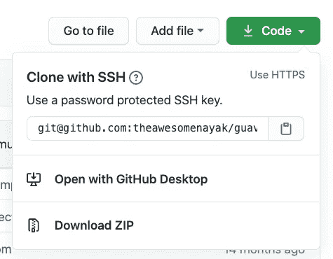
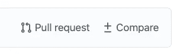
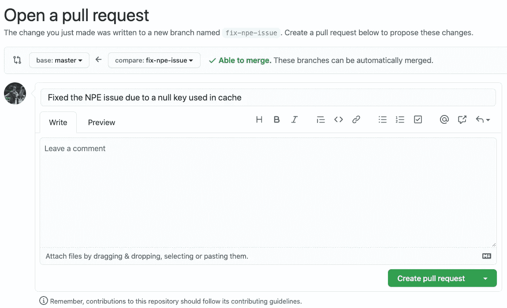

# 为开源项目做贡献的 10 个步骤

> 原文：<https://betterprogramming.pub/10-step-guide-to-github-contributions-9aeeb38493a8>

## 创建干净、管理良好的 GitHub 贡献的简短指南



图片提供:GitHub

你终于决定做出你的第一个 GitHub 贡献，并希望迅速开始做出改变。无论是公共 GitHub 上的开源软件(OSS ),还是贵组织在 GitHub Enterprise 上的内部项目，都有一个定义明确的贡献流程，让您的生活更加轻松，并保持代码库的整洁。在本文中，我将给出十个简单的步骤来确保快速、干净地贡献 GitHub。

# 贡献生命周期

## 1.派生主存储库

分叉存储库会在您的帐户中创建一个副本。您可以进行更改并将任何代码推送到这个分支，而不用担心弄乱原始代码库。单击页面顶部的 fork 按钮创建一个新的 fork。



分叉的存储库现在将出现在您帐户的“存储库”部分。

## 2.将分叉的存储库克隆到您的机器上

现在我们需要将分叉的存储库克隆到我们的机器上，这样我们就有了代码的本地副本。单击分支存储库的 SSH 或 HTTPS URL 旁边的剪贴板图标来复制它。



现在，在您的机器上打开一个终端，运行以下命令来克隆分叉的存储库:

```
git clone git@github.com:theawesomenayak/guava.git
```

## 3.创建特征分支

在对代码进行任何更改时，最佳实践是为我们需要进行的更改创建一个新的特性分支。这确保了我们保持主分支的整洁，并且能够简单地恢复我们的代码或者在必要时进行更新。

切换到克隆分叉存储库后创建的目录:

```
cd guava
```

创建一个新的要素分支，其名称可识别您计划进行的更改。例如:

```
git checkout -b fix-npe-issue
```

## 4.将您的更改提交到要素分支

如果您已经创建了任何新文件作为您的更改的一部分，您将需要`add`它到您刚刚创建的分支。

```
git add <filename>
```

对于所做的所有更改，您必须将它们`commit`到分支。确保您添加了有效的提交消息(按照项目的惯例):

```
git commit -m "Fixed the NPE issue due to a null key used in cache"
```

## 5.将特征分支推到分叉处

现在是时候`push`你的提交到你的分叉库了:

```
git push origin fix-npe-issue
```

## 6.对主存储库发出一个拉请求

一旦您将代码推送到分叉的存储库，就该对主存储库提出 PR 了。点击“拉动请求”按钮开始新的采购申请。



这将把您带到一个屏幕，在这里您的分叉存储库中的更改与主存储库中的代码进行了比较。在提交之前，您可以检查更改并提供更改的有效描述。



## 7.处理评审意见并合并您的 PR

代码维护人员通常会对您所做的更改提出一些评论。这些可以是功能性的改变，也可以是装饰性的改变，如格式等。一旦您做出这些更改，只需将它们推送到您的分支机构，PR 就会自动更新。

一旦变更好了，维护人员会将它们合并到主存储库中。恭喜你！！！你现在正式成为开源贡献者了。

## 8.将主资料库作为上游添加到克隆的资料库中

除了您之外，许多其他开发人员也不断地将他们的代码合并到主存储库中。我们需要不断地将分叉的存储库与它同步，以获得最新的可用代码。

克隆的存储库链接到分叉的存储库。为了让您的 fork 与主存储库保持同步，您需要通过将主存储库作为`upstream`添加到您的克隆存储库中来连接它们。

```
git remote add upstream git@github.com:google/guava.git
```

使用以下命令验证上游设置是否正确:

```
git remote -v
```

它应该显示以下值，以确认原点和上游指向正确的存储库:

```
origin  git@github.com:theawesomenayak/guava.git (fetch)
origin  git@github.com:theawesomenayak/guava.git (push)
upstream        git@github.com:google/guava.git (fetch)
upstream        git@github.com:google/guava.git (push)
```

## 9.从上游更新您的主分支

一旦上游设置好了，您就可以引入其他开发人员已经在主存储库中完成的更改。这将更新本地计算机上的克隆存储库:

```
git pull upstream master
```

## 10.把主树枝推到你的叉子上

一旦您在本地机器上有了所有的更新，您将需要把它们推送到您的分叉存储库，以便它与主存储库同步:

```
git push origin master
```

## (可选)删除您的特征分支

一旦将该特性合并到主存储库中，就不再需要它，可以将其删除:

```
git branch -d fix-npe-issue
```

您还可以从分叉的存储库中删除远程分支:

```
git push origin --delete fix-npe-issue
```

# 终点线

为 GitHub 项目做贡献可能会很棘手，这取决于有多少开发人员同时为它工作。希望这篇文章能够澄清 GitHub 贡献的过程，并使您的开发周期变得简单一些。

感谢您花时间阅读我的文章。继续建！