# 构建具有可访问性的 Web 应用程序的 10 个步骤(a11y)

> 原文：<https://betterprogramming.pub/10-steps-to-building-web-applications-with-accessibility-a11y-81cd2c1dd499>

## 让所有人都能访问您的网站的详细指南


照片由[克里斯汀·休姆](https://unsplash.com/@christinhumephoto?utm_source=medium&utm_medium=referral)在 [Unsplash](https://unsplash.com?utm_source=medium&utm_medium=referral) 拍摄。

可访问性(a11y)是使 web 应用程序对那些在某些方面能力有限的人有用的实践，例如视力(使用屏幕阅读器)和行动能力(仅使用键盘)。此外，这种限制可能来自设备的能力，例如移动设备。

以下是可访问性的基本原理:

*   它为包括残疾人在内的所有人提供了平等的机会。
*   它提高了可用性，提供了更直观的用户体验。
*   它符合联邦、州和国际法律的要求，使电子和 web 内容对残疾人来说是可访问的。违反这些法律会导致资金或合同的损失。

建立可用性需要时间和精力，而可用性融入到 web 应用程序的框架中是很重要的。在本文中，我们将提供如何构建具有可访问性的 web 应用程序的十个步骤。

*   [第一步:选择语义 HTML](#20f7)
*   [第二步:使用内置键盘访问](#d97a)
*   [第三步:避免设置导航流的正 tabindex](#b7c4)
*   [第四步:实现全键盘访问](#0194)
*   [第五步:使焦点和悬停相等/在](#8a72) `[mouseenter](#8a72)` [上使用](#8a72)`[mouseover](#8a72)`[/在](#8a72) `[mouseleave](#8a72)`上使用 `[mouseout](#8a72)`
*   [第六步:确保网页在没有 CSS 的情况下也能正常运行](#3f08)
*   [第七步:用 WAI-ARIA 填补可及性空白](#ce6a)
*   [第 8 步:为媒体内容提供文本选择和更多内容](#444e)
*   [第九步:区分文字大小和颜色](#8fd2)
*   [步骤 10:通过审计工具测试](#c9ba)

# 第一步:选择语义 HTML

语义 HTML 给网页引入了意义，而不仅仅是表现。有时，它被称为普通旧语义 HTML (POSH)。

以下是标题的语义定义:

```
<h1>This is heading text</div>
```

视觉上，它看起来与指定的样式相同:

```
<div style="font-size:32px;font-weight:600;">This is heading text</div>
```

然而，`div`并不是实现标题的正确方式。虽然它在桌面上看起来一样，但它会被屏幕阅读器错误地翻译。

从历史上看，web 开发中有两个常见的陷阱:

*   使用`<b>`而不是`<strong>`来强调文本。
*   使用`<table>`而不是 CSS 布局元素。

HTML5 为我们提供了以有意义的方式编写标记的所有语义元素，例如`<article>`、`<details>`、`<figure>`、`<nav>`、`<section>`和`<summary>`。搜索引擎优化(SEO)赋予这些标签中的内容更多的重要性，并使下面的网页更易于搜索。

建议使用语义 HTML，网页的 HTML 语义正确也很重要。

W3C 有一个[网站](https://validator.w3.org/)来验证 HTML、XHTML、SMIL、MathML 等 web 文档的标记有效性。我们可以用它来确保 HTML 语法的正确使用。

下面是验证`[https://www.amazon.com/](https://www.amazon.com/:)`的结果:

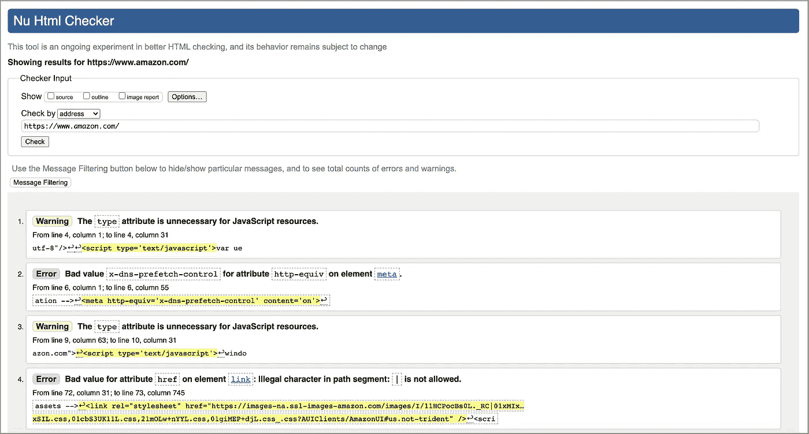

即使是商业上成功的网站也有改进的空间。

# 步骤 2:使用内置键盘访问

键盘访问对于可访问性至关重要。键盘用户通常使用`Tab`、`Shift Tab`或箭头键来浏览网页上的交互元素，例如按钮、输入字段、选择、链接等。当一个项目被聚焦时，可以用键盘激活或操作它。点击`Enter`或`Spacebar`键可以执行一个动作。

[WebAIM](https://webaim.org/techniques/keyboard/) 为自动完成、对话框、滑块、菜单栏、tab 面板、树形菜单等提供键盘测试规则。

以下是可聚焦的规则:

*   `<input>`、`<select>`、`<textarea>`、`<button>`、`<object>`在未禁用的情况下是可对焦的。
*   如果锚点具有`href`或`tabindex`属性，则它们是可聚焦的。
*   如果`<area>`在一个已命名的`<map>`中，有一个`href`属性，或者有一个使用`<map>`的可见图像，那么它就是可聚焦的。
*   所有其他元素仅基于它们的`tabindex`属性和可见性是可聚焦的。

基于这些规则，`<button>`是可聚焦的。如果需要按钮，使用`<button>Run</button>`或`<input type=”button” value=”Run”>`。

不鼓励将`<div>Run</div>`与 CSS 和`tabindex`一起使用。这个`div`元素可能提供类似的样式或行为，但是内置的可访问性可能会丢失。

使用内置键盘访问符合使用语义 HTML 的规则。因为您不需要实现额外的管道，所以语义元素最终可能比非语义代码具有更小的包大小。

# 步骤 3:避免使用正的 Tabindex 来设置导航流

交互式项目获得键盘焦点的导航顺序很重要。默认的顺序应该是逻辑和直观的。一般流程是从左到右，从上到下。导航顺序应该来自文档的源顺序。避免正面`tabindex`设置导航流量。

`tabindex`是一个全局属性，指示其元素可以被聚焦，并且如果值不为负，可以成为导航流的一部分。

*   `tabindex="-1"`(或任何负数)表示该元素不在导航流中，但可以用 JavaScript 或通过单击来聚焦。
*   `tabindex="0"`意味着元素在导航流中。顺序在具有正`tabindex`值的元素之后。在带有`tabindex=“0”`的元素中，顺序由单据的来源顺序定义。
*   `tabindex="1"`(或另一个正数)表示元素在导航流中。首先排序具有较小`tabindex`值的元素。

你能猜出下面的`Tab`顺序吗？

```
<div tabindex="0">Third</div>
<div tabindex="-1">Not Reachable</div>
<div tabindex="0">Fourth</div>
<div tabindex="2">Second</div>
<div tabindex="1">First</div>
```

分别是`First`、`Second`、`Third`、`Fourth`。

屏幕阅读器顺序是什么？

就是`Third`、`Not Reachable`、`Fourth`、`Second`、`First`。

你看到不一致了吗？

在开发过程中使用屏幕阅读器来测试网页是一个很好的实践。

MacBooks 具有出色的内置可访问性。您可以打开 VoiceOver 进行屏幕阅读。

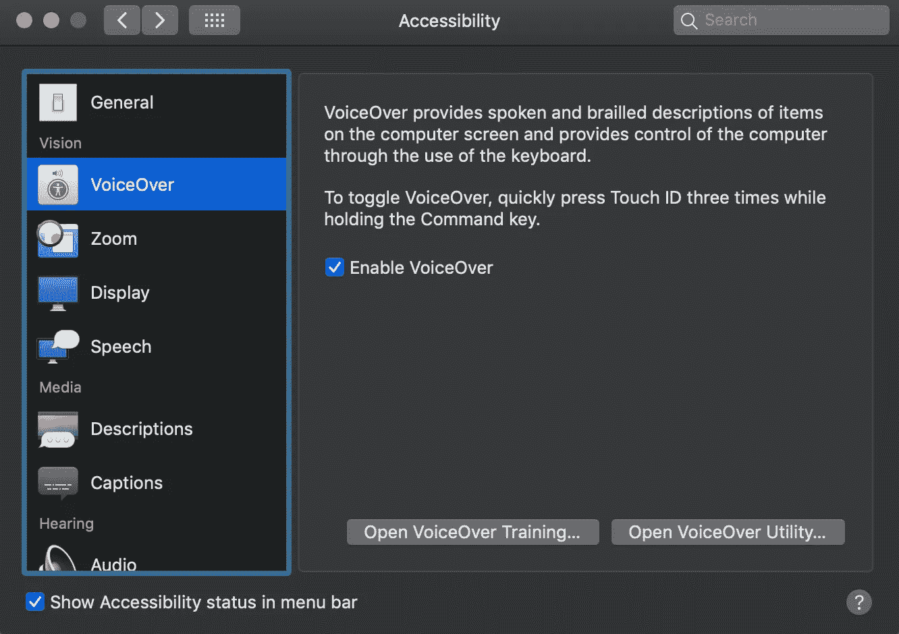

你也可以使用 ChromeVox Classic 扩展，这是 Chrome 上为视障用户提供的屏幕阅读器。

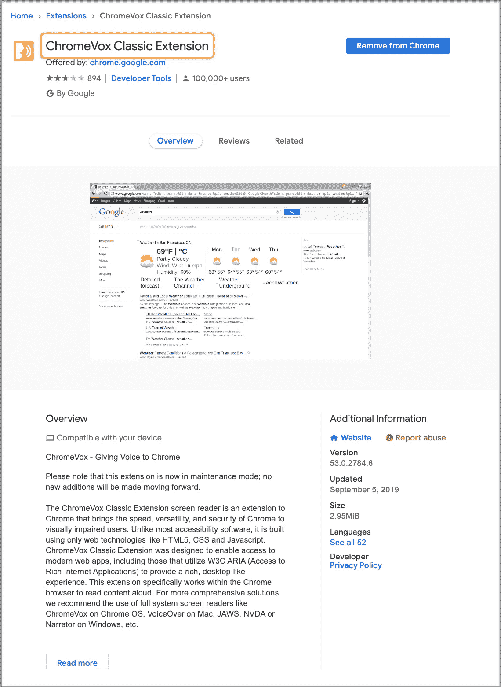

# 步骤 4:获得完整的键盘访问权限

[网页内容可访问性指南(新 WCAG 协议)](https://www.w3.org/TR/WCAG22/#keyboard)解释了如何使网页内容对残障人士更容易访问。它提供了四类指导:

> "1.可感知的:信息和用户界面组件必须以用户可以感知的方式呈现给用户。
> 
> 2.可操作:用户界面组件和导航必须是可操作的。
> 
> 3.可理解:信息和用户界面的操作必须是可理解的。
> 
> 4.健壮:内容必须足够健壮，能够被各种各样的用户代理(包括辅助技术)可靠地解释。"

对于每个指南，都有可测试的成功标准，分为三个级别:A、AA 和 AAA。最低级别是 A，目标级别是 AAA。

键盘访问完全取决于可操作性。在实现网页时，首先要使用内置键盘访问。如果它不可用于复杂的用户界面，可以实施`tabindex`来填补空白。目标是实现全键盘访问。

# 步骤 5:使焦点和悬停相等/在鼠标上方使用鼠标进入/在鼠标离开上方使用鼠标退出

焦点表示该组件当前被选中。为了满足 WCAG 2 的可感知和可操作的规则，当光标在应用周围移动时，聚焦的项目应该是可见的。视觉指示应该足够大以覆盖组件区域，并且边界区域应该具有足够的颜色对比度和厚度。

如果光标位于该元素中并且该元素具有`:focus`伪状态，则焦点为真。当鼠标指针在一个元素上并且该元素具有`:focus`伪状态时，Hover 为真。

大多数时候，焦点和悬停是一致的。当悬停为假时，焦点可能为真。如果用户单击表单元素并将鼠标移开，则 focus 为 true，hover 为 false。如果用户切换到一个表单元素，也会触发 focus 为真而 hover 为假的情况。

通常，一个聚焦的项目有一个包围它的轮廓。这个轮廓可以通过应用`outline:0`或者`outline:none`的 CSS 来隐藏，虽然这是违背引导的。

此外，CSS 可以用于使聚焦的项目在视觉上更加突出(对比度或厚度)或进行样式设计，以匹配整个网站设计。

当设计焦点项目时，我们可以使用`:focus`伪类。这是一个好主意，把焦点和悬停风格。因此，无论控件是被鼠标悬停还是被键盘聚焦，用户都会得到相同的视觉指示，即控件已准备好执行某个操作。

下面的示例显示了当元素被悬停或聚焦时的红色轮廓:

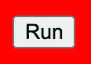

当检测到鼠标事件以显示聚焦或悬停的项目时，在`mouseenter`上使用`mouseover`，在`mouseleave`上使用`mouseout`。

如果将事件监听器添加到`div 1`中，则有以下区别:

*   `mouseover`:当鼠标从外部到`div 2`时，触发一个`div 1`事件和另一个`div 2`子事件。
*   `mouseenter`:当鼠标从外部移动到`div 2`时，触发`div 1`事件。
*   `mouseout`:当鼠标从`div 2`移动到外面时，触发一个子事件`div 2`和另一个事件`div 1`。
*   `mouseleave`:当鼠标从`div 2`走到外面时，触发`div 1`事件。

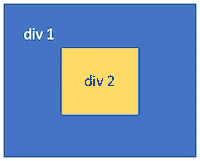

# 步骤 6: **确保**网页在没有 CSS 的情况下也能正常工作

导航顺序应该来自文档的源顺序。CSS 用于控制视觉表现。一个设计良好的网页应该在没有 CSS 的情况下也能发挥作用。

CSS 是级联样式表的简称。它用于定义布局、颜色、字体和动态行为。CSS 旨在实现表示和内容的分离。这使得在不同的呈现系统(如桌面浏览器、移动设备、印刷品、语音和基于盲文的触觉设备)中以不同的样式呈现相同的标记页面变得可行。它提高了内容的可访问性。

给定以下 HTML 源代码:

它呈现一行按钮:

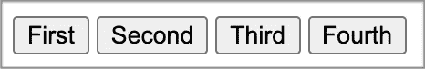

使用以下 CSS 选择器:

```
p {
  display: flex;
  flex-direction: row-reverse;
}
```

它以相反的顺序呈现一行按钮:

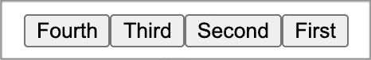

虽然看起来颠倒了，但是键盘导航和屏幕阅读器还是从`First`、`Second`、`Third`到`Fourth`。

CSS flexbox 的`order`属性控制 flex 容器中 flex 项目的顺序。与`tabindex`类似，只有当视觉顺序需要与屏幕阅读器顺序和导航顺序不同步时，才必须使用这个`order`属性。否则，应该对基础文档源进行重新排序。

在没有 CSS 的情况下测试网页渲染是很重要的。

除了 Chrome，大多数浏览器都有一个菜单选项来查看没有 CSS 的页面。在 Chrome 上， [Web Developer 扩展](https://chrome.google.com/webstore/detail/web-developer/bfbameneiokkgbdmiekhjnmfkcnldhhm?hl=en-US)可以实现同样的事情。

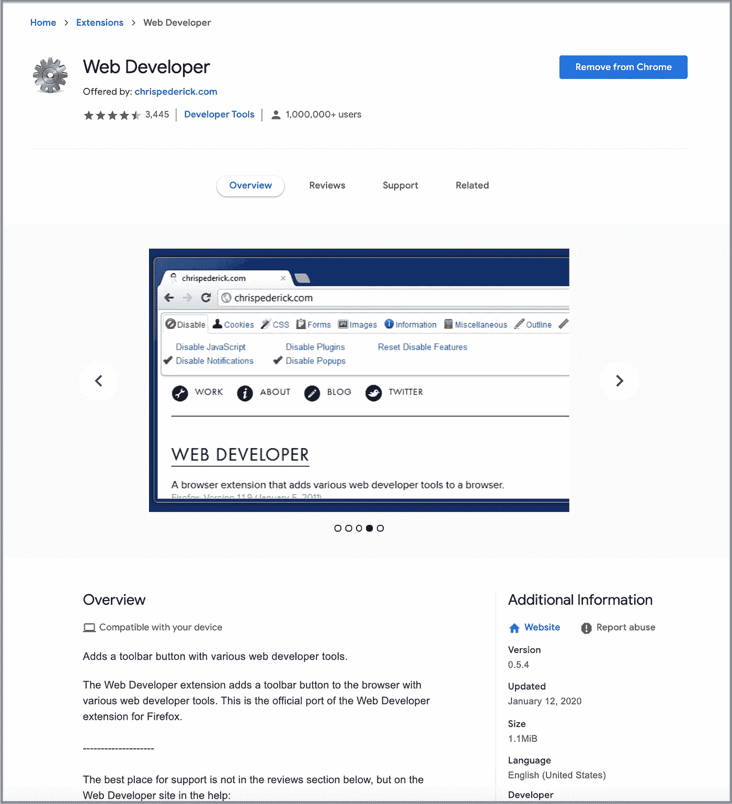

这个扩展为 Chrome 的工具栏添加了一个图标，带有各种 web 开发者工具。点击图标后，我们会看到一个菜单。在此菜单中，选择`CSS`选项卡，然后点击`Disable All Styles`禁用 CSS。

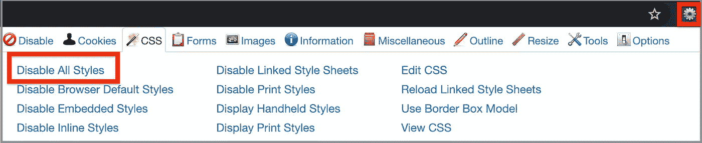

现在我们可以不用 CSS 查看`[https://www.amazon.com/](https://www.amazon.com/)`:

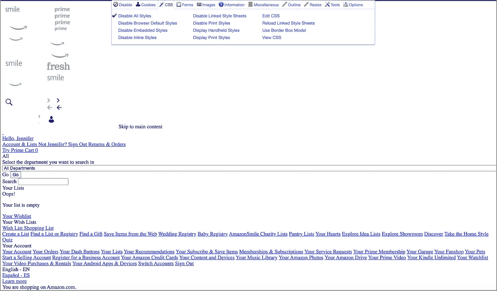

我们可以看到，这份没有 CSS 的文件是在一个合理的顺序，可以发挥作用。按钮和输入字段具有默认样式。使用`Tab`和`Shift Tab`可以四处导航。在链接、选择菜单和按钮上，`enter`键能够触发一个动作。这是一个设计良好的网页，没有 CSS 也能工作。

# 步骤 7:用 WAI-ARIA 填补可及性差距

HTML5 最初发布于 2014 年 10 月。它包含许多与地标和剖面相关的元素，如`main`、`nav`、`header`、`footer`、`section`、`aside.`这些区域可以通过屏幕阅读器和其他辅助技术跳转。

WAI-ARIA(Web Accessibility Initiative-Accessible Rich Internet Applications)最初发布于 2014 年 3 月。根据文档，它定义了“一组额外的 HTML 属性，这些属性可以应用于元素，以提供额外的语义，并在缺少的地方提高可访问性。”ARIA 不是 HTML 的一个版本。

HTML5 用于静态网页内容，ARIA 主要用于动态网页内容。然而，新的 HTML 5 元素与一些 ARIA 角色重叠。一般的建议是首先使用语义 HTML，对于更高级的情况考虑 WAI-ARIA。最健壮的方法是在同一个元素中同时使用两者。

ARIA 角色是通过一个`role="<ROLE TYPE>"`属性添加的，一旦设置，就不会改变。咏叹调角色有六类。

*   地标角色，如`banner`、`navigation`和`search`，标识大的内容区域，并被屏幕阅读器用于导航。
*   文档结构角色，如`table`、`row`和`rowgroup`，为一个部分提供结构描述，通常是非交互式的。
*   小部件角色，如`button`、`radio`和`tab`，描述用户可以与之交互的用户界面对象。
*   窗口角色，如`alertdialog`和`dialog`，充当浏览器或应用程序中的窗口。
*   诸如`alert`、`status`和`timer`的实况区域角色描述了网页的可感知区域，当用户焦点可能在别处时，这些区域通常作为外部事件的结果而被更新。
*   抽象角色，如`command`、`widget`和`window`用于本体。Web 开发人员不得在内容中使用抽象角色。

ARIA 也支持状态和属性。它们都被视为 aria 前缀的标记属性。

状态是可以响应于用户动作或自动化过程而改变的动态属性(例如，`aria-busy`、`aria-disabled`和`aria-hidden`)。

属性对于给定对象的性质是必不可少的。用于提供额外的意义或语义(如`aria-controls`、`aria-details`、`aria-label`)。

这是一个带有 ARIA 属性的搜索框示例:

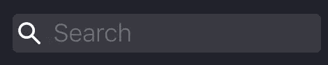

```
<input id="algolia-doc-search" type="search" **role="combobox"** placeholder="Search" **aria-label="Search docs"** **aria-autocomplete="list"** **aria-expanded="false" aria-labelledby="label-for-search"** **aria-owns="autocomplete-listbox-0"**>
```

角色、状态和属性是 WCAG 新协议健壮性的一部分。

# 步骤 8:为媒体内容提供文本选择和更多内容

为媒体内容提供替代文本总是一个好主意，以防由于连接速度慢、链接错误或通过屏幕阅读器无法查看。

属性为图像提供了一个文本选项。根据 [W3Schools](https://www.w3schools.com/tags/att_img_alt.asp) ，以下是对`alt`文本的指导:

*   如果图像包含信息，文本应该描述图像。
*   如果图像在一个`<a>`元素中，文本应该解释链接的位置。
*   如果图像仅用于装饰，则使用`alt=””`。

`title`属性是提供文本选项的另一种方式，尽管它会显示一个工具提示。

ARIA 可用于计算元素/对象的文本替换，包括媒体内容:

*   `aria-label`:定义一个标记当前元素的字符串值。它在屏幕上不可见。标签应该简洁。
*   `aria-labelledby`:标识标记对象的一个或多个元素。它可以在屏幕上看到。
*   `aria-describedby`:标识描述对象的一个或多个元素。比`[aria-labelledby](https://www.w3.org/TR/wai-aria-1.1/#aria-labelledby)`更啰嗦。
*   `aria-details`:标识为对象提供详细和扩展描述的元素。由辅助技术呈现时，`aria-details`引用的元素的内容不会被展平为字符串。这避免了可能的信息丢失。

这是 YouTube 上的一个例子:

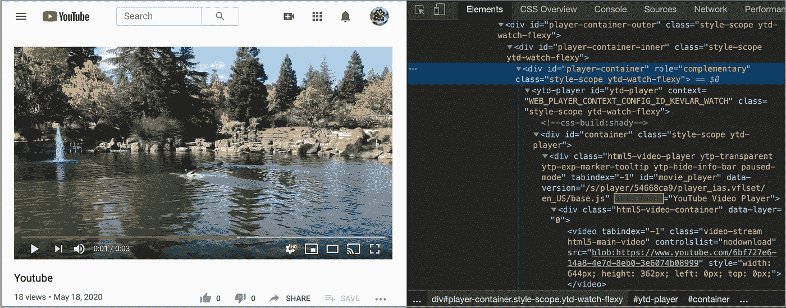

在《WCAG 2》中，文本选择是可感知范畴的一部分。它要求所有非文本项都有一个文本替代项。

*   正确的标签和描述在 A 级，以及预先录制的标题。
*   现场字幕和预先录制的音频描述为 AA 级。
*   手语和现场音频描述达到 AAA 级。

# 步骤 9:区分文字的大小和颜色

WCAG 2 的感知类别中有一节是关于让视力不好的人能够区分文字的大小和颜色。

这是文本大小指南:

*   可以在不损失内容或功能的情况下放大文本。
*   文本应该有足够的行距、段落间距、字母间距和单词间距。

根据[维基百科](https://en.wikipedia.org/wiki/Contrast_ratio)，色彩对比度是“显示系统的一个属性，定义为系统能够产生的最亮颜色(白色)与最暗颜色(黑色)的亮度之比。”高对比度是观看内容的期望方面。

这是文本颜色指南:

*   文字和文字图像的视觉呈现对比率至少为 7:1(大尺寸文字和装饰文字除外)。

你如何测量颜色对比？

进入 WebAIM 的[对比度检查页面](https://webaim.org/resources/contrastchecker/)，在这里您可以比较两种颜色的对比度:

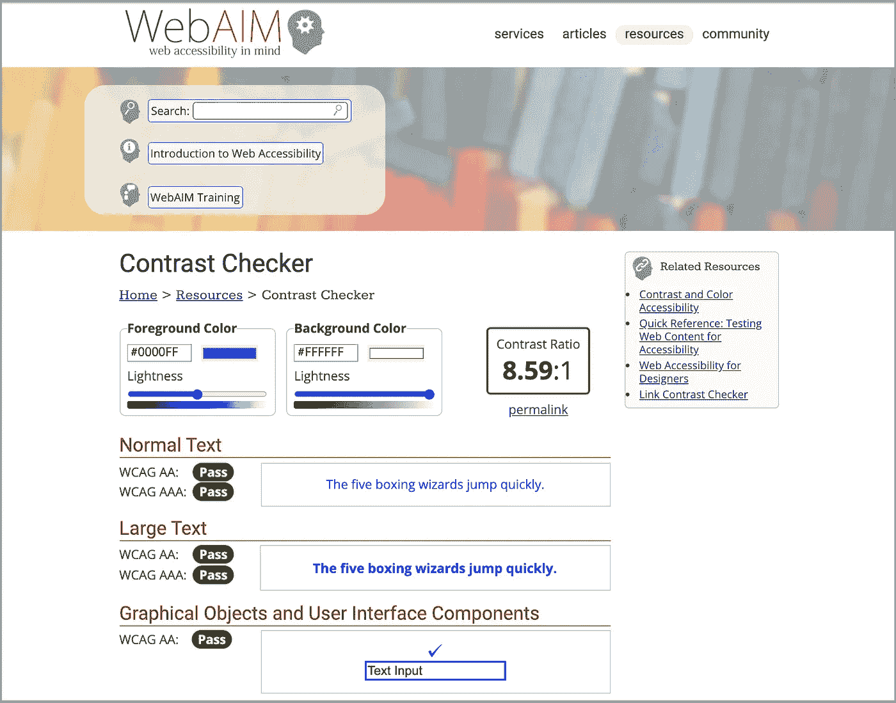

它告诉我们蓝色和白色的对比度是 8.59。它还表明这两种颜色的对比度通过了 WCAG 的 AA 和 AAA 级标准。是不是很酷？

# 步骤 10:通过审计工具测试

尽管遵循了所有关于可访问性的规则，你仍然可能会错过一些东西。使用审计工具来验证网页的可访问性是一个很好的做法。

以下是一些有用的工具:

*   Wave :接受网址的在线可访问性测试工具。它显示该页面的注释视图。所有可访问性问题都会突出显示。

这是`[https://www.amazon.com/](https://www.amazon.com/:)`的测试结果。它显示了四个可访问性错误及其位置。


*   [Tenon](https://tenon.io/) :接受网址或源代码的在线工具。它根据 WCAG 协议 2 和第 508 节显示可访问性问题。

这是`[https://www.amazon.com/](https://www.amazon.com/:)`的测试结果。它显示了 372 个可访问性问题以及它们是什么。

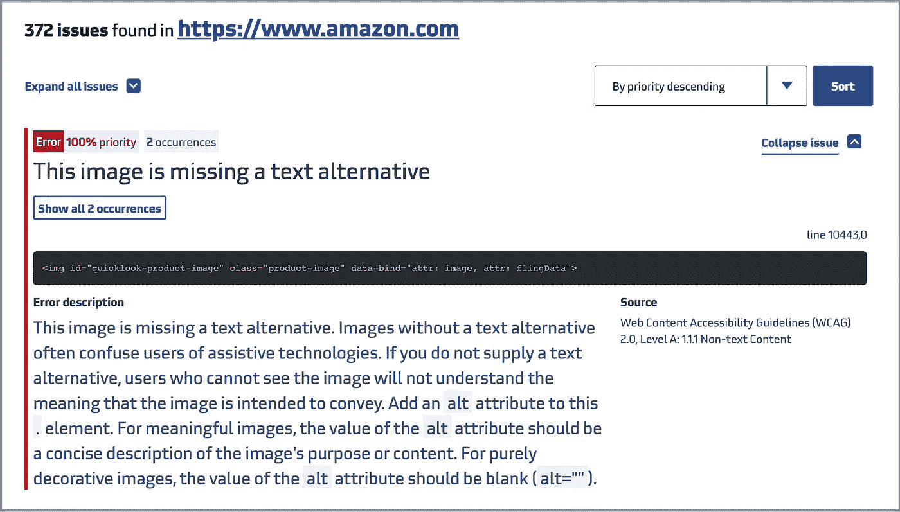

*   AChecker :接受网址、源代码或上传文件的在线工具。它显示了基于 HTML 验证程序、WCAG 2、第 508 节等的可访问性问题。

这是`[https://www.amazon.com/](https://www.amazon.com/:)`的测试结果。它显示了七个已知的问题，并列出了它们未能通过的规则。

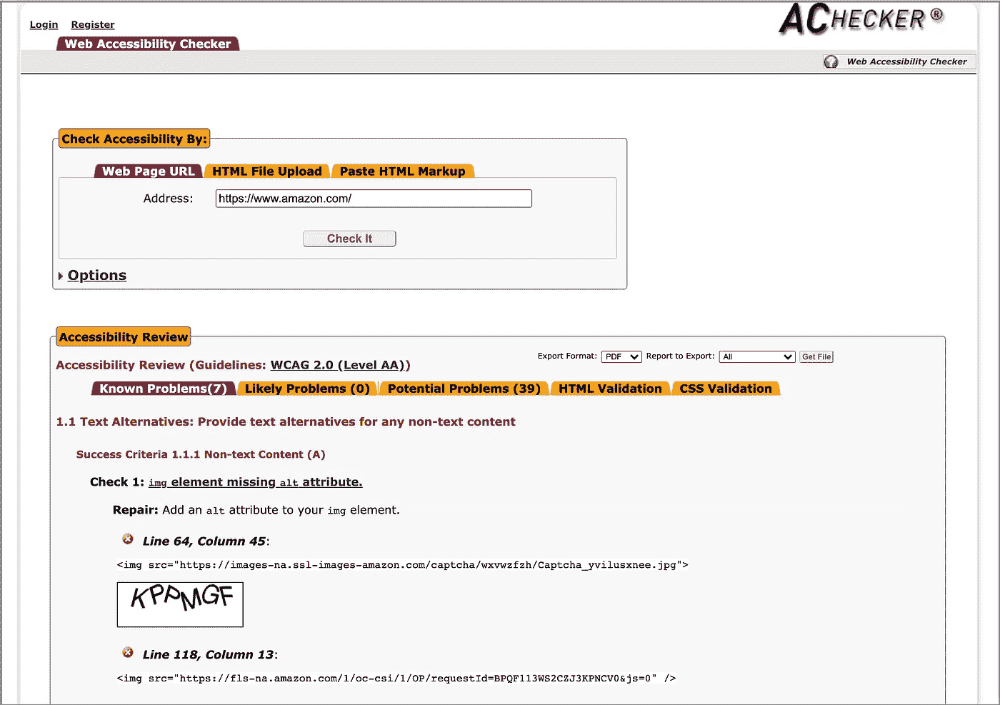

# 结论

我们已经描述了构建具有可访问性的 web 应用程序的十个步骤。让我们回顾一下。

1.  选择语义 HTML。
2.  使用内置键盘访问。
3.  避免使用正的 tabindex 来设置导航流。
4.  达到全键盘访问。
5.  使焦点和悬停相等/在`mouseenter`上使用`mouseover`/在`mouseleave`上使用`mouseout`。
6.  确保网页在没有 CSS 的情况下也能正常运行。
7.  用 WAI-ARIA 填补无障碍缺口。
8.  为媒体内容提供文本替代和更多内容。
9.  使文本大小和颜色可区分。
10.  通过审计工具测试。

这是一个很长的列表，但是为了提高 web 应用程序的可访问性，这是值得的。

接下来，我们将提供关于[如何填写自愿产品可及性模板(VPAT )](https://medium.com/p/78ff28552e35) 的指南。

感谢阅读。我希望这有所帮助。你可以在这里看到我的其他媒体出版物。

*注:Yashwanth Pinneka 和 Mary Chen 对* `*mouseover*` */* `*mouseout*` *规则做出了贡献。*