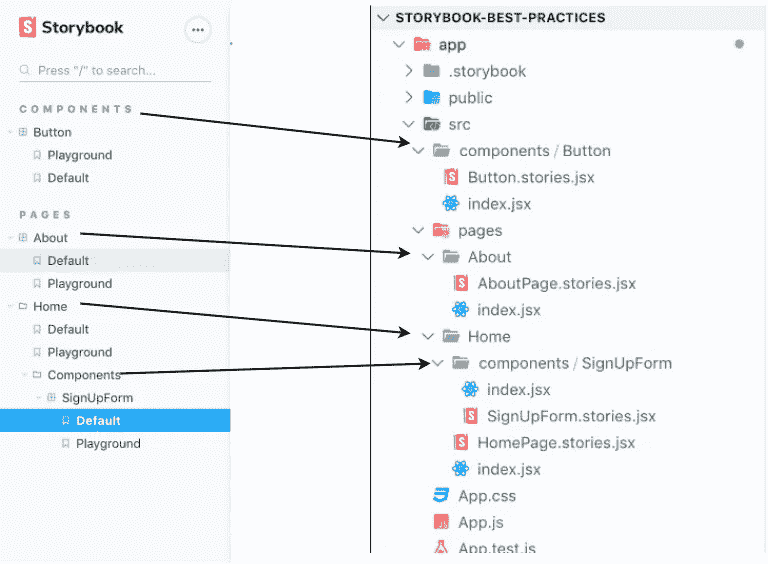

# 10 个故事书最佳实践

> 原文：<https://betterprogramming.pub/10-storybooks-best-practices-ad5fec0f145a>

## 更好的开发者体验，更好的软件


10 个故事书最佳实践

这是一个关于[故事书](https://storybook.js.org/)和约定的帖子。它是基于我多年来使用 Storybook 的经验和其他开发者的经验。我在这里定义的最佳实践并不是修复和改进每个项目的灵丹妙药。它们是我认为值得尝试的想法和惯例的基线。希望它们能帮助你和你的团队拥有更好的开发者体验，并最终向世界交付更好的软件。

我想你知道什么是故事书，并且对它有一些经验。这里的想法可以应用于任何规模的应用程序，并不特定于任何特定的框架(例如 React 或 Vue)，但我写它们时考虑了大型应用程序、大型团队和多个贡献者。

# **1。每个组件一个故事书文件**

故事文件应该包含:

*   一个*默认*故事
*   一个*游乐场*故事
*   和其他反映组件特定状态或 API 的故事。

默认故事显示的组件只定义了其所需的属性。这为每个人创建了一个可视化的基线表示。因此，当人们想到一个特定的组件时，理想情况下，他们会记住默认故事所再现的内容。

游乐场故事用于帮助组件的消费者尝试不同的道具组合，并观察组件的反应。这可以在故事书版本 5 和以下版本中使用[旋钮附件](https://www.npmjs.com/package/@storybook/addon-knobs)来实现。您为组件的所有道具提供旋钮:

对于故事书的最新版本(版本 6)，游乐场的故事可以使用新的 [Args 特性](https://storybook.js.org/docs/react/writing-stories/args)来编写。它看起来像这样:

最后，其他故事应该反映组件的特定状态或 API。例如，如果我们有一个按钮组件，它有一个接受值`primary`、`secondary`、`tertiary`或`error`的`type`属性。那么，我们将有四个故事:`Button/Primary`、`Button/Secondary`、`Button/Tertiary`和`Button /Error`。遵循这种模式有几个原因:

*   共享精确定义了您想要引用的状态的组件的链接更容易，这在与 QA 和设计者交流时很有用。
*   如果故事书与测试工具相结合，比如快照测试或视觉回归测试，那么每个故事就变成了一个单元测试。如果其中一个失败了，你知道是哪一个。
*   通过使故事清晰，我们避免了隐藏旋钮下的组件状态。

# **2。共处一地:故事书文件应该和它的组件呆在一起**

出于相同原因而更改的代码应该放在一起。从这个意义上说，给定组件的故事书文件很可能会随着该组件的改变而改变——所以要把它们放在一起。此外，如果组件文件夹被移动到项目中的另一个位置，或者甚至移动到另一个项目，那么将故事书文件一起移动会更容易。

# **3。命名约定**

将故事书文件命名为`[ComponentName].stories.[js|jsx|tsx]`。老实说，重要的是你和你的团队就命名约定达成一致，并且每个人都遵守它。就我个人而言，我喜欢在文件名中包含组件的名称，因为这样更容易在代码编辑器中找到。否则，我可能会以五个名为`index.stories.tsx`的文件结束，然后我必须打开每个文件或者执行搜索来找到正确的文件。

# **4。新组件必须有故事书**

它有助于创建一个组件库并获得拥有一个组件库的好处。如果你的团队有某种公关清单，故事书可能是在将代码合并到 master 之前要检查的项目之一。

# **5。更喜欢组件故事格式**

[组件故事格式或 CSF](https://storybook.js.org/docs/react/api/csf) 是故事书维护者推荐的编写故事的方式。它基本上是在故事文件中使用的一组约定。您不用使用`storiesOf` API，而是编写常规的 JavaScript 函数并导出它们。Storybook 将命名的和默认的导出内容转换为故事。CSF 格式的一个很大的优点是代码看起来更干净，更容易阅读。代替故事书样板，你可以关注你的代码实际在做什么

# **6。在构建代码库的同时构建故事**

当你使用 Storybook 时，你应该清楚你的应用程序是如何组织的。这是我从 loc Goyet 那里得到的，他发了一篇很棒的帖子[关于我如何设法让我的故事书项目变得最有效率。他的想法是让故事菜单反映故事在应用程序中的位置:](https://dev.to/loicgoyet/how-i-manage-to-make-my-storybook-project-the-most-efficient-possible-2d8o)



你看到上面 Storybook 中的菜单是如何与应用程序文件夹结构对齐的吗？

该结构将帮助您:

*   更轻松地查找故事
*   理解代码是如何组织的。

如果您的应用程序中使用了协同定位，将相关项目放在一起，文件夹结构会让您了解应用程序的结构。

# **7。一致的环境**

当我们在 Storybook 中开发时，我们想要隔离，但很可能我们仍然使用一些与应用程序共享的资源，如图像、数据、CSS、图标、翻译等。这很好，因为我们希望确保我们的组件在应用程序的上下文中使用时行为一致。例如，如果在应用程序中使用了一个本地化库，它可能会在 Storybook 中以相同的配置重用。另一个例子:如果使用第三方 CSS，那么它应该包含在 Storybook 中，因为我们想知道该 CSS 是否会与我们的 CSS 冲突。目的是避免在应用程序中使用组件时出现意外。

# **8。控制数据**

如果您注意到在许多不同的故事中需要相同的数据，那么创建一个 mocks 文件夹并添加 JavaScript 文件可能是一个好主意，这些文件导出将创建可重用数据的工厂函数。让我们假设我们有一个显示用户图像、姓名、锚点的虚拟角色组件，并且这个组件被用在多个地方。我们可以有一个名为 mocks/user.js 的文件，其内容如下:

```
const getUser = (overrides = {}) => {
    const defaultValues = {
        username: "Some User",
        anchor: "[@someuser](http://twitter.com/someuser)",
        image: "[https://webapp/static/images/someuser.png](https://webapp/static/images/someuser.png)"
    };
    return Object.assign(defaultValues, overrides);
};export default getUser;
```

工厂为什么发挥作用？只是为了确保我们每次都得到一个新的对象。如果我们导入一个对象，我们可能会不小心修改它，导致错误的结果。我见过。同样，这里我使用`Object.assign`作为例子，但是你可能需要更复杂的东西来处理数组和对象的合并。Lodash 和 [RamdaJS](https://ramdajs.com/docs/#merge) 都有这个功能——ramda js 太棒了！

# **9。创建你自己的装饰器和插件(如果有意义的话)**

[装饰器](https://storybook.js.org/docs/react/writing-stories/decorators)基本上是包装另一段代码并赋予它额外功能的函数。在 Storybook 中，装饰器可以应用于单独的故事(称为故事装饰器)，一个组件的所有故事(称为组件装饰器)，或者项目中的所有故事(称为全局装饰器)。基线是这样的:

```
const myDecorator = (Story) => <div><Story /></div>
```

在 React 应用程序中，让提供者包装应用程序或应用程序的一部分是很常见的。例如，如果你需要用一个提供者来包装你的组件，那么装饰器是一个不错的选择。或者，如果您想为某个组件添加一个边距，这样它就不会接触到画布的边界，您可以使用这样的装饰器:

```
const withMargin = (Story) => <div style={{ margin: '3em' }}><Story/></div>
```

附加组件是故事书的扩展，可以帮助你以各种方式配置和扩展故事书。开发附加组件更复杂，但并不难，而且你有更多的能力和灵活性。

# **10。认真对待故事书的使用和维护**

故事书对开发 UI 有很大的帮助，因为它鼓励你关注组件的界面，这将帮助你拥有更通用和精简的组件。通用组件和精益组件非常灵活，可以在不同的环境中使用。最后，如果您有一些灵活的组件，您可能需要更少的组件。组件越少意味着代码越少；更少的代码意味着更少的出错机会；更少的漏洞意味着更快乐的用户和更快乐的开发者。所以，保持故事书运行良好，不要让支离破碎的故事继续存在，当它们变得混乱时，重构和重新安排。

根据我的经验，只有当人们拥有所有权时，事情才会得到改善。如果没有一群人负责照看故事书，那么保持故事书的发展和获得使用故事书的好处将会非常困难。每个人都有责任贡献并遵循团队的约定，但是指派某人或一组人作为故事书维护者可能会有所帮助。故事书的维护者可以让其他人负责遵守约定——他们可以在你的团队中改进故事书的使用。

# 结论

这些是我在使用 Storybook 五年后，从比我聪明的其他开发人员的经验中收集的一些想法。我真心希望你学到了新的东西，并且很乐意尝试故事书，或者让故事书对你和你的团队更好。如果你有任何问题或建议让这篇文章更好，请在下面的评论中告诉我。

谢谢！

## 参考

*   【https://storybook.js.org/ 
*   [https://www.learnstorybook.com/](https://www.learnstorybook.com/)
*   [https://dev . to/loic goyet/how-I-manage-make-my-story book-project-the-most-efficient-possible-2d8o](https://dev.to/loicgoyet/how-i-manage-to-make-my-storybook-project-the-most-efficient-possible-2d8o)
*   [https://blog . hich Roma . com/the-pleasant-story book-workflow-b 322 b 76 FD 07？gi=48bcfdd9231b](https://blog.hichroma.com/the-delightful-storybook-workflow-b322b76fd07?gi=48bcfdd9231b)
*   [https://www . learn storybook . com/design-systems-for-developers/react/en/distribute/](https://www.learnstorybook.com/design-systems-for-developers/react/en/distribute/)
*   [https://www . rich soni . com/posts/2019-01-29-story book-architecture-audit/](https://www.richsoni.com/posts/2019-01-29-storybook-architecture-audit/)
*   https://github.com/lauthieb/awesome-storybook