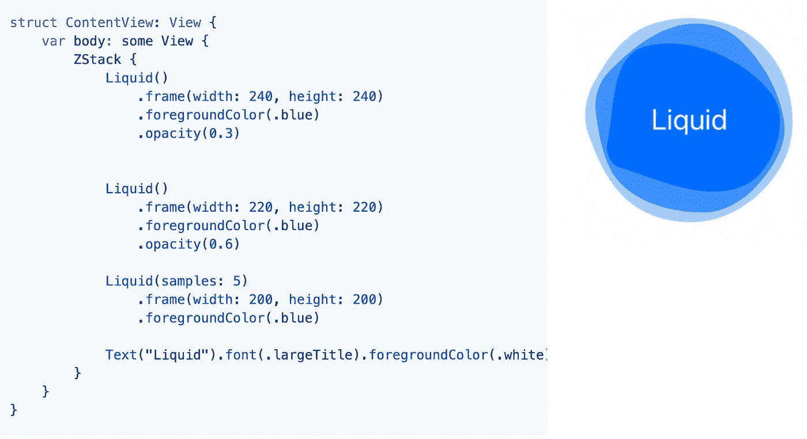
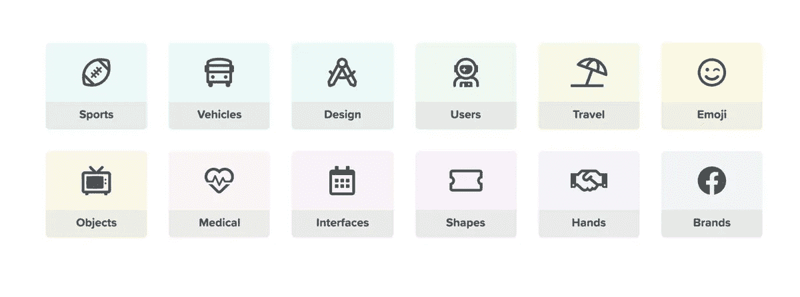
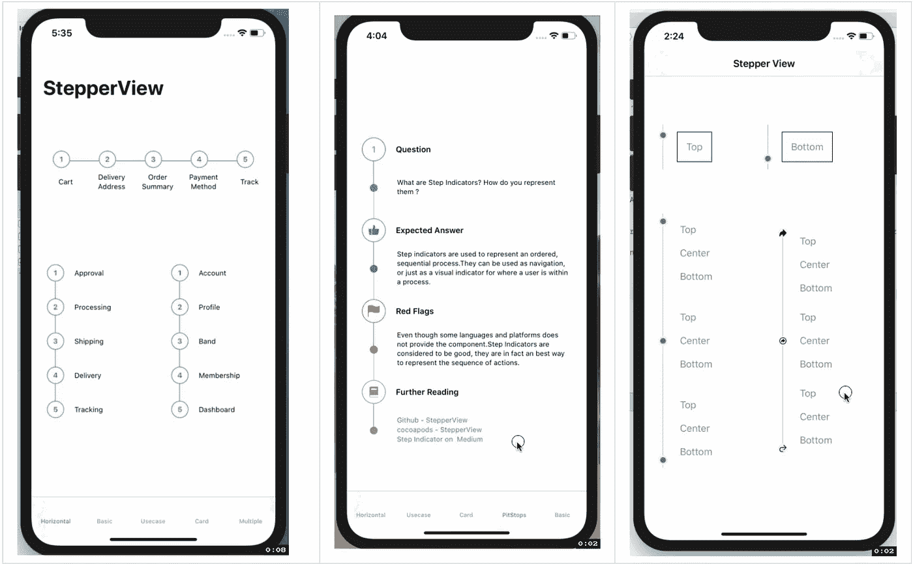
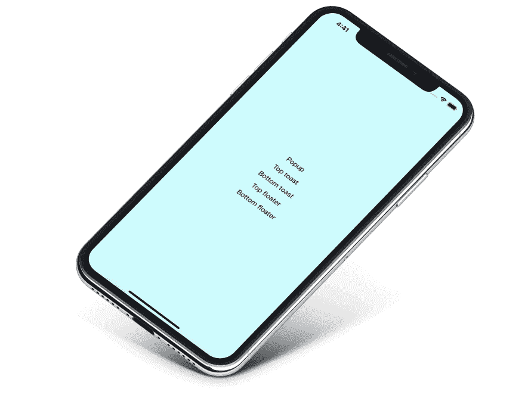
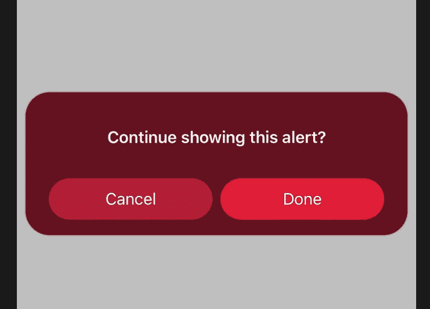
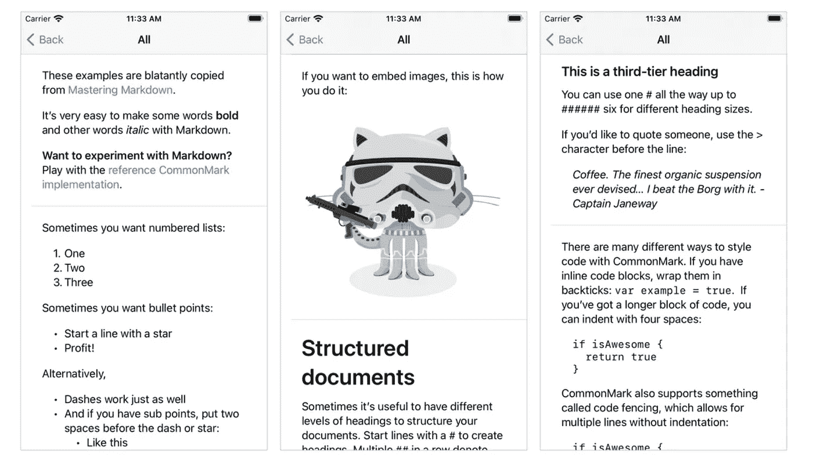
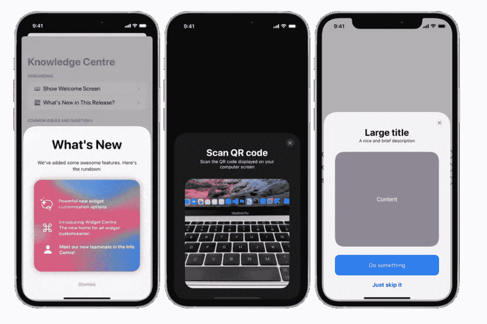
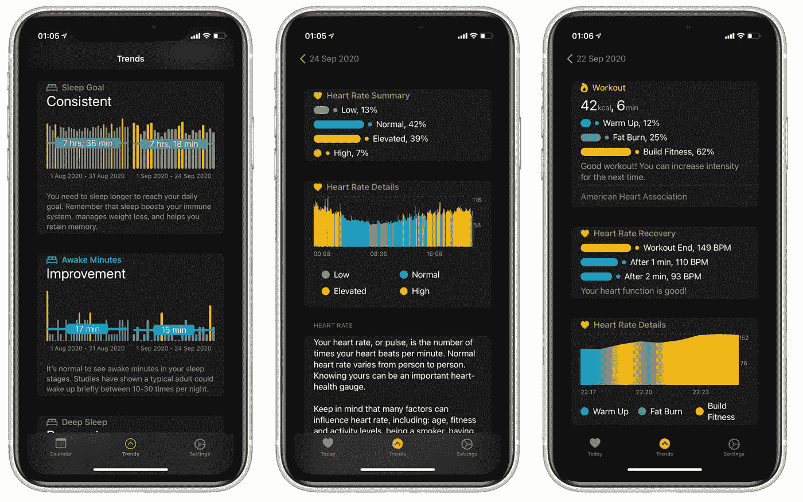

# 2021 年将使用 10 个 SwiftUI 库

> 原文：<https://betterprogramming.pub/10-swiftui-libraries-to-use-in-2021-d21c0384e619>

## 面向 iOS、macOS、watchOS 和 tvOS 开发人员的最酷产品


亚当·范登·布林克在 [Unsplash](https://unsplash.com?utm_source=medium&utm_medium=referral) 上的照片。

SwiftUI 真正改变了我们设计和思考 iOS 应用的方式。在 WWDC 2019 上首次亮相后，苹果通过引入一系列新视图、属性包装器和自定义类型，将事情推向了一个新的高度。

然而，声明性框架仍处于萌芽阶段。SwiftUI 的 bug 使得在生产中使用起来很棘手。此外，我们还没有看到 SwiftUI 在 iOS 应用程序中的许多高级用例。

不管怎样，许多开发人员已经加入了这股潮流，并构建了一些令人惊叹的 SwiftUI 库，您可以在您的 iOS 应用程序中即插即用。

让我们来看几个例子。

# 1.权限 SwiftUI

众所周知，苹果每年都会提高应用权限——无论是通过引入近似位置访问、有限的照片库，还是最新的 iOS 14 广告跟踪权限。

这种带权限的透明对消费者来说是福音，对广告主来说是头疼的事情。

[这个库](https://github.com/jevonmao/PermissionsSwiftUI)包含了苹果默认风格的全部 12 个 iOS 权限。您可以从底部工作表轻松地在它们之间切换。


可以在任何视图上设置`JMPermission`视图修饰符来显示模态表，如下所示:

```
.JMPermissions(showModal: $showModal, for: [.photo, .microphone])
```

此外，该库允许您设置定制的权限文本、图像和图标，以便使用`setPermissionComponent`为用户提供更好的上下文。

# 2.液体

闪屏在任何应用程序中都是可取的。通常，团队倾向于雇佣设计师来创作引人注目的艺术品。

幸运的是，我们有现成的 Swift 包可以做到这一点。[这个库](https://github.com/maustinstar/liquid)可以让你通过简单地使用`Liquid()`自定义视图在 SwiftUI 界面中集成液体动画后挡板视图:



# 3.丰塔韦索梅斯威夫特伊

FontAwesome 图标在组织的应用程序和网站中被广泛使用。图标是矢量形状的事实意味着在调整它们的大小时不会损失质量。

一个通用的命名法只能确保人们可以从云中动态地改变他们的 Android、iOS 和 web 应用程序的图标。

[这个库](https://github.com/onmyway133/FontAwesomeSwiftUI)通过利用 enums 的力量，帮助将 FontAwesome 5 图标带到您的 SwiftUI 应用程序中。对于 iOS 应用程序，您只需:

```
FontAwesome.register()
```

设置完成后，您可以在 SwiftUI `Text`中设置矢量图标，如下所示:

```
Text(AwesomeIcon.btc.rawValue)
    .font(.awesome(style: .brand, size: 20))
    .foregroundColor(.white)
```



来源:[推特上的 Khoa](https://twitter.com/onmyway133/status/1317795562444509188)

# 4.分步视图

步进器是当今应用程序的重要组成部分。他们帮助向用户发送实时进度反馈。遗憾的是，SwiftUI 目前不支持本机步进视图。

但是[这个库](https://github.com/badrinathvm/StepperView)通过为`StepperView`提供开箱即用的支持，努力使您的开发更容易。您可以使用自定义指示器视图、类型、线条和文本对齐方式快速创建垂直和水平步进器。



# 5.弹出视图

与 Android 中不同，iOS 中早就没有内置的祝酒词了。尽管出现了具有“AirPods 已连接”通知的 iOS 14，但 UI 在很大程度上没有出现在苹果生态系统中。

[PopupView](https://github.com/exyte/PopupView) 就是解决那个问题的库。顾名思义，这个 Swift 包有助于在 SwiftUI 界面中显示祝酒词和弹出窗口。

它带有以下用于定制视图的可选参数:

*   `type` —吐司、浮动或默认
*   `position` —顶部或底部(默认情况下，仅决定动画方向)
*   `animation` —自定义弹出滑动到屏幕上的动画
*   `autohideIn` —弹出窗口消失的时间



# 6.AlertX

弹出窗口不同于警告对话框，因为前者不需要按钮，可以自动关闭。

如果默认的 iOS 提醒看起来太无聊，这里有一个库可以让事情变得有趣得多。

[AlertX](https://github.com/neel-makhecha/AlertX) 是一个帮助您在 SwiftUI 中轻松设置自定义提醒的库。从改变背景主题到添加圆角、多个按钮和动画，有一长串的事情可以用这个库来实现。

下面是一行简单的代码可以实现的功能:

```
AlertX.Theme.wine(withTransparency: false, roundedCorners: true)
```



# 7.活动指示器视图

iOS 14 中的 SwiftUI 带来了一些进步。然而，它仍然缺少一个本地活动指示器。的确，可以使用`ProgressView`在某种程度上显示不确定的加载器。话说回来，也不能大篇幅定制。

[ActivityIndicatorView 库](https://github.com/exyte/ActivityIndicatorView)提供了在 SwiftUI 中创建的各种预设加载指示器。从选择指示器的类型到添加颜色和渐变，您可以做很多事情来显示您喜欢的进度指示器。


# 8.MarkdownUI

我们都喜欢降价编辑，不是吗？他们让你用标准的语法在网上写格式化的文本。

SwiftUI 缺少这个必要的工具，尽管人们可以通过使用`UIViewRepresentable`协议来利用`UITextView`，但是内置的 Markdown 编辑器会更好。

同样，[我们有一个库](https://github.com/gonzalezreal/MarkdownUI)用于在 SwiftUI 中渲染 Markdown。您可以设置粗体、斜体、内联代码等等。下面是它的语法:

```
Markdown(
    #"""
    Make some words **bold** and other words *italic* with Markdown.

    ## Inline code
    Wrap them in backticks: `var example = true`.
    """#
)
```



要定制字体，使用`MarkdownStyle`视图修改器，可以设置字体名称和大小的标题和代码。

# 9.幻灯片卡片

从屏幕底部弹出的卡片是一种越来越多地被 iOS 开发者采用的设计模式。这并不奇怪，因为它在苹果的 HomeKit 和 Wifi 共享 UI 中默认使用。

[SlideOverCard](https://github.com/joogps/SlideOverCard) 是一个库，它将卡片设计带到您 SwiftUI 界面中。您可以使用带有可选布尔参数的`SlideOverCardView`或`slideOverCard`视图修改器用于附件视图，如`displayExitButton`、`dragEnabled`和`dragToDismiss`。



# 10.SwiftUICharts

图表是当今大多数应用程序的核心组成部分。除了提供赏心悦目的视觉效果，它们在显示股票和加密货币数据以及各种统计工具方面也很有用。

[这个库](https://github.com/mecid/SwiftUICharts)让您可以在 SwiftUI 应用中快速集成线形图以及垂直和水平条形图。作为锦上添花，它也支持可访问性。



# 结论

在编程中有一句流行的名言:“不要重新发明轮子，除非你打算学习更多关于轮子的知识。”这当然也适用于图书馆。

当您正在构建复杂的项目并且时间紧迫时，拥有现成的库肯定会提高您的开发速度，并确保您不会在别人已经解决的事情上浪费时间。

我希望这组 SwiftUI 库能够启发您构建更多令人惊叹的 iOS 应用，或许还能为开源项目做出贡献。

这一次到此为止。感谢阅读。