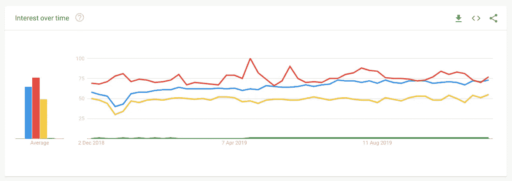

# 前端开发人员在 2020 年应该学会的 10 件事

> 原文：<https://betterprogramming.pub/10-things-front-end-developers-should-learn-in-2020-61b448e75483>

## 如何在明年提升你的工程职业

艾萨克·史密斯在 [Unsplash](https://unsplash.com?utm_source=medium&utm_medium=referral) 上拍摄的照片

这篇文章最初发表在智能编码器上。

# 介绍

毫无疑问，前端开发将是 2020 年科技领域最热门的学科之一。

以前，前端领域的开发人员了解一些 HTML、CSS，也许还有 jQuery，就足以创建交互式网站，但是今天，他们面临着一个广泛的、不断变化的技能生态系统需要开发；要掌握的工具、库、框架；以及不断投资个人教育的需要。

在过去的几年里，我们带来了令人敬畏的新库和框架，如 ReactJS、VueJS 和 Svelte，它们利用 JavaScript 来驱动主要的 web 应用程序。

这篇文章旨在给你一些指导，告诉你在 2020 年作为一名前端开发者应该关注什么来提升你的游戏，无论你是刚开始编程还是已经有了一些经验。

# 1.结构

2020 年，我们可能会看到脸书 ReactJS 和社区驱动的 VueJS 之间的决斗。React 目前在 GitHub 上有 140，000 颗星，而 Vue 的星数甚至更多——153，000 颗星。比如 Angular，只有 53000 颗恒星。

React(蓝线)、Vue(红线)、Angular(黄线)和 Svelte(绿线)在 2019 年的搜索量支持这一假设——Vue 略高于 React。Angular 在搜索量上跟不上，Svelte 在这个对比中绝对起不到什么作用。

因此，对于 2020 年，使用或希望使用 JavaScript 框架的前端开发人员应该将 React 和 Vue 作为他们的主要选择。如果您正在处理大型企业项目，Angular 是一个有效的选项。

如果您想了解关于这些框架的更多信息，请查看以下资源:

*   [反应过来](https://reactjs.org/)
*   [Vue.js](https://vuejs.org/)

# 2.静态站点生成器

静态站点生成器结合了服务器端呈现的能力(对 SEO 非常重要，但也包括初始加载时间)和单页面应用程序。

如今，许多项目选择 SSG，即使它们不需要服务器端渲染，因为像 Next 或 Nuxt 这样的解决方案具有方便的功能，如 markdown 支持、模块捆绑器、集成测试运行器等。

如果您对前端开发很认真，您应该仔细研究以下项目，并尝试获得一些实践经验:

*   下一步(基于反应)
*   Nuxt(基于 Vue)
*   盖茨比(基于反应)
*   Gridsome(基于 Vue)

这些可能是 2020 年最热门的，尽管还有更多。如果您想了解更多信息，请查看以下资源:

*   [Next.js](https://nextjs.org/)
*   [Nuxt.js](https://nuxtjs.org/)
*   [盖茨比](https://www.gatsbyjs.org/)
*   [网格体](https://gridsome.org/)

# 3.JAMstack

术语 *JAMstack* 代表 *JavaScript* (在客户端运行——例如 React、Vue 或 VanillaJS)*API*(服务器端流程通过 JavaScript 抽象并通过 HTTPS 访问)*标记*(在部署时预构建的模板化标记)。

这是一种构建网站和应用程序以获得更好性能的方式——降低扩展成本，提供更高的安全性，并提供更好的开发人员体验。

虽然这些术语本身并不新鲜，但它们都有一个共同点——它们不依赖于 web 服务器。因此，依赖于 Ruby 或 Node.js 后端的单一应用程序，或者用 Drupal 或 WordPress 等服务器端 CMS 构建的网站，都不是用 JAMstack 构建的。

如果您想使用 JAMstack，有一些最佳实践:

## **整个项目服务于 CDN**

因为不需要服务器，整个项目可以从一个 CDN 提供服务，从而实现无与伦比的速度和性能。

## **一切都存在于 Git 中**

每个人都应该能够从 Git repo 克隆整个项目，而不需要数据库或复杂的设置。

## 自动化构建

您可以完美地自动化构建，因为所有的标记都是预先构建的——例如，使用 webhooks 或云服务。

## **原子部署**

为了避免在大型项目中重新部署成百上千个文件时出现不一致的状态，atomic deployment 会在更改生效之前等待所有文件上传完毕。

## **即时缓存失效**

当一个网站上线时，你必须确保你的 CDN 可以处理即时缓存清除，以使变化变得可见。

像 Netlify 或 Zeit 这样的知名主机商支持 JAMstack 应用程序，大公司使用它们为用户提供出色的体验。

在 2020 年，作为一名前端开发人员，这绝对是你需要考虑的事情。如果您想了解更多关于 JAMstacks 的信息，这里有一些很好的资源:

*   [JAMstack](https://jamstack.org/)
*   [詹斯塔克 WTF](https://jamstack.wtf/)
*   [“jam stack 新手？入门所需的一切"](https://snipcart.com/blog/jamstack)

# 4.艾滋病患者

渐进式网络应用(PWA)肯定会在 2020 年成为一件事。越来越多的公司选择 PWAs 而不是原生应用来为他们的用户提供丰富的移动体验。

pwa 可靠(即时加载，无需互联网连接即可工作)，快速(流畅的动画，对用户交互的快速响应)，引人入胜(原生应用程序的感觉，出色的用户体验)。

他们利用服务人员实现离线功能，利用 web 应用清单文件实现全屏体验。

构建渐进式 web 应用程序的原因有，例如:

*   可以从浏览器添加到用户的主屏幕
*   即使没有互联网连接也能工作
*   支持网页推送通知，提高用户参与度
*   利用谷歌的灯塔功能

如果您想了解更多关于 PWAs 的信息，请随时查看以下附加资源:

*   [渐进式网络应用](https://developers.google.com/web/progressive-web-apps)
*   [“你的第一个渐进式网络应用”](https://codelabs.developers.google.com/codelabs/your-first-pwapp/#0)

# 5.GraphQL

GraphQL 是目前最热门的话题之一，也绝对是你在 2020 年需要学习或改进的东西。

虽然 REST 长期以来一直被认为是设计 web APIs 的事实上的标准，因为它提供了像无状态服务器这样的伟大概念，但是 RESTful APIs 越来越被认为是不灵活的，因为它要跟上快速变化的客户端对它们的访问。

GraphQL 是由脸书开发的，用来解决开发者在处理 Restful APIs 时所面临的问题。

使用 REST APIs，开发人员将通过从多个端点获取数据来收集数据，这些端点是为了特定的目的而创建的，例如，`/users/<id>`端点或`/tours/<id>/location`端点。

使用 GraphQL，工作方式会有所不同。开发人员会向 GraphQL 服务器发送一个带有他们数据需求的查询。然后，服务器将返回一个 JSON 对象以及所有相应的数据。

使用 GraphQL 的另一个好处是它使用了强类型系统。GraphQL 服务器上的一切都是通过使用 GraphQL 模式定义语言(SDL)的模式来定义的。一旦创建了模式，前端和后端开发人员就可以彼此独立地工作，因为他们知道定义的数据结构。

如果您想了解有关 GraphQL 的更多信息，请查看以下资源:

[图表 QL](https://graphql.org/)

[如何绘制 QL](https://www.howtographql.com/)

[“graph QL 内容 API 入门”](https://www.contentful.com/developers/docs/tutorials/general/graphql/)

[“graph QL:一种数据查询语言”](https://engineering.fb.com/core-data/graphql-a-data-query-language/)

# 6.代码编辑器/ide

就像 2019 年一样，2020 年微软的 VS 代码将是大多数前端工程师的头号编辑器。

它提供了几乎类似 IDE 的特性，比如代码完成和高亮显示，并且可以通过其扩展市场进行无限扩展。

尤其是市场，是让 VS 代码如此棒的原因。对于前端开发人员来说，这里有一些很棒的扩展:

*   JavaScript (ES6)代码片段
*   npm
*   较美丽
*   CSS Peek
*   韦图尔
*   埃斯林特
*   实时 Sass 编译器
*   Chrome 调试器
*   实时服务器
*   美化

这些都是很酷的例子。在 VS 代码中还有更多值得探索的地方，所以如果您还没有使用它，我鼓励您尝试一下。

# 7.测试

没有一个未经测试的代码可以进入生产。

虽然在您的个人项目中没有任何测试看起来很方便，但是在商业和企业环境中工作时必须有测试。因此，对于任何开发人员来说，只要有可能，最好将测试集成到开发工作流中。

人们可以区分测试用例，如:

## **单元测试**

孤立地测试单个组件或功能。

## **集成测试**

测试组件之间的交互。

## **端到端测试**

在浏览器中测试全面的用户流。

测试的方式更多，比如手动测试、快照测试等。如果你想晋升到高级开发人员的职位，或者想在一家有开发标准的大公司工作，你应该努力提高你的测试技能。

# 8.干净的代码

能够编写干净的代码是一项很好的技能，许多组织都非常需要。如果你想从一个开发人员晋升到一个高级开发人员，你真的应该学习干净代码的概念。

干净的代码应该优雅易读。它应该是集中的，你应该照顾它。所有测试都在干净的代码中运行。它们不应该包含重复，实体的使用，比如类、方法和函数，应该被最小化。

干净代码开发人员应该做的一些事情是:

*   为变量、类、方法和函数创建有意义的名称
*   函数应该很小，并且参数越少越好
*   根本不需要注释——代码本身就能说明问题

如果你想了解更多关于干净编码检查的知识，可以看看 Robert C. Martin 的书和文章。

# 9.饭桶

毫无疑问，Git 是目前 web 开发中版本控制的标准。对于每个前端工程师来说，了解基本的 Git 概念和工作流，以便在各种规模的团队中有效地工作，这真的很重要。

这里有一些你应该知道的流行 Git 命令:

*   `git config`
*   `git init`
*   `git clone`
*   `git status`
*   `git add`
*   `git commit`
*   `git push`
*   `git pull`
*   `git branch`

虽然知道这些命令对于提高您的生产率总是有好处的，但是前端工程师也应该学习 Git 背后的基本概念。以下是一些适合您的资源:

*   [“解释 Git 的基本概念以及如何使用 GitHub”](https://thepilcrow.net/explaining-basic-concepts-git-and-github/)
*   [“如何使用 GitHub —使用 GitHub 的开发者协作”](https://www.edureka.co/blog/how-to-use-github/)
*   [GitHub](https://github.com/)

# 10.软技能

经常被忽视但对开发者来说非常非常重要的是软技能的获得。

虽然它有助于理解事情的技术方面，但知道如何在团队中沟通也同样重要。如果你真的想从事科技行业，或者打算晋升到高级职位，你应该在以下软技能上下功夫:

*   神入
*   沟通
*   协力
*   平易近人和乐于助人
*   耐心
*   思想开放
*   解决问题
*   有责任
*   创造力
*   时间管理

永远记住:对于一个高级开发人员来说，最重要的可交付成果是更多的高级开发人员。

# 结论

在本文中，我向您展示了前端开发人员在 2020 年应该努力学习、改进或掌握的 10 件重要事情。

这个列表并不完整，但我希望它能给你来年一些启发——选择权在你！