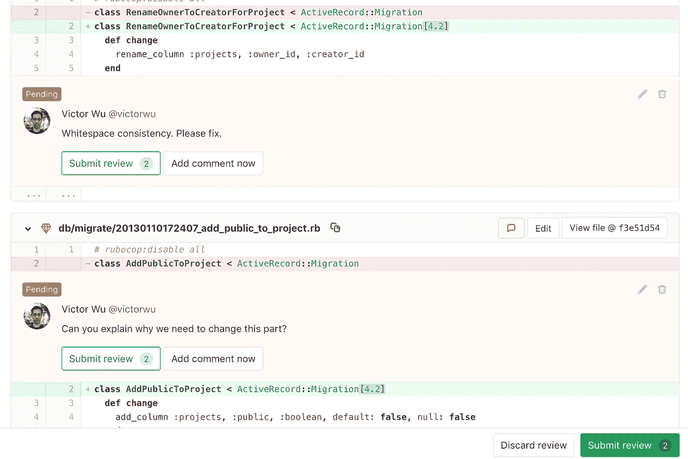

# 在每次代码审查中要寻找的 10 件事

> 原文：<https://betterprogramming.pub/10-things-to-look-for-in-every-code-review-3f7fe67ba817>

## 让你的代码更易维护和健壮的指南

西蒙·艾布拉姆斯在 [Unsplash](https://unsplash.com?utm_source=medium&utm_medium=referral) 上拍摄的照片

代码评审是开发过程中不可或缺的一部分。它们有助于确保您构建健壮且可维护的工具。代码审查的好处包括增加项目的可见性，在团队成员之间共享知识，最重要的是，检测错误和提高可维护性。

任何将代码提交审查的开发人员都希望得到建设性的反馈。反馈不应仅限于关于样式、行距或命名的注释。

*代码审查的主要焦点应该是给出建设性的反馈，这将使代码更具可读性、可维护性和无 bug 性。*

以下是每次代码审查中需要注意的 10 件事。

# 1.功能

代码是否如开发人员所愿？首先，代码评审员负责检查代码评审中定义的目标是否达到。这些变化解决了所有的特性或错误修复了吗？

# 2.设计

在理想的情况下，任何软件设计的改变都应该在实现之前进行讨论和评估。唉，我们并不是生活在一个完美的世界中，所以可能会有这样的情况，设计没有事先讨论，需要大量的重构来使代码更改符合标准。

*   查看提议的[设计模式](https://en.wikipedia.org/wiki/Software_design_pattern)是否与代码评审中的变更相匹配。程序逻辑在类之间是如何划分的，这些类之间是如何交互的？
*   代码是否遵循[面向对象设计](https://en.wikipedia.org/wiki/Object-oriented_design)原则？
*   UI 代码和逻辑代码是分开的吗？组件的划分方式有意义吗？
*   项目中的文件组织直观吗？例如，UI 文件、图像、脚本、类和头文件都在不同的文件夹中吗？

# 3.识别重复代码

***【不重复自己(干)***

重复的代码会导致重复的错误、增加的复杂性和不必要的开销。不要重复自己(DRY)是软件开发人员的常用口头禅。

**避免重码的原因:**

*   这使得代码库冗长且难以维护。
*   一个维护者可能在一个地方修复了一个 bug，但在另一个地方却没有。
*   重复的代码意味着需要运行重复次数的测试。

**如何修复:**

*   如果函数在整个类中重复，那么这段代码应该被移到一个单独的函数中。
*   如果这个重复的代码在多个项目中使用，那么这个代码应该被添加到一个[子模块](https://git-scm.com/book/en/v2/Git-Tools-Submodules)或者单独的项目中，被所有的项目引用。
*   多个类中是否存在重复的功能？确保使用继承将减少重复函数的数量。

# 4.考虑算法的运行时间

算法的运行时间取决于执行的操作数量，可以用[大 O](https://en.wikipedia.org/wiki/Big_O_notation) 符号表示。操作越多，运行应用程序的时间就越长。

*   有没有不需要的操作？应该删除所有不必要的计算。
*   算法是不是在做重复的工作？我们能否使用[内存化](https://en.wikipedia.org/wiki/Memoization)来缓存数据，以避免多次运行相同的计算？
*   识别嵌套循环。有没有一种不用操作就能简化操作的方法？
*   访问数据时的查找成本是多少？有没有一种数据结构可以用来简化它？

# 5.移除代码中所有硬编码的值

如果硬编码值需要存在于项目中，使用[常量](https://en.wikipedia.org/wiki/Constant_(computer_programming))和描述性变量名。

*   特定于类的常量应该作为静态类变量添加。
*   可配置常数应该是配置类的一部分。
*   不可配置的和在类之间共享的常量应该在一个常量文件中，并且只在需要的时候包含。

# 6.错误处理

代码是否包含彻底的[错误处理](https://medium.com/better-programming/handling-errors-in-python-9f1b32952423)？

*   异常应该处理由于用户输入、硬件限制、网络问题等导致的无效输入。
*   断言应该验证条件，以帮助检测错误和验证测试用例。

# 7.存储器分配

如果`malloc()`或`free()`被误用，内存分配可能容易出错。由于内存分配导致的最危险软件错误的详细列表可以在[这里](https://cwe.mitre.org/top25/archive/2019/2019_cwe_top25.html)找到。

*   **如果内存中未使用的对象从未被释放，就会发生内存泄漏**。这将导致应用程序使用比所需更多的内存，并可能降低系统速度。
*   **过早释放**发生在一个仍被程序使用的对象被释放的时候。结果是一个陈旧的指针，这将导致对 malloc 和 free 的进一步调用崩溃。
*   通过释放一个已经释放的对象，一个对象可以被双重释放。同样，将来对 malloc 和 free 的调用可能会崩溃。

在使用 Python 等具有内置垃圾收集功能的语言时，您不太可能遇到内存分配问题。

# 8.评论

如果不清楚为什么一部分代码存在，这是需要注释的好迹象。

*   评论应该简洁且可操作。
*   注释应该解释*为什么*代码存在——而不是*代码在做什么*。
*   IDE 注释关键字，如`TODO`、`FIXME`、`CHECKME`、`PENDING`等，应该用来标识注释的具体类别。

# 9.一致性

整个代码库的风格应该在命名、间距和括号方面保持一致。理想情况下，您的团队已经建立了风格指南。

*   函数、变量和类的命名一致吗？
*   如果没有风格指南，代码应该与代码库的其余部分保持一致。

# 10.安全并行编程

如果代码包含并行编程，则必须检查[死锁](https://en.wikipedia.org/wiki/Deadlock)和[竞争条件](https://en.wikipedia.org/wiki/Race_condition)。仅仅通过运行代码来测试这些问题是很有挑战性的，所以让另一个开发人员来研究这些问题是很重要的。

# 额外资源

以下是一些标准的代码审查工具:

*   [坩埚](https://www.atlassian.com/software/crucible)
*   [审查委员会](https://www.reviewboard.org/)
*   [Gitlab](https://about.gitlab.com/handbook/engineering/workflow/code-review/)

Gitlab 代码审查来自 [Gitlab 发行说明](https://about.gitlab.com/releases/2018/10/22/gitlab-11-4-released/)

编码风格指南:

*   [Python Pep 8 风格指南](https://www.python.org/dev/peps/pep-0008/)
*   [谷歌 C++风格指南](https://google.github.io/styleguide/cppguide.html)
*   [谷歌 Javascript 风格指南](https://google.github.io/styleguide/jsguide.html)

# 结论

我希望这篇文章能让您更深入地了解在审查代码时应该寻找什么。

如果您遵循本文中的指导原则，代码审查可以减少错误，并确保一致性、效率和可维护性。

如果您的团队目前不需要代码评审，我希望这篇文章已经让您相信了代码评审在开发和维护健壮系统中的重要作用。