# 关于 YAML 你可能不知道的 10 件事

> 原文：<https://betterprogramming.pub/10-things-you-might-not-know-about-yaml-b0589da547c>

## 利用 YAML 的真正力量

作者图片

YAML 声称这是一个人性化的数据序列化标准。“人性化”，没有一个用过 YAML 的人说。

一个空间错位，一切都破碎了。

对于 1.2 版。主要目标是使 YAML 符合 JSON 作为官方子集。作为 JSON 的超集，YAML 增加了什么？在这篇文章中，我将探索一些你可能不知道的关于 YAML 的事情。

在我们开始之前，让我们快速介绍一下 YAML。YAML 将列表排序为序列。这些序列是由冒号分隔的破折号和无序的键值对创建的。这些键值对被称为映射。映射中的每个键都必须是唯一的。定义键、值和序列项的文本称为标量值，它们是零个或多个可打印的 Unicode 字符。清楚了这一点，让我们开始我们的 YAML 十大你可能不知道的事情之旅。

# 第一

YAML 是 JSON 的超集，这意味着任何有效的 JSON 都是有效的 YAML。左边是一个 JSON 文档，右边是该内容的规范形式。

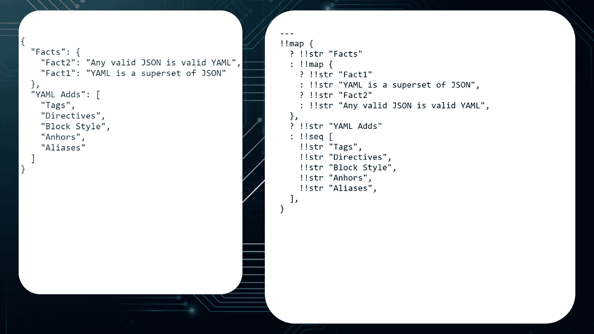

由 1.2 版 YAML 解析器解析的 JSON 文档

如果您使用的 YAML 解析器支持 1.2 版，您可以将所有 YAML 文件转换成 JSON，一切都将继续工作。但在此之前，请阅读本文的其余部分。你可能会发现为什么你想和 YAML 在一起。

# 第二点

YAML 支持评论意见。注释可以以井号(#)开始，直到行尾。这在 CI/CD 管道这样的大型文档中非常方便。添加注释不会以任何方式改变输出。

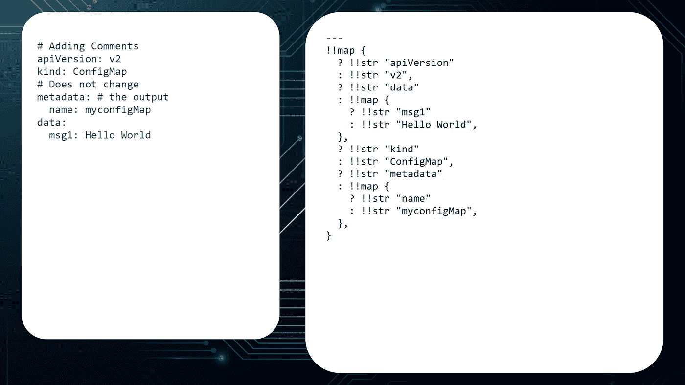

YAML 支持评论意见

# 第三点

YAML 支持锚和别名。这样可以避免重复相同的值。锚点是一个&符号(`&`)，后面是一个标签，后面是一个空格和您想要重用的值。当您想要使用该值时，请键入星号(`*`)和标签。处理 YAML 时，所有别名都将替换为实际值。这允许您在一个地方更改值，并让更改传播到整个文档。

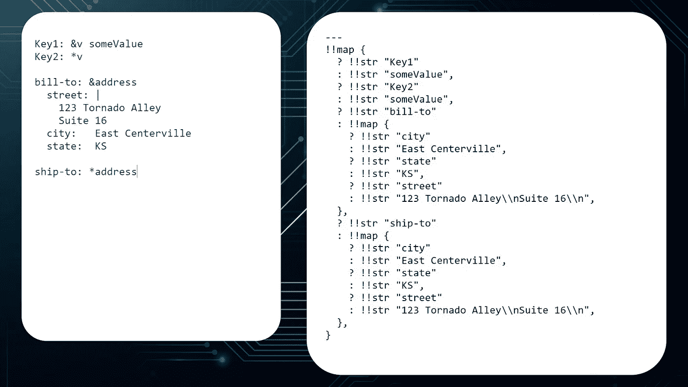

锚和别名的使用

# 第四个

可以使用竖线指示的文字样式来保留或折叠新行(`|`)。

或者用大于号(`>`)表示的折叠样式。

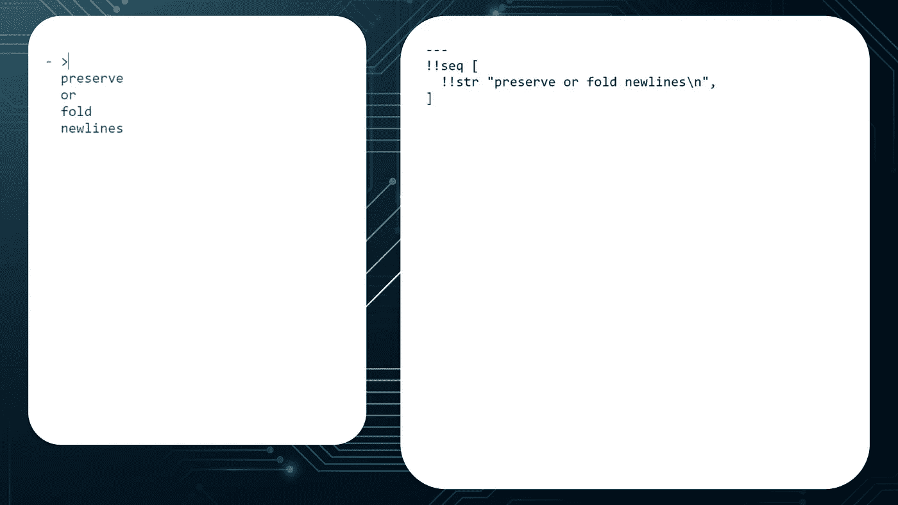

使用折叠样式时，每个换行符都被折叠成一个空格，除非它以一个空行或更缩进的行结束。添加减号(`-`)或加号(`+`)控制是否保留尾随的新行。

使用减号(`-`)和加号(+)以折叠方式保留尾随的新行

使用文字样式时，每个换行符都会保留。但是，后面的新行可以用减号(`-`)或加号(`+`)来控制。

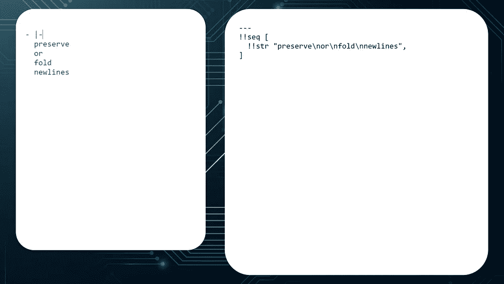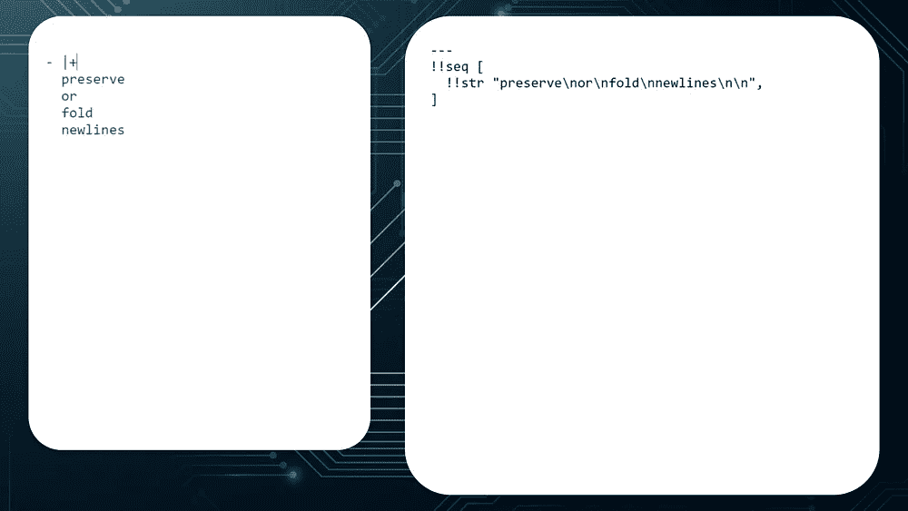

使用减号(-)和加号(+)保留文字样式的尾随新行

最后，您可以添加一个块指示器来通知解析器预期的缩进。任何额外的空格都将添加到值的前面。

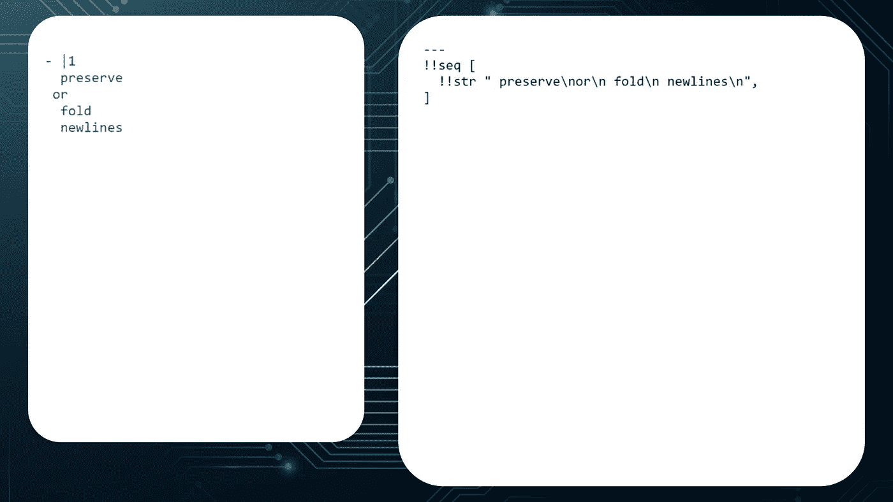

闭塞指示器

# 第五个

值可以写成普通(不带引号)、双引号或单引号。如果值的第一个字符可能会导致歧义，则引用值会很有帮助。使用双引号时，反斜杠和双引号必须用反斜杠转义。使用单引号时，不需要对反斜杠和双引号进行转义。然而，要获得单引号，您必须使用两个。

转义字符

# 第六个

您可以使用文件顶部的指令来识别 YAML 版本。例如，您可以用`%YAML 1.2`作为文档的开头，表示该文档支持 YAML 规范的 1.2 版本。

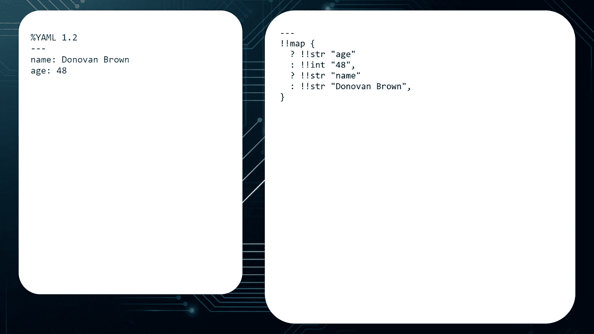

使用版本指令

# 第七个

您可以使用双感叹号后跟类型来将类型分配给值。例如，我可以将我的年龄从默认的整数改为浮点数。所以，我可以报告我 48 岁半。

双爆炸的使用

# 前锋

YAML 支持两种创作风格:块和流。Block 使用缩进来表示结构，这是我们大多数人看到 YAML 被使用的方式。YAML 的流风格可以被认为是 JSON 的自然扩展，它使用双引号、单引号、方括号、花括号和逗号来表示结构。

Flow 定义了写为方括号内逗号分隔列表的序列和使用花括号的映射。谈到空间，流动风格要宽容得多。您可以在同一文档中混合使用块样式和流样式。

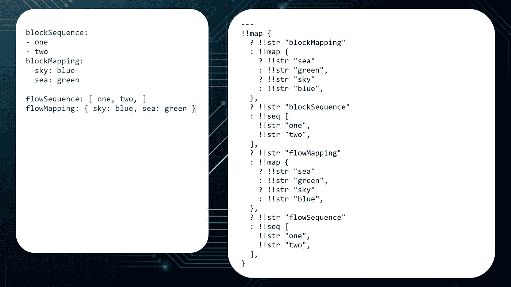

块和流样式的使用

# 第九个

您可以使用问号来表示键-值对中的键。当键为空或者第一个字符是一个字符(如破折号或方括号)时，如果没有引号，将会导致歧义，这将非常有用。使用问号还允许键跨越多行。使用问号时，冒号必须在单独一行。

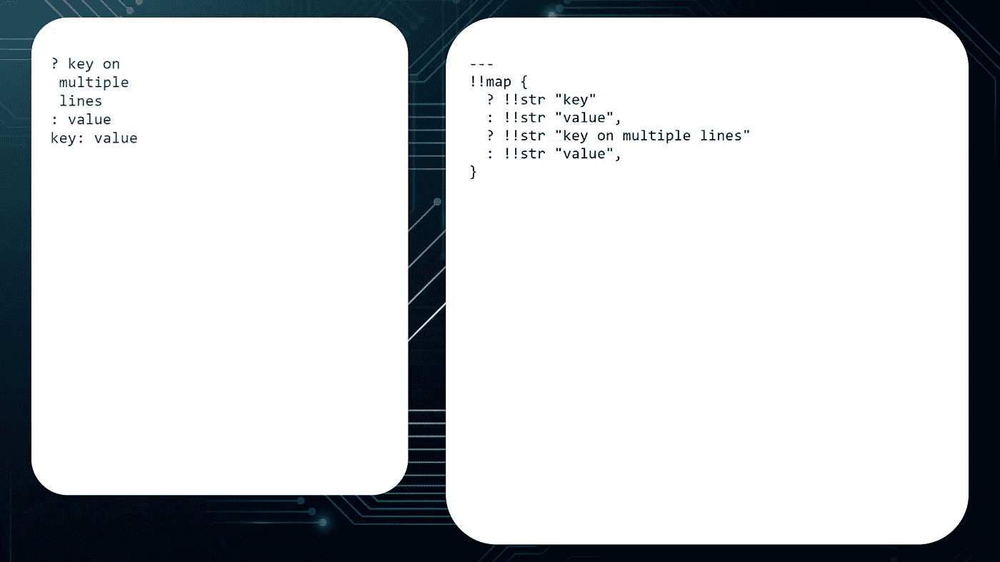

使用？表示键名

# 唐宁街１０号

制表符不能用于缩进；它们必须转换成空格。我一直以为空格数是固定的。只要平行元素具有相同的左对齐，并且分层嵌套元素进一步缩进，空格的数量就不重要。从第一个非空行检测块标量的缩进级别。

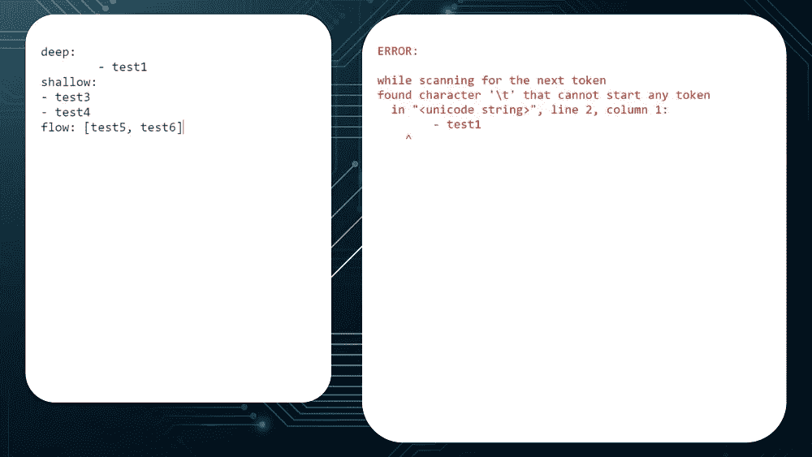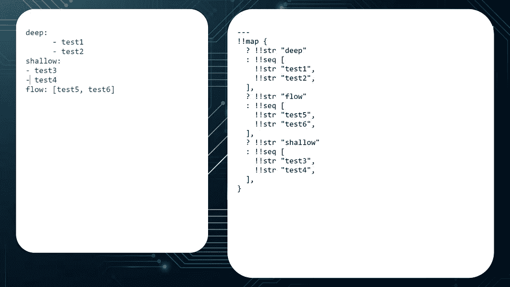

YAML 不支持制表符

在我为这篇文章做研究之前，我总是对 YAML 感到沮丧，我想知道它为什么会存在。现在我明白了，它给 JSON 增加了很多很酷的特性，我可以在什么时候使用它做出更明智的决定。

# 信用

编辑:切尔西·布朗