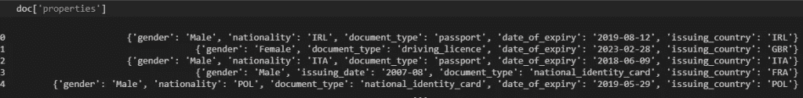
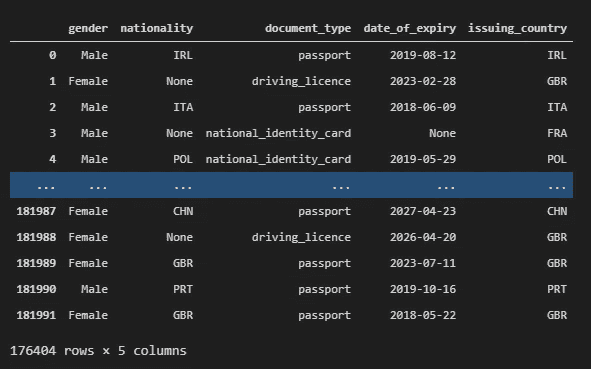
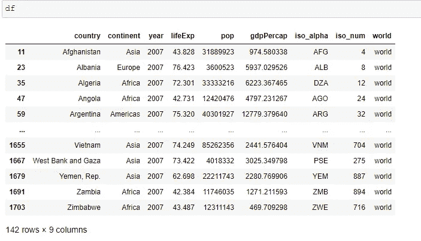
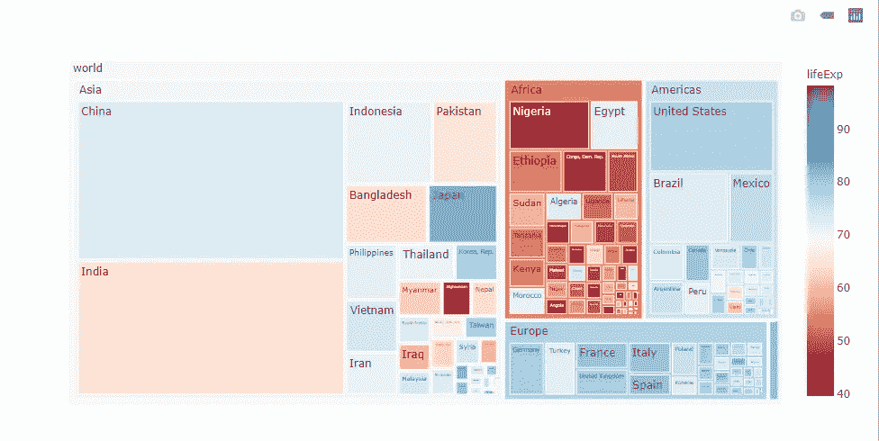
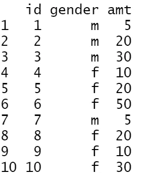

# 数据科学家会喜欢的 10 个真实世界的提示和技巧

> 原文：<https://betterprogramming.pub/10-tips-and-tricks-for-data-scientists-part-3-52ffbddcba26>

## Python、R 等语言中一些更有用的代码片段


照片由[米卡·鲍梅斯特](https://unsplash.com/@mbaumi?utm_source=medium&utm_medium=referral)在 [Unsplash](https://unsplash.com?utm_source=medium&utm_medium=referral) 上拍摄。

我已经开始为数据科学家撰写一系列关于技巧和诀窍的文章(主要用 Python 和 R 语言)。如果你错过了第一和第二部分，你可以看看下面:

[](/10tips-and-tricks-for-data-scientists-vol-1-a870455325da) [## 数据科学家的 10 个技巧和诀窍

### R 和 Python 中有用的代码片段

better 编程. pub](/10tips-and-tricks-for-data-scientists-vol-1-a870455325da) [](/10-tips-and-tricks-for-data-scientists-vol-2-5640ccd1aa5e) [## 数据科学家的 10 个惊人技巧和诀窍

### 一些更有用的 R 和 Python 代码片段

better 编程. pub](/10-tips-and-tricks-for-data-scientists-vol-2-5640ccd1aa5e) 

# 计算机编程语言

## **1。如何处理熊猫的 JSON 细胞**

假设您正在处理一个 pandas 数据帧，其中有一列是 JSON 格式的，并且您想要提取特定的信息。对于这个例子，我们将使用来自 [Kaggle](https://www.kaggle.com/andreashong/rev-kyc) 的`doc_report.csv`数据集。



如果我们查看数据，`properties`字段是 JSON 格式的。这意味着我们需要将其转换为字典，然后提取所需的信息。我们将使用`ast`库将其转换为字典，然后我们将为每个键创建单独的列，如下所示:



如您所见，我们根据键值将 JSON 数据类型单元格转换为列。

## **2。如何使用 applymap** 更改多个列值

我们将提供一个例子，说明如何使用`applymap`函数来更改 pandas 数据框架中的多个列值。假设您的数据帧采用值`1`、`2`和`3`，并且您想要应用以下映射函数:

*   如果`1`，那么`0`。
*   如果`2`或`3`，则`1`。

```
df **=** pd.DataFrame({'A':[1,1,2,2,3,3],'B':[1,2,3,1,2,3]})df
```

输出:

```
 A	B
0	1	1
1	1	2
2	2	3
3	2	1
4	3	2
5	3	3
```

使用`applymap`功能:

```
# create the mapping dictionaryd **=** {1 : 0, 2: 1, 3: 1}# apply it to all columns
df.applymap(d.get)
```

我们得到:

```
 A	B
0	0	0
1	0	1
2	1	1
3	1	0
4	1	1
5	1	1
```

## **3。如何用 Plotly 构建树形图**

使用 [plotly.express](https://plotly.com/python/plotly-express/) ，您可以轻松地创建精美的树形图。例如，假设我们想考虑国家的大陆和人口，按国家表示预期寿命。所以，在下面的树状图中，矩形的大小指的是人口数量，颜色指的是预期寿命。寿命越高，颜色越蓝。寿命越低，颜色越红。



你可以在 [plotly 文档](https://plotly.com/python/treemaps/)中找到更多细节。

## **4。如何获得两个数据帧之间的相关性**

让我们看看如何在 Python 中获得两个数据帧之间的列相关:

输出:

```
 x21      x22
x11 0.953873 0.900050
x12 0.988908 0.975597
```

## **5。如何在熊猫中把日期截成一个月**

假设您正在处理以下数据帧:

```
**import** pandas as pddf **=** pd.DataFrame({'MyDate': ['2020-03-11', '2021-04-26', '2021-01-17']})df['MyDate'] **=** pd.to_datetime(df.MyDate)df
```

输出:

```
 MyDate
0   2020-03-11
1   2021-04-26
2   2021-01-17
```

并且您想将日期截断为一个月:

```
df['Truncated'] **=** df['MyDate'] **+** pd.offsets.MonthBegin(**-**1)# OR
# df['Truncated'] = df['MyDate'] - pd.offsets.MonthBegin(1)df
```

输出:

```
 MyDate     Truncated
0 2020-03-11 2020-03-01
1 2021-04-26 2021-04-01
2 2021-01-17 2021-01-01
```

## 6。如何在熊猫中从一个文件夹追加多个 CSV 文件

假设您在一个特定的文件夹中有多个 CSV 文件，并且您想将它们连接在一个 pandas 数据帧中。我们假设我们的 CSV 文件在`My_Folder`下。

现在`df`由`My_Folder`中的`CSV`文件组成。

## 7。如何在 Python 中连接多个 CSV 文件

假设您在一个特定的文件夹中有多个 CSV 文件，并且您想要将它们连接起来并保存到一个名为`merged.csv`的文件中。我们可以和熊猫一起工作，在`.to_csv()`中使用`mode=a`的技巧，这意味着*附加*:

## 8。如何在 Python 中连接多个 TXT 文件

假设您有多个`.txt`文件，并且您想将它们连接成一个唯一的`.txt`文件。假设您的`.txt`文件在`dataset`文件夹中。然后你需要得到他们的路径:

通过上面的代码片段，我们成功地将它们连接成一个名为`merged_file.txt`的文件。在文件很大的情况下，您可以按如下方式工作:

# 稀有

## 9。如何获得两个数据帧之间的相关性

让我们看看如何在 R:

```
df1 = data.frame(x11 = c(10,20,30,40,50,55,60),
                 x12 = c(11,15,20,30,35,60,70)
                 )df2 = data.frame(x21 = c(100,150,200,250,300,400,500),
                 x22 = c(110,150,180,250,300,400,600)
                 )cor(df1,df2)
```

输出:

```
 x21       x22
x11 0.9538727 0.9000503
x12 0.9889076 0.9755973
```

## **10。R** 中的“计数(当…否则…结束时的情况)”

当我用 SQL(甚至 HiveQL、Spark SQL 等等)运行查询时，使用`count(case when.. else ... end)`语法是很常见的。今天，我将为您提供一个如何在`dplyr`中运行这类命令的示例。让我们开始:

```
library(sqldf)
library(dplyr)df<-data.frame(id = 1:10,
               gender = c("m","m","m","f","f","f","m","f","f","f"),
               amt= c(5,20,30,10,20,50,5,20,10,30))df
```



让我们在 SQL 的不同列中获得每个性别的`count`和`sum`:

```
sqldf("select count(case when gender='m' then id else null end) as male_cnt,
              count(case when gender='f' then id else null end) as female_cnt,
              sum(case when gender='m' then amt else 0 end) as male_amt,
              sum(case when gender='f' then amt else 0 end) as female_amt
              from df")
```

输出:

```
 male_cnt female_cnt male_amt female_amt
1        4          6       60        140
```

让我们在`dplyr`得到同样的输出。我们需要根据一列对数据帧进行子集划分:

```
df%>%summarise(male_cnt=length(id[gender=="m"]),
               female_cnt=length(id[gender=="f"]),
               male_amt=sum(amt[gender=="m"]),
               female_amt=sum(amt[gender=="f"])
               )
```

输出:

```
 male_cnt female_cnt male_amt female_amt
1        4          6       60        140
```

最初由[预测黑客](https://predictivehacks.com/10-tips-and-tricks-for-data-scientists-vol-3/)发布