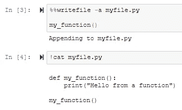
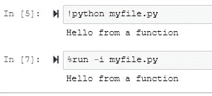
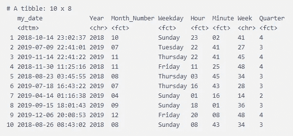
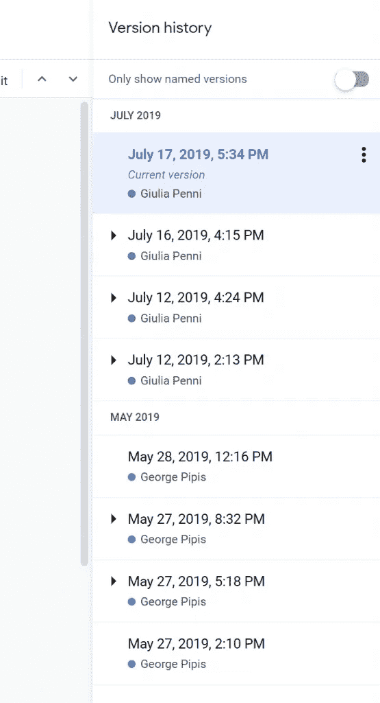
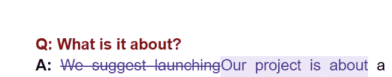

# 数据科学家的 10 个惊人技巧和诀窍

> 原文：<https://betterprogramming.pub/10-tips-and-tricks-for-data-scientists-vol-2-5640ccd1aa5e>

## 一些更有用的 R 和 Python 代码片段


帕特里克·亨德利在 [Unsplash](https://unsplash.com?utm_source=medium&utm_medium=referral) 上拍摄的照片。

[](https://jorgepit-14189.medium.com/membership) [## 用我的推荐链接加入媒体-乔治皮皮斯

### 阅读乔治·皮皮斯(以及媒体上成千上万的其他作家)的每一个故事。您的会员费直接支持…

jorgepit-14189.medium.com](https://jorgepit-14189.medium.com/membership) 

我已经开始为数据科学家撰写一系列关于技巧和诀窍的文章(主要用 Python 和 R 语言)。如果你错过了第一卷，你可以看看下面:

[](/10tips-and-tricks-for-data-scientists-vol-1-a870455325da) [## 数据科学家的 10 个技巧和诀窍

### R 和 Python 中有用的代码片段

better 编程. pub](/10tips-and-tricks-for-data-scientists-vol-1-a870455325da) 

# 计算机编程语言

## 1.如何从 Jupyter 创建文件

使用 Jupyter 笔记本时，有时您需要创建一个文件(例如一个`.py`文件)。让我们看看如何通过 Jupyter 笔记本来实现。

要编写文件，我们可以简单地在 Jupyter 单元格中键入`%%writefile myfile`,然后开始编写文件。例如，下面的命令将创建一个名为`myfile.py`的新文件:

```
%%writefile myfile.py**def** my_function(): print("Hello from a function")
```

如果我们想看到文件的内容，我们可以输入`!cat myfile.py`。

假设我们想在文件中添加一些东西。我们可以使用来自追加的参数`-a`。例如，如果我们想将`my_function()` 添加到我们的文件中:

```
%%writefile -a myfile.py my_function()
```

如您所见，我们在`myfile.py`中添加了`my_function()`:



要运行该脚本，我们可以简单地使用`!python myfile.py`命令或键入`%run -i myfile.py`:



## 2.如何根据列名按行获取值

假设你想根据一个引用列得到一个熊猫`DataFrame`的对应值。例如:

输出:

```
 V1  V2  V3 Selection
0  66  41  19        V1
1  57  85   3        V3
2  79  94  38        V2
3  75  71  58        V3
```

我们希望根据`Selection`列获得一个新列，其中第一个值将是`V1`列的对应值，第二个值将是`V3`列的对应值，依此类推。

`lookup`功能:

```
df['Value'] = df.lookup(df.index, df.Selection)
df
```

输出:

```
 V1  V2  V3 Selection  Value
0  66  41  19        V1     66
1  57  85   3        V3      3
2  79  94  38        V2     94
3  75  71  58        V3     58
```

## 3.如何从词典中创建单词云

有时，我们希望通过定义单词的频率来创建自定义的单词云。


## 4.如何检查熊猫 df 列是否包含特定值

让我们试着看看角色`a`是否存在于任何熊猫`DataFrame`列中。

```
import pandas as pd
df = pd.DataFrame({"A"  : ["a", "b", "c"], "B" : ["d", "e", "f"], "C" : ["x", "y" , "a"]})
df
```

输出:

```
 A  B  C
0  a  d  x
1  b  e  y
2  c  f  a
```

我们可以简单地输入:

```
(df=='a').any()
```

我们得到了:

```
A     True
B    False
C     True
```

## 5.如何将多个熊猫数据框写入 Excel 表格

让我们假设您有许多熊猫`DataFrames`，并且您想将它们保存到一个包含许多工作表(选项卡)的 Excel 文件中。让我们来看看我们该怎么做:

# 稀有

## 6.如何根据列名按行获取值

类似于我们在 Python 中所做的:

```
set.seed(5)
df<-as.data.frame(matrix(sample(1:100,12),ncol=3))
df$Selection<-c("V1","V3","V2","V3")df
```

输出:

```
 V1 V2 V3 Selection
1 66 41 19        V1
2 57 85  3        V3
3 79 94 38        V2
4 75 71 58        V3
```

我们应用以下技巧:

```
df$Value<-as.numeric(df[cbind(seq_len(nrow(df)), match(df$Selection,names(df)))])df
```

我们得到了:

```
 V1 V2 V3 Selection Value
1 66 41 19        V1    66
2 57 85  3        V3     3
3 79 94 38        V2    94
4 75 71 58        V3    58
```

## 7.多列上的 dplyr 联接

`dplyr`允许我们在一个以上的列中加入两个`DataFrames`。您所要做的就是在`by`(例如`by = c("x1" = "x2", "y1" = "y2")`)中添加列。例如:

```
library(dplyr)
set.seed(5)
df1 <- tibble(
    x1 = letters[1:10],
    y1 = LETTERS[11:20],
    a = rnorm(10)
)df2 <- tibble(
    x2 = letters[1:10],
    y2 = LETTERS[11:20],
    b = rnorm(10)
)df<-df1%>%inner_join(df2, df2, by = c("x1" = "x2", "y1" = "y2"))df
```

我们得到了:

```
# A tibble: 10 x 4
   x1    y1          a      b
   <chr> <chr>   <dbl>  <dbl>
 1 a     K     -0.841   1.23 
 2 b     L      1.38   -0.802
 3 c     M     -1.26   -1.08 
 4 d     N      0.0701 -0.158
 5 e     O      1.71   -1.07 
 6 f     P     -0.603  -0.139
 7 g     Q     -0.472  -0.597
 8 h     R     -0.635  -2.18 
 9 i     S     -0.286   0.241
10 j     T      0.138  -0.259
```

## 8.带日期的特征工程

当我们得到事件的`DateTime`时，我们可以为机器学习模型生成一些特征。例如，我们可以生成:

*   年
*   月
*   工作日
*   小时
*   分钟
*   一年中的第几周
*   四分之一

让我们看看如何在 R 中从一个`DateTime`对象生成这些特性。我建议转换一些功能，如工作日、月份、小时等。用于机器学习的因素。更好的是，您应该创建更多的功能，如:

*   一个名为`isWeekend`的布尔值，周末取`1`，否则取`0`。
*   一天中的时间段(如`Morning`、`Afternoon`、`Evening`)。

```
library(tidyverse)set.seed(5)df<- tibble(my_date = lubridate::as_datetime( runif(10, 1530000000, 1577739600)))df%>%mutate(Year = format(my_date, '%Y'), Month_Number = as.factor(format(my_date, '%m')), 
            Weekday = as.factor(weekdays(my_date)), Hour =as.factor(format(my_date, '%H')),  
            Minute =as.factor(format(my_date, '%M')), Week =(format(my_date, '%W')), 
            Quarter = lubridate::quarter(my_date, with_year = T))
```

输出:



# 谷歌电子表格

## 9.Google 文档和电子表格中的版本控制

大多数数据科学家都熟悉 Git 和 GitHub，它们是版本控制工具。然而，许多人并不知道 Google 文档、电子表格和演示文稿中的版本历史。让我给你看一个谷歌文档中版本历史的例子:

*   打开你的谷歌文档。
*   在顶部，单击文件–>版本历史。

在左边，你会看到修改的日期和作者的名字。例如，2019 年 7 月 16 日下午 4 点 15 分，Giulia Penni 做了一个更改:



您可以单击任何更改，您将看到如下所示的更改:



最后，您可以通过单击“恢复此版本”按钮来恢复之前的状态:


# Linux 操作系统

## 10.如何在 Linux 中复制文件夹

当你使用 Linux 操作系统如服务器等时。，您需要使用命令行复制粘贴文件夹。如果你想将一个文件夹从一个目的地复制到另一个目的地，你可以运行下面的`bash`命令:

```
cp -R /some/dir/ /some/other/dir/
```

*   如果`/some/other/dir/`不存在，则会被创建。
*   `-R`表示`copy directories recursively`。您也可以使用`-r`,因为它不区分大小写。

# 想获得更多提示吗？

要了解更多提示，您可以访问预测黑客的[提示](https://predictivehacks.com/tips/)