# 数据科学家的 10 个 Python 和 R 技巧

> 原文：<https://betterprogramming.pub/10-tips-and-tricks-for-data-scientists-vol-4-76b0b732a94f>

## 在 Pandas 中输入缺失值，用 mode 替换分类变量，等等


照片由[阿马德·陶塞斯](https://unsplash.com/@amadejtauses?utm_source=medium&utm_medium=referral)在 [Unsplash](https://unsplash.com?utm_source=medium&utm_medium=referral) 拍摄

[](https://jorgepit-14189.medium.com/membership) [## 用我的推荐链接加入媒体-乔治皮皮斯

### 阅读乔治·皮皮斯(以及媒体上成千上万的其他作家)的每一个故事。您的会员费直接支持…

jorgepit-14189.medium.com](https://jorgepit-14189.medium.com/membership) 

我们已经开始为数据科学家撰写一系列关于技巧和诀窍的文章，主要是用 Python 和 r 编写的。(如果你错过了，这里有[第 1 卷](https://predictivehacks.com/10-tips-and-tricks-for-data-scientists-vol-1/)、[第 2 卷](https://predictivehacks.com/10-tips-and-tricks-for-data-scientists-vol-2/)和[第 3 卷](https://predictivehacks.com/10-tips-and-tricks-for-data-scientists-vol-3/)。)

# 计算机编程语言

## 1.如何将数据从 Google Drive 导入 Colab

[Google Colab](https://colab.research.google.com/notebooks/intro.ipynb) 在数据科学社区中越来越受欢迎。使用 [Colab Jupyter 笔记本](https://colab.research.google.com/github/BetoBob/NLTK-Book-Resource/blob/master/setup.ipynb)，你可以安装你的 Google Drive，这样你就可以直接从中获取数据。让我们看看你怎么做。您应该打开笔记本，键入以下命令:

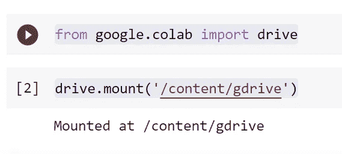

它会向您发送一个链接，通过输入令牌来授权您的 Google Drive，您就完成了。然后你会在你的文件下看到一个名为`gdrive`的文件夹:

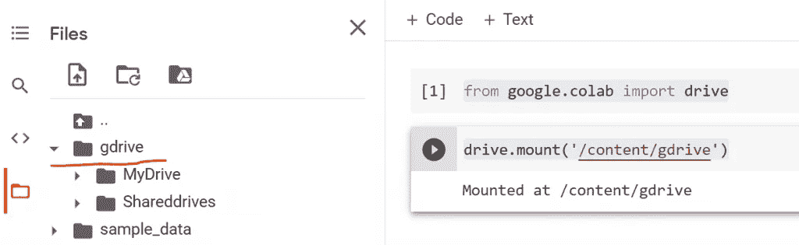

现在，如果你想得到文件的确切路径，你可以右击并选择“复制路径”，它通常以`/content/gdrive/MyDrive/`开始。

## 2.如何估算熊猫的缺失值

我们将提供一个示例，说明如何按照以下规则估算 [pandas](https://pandas.pydata.org/) 中的缺失值:

*   如果变量是数字，则用平均值估算缺失值。
*   如果变量为`object` `dtype`，则用模式对缺失值进行插补。

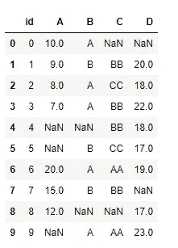

```
for i in df.columns:
    if (df[i].dtype=='object'):
        df[i].fillna(df[i].mode()[0], inplace=True)
    elif (df[i].dtype=='float64' or df[i].dtype=='int64'):
        df[i].fillna(df[i].mean(), inplace=True)

df
```

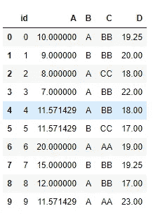

## 3.如何用熊猫读写 gzip/zip 文件

我们可以把熊猫数据框写成 gzip 和 zip 文件。例如:

```
#lets use this sample dataframe
df=pd.DataFrame({'A':[1,2,3,4]})
```

**保存为 gzip 或者 zip**

```
# save it as gzip
df.to_csv("dataframe.csv.gz", index=False, compression="gzip")# save it as gzip
df.to_csv("dataframe.csv.zip", index=False, compression="zip")
```

**用熊猫读取 gzip/zip 文件**

熊猫也可以阅读包含 CSV 的 gzip/zip 文件。

```
pd.read_csv('dataframe.csv.gz')
```

## 4.如何用熊猫读写不带头文件的 CSV 文件

**无标题阅读**

假设您有以下不带列名的 CSV 文件。让我们看看如何用熊猫来阅读它。假设`my_file.csv`是:

```
George,25 
Maria,30 
John,18
```

我们可以如下阅读该文件:

```
import pandas as pd 
df = pd.read_csv("my_file.csv", header=None) 
df
```

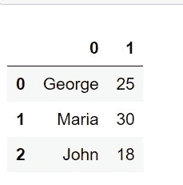

如果我们想为我们的列名指定特定的名称:

```
df1 = pd.read_csv("my_file.csv", header=None, names=['colA', 'colB']) 
df1
```

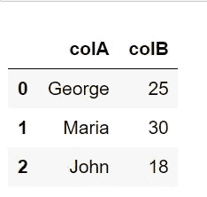

**无标题写入**

现在，假设我们想将这个数据帧写入一个 CSV 文件，但是没有头。

```
df.to_csv('filename.csv', header=False, index=False)
```

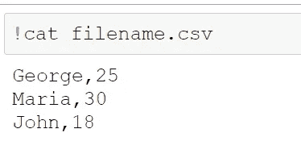

我们可以看到，`filename.csv`是没有头的。

## 5.Python 中不同值的累积计数

有时需要对列表/向量的不同值进行滚动计数。换句话说，我们只想添加列表/向量中出现的任何新元素。

**输出**

```
mylist  CumDistinct
0      e            1
1      a            2
2      a            2
3      b            3
4      a            3
5      b            3
6      c            4
7      d            5
8      e            5
```

## 6.Python 中连续事件的计数

我们将展示一个简单实用的例子，说明如何对连续事件进行计数:

```
import pandas as pddf = pd.DataFrame({'Score':['win', 'loss', 'loss', 'loss', 'win', 'win', 'win', 'win', 'win', 'loss', 'win', 'loss', 'loss']})
```

通过下面的代码，我们将得到 Streak 的列:

```
df['Streak'] = df['Score'].groupby((df['Score'] != df['Score'].shift()).cumsum()).cumcount() + 1 df
```

**输出**

```
Score  Streak
0    win       1
1   loss       1
2   loss       2
3   loss       3
4    win       1
5    win       2
6    win       3
7    win       4
8    win       5
9   loss       1
10   win       1
11  loss       1
12  loss       2
```

# 稀有

## 7.R 中不同值累积计数

有时需要对列表/向量的不同值进行滚动计数。换句话说，我们只想添加列表/向量中出现的任何新元素。

```
# assume that this is our vector
x=c("e", "a","a","b","a","b","c", "d", "e")

# we apply the "cumsum(!duplicated(x))" command
data.frame(Vector=x,
CumDistinct=cumsum(!duplicated(x)))
```

**输出**

```
Vector CumDistinct
1      e           1
2      a           2
3      a           2
4      b           3
5      a           3
6      b           3
7      c           4
8      d           5
9      e           5
```

## 8.计数 R 中的连续事件

假设有一个轮盘赌，返回红色(50%)和黑色(50%)。我们将模拟 N=1，000，000 卷，并分别记录红色和黑色条纹。使我们的生活变得更容易的 R 函数是 [rle](https://www.rdocumentation.org/packages/base/versions/3.5.3/topics/rle) ，但是如果我们想要跟踪跑步记录，那么我们还需要使用 seq**函数。我们还添加了另一个列，称为`EndOfStreak` ，它指示连续条纹是否已经结束。**

```
library(tidyverse)

# number of simulations
n<-1000000

# set a random seed for reproducibility
set.seed(5)

# create the data frame
df<-tibble(Rolls=seq(1:n), Outcome=sample(c("Red", "Black"),n,replace = TRUE, prob = c(0.5,0.5)))%>%
  mutate(Streak=sequence(rle(Outcome)$lengths), EndOfStreak=ifelse(lead(Outcome)==Outcome, "No", "Yes"))

df%>%print(n=20)
```

**输出**

```
# A tibble: 1,000,000 x 4
   Rolls Outcome Streak EndOfStreak
   <int> <chr>    <int> <chr>      
 1     1 Black        1 Yes        
 2     2 Red          1 No         
 3     3 Red          2 Yes        
 4     4 Black        1 No         
 5     5 Black        2 Yes        
 6     6 Red          1 No         
 7     7 Red          2 No         
 8     8 Red          3 No         
 9     9 Red          4 Yes        
10    10 Black        1 No         
11    11 Black        2 No         
12    12 Black        3 No         
13    13 Black        4 Yes        
14    14 Red          1 Yes        
15    15 Black        1 No         
16    16 Black        2 No         
17    17 Black        3 Yes        
18    18 Red          1 No         
19    19 Red          2 No         
20    20 Red          3 No
```

## 9.用平均值替换缺失值

假设您正在处理一个带有缺失值的数据框，并且您想要用相应列的平均值替换它们。让我们考虑以下数据帧:

```
df<-data.frame(id=seq(1,10), ColumnA=c(10,9,8,7,NA,NA,20,15,12,NA), 
           ColumnB=factor(c("A","B","A","A","","B","A","B","","A")),
           ColumnC=factor(c("","BB","CC","BB","BB","CC","AA","BB","","AA")),
           ColumnD=c(NA,20,18,22,18,17,19,NA,17,23)
)

df
```

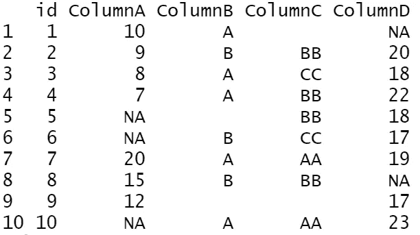

显然，我们只想考虑数值变量。让我们看看如何在一行代码中实现它。

```
df[sapply(df, is.numeric)] <- lapply(df[sapply(df, is.numeric)], function(x) ifelse(is.na(x), mean(x, na.rm = TRUE), x))df
```

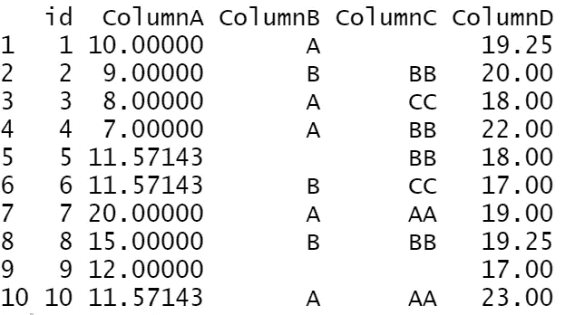

## 10.用模式替换分类变量

在数据科学项目中，通常用模式替换分类变量的缺失值。让我们看下面的例子:

```
df<-data.frame(id=seq(1,10), ColumnA=c(10,9,8,7,NA,NA,20,15,12,NA), 
           ColumnB=c("A","B","A","A","","B","A","B","","A"),
           ColumnC=c("","BB","CC","BB","BB","CC","AA","BB","","AA"),
           ColumnD=c(NA,20,18,22,18,17,19,NA,17,23)
)

df
```

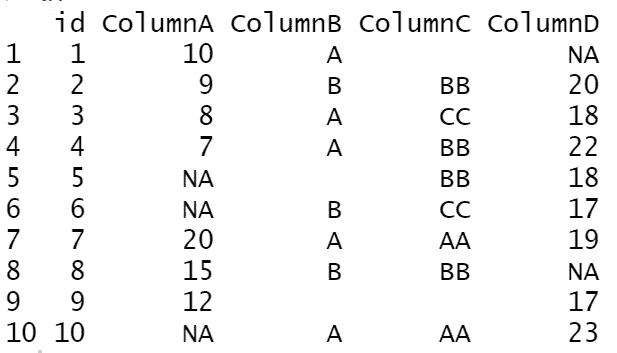

注意 B 列和 C 列是`Character`列。还要注意，r 中没有模式函数，所以让我们来构建它:

```
getmode <- function(v){
  v=v[nchar(as.character(v))>0]
  uniqv <- unique(v)
  uniqv[which.max(tabulate(match(v, uniqv)))]
}
```

现在让我们将所有的`Character`变量的空字符串替换为它们对应的列模式。最后，我们应该将`character`变量转换成`factors`。

```
df[sapply(df, is.character)] <- lapply(df[sapply(df, is.character)], function(x) ifelse(x=="", getmode(x), x))
df[sapply(df, is.character)] <- lapply(df[sapply(df, is.character)], as.factor)df
```

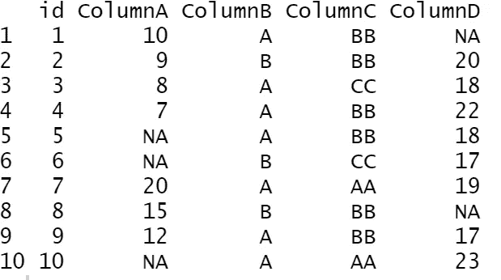

正如我们所看到的，我们用相应的模式替换了空字符串。

*最初发表于*[](https://predictivehacks.com/10-tips-and-tricks-for-data-scientists-vol-4/)**。**