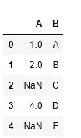
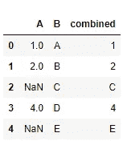
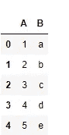
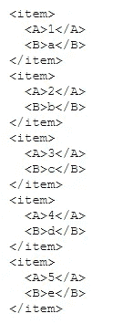
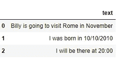
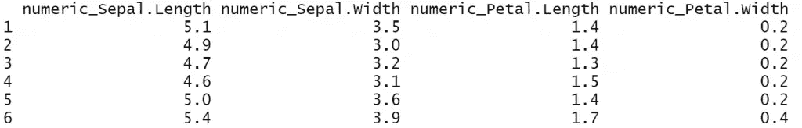
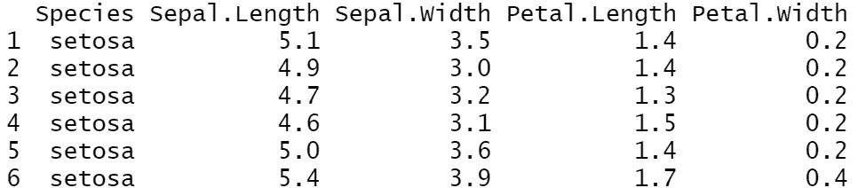
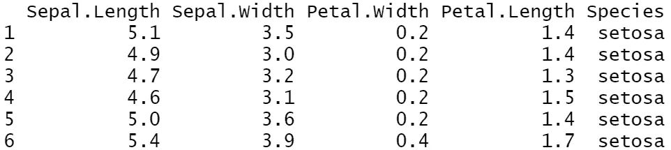
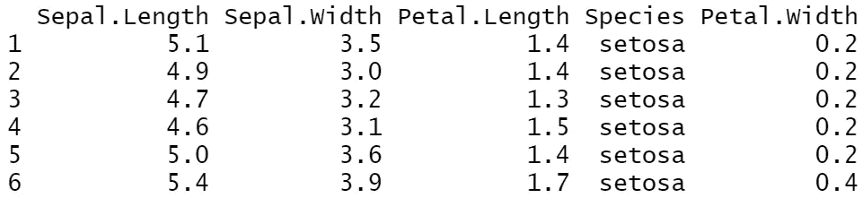
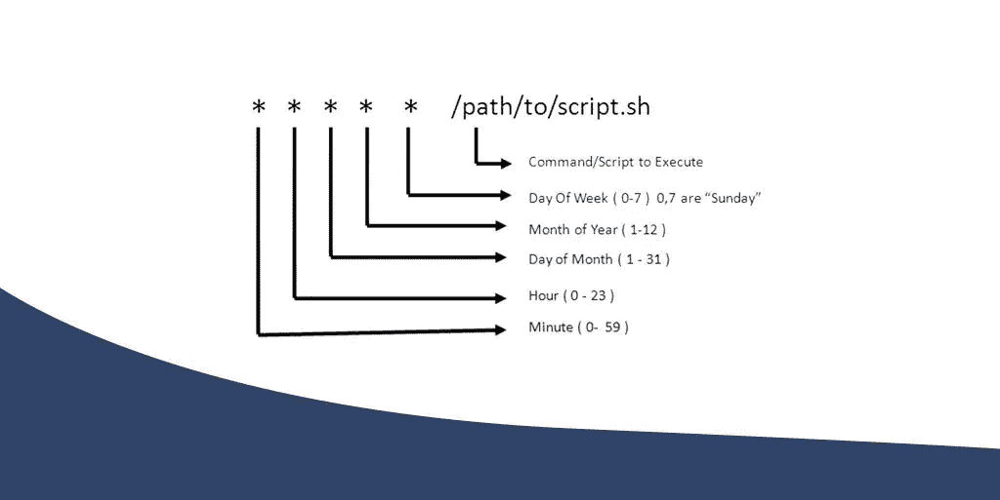

# 数据科学家的 10 个更多提示和技巧(第 5 卷)

> 原文：<https://betterprogramming.pub/10-tips-and-tricks-for-data-scientists-vol-5-ef86aea08b6c>

## 对日常任务有用的代码片段


照片由[达莉亚·沃尔科娃](https://unsplash.com/@darias_big_world?utm_source=medium&utm_medium=referral)在 [Unsplash](https://unsplash.com?utm_source=medium&utm_medium=referral) 上拍摄。

我们已经开始为数据科学家撰写一系列关于技巧和诀窍的文章(主要用 Python 和 R 语言)。如果您错过了前几期:

第一卷:

[](/10tips-and-tricks-for-data-scientists-vol-1-a870455325da) [## 数据科学家的 10 个技巧和诀窍

### R 和 Python 中有用的代码片段

better 编程. pub](/10tips-and-tricks-for-data-scientists-vol-1-a870455325da) 

第二卷:

[](/10-tips-and-tricks-for-data-scientists-vol-2-5640ccd1aa5e) [## 数据科学家的 10 个惊人技巧和诀窍

### 一些更有用的 R 和 Python 代码片段

better 编程. pub](/10-tips-and-tricks-for-data-scientists-vol-2-5640ccd1aa5e) 

第三卷:

[](/10-tips-and-tricks-for-data-scientists-part-3-52ffbddcba26) [## 数据科学家会喜欢的 10 个真实世界的提示和技巧

### Python、R 等语言中一些更有用的代码片段

better 编程. pub](/10-tips-and-tricks-for-data-scientists-part-3-52ffbddcba26) 

第 4 卷:

[](/10-tips-and-tricks-for-data-scientists-vol-4-76b0b732a94f) [## 数据科学家的 10 个 Python 和 R 技巧

### 在 Pandas 中输入缺失值，用 mode 替换分类变量，等等

better 编程. pub](/10-tips-and-tricks-for-data-scientists-vol-4-76b0b732a94f) 

# 计算机编程语言

## 1.熊猫是如何结合的

此函数返回两列之间的第一个非`null`值:

```
import pandas as pd
import numpy as np

df=pd.DataFrame({"A":[1,2,np.nan,4,np.nan],"B":['A',"B","C","D","E"]})

df
```



在下面的例子中，它将返回 A 列的值，如果它们是`null`，它将返回 B 列的相应值:

```
df['combined'] = df['A'].combine_first(df['B']) 
df
```



## 2.如何在 Python 中禁用所有警告

通过运行以下代码块，可以禁用所有 Python 警告:

```
import sys
if not sys.warnoptions:
    import warnings
    warnings.simplefilter("ignore")
```

## 3.如何将熊猫数据帧转换成 XML

没有 pandas 函数将一个`DataFrame`转换成 XML，但是我们将向您展示如何用一个简单的自定义函数来完成。这非常有用——尤其是在使用 Flask 并且希望 API 输出 XML 文件时。

```
#lets create a dataframe df=pd.DataFrame({'A':[1,2,3,4,5],'B':['a','b','c','d','e']}) df
```



让我们构建`to_xml`函数:



现在，如果您想将其保存为 XML:

```
with open('df.XML', 'w') as f: f.write(to_xml(df))
```

## 4.用另一个字符串列表替换一个字符串列表

如果不应用`for`循环或多个正则表达式调用，没有任何通用的方法可以在文本中用另一个字符串列表替换一个字符串列表。有了这个快速简单的方法，我们可以使用 pandas `DataFrames`在一行代码中完成:

```
import pandas as pddf = pd.DataFrame({'text': ['Billy is going to visit Rome in November', 'I was born in 10/10/2010', 'I will be there at 20:00']})df
```



请注意，文本上的替换是按照它们在列表中出现的顺序进行的。

# 稀有

## 5.在 Tidyverse 中使用`select_if` / `rename_if`

`select_if`函数属于`dplyr`，当我们想根据一些条件选择一些列时非常有用。我们还可以添加一个适用于列名的函数。

假设我只想选择数字变量，并在它们的列名前添加前缀`numeric_`:

```
library(tidyverse) iris%>%select_if(is.numeric, list(~ paste0("numeric_", .)))%>%head()
```


注意，我们也可以用同样的方式使用`rename_if`。一个重要的注意事项是`rename_if()`、`rename_at()`和`rename_all()`已经被`rename_with()`取代。匹配的`select`语句已经被`select()` + `rename_with()`的组合所取代。

这些功能被取代是因为`mutate_if()`和好友被`across()`取代。`select_if()`和`rename_if()`已经使用整齐选择，所以不能用`across()`替换。相反，我们需要一个新的功能。

## 6.在 Tidyverse 中使用`where`

我们可以通过选择函数返回`true`的变量，使用`where`来`select`或`rename`列。

我们将使用与上面相同的例子。假设我只想选择数字变量，并在它们的列名中添加前缀`numeric_`:

```
library(tidyverse) iris%>%rename_with(~ paste0("numeric_", .), where(is.numeric))%>% select(where(is.numeric))%>%head()
```



## 7.在 Tidyverse 中使用`everything`

在许多数据科学项目中，我们希望一个特定的列(通常是因变量 *y* )出现在数据集中的第一个或最后一个。我们可以使用`dplyr`包中的`everything()`来实现这一点。

假设我希望列`Species`在我的数据集中首先出现。

```
library(tidyverse) mydataset<-iris%>%select(Species, everything()) mydataset%>%head()
```



## 8.在 Tidyverse 中使用`relocate`

`relocate()`是 dplyr 1.0.0 中新增的。您可以使用`.before`或`.after`来指定列的确切位置。

假设我希望`Petal.Width`列出现在`Sepal.Width`的旁边:

```
library(tidyverse) iris%>%relocate(Petal.Width, .after=Sepal.Width)%>%head()
```



请注意，我们也可以将其设置为出现在最后一列之后。

假设我想让`Petal.Width`成为最后一列:

```
iris%>%relocate(Petal.Width, .after=last_col())%>%head()
```



# Linux 操作系统

## 9.如何在 Linux 中调度 cron 作业



图片来自 [AI 总结](https://ai-summary.com/summary-how-to-schedule-a-cron-job-in-linux/)。

很多时候，我们需要定期在服务器上运行脚本。我们可以使用 cron 来安排我们的工作。我们需要做的第一件事是进入终端并通过键入以下命令打开 crontab:

```
crontab -e
```

第一次，它会让你选择你的编辑器，可以是 **nano，vim，**等。个人比较喜欢 nano，最简单的一种。打开编辑器后，我们就可以安排 cron 作业了。

从星期日=0 开始，有五个占位符，分别称为`minute`(0-59)`hour`**(0-23)`day of month`(1-31)`month`(1-12)`day of week`(0-6)。**

**假设我有一个名为`mytest.py`的 Python 脚本，我想每分钟都运行它。然后，我们必须在 crontab 中编写:**

```
* * * * * python /path/to/mytest.py
```

**假设我想每十分钟运行一次。注意，我们可以使用`/`来定义步骤:**

```
# it runs the script every 10 minutes
*/10 * * * * python /path/to/mytest.py
```

**我们再举一些其他的例子。看评论:**

```
# it runs the script every Friday at 3am
0 3 * * 5 python /path/to/mytest.py

# it runs the script every week
0 0 */7 * * python /path/to/mytest.py

# it runs the script every 1st and 15th of the month
0 0 1,15 * * python /path/to/mytest.py
```

**您可以使用以下命令查看已经调度了哪些 cron 作业:**

```
crontab -l
```

**您可以打开文本编辑器并删除相应 cron 作业的特定行，也可以在不打开编辑器的情况下删除所有 cron 作业，方法是运行:**

```
crontab -r
```

**如果你感到困惑，不确定你安排了什么，有一个很好的 [crontab-generator](https://crontab-generator.org/) 可以为你编写 crontab 的命令！然后你只需要在输入`crontab -e`后在 crontab 复制粘贴即可。**

## **10.如何选择列**

**假设我们正在处理以下名为`eg1.csv`的 CSV 文件:**

```
ID,Name,Dept,Gender
1,George,DS,M
2,Billy,DS,M
3,Nick,IT,M
4,George,IT,M
5,Nikki,HR,F
6,Claudia,HR,F
7,Maria,Sales,F
8,Jimmy,Sales,M
9,Jane,Marketing,F
10,George,DS,M
```

**如果要选择列，可以使用`cut`命令。它有几个选项(使用`man cut`来探索它们)，但最常见的是这样的:**

```
cut -f 1-2,4 -d , eg1.csv
```

**这意味着“选择第 1 至 2 列和第 4 列，使用逗号作为分隔符。”`cut`使用`-f`(意为“字段”)指定列，使用`-d` (意为“分隔符”)指定分隔符。上面的命令返回:**

```
ID,Name,Gender
1,George,M
2,Billy,M
3,Nick,M
4,George,M
5,Nikki,F
6,Claudia,F
7,Maria,F
8,Jimmy,M
9,Jane,F
10,George,M
```

**为了排除一列或多列，我们做与选择列相反的事情，添加`-complement`。例如，假设我们想要排除第二列:**

```
cut --complement -f 2 -d , eg1.csv
```

***最初发表于*[*【https://predictivehacks.com】*](https://predictivehacks.com/10-tips-and-tricks-for-data-scientists-vol-5/)*。***