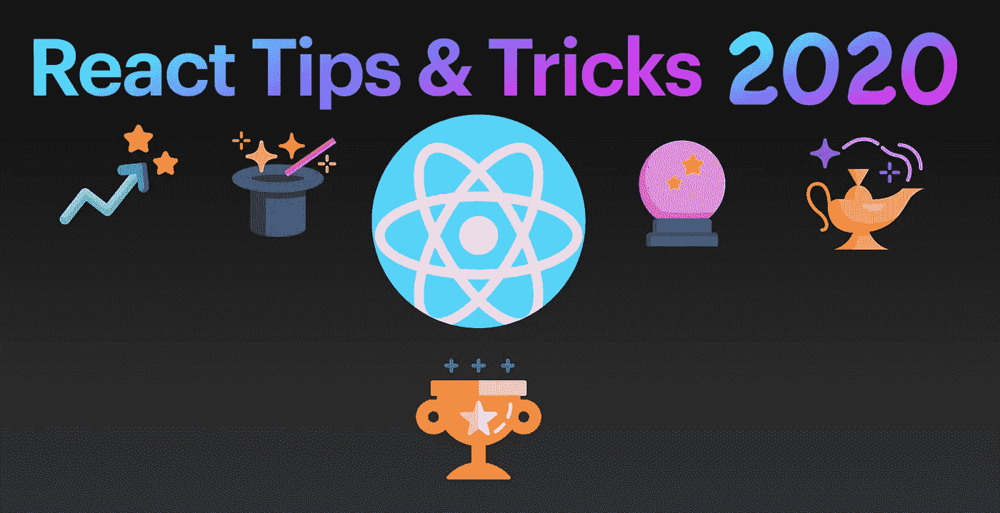
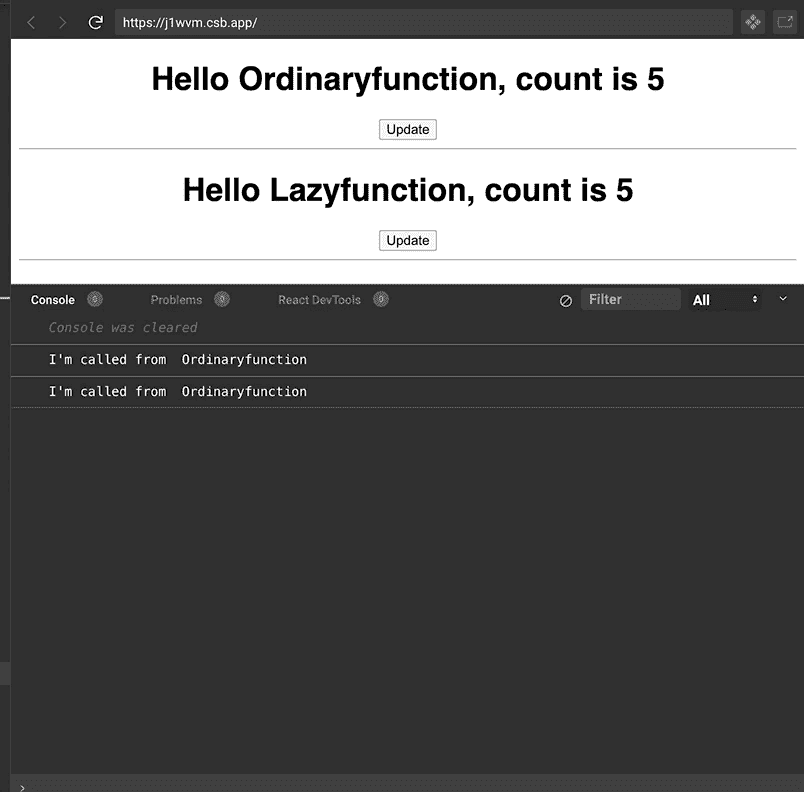
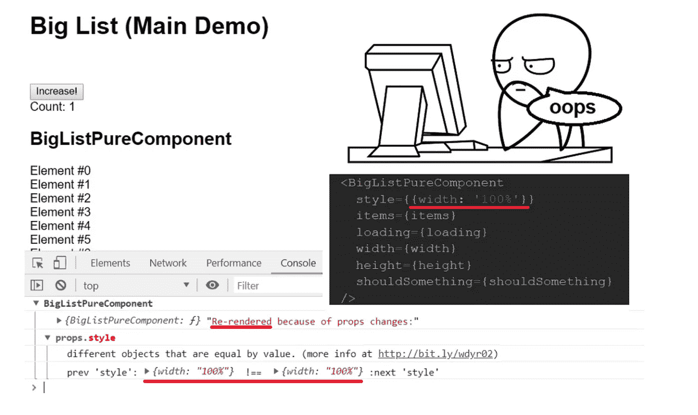
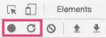
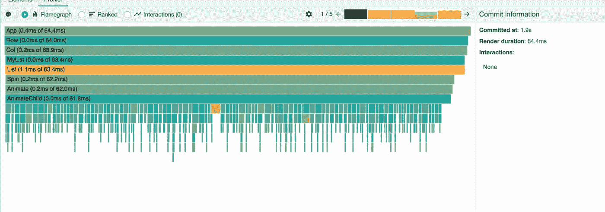
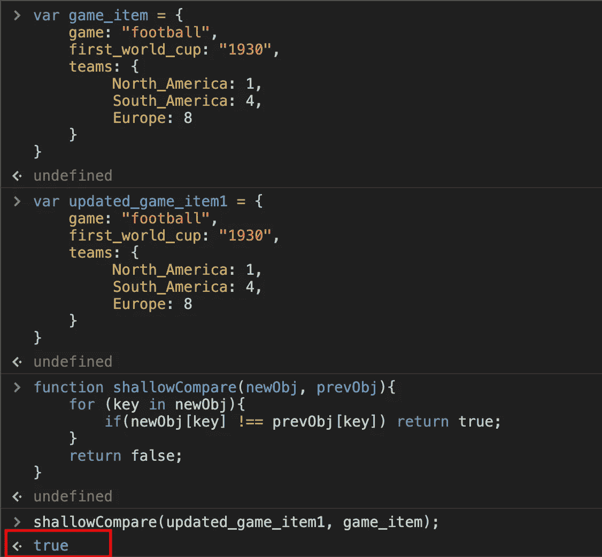

# 2020 年提升 React 应用性能的 10 个技巧和诀窍

> 原文：<https://betterprogramming.pub/10-tips-and-tricks-to-boost-your-react-apps-performance-in-2020-9388159f6ebf>

## 更快的应用，更快乐的用户



[Freepik](https://www.flaticon.com/authors/freepik) 在 [flaticon](https://www.flaticon.com/) 上的图标。

对于编程来说，解决同一个问题有不同的方法——无论是 JavaScript、React、Python 还是任何其他语言。当你研究别人的代码时，总会有新的东西可以学习。

React 每天都在发展，有各种方法可以用来解决我们在应用程序中遇到的任何问题。让我们来看看在使用 React 时肯定会对您有所帮助的十个提示和技巧。请将这些技巧视为应用程序的性能助推器。

# **1。暂停控制台调试器**

您肯定遇到过这样的情况，您想要调试 dropdown 的样式，或者当您尝试右键单击元素并单击“Inspect element”时自动关闭的其他样式

这里有一个简单的解决方案:

1.  从浏览器打开您的控制台。
2.  键入以下命令:

```
setTimeout(() => {debugger;}, 5000)
```

3.然后打开您想要调试的下拉菜单。

停止调试器—信用: [ralex1993](https://twitter.com/ralex1993)

# 2.使用函数进行状态惰性初始化

有时候，我们需要从某个变量或返回值的函数中设置状态的初始值。

让我们看看下面的例子:

```
const initialState = someFunctionThatCaluclatesValue(props)const [count, setCount] = React.useState(initialState)
```

因为我们的函数在主体中，所以每次重新渲染时，这个函数都会被调用，即使不需要它的值(我们只在初始渲染时需要它)。

让我们看看如何用函数惰性初始化`useState`:

```
const getInitialState = (props) => someFunctionThatCaluclatesValue(props)const [count, setCount] = React.useState(getInitialState)
```

创建一个函数非常快。React 只会在需要初始值的时候调用函数(也就是组件最初渲染的时候)。所以即使这个函数花费了很多时间，它也只是在初始渲染时会很慢。这被称为“惰性初始化”这是一种性能优化。

让我们看看这张 GIF 图，了解一下它的样子:



懒惰函数与普通函数

来玩一下上面的例子:

关于 [CodeSandbox](https://codesandbox.io/s/usestate-lazy-initialization-j1wvm?file=/src/App.js) 的示例

# 3.利用定制挂钩

使用钩子，我们没有一些工具可以帮助我们得到回调，就像在`setState`的情况下一样。

例如，我们在状态中得到回调。一旦状态被设置，我们通常使用回调函数:

```
this.setState({
    "name" : "Harsh"
}, () => {
     // Hey that state is set successfully what do you
     // want to do, I'm callback your friend 😄
})
```

让我们看看如何用一个自定义钩子实现类似的行为，这个钩子只在状态改变时被调用，而在初始渲染时不被调用:

更多简单易懂的鱼钩食谱，请查看[加布·拉格兰](https://twitter.com/gabe_ragland)。

[](https://usehooks.com/) [## 使用挂钩

### 这个钩子使得订阅 Firestore 数据库中的数据变得非常容易，而不必担心状态…

usehooks.com](https://usehooks.com/) 

# 4.监控应用程序中不必要的渲染

我们面临的一个常见问题是评估应用程序中对性能有不良影响的必要渲染。

我们有不同的方法来评估它们，以避免在几分钟内进行不必要的渲染

## 你为什么渲染



图片鸣谢: [GitHub](https://github.com/welldone-software/why-did-you-render) 。

根据其文档，[why-do-you-render](https://github.com/welldone-software/why-did-you-render)“monkey patches 做出反应，通知您可避免的重新渲染。”这将显示应用程序中发生的不必要的渲染，以便您可以对它们采取措施。

## React 开发工具

如[调试员](https://www.debugbear.com/blog/measuring-react-app-performance)所述:

> ["DevTools](https://chrome.google.com/webstore/detail/react-developer-tools/fmkadmapgofadopljbjfkapdkoienihi?hl=en) 为我们展示一下您的应用性能。要看到这一点，请确保您在开发模式下运行 React，在浏览器中打开 DevTools，然后转到“Performance”选项卡。
> 
> 您可以从页面加载后的某个时间点或从页面加载开始记录应用程序的性能。DevTools 对话框的左上角有两个按钮:"



开始录音

一旦停止录制，您将能够看到一个图形，显示渲染的不同组件以及渲染它们所用的时间。



渲染信息

# 5.使用 React.memo 和 useMemo

根据 [React 的官方文档](https://reactjs.org/docs/react-api.html):

> “`React.memo`是高阶分量。
> 
> 如果您的函数组件使用相同的属性呈现相同的结果，您可以将其封装在一个调用中进行反应。在某些情况下，记忆结果会提高性能。这意味着 React 将跳过对组件的渲染，并重用上次渲染的结果。"

`React.memo`开箱进行浅层比较，避免渲染。堆栈溢出用户[将浅层比较](https://stackoverflow.com/questions/36084515/how-does-shallow-compare-work-in-react)定义为“当被比较对象的属性使用`===`或严格相等完成时，不会对属性进行更深入的比较。”



这将导致重新渲染。

*注意:在上面的例子中，* `*true*` *意味着组件将再次渲染，尽管值是相同的。*

但是有时您需要进行深度比较，这意味着您想要比较对象数组中的嵌套属性。我们如何做到这一点？让我们开始下一个魔术。

# 6.shouldComponentUpdate 中的深度比较

正如我们在上面的例子中看到的，如果你的值很简单，`React.memo`只能帮助你避免重新渲染。但是如果你有一个嵌套的对象数组，你就不能开箱即用地比较它们。

使用深度相等:

[](https://www.npmjs.com/package/deep-equal) [## 深度相等

### 作为独立模块的节点的 assert.deepEqual()算法。这个模块比包装快大约 46 倍…

www.npmjs.com](https://www.npmjs.com/package/deep-equal) 

比较两个对象，并根据递归相等算法返回它们是否相等。

> “如果`opts.strict`是`true`，用严格等式(`===`)比较叶节点。默认情况下使用强制相等(`==`)，因为这就是`assert.deepEqual()`默认的工作方式。”— [深度相等](https://github.com/inspect-js/node-deep-equal)

*注意:有很多这样的包可以帮助你比较两个嵌套的对象数组，避免通过比较来重新渲染。*

# 7.反应窗口

由于应用程序的大部分工作都是以列表的形式呈现数据，因此当列表变长时，就像一种毒药正在慢慢进入应用程序，对性能产生不良影响。它也开始消耗浏览器中的大量内存。因为所有的列表项都在 DOM 中，所以当你滚动列表时会有延迟。

那么，我们如何才能只呈现列表中当前在屏幕上可见的部分项目呢？利用 React 窗口:

[](https://github.com/bvaughn/react-window) [## bvaughn/react 窗口

### React 组件可以有效地呈现大型列表和表格数据，React window 只需呈现一个

github.com](https://github.com/bvaughn/react-window) 

不管你的列表有多大(比如 1000 个条目)，它在 DOM 中只会显示 20-30 个条目，这取决于你的窗口的大小，这是完全可定制的，可以提高性能！

# 8.反应查询

通过 React 中用于获取、缓存和更新异步数据的钩子，使用 React Query 管理服务器状态比以往任何时候都更容易。

以下是 [GitHub](https://github.com/tannerlinsley/react-query) 上列出的功能:

*   传输/协议/后端不可知的数据获取(REST、GraphQL、promises 等等！)
*   自动缓存+重新提取(失效时重新验证、窗口重新聚焦、轮询/实时)
*   并行+相关查询
*   突变+反应式查询重取
*   多层缓存+自动垃圾收集
*   分页+基于光标的查询
*   带滚动恢复的 Load-More +无限滚动查询
*   请求取消
*   [反应暂停](https://reactjs.org/docs/concurrent-mode-suspense.html) +渲染时提取查询预取
*   [专用开发工具(React Query Devtools)](https://github.com/tannerlinsley/react-query-devtools)

来自 [GitHub](https://github.com/tannerlinsley) 的示例。

[](https://github.com/tannerlinsley/react-query) [## tannerlinsley/react-查询

### React 中用于获取、缓存和更新异步数据的钩子喜欢这个库吗？尝试整个 TanStack！反应…

github.com](https://github.com/tannerlinsley/react-query) 

# 9.惰性加载 React 组件(带有 React.lazy 和 suspension)

## React.lazy()是什么？

如[所写，Lotanna](https://blog.bitsrc.io/lazy-loading-react-components-with-react-lazy-and-suspense-f05c4cfde10c) ，`React.lazy`是:

> “React 中的一个新功能，允许您通过代码分割来延迟加载 React 组件，而无需任何其他库的帮助。延迟加载是一种技术，首先只呈现需要的或关键的用户界面项目，然后悄悄地展开非关键项目。”

## 悬念是什么？

> "`Suspense`是 lazy 函数所需要的组件，基本上是用来包装 lazy 组件的。借助于`Suspense`组件，可以包装多个惰性组件。它还带有一个回退属性，该属性将接受您希望在加载惰性组件时呈现的 React 元素。— [谁是洛塔娜](https://blog.bitsrc.io/lazy-loading-react-components-with-react-lazy-and-suspense-f05c4cfde10c)

在 [CodeSandbox](https://codesandbox.io/s/react-lazy-suspense-n15rs) 上查看相关代码。

现在，您可以在应用程序的页面上识别任何大型组件，这些组件只在特定的用户交互中呈现(如单击按钮、切换等)。分割这些组件将最小化您的 JavaScript 有效负载，并帮助您提高性能。

# 10.一个更新多个输入状态值的函数

这是保持同一个函数来更新多个输入值的常见用例。我们大多数人都知道这种有助于减少代码并完成工作的方法。这在表单中有多个输入的情况下很有用:

# 结论

你知道这些把戏吗？感谢阅读这篇文章。我希望你学到了新的东西！