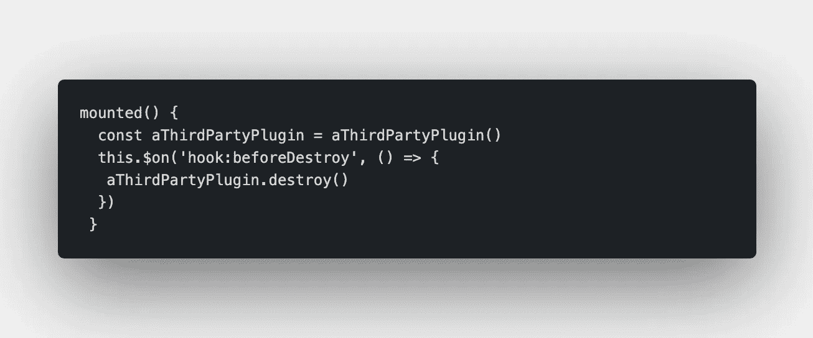
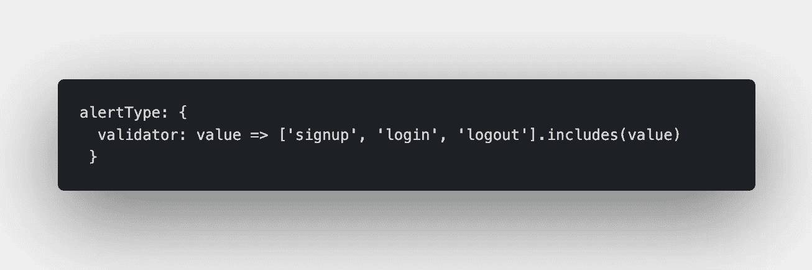
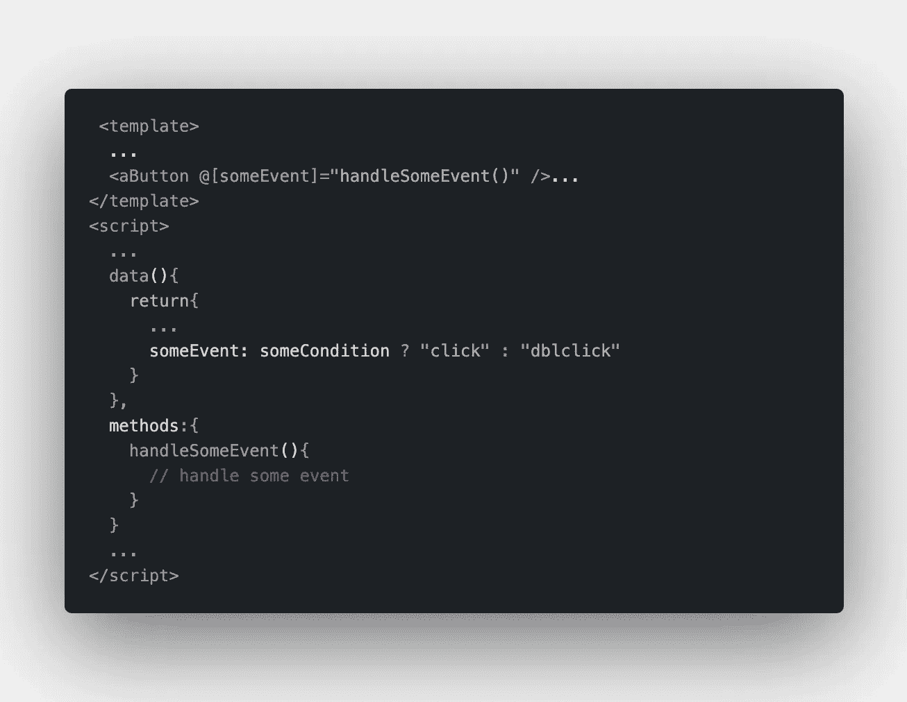
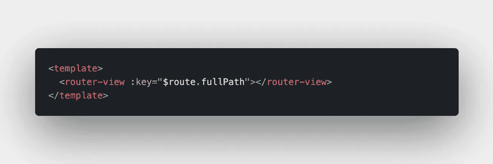
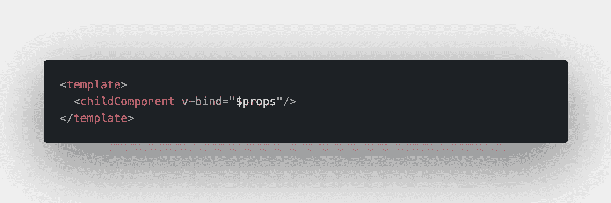
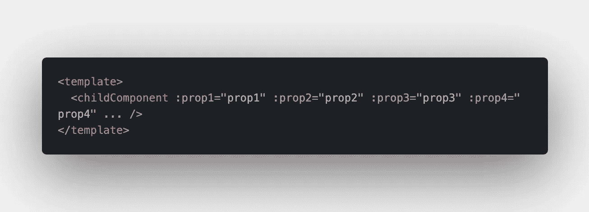
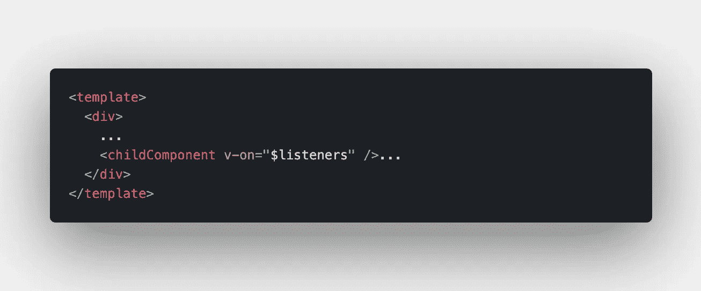
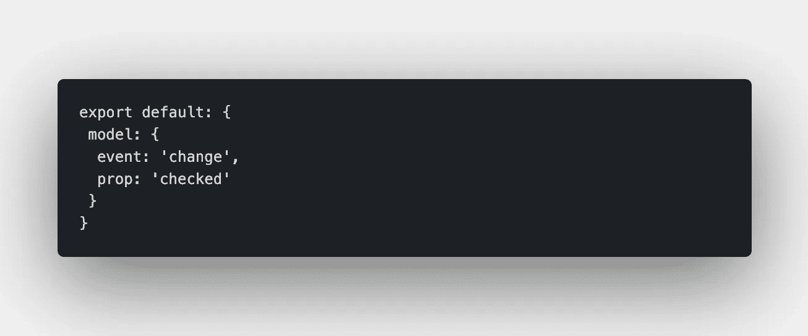

# 让你成为更好的 Vue.js 开发者的 10 个技巧和诀窍

> 原文：<https://betterprogramming.pub/10-tips-and-tricks-to-make-you-a-better-vue-js-developer-afc74acaf388>

## 使用这些方便的提示和技巧，成为 Vue.js 开发人员

萨姆·张丹在 [Unsplash](https://unsplash.com/s/photos/tip-jar?utm_source=unsplash&utm_medium=referral&utm_content=creditCopyText) 上的照片

这个故事最初发表在智能编码器的[上。](https://thesmartcoder.dev/10-tips-and-tricks-to-make-you-a-better-vuejs-developer/)

# 介绍

我真的很喜欢使用 Vue.js，每次我使用一个框架时，我都喜欢深入挖掘它的功能和特性。在这篇文章中，我向你展示了十个你可能还没有意识到的很酷的技巧和窍门，来帮助你成为更好的 Vue 开发者。

# 插槽语法变得漂亮了

随着 Vue 2.6 的推出，引入了插槽的简写符号，可以像事件一样使用(例如，v-on:click 事件的@click 符号)或绑定的冒号符号(:src)。例如，如果您有一个表格组件，您可以按如下方式使用此功能:

# 的$on('hook:')

如果您想在创建或挂载的钩子中定义一个自定义事件监听器或第三方插件，并且需要在 beforeDestroy 钩子中删除它以避免任何内存泄漏，那么这是一个很好的特性。使用$on('hook:')方法，您可以在一个生命周期方法中定义/移除事件，而不是两个。

# 正确验证

你可能已经知道你可以验证你的道具是原语，比如字符串，数字，甚至对象。您还可以使用自定义验证器，例如，如果您想要对字符串列表进行验证:

# 动态指令参数

Vue 2.6 最酷的特性之一是可以动态地将指令参数传递给组件。假设您有一个按钮组件，在某些情况下想监听单击事件，但在其他情况下想监听双击事件。这就是这些指令派上用场的地方:

还有一点非常棒——您可以将相同的模式应用于动态 HTML 属性、道具等等。

# 重复使用同一路线的组件

有时，不同的路由共享一些组件。如果在这些路径之间切换，默认情况下，共享组件不会重新渲染，因为 Vue 出于性能原因正在重用该组件。但是，如果您想让这些组件重新呈现，您可以通过向路由器视图组件提供:key 属性来实现。

# 从父到子的所有道具

这是一个非常酷的特性，允许你将所有的道具从一个父组件传递到一个子组件。如果您有另一个组件的包装器组件，这将非常方便。所以不用把所有道具一个一个传下去，你可以利用这一点，把所有道具一次传下去:

而不是:

# 从父到子的所有事件侦听器

如果您的子组件不在父组件的根目录下，您可以将所有事件侦听器从父组件传递到子组件，如下所示:

如果子组件位于其父组件的根处，它将默认获得这些，您不需要这个小技巧。

# $createElement

默认情况下，每个 Vue 实例都可以访问$createElement 方法来创建和返回虚拟节点。例如，这可以用来在可以通过 v-html 指令传递的方法中使用标记。在函数组件中，该方法可以作为 render 函数中的第一个参数来访问。

# 使用 JSX

由于默认情况下 Vue CLI 3 支持使用 JSX，所以如果您愿意，现在可以在 JSX 编写代码(也可以从 React 编写)，这对于编写功能组件来说非常方便。如果你还没有使用 Vue CLI 3，你可以使用 babel-plugin-transform-vue-jsx 来获得 jsx 支持。

# 定制的 V 型车

默认情况下，V-model 就是我们所说的语法糖 over @input event listeners 和:value props。但是，您可以在 Vue 组件中指定一个模型属性来定义使用什么事件和值属性——非常简单！

# 结论

我希望我能给你一些建议，帮助你成为一名更好的 Vue.js 开发者。也可以随意发表评论！