# 你现在应该在 Xcode 中使用的 10 个技巧和快捷键

> 原文：<https://betterprogramming.pub/10-tips-shortcuts-you-should-be-using-right-now-on-xcode-2e9e1b01511e>

## 一组快捷方式和提示，将帮助您更快地掌握 Xcode 和编写代码

图片来源:作者

在我作为一名 iOS 开发人员的职业生涯中，我养成了一些习惯，这些习惯使得在 Xcode 中工作变得更加容易和快捷。其中大部分都围绕着充分利用各种各样的捷径，这些捷径已经存在，但我们可能没有意识到，甚至忘记了存在。

这就是为什么我收集了一些我最喜欢的与大家分享。

我们开始吧！

# 1.快速自动缩进

每当你的代码没有对齐，这个快捷方式将非常方便。

> 控制+ i / ⌃ + i

这将自动缩进光标所在的行。但是，如果您突出显示一段代码，甚至整个文件，然后触发该快捷方式，它将修复整个文件的缩进。

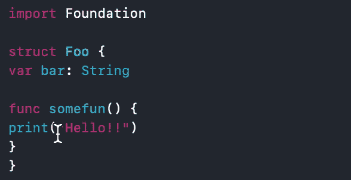

⌃+1 演示

这有助于立即组织代码。

# 2.编辑范围内的所有内容

假设您发现自己处于这样一种情况，在方法或变量的名称中有一个错误，您必须修复它。当然，您从未想过必须一个接一个地进行，因为您已经知道有一个重构选项可以对其进行重命名。但是有时候，Xcode 在使用 refactor 时可能有点不合作。

这时，您可以使用下面的快捷方式来突出显示该变量在您所在的文件中的所有用途。

> 指挥+控制+ e / ⌘ + ⌃ + e

这将突出显示所有的用途，并让您随时更改名称。

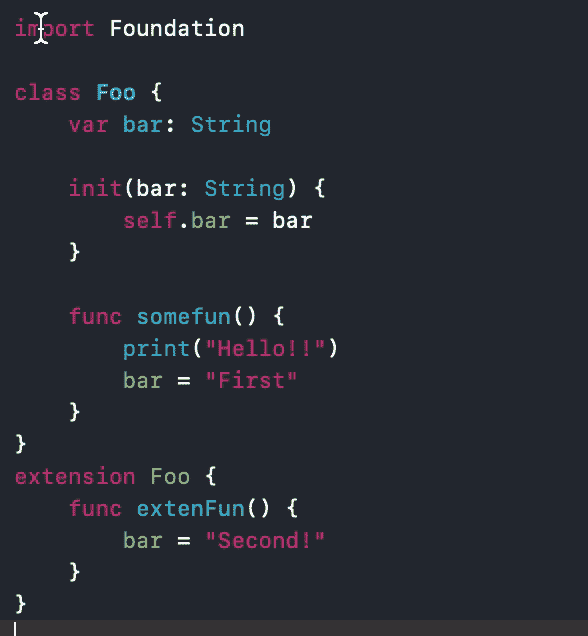

⌘ + ⌃ + e 的演示

# 3.查找下一个事件

现在让我们说，你不需要在整个范围内编辑变量的名字，你只需要找到它的下一次使用，或者你想在一个函数内而不是在整个类内重命名它，或者类似这样的事情。嗯，有一个非常相似的捷径。

> 选项+控制+ e / ⌥ + ⌃ + e

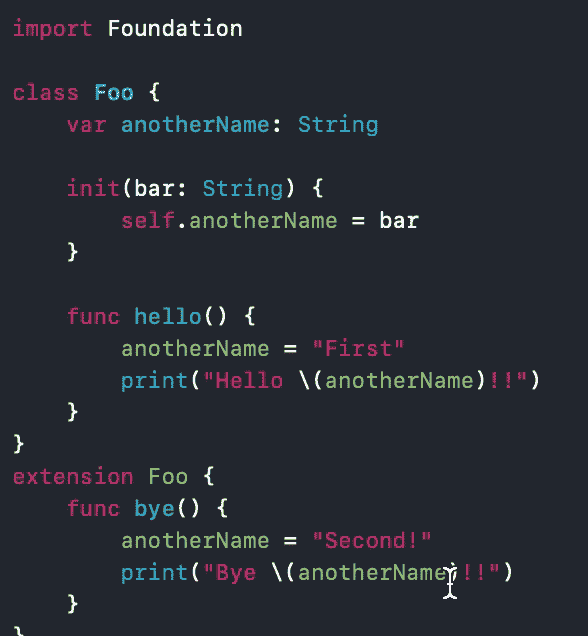

⌥ + ⌃ + e 的演示

当您高亮显示某个值并按下这些键时，Xcode 会高亮显示下一个出现的相同字符串。这意味着如果一些变量和/或函数共享那些高亮显示的字符，那么下一次使用可能不是您所期望的。

# 4.查找上一个事件

虽然上一个快捷键会查找下一个匹配项，但如果您再添加一个键，它会查找前面的匹配项。

> shift + option + control + e / ⇧ + ⌥ + ⌃ + e

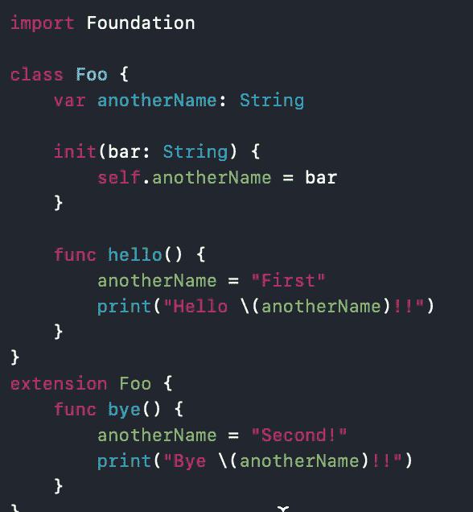

⇧ + ⌥ + ⌃ + e 的演示

# 5.向上或向下移动线条

我们可能会发现自己在文件中做了一些重新排序。一种方法是使用古老而可靠的剪切粘贴技术。然而，如果我们想要的只是将代码上移一行或下移一行，那么下面的快捷方式肯定会有所帮助。

**往上走:**

> 选项+命令+ [ / ⌥ + ⌘ + [

**往下:**

> option + command + ] / ⌥ + ⌘ + ]

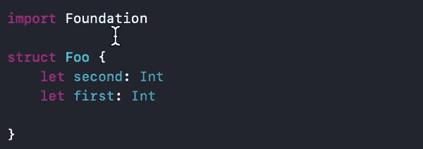

⌥ + ⌘ + [和⌥ + ⌘ + ]的演示

## 额外小费！您可以移动多行

如果我们使用和以前一样的快捷方式，但是突出显示几行，那么这些行将作为一个块移动。

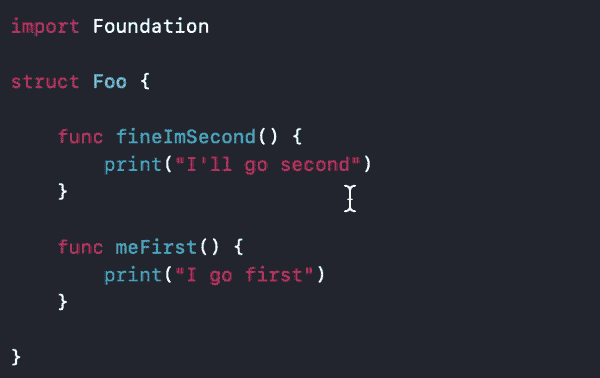

前面的快捷方式将几行作为块移动的演示

# 6.多行光标(用鼠标)

有时你需要在文件的不同部分写同样的东西，你会因为只写一次就要复制粘贴几次而感到烦恼。好了，别再烦恼了。你可以用这个简单的快捷键一次写多行。

> shift + control +单击/ ⇧ + ⌃ +单击

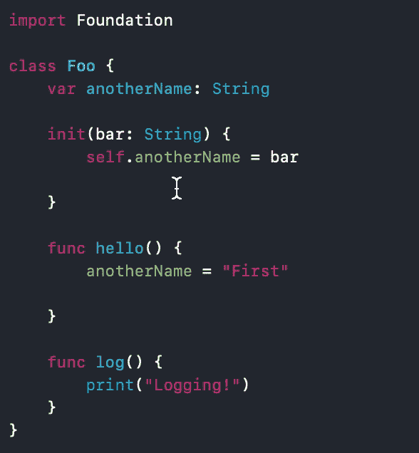

⇧ + ⌃ +点击的演示

# 7.多行光标(带键盘)

这个快捷方式基本上和之前的一样，但是我们不用鼠标来选择光标的位置，我们可以用箭头键来上下移动。

> shift + control +向上或向下/⇧ + ⌃ + ↑或↓

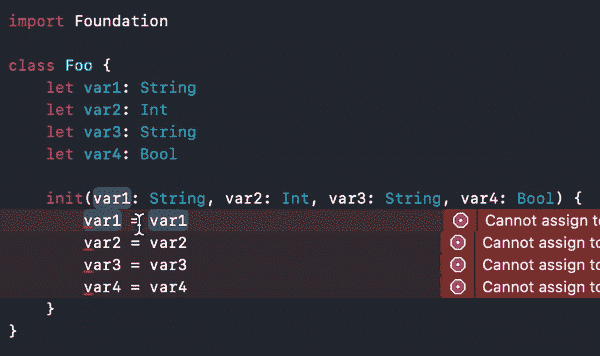

# 8.用几个参数快速创建一个 Init

我最喜欢使用上面的快捷方式之一是创建一个比你以前见过的任何东西都要快的 init。

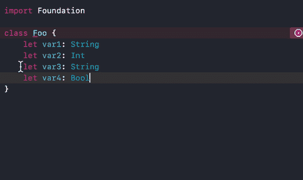

通过使用多光标和其他一些熟悉的快捷方式，如复制粘贴或突出显示整行，我们能够快速创建 init。这只是这一强大功能的多种用途之一。

## 8.1 另一种方式

还有一个编辑功能，允许你轻松地生成成员式初始化器。你可以通过把你的光标放在类名上，然后进入编辑器>重构>生成成员方式初始化器来找到它。

然而，这篇文章是关于捷径和技巧的。因此，一个小技巧是转到首选项>按键绑定，查找命令并添加按键组合。

这里有一个如何做到这一点的例子:

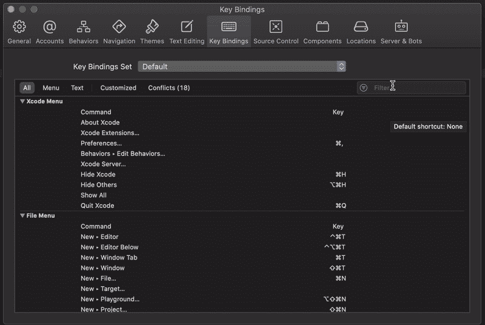

如何添加键绑定

# 9.回到光标所在的位置

有时，您可能正在处理一个非常大的文件。当我们向上滚动来检查某个东西时，我们可能会迷路，找不到回到原来位置的路。嗯，有了这个快捷方式，只要我们没有把光标移开，就可以快速跳回它。

> 选项+命令+ L / ⌥ + ⌘ + L

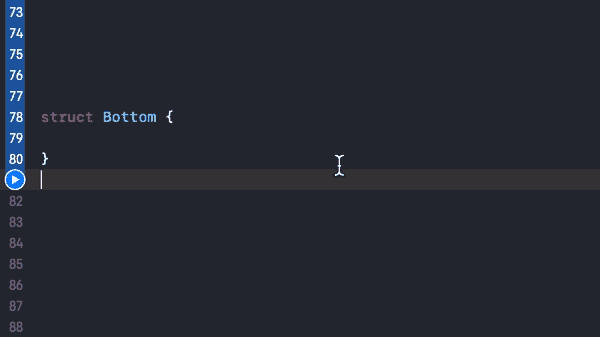

⌥ + ⌘ + L 的演示

# 10.跳转到行

与前一个相关，如果我们确切地知道我们想要在哪一行，那么通过这个快捷方式我们可以直接跳回它。

> 命令+ L / ⌘ + L

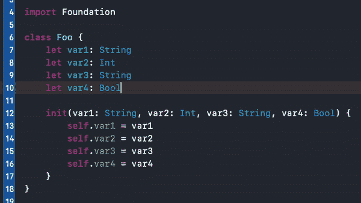

⌘ + L 的演示

# 最后的想法

就是这样。这是我每天使用 Xcode 来提高速度的十个快捷方式和技巧。它们经常会非常方便。

我希望你和我一样觉得它们有用。

如果你让我知道你是否已经知道并使用它们，或者这些对你来说是新的，我会很高兴。此外，请随意分享您使用的任何其他非常有用和有帮助的快捷方式。

## **小免责声明**

理想情况下，我之前提到的所有快捷方式都适用于你，它们的组合键也适用于我。然而，根据您的操作系统所设置的语言，有些可能会略有不同。

您可以随时前往 Xcode >偏好设置…>按键绑定，并检查特定情况下的绑定。

## 额外小费！快速打开偏好设置

> 命令+，/ ⌘ +，