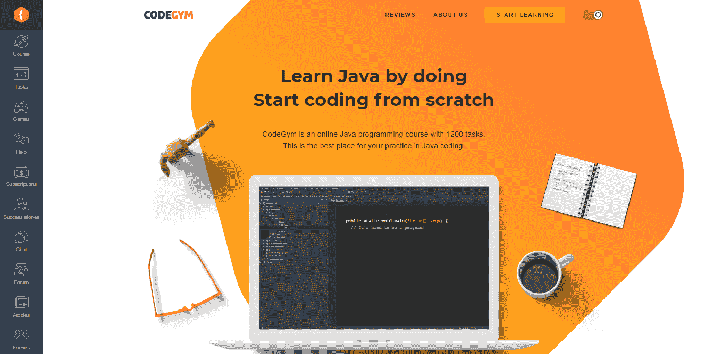
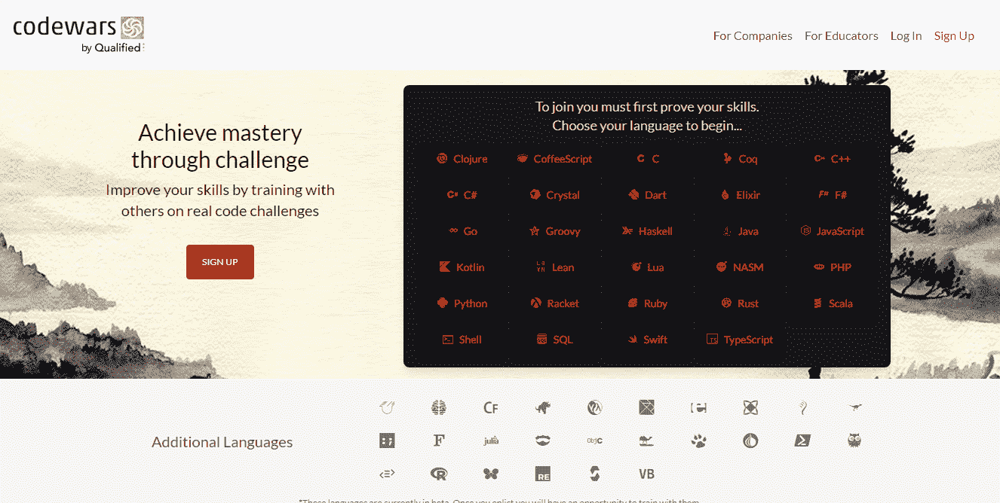
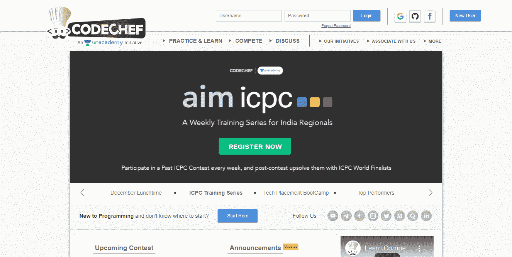

# 帮助你脱颖而出成为 Java 开发人员的 10 个技巧

> 原文：<https://betterprogramming.pub/10-tips-to-help-you-stand-out-as-a-java-developer-9865516584ae>

## 掌握 Java 需要知道什么

由[和](https://unsplash.com/@dhika88?utm_source=medium&utm_medium=referral)在 [Unsplash](https://unsplash.com?utm_source=medium&utm_medium=referral) 上拍摄的照片

几十年来，Java 一直是 T4 最流行的编程语言之一。想要精通 Java 的专家数量正在迅速增长。因为竞争非常激烈，仅仅成为一名优秀的 Java 开发人员已经不够了——你需要获得深厚的知识，熟悉许多概念，才能在竞争中领先。如果你一直在问自己“作为一名 Java 开发人员，我应该学习什么才能脱颖而出？”，这篇博文可以帮你把事情搞清楚。

# 1.对 OOP 原则有一个坚实的基础和清晰的概念

Java 是一种面向对象的语言，所以开发人员不应该低估 OOP 的原理，而应该努力去深入了解这个概念。学习如何在编程时应用 OOP 原则，深入了解对象建模、坚实的原则、设计模式、继承和其他概念。这些都是你在编写软件时应该记住的事情，尤其是在现代面向对象语言中。

# 2.阅读涵盖这些原则的书籍

掌握这些概念将有助于你应用 OOP 原则轻松构建项目。很多概念在一些我认为是开发者必读的经典书籍中有所涉及:

*   “设计模式:可重用面向对象软件的要素”由“四人帮”所作
*   “鲍勃叔叔”罗伯特·马丁的《干净的代码》
*   “鲍勃叔叔”罗伯特·马丁的“清洁建筑”
*   马丁·福勒和肯特·贝克的《重构》(第二版)
*   Kent Beck 的“极限编程讲解”
*   Kent Beck 的“测试驱动开发:示例”

# 3.熟悉 Spring 框架

Spring 框架在现代 Java 开发中扮演着重要的角色。Spring 框架组件，如 Spring MVC 和 Spring Boot，通常被公司用来构建微服务或 web 应用。理解 Spring 框架所有优点的开发人员更有可能在他们的领域大放异彩，将本地 Java 方法转变为管理操作或远程过程。

如果你以前从未使用过 Spring，第一步是熟悉 Spring 的基本知识，比如依赖注入(DI)、控制反转(IoC)和 Spring MVC 的基本原理。

下一个重要的里程碑无疑是 Spring Boot 及其为构建和运行 web 应用程序带来的能力。了解它提供的主要重要注释及其行为，并从总体上考虑 [Spring 注释](https://www.jrebel.com/blog/spring-annotations-cheat-sheet)(特别是如果您来自一个更基于 XML 的背景)。

诸如@Repository、@Service 和@Controller 或@RequestMapping 等将成为您的日常伙伴。试着用它们[构建一个小型的网络应用](https://spring.io/guides/gs/spring-boot/)。当然，对于这项学习，您需要很好地理解设计模式，以及这些注释定义的组件应该如何相互交互。

与以前使用 Java 的其他部署选项相比，使用 Spring Boot 启动和运行您新创建的应用程序会非常容易，您会对此感到惊讶。这个框架旨在极大地简化你的生活，让你获得一个可运行的“全包”。jar 文件，您可以从 Docker 容器从您的计算机上的命令行运行该文件，或者部署为普通的 Linux 服务，如果您在生产中不使用 Docker，则将其放在 Nginx 之后。

下一个 Spring 组件是 Spring Security，您肯定希望尽早学习它。设置对终端和服务的适当访问所需的一切，一般来说，身份验证和授权、登录、注册和不同的安全提供者，您都可以在那里找到。

在很多项目中，您还会遇到另一个相当大的组件，那就是 Spring Data。它为数据访问提供了方便而优雅的抽象。它本身不是 ORM，也不是 JPA 实现——它只是在它的基础上提供了一个通用的抽象，允许您减少数据操作所需的代码量，并使它变得简单明了和可支持。

最后，一个值得明确提及的组件(别忘了整个 Spring 是巨大的)是 Spring AOP(面向方面编程)。它提供了一种方法来包含各种注释，以声明方式控制代码行为的多个方面，如日志记录、异常或事务。理解这种哲学和方法将会在任何工作面试中给你带来提升。

毫无疑问，Spring 是 Java 世界中的一条大鱼，但它不是唯一的一条。并不是每个 Java 开发人员都想完全屈服于 Spring 的统治——有些人想专攻不同的技术，在不同的领域更深入。对于这些开发人员，我会区分 Java EE 堆栈。虽然旧了，但它仍然存在，尤其是在旧的大型项目中。

# 4.了解最基本的 API 和库

API 和库仅次于 Java 框架，所以如果你想脱颖而出，了解它们是很重要的。他们是 Java 生态系统不可或缺的一部分，在 StackOverflow 网站上拥有第二大社区。

这是一个非常广泛的主题，它同时包含了很多东西——我可以为此写十几篇文章——但是总的来说，对核心 API、主库和第三方库以及 Java 开发工具包(JDK)的深入了解定义了一个高技能的 Java 开发人员。为了避免混淆，我应该说专家们并不需要学习所有可能的 API，也不需要知道库中的每一个元素。对 Apache Commons、Guava、Maven 以及其他一些主要的 API 和库有一个清晰的了解就足够了。

# 5.深入了解 Java 11

最近，Java 开发人员社区见证了 Java 15 最后一个版本的发布。然而，当采用任何新版本时，Java 领域的软件开发流程通常相当缓慢——企业项目中尤其信奉“如果它没有坏，就不要修复它”的原则。

这些项目中发生的每一个小变化都必须符合高安全性要求，并且通常使用较旧的技术。例如，在银行、航空公司或保险系统中，你不太可能遇到任何小于五年左右的技术。在这里，旧意味着稳定、可靠和安全。

然而，新版本也在这些领域缓慢但稳定地被采用。每次新版本发布后，越来越多的公司会要求你熟悉新功能。Java 8 在当时是一个重大突破，但它花了几年时间才成为行业标准。在没有掌握 Stream API、默认接口方法、Lambda 表达式、Java Time API 以及这个版本的其他[主要特性的情况下，你肯定“不会通过”了。](https://www.journaldev.com/2389/java-8-features-with-examples)

进一步的 Java 版本保持了主动特性采用的旅程。下一个 LTS 版本是 Java 11——这是你最近在工作中经常遇到的版本。许多公司在下一个 LTS 发布之前不会放弃它，下一个应该是 2021 年 9 月发布的 Java 17。我绝对不建议你在接触和熟悉所有的 [Java 11 特性](https://mkyong.com/java/what-is-new-in-java-11)之前就开始找工作。

后来的 Java 版本，如上所述达到了 15 个，在某种程度上仍然处于被广泛采用的过程中，但是它们已经被广泛使用了。例如，已经有一个[亚马逊 Corretto 15](https://aws.amazon.com/corretto/) 版本。

无论哪种方式，对于一个优秀的 Java 开发人员来说，一个重要的实践就是非常仔细地关注每一个新版本，并迅速熟悉所有的新特性。一个都不能忽视。

# 6.关注 JVM 及其内部

没有 JVM (Java 虚拟机)Java 就不存在。它是一个运行时引擎，允许 Java 应用程序在任何可能的平台上运行。所以，如果你想加入一群优秀的 Java 开发人员，理解 JVM 的工作原理是必须的。除此之外，虚拟机的知识将帮助你在开发过程中解决问题。因此，除了其他事情之外，一定要掌握 JVM 系统线程和 Java 在运行时环境中的执行方式。

# 7.手头有多种方法

如果您想领先于许多其他 Java 程序员，您应该特别注意不同的方法。首先，熟悉敏捷，尤其是 SCRUM，还要了解瀑布，准备好使用它。只要许多开发人员根据客户的偏好选择方法，了解他们中的许多人将有助于您掌握这一点。

此外，您可以学习极限编程技术(上面提到了 Kent Beck 的经典著作)，以获得更丰富的经验和有效的工作。

# 8.习惯自动化测试

真正的 Java 开发人员和那些试图看起来像 Java 开发人员的人的区别在于能够进行自动化测试。简单地说，任何非手工的测试都可以被认为是自动化的:单元、集成等等，如果你想成为一名优秀的 Java 程序员，这些都需要改进。您还应该学习如何以这样的方式交付项目，即测试是您的 CI/CD 管道的一部分，并且如果一些重要的部分没有被测试覆盖，代码不会进入生产。

下面是您的开发和进一步部署流程在测试后的样子。

## **你开发应用程序的一个组件，然后用单元测试覆盖它，直到进入下一个。**

如果您完全遵循这种实践，您可能会注意到它是如何隐含地迫使您保持良好的代码模块化的。一个好的单元测试是允许你独立运行组件代码的。您不能使用数据库、外部 API 或依赖其他类。目前只有你的部分在现场。

您将演示数据准确地放在一起，记住所有的边缘情况，如空值或 null 值，并检查您得到的输出是否完全符合预期。这样做之后，您可以确定您的组件不是失败的根源，并且您可以在其他地方依赖它的逻辑。JUnit 5 和 Mockito 是您在这里最好的朋友——每天掌握和使用它们。

此外，另一个优点是在编写测试用例时使用 TDD，甚至是在编写组件代码之前。这里有一个有趣的[故事，关于 TDD 有时能为你节省多少调试时间](https://daedtech.com/5-things-ive-learned-in-20-years-of-programming/)。

## 在所有的组件都这样开发之后，您需要提供自动化的集成测试。

在大多数情况下，这只是意味着用一个简单的脚本以编程方式利用您的应用程序，用一些输入数据运行它，并控制输出(您通常会在 Docker 容器中这样做)。然而，有时这意味着测试单独的组件或一系列组件，但这一次使用真正的外部资源，如数据库或文件存储。

无论哪种方式，都要考虑全局可以有哪些输入边缘情况，并检查您的应用程序是否可以正确处理这些情况。

## **3。最后，您应该将测试嵌入到您的 CI/CD 管道中。**

一个经典的现代方法是，一旦你将代码提交到你的 Git 存储库中，无论是提交、请求还是合并到一个特定的分支，都会触发一个钩子。这会运行一个部署脚本并利用 Docker 容器，该容器会根据您的部署尝试构建您的应用程序或应用程序的 Docker 映像。

无论哪种方式，假设应用程序构建成功(如果不成功，您会自动得到保护，免受生产中损坏的应用程序的影响)，它会尝试在容器中运行您的所有测试，包括单元测试和集成测试。如果任何一个测试失败，整个过程都会失败，Git 不会自动批准 pull 请求，或者只是让您的构建失败。

这个流程的一些细节会有所不同，但总的来说，这种应用交付的方法会在每次提交的基础上为您带来明确的质量控制，当您的应用在生产中崩溃时，可以节省您几个小时的时间。

# 9.提高你的编码技能

编码主要是练。不管你读了多少书，都不会像你在实践中磨砺知识那样有效。幸运的是，如今的编码并不像你想象的那么无聊——网络上有许多游戏化的平台让编码变得有趣。

在众多平台和课程中，我建议考虑以下内容。

## 1.CodeGym

在实践中学习 Java 是 CodeGym 强烈推荐的。参加课程后，你将被迫完成超过 1200 个实际操作任务，并因此编写大量代码。感谢一个即时验证选项，你将有一个虚拟导师来审查你的代码，这样你就知道要改进什么。您还可以加入 CodeGym 社区，与其他学生交流，分享您在该平台上练习 Java 的想法。

## 2.代码战争

[Codewars](https://www.codewars.com) 由社区成员创建，让新来者掌握 20 多种编程语言。学习的目的是让学生通过与其他开发人员一起训练形来提高他们的技能。一旦学习者完成下一个任务，平台会奖励他们荣誉和排名，并向您发送更多高级挑战。在这里，在 Codewars，你也可以建立自己的形，并要求你的同伴解决它们。

## 3.赛博道场

与许多其他编程课程不同， [Cyber-Dojo](https://www.cyber-dojo.org/creator/home) 鼓励新手专注于提高他们的技能，而不是尽快完成游戏。在这里，你可以单独练习 Java 或者加入小组讨论，如果你已经有了技术背景，甚至可以参加编码对练。

## 4.厨师长

如果你热衷于编码竞赛和挑战，请将 [CodeChef](https://www.codechef.com) 放在列表上——这是一个完美的地方。该平台每月举办编程竞赛，来自世界各地的开发人员展示他们的技能，并试图赢得奖杯。除了参加挑战，您还可以通过参加与不同技术主题相关的培训来积累知识，如二分搜索法、算法、数组大小等。

## 5.编码游戏

对于所有技能水平的开发人员来说，Codingame 是一个理想的学习平台。在练习 Java 的时候你不会感到无聊——课程提供了编码测验、单人和小组挑战、代码冲突中的 5 分钟编码大战，以及面向高级开发者的机器人编程比赛。

# 包扎

遵循这些提示将帮助你脱颖而出，加入伟大的 Java 开发人员的行列。如果你知道一些我没有提到的事情，请在下面的评论中分享你的想法。