# 从您的终端运行 Swift 的 10 个技巧

> 原文：<https://betterprogramming.pub/10-tips-to-run-swift-from-your-terminal-b5832cd9cd8c>

## “swift”、“swiftc”和“lldb”


伊利亚·巴甫洛夫在 [Unsplash](https://unsplash.com?utm_source=medium&utm_medium=referral) 上拍摄的照片

有时候写一段 Swift 代码，我都懒得启动 Xcode。从终端运行 Swift 命令`swift`和`swiftc`更加轻量和方便。为了调试和设置断点，`lldb`完成了这项工作。

# 1.获取 swift 版本的“Swift”命令

从[下载](https://swift.org/download/)页面安装最新版本的 Swift 后，我将运行命令来验证我运行的是预期的 Swift 版本:

```
$ swift --version
```

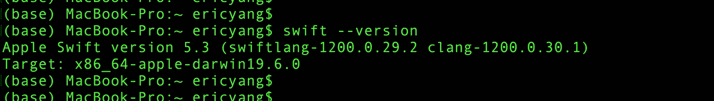

Swift 版本

*   它显示我目前使用的是 Swift 5.3
*   Swift/Objective-C 编译器版本为 12
*   Swift 环境是 64 位 CPU 上的 MacOS Catalina

# 2.运行 Swift 文件的 Swift 命令

让我们使用`vi`编辑器来编写我们的第一个 Swift 文件`Foo.swift`以打印出`“Hello world!”`:

```
$ vi Foo.swift
```

记下`foo()`功能，并执行它:

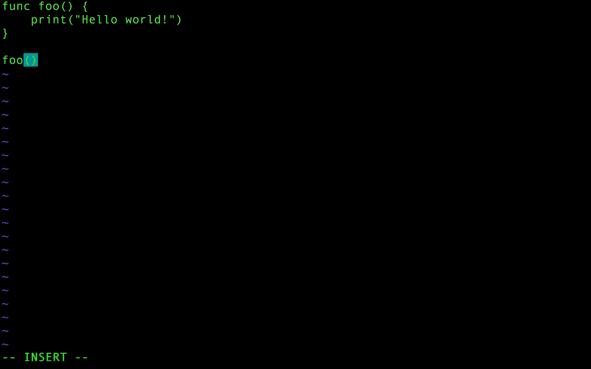

' Foo.swift '

要运行该文件，我们使用:

```
$ swift Foo.swift
```

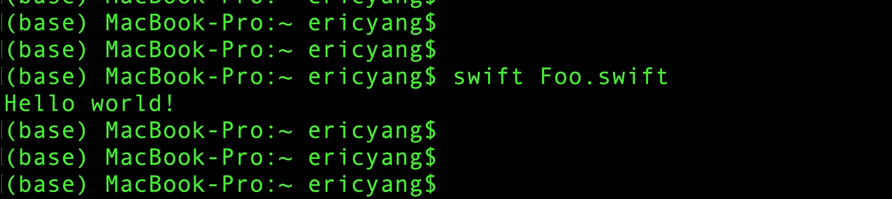

运行 Swift 文件

# 3.使用参数运行 Swift 文件

`CommandLine`枚举是 Swift 标准库的一部分，用于提供命令行参数。我们使用`CommandLine.arguments`来获得`swift`命令后的参数。

要打印出`“Hello, Foo!”`消息，代码是:

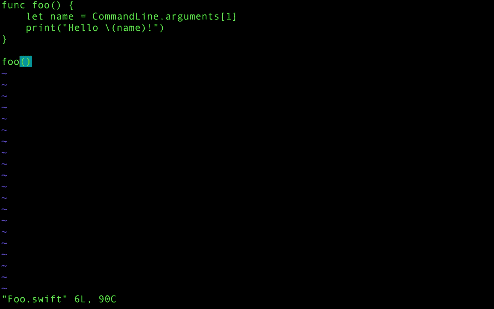

带参数的“Foo.swift”

要运行带参数的文件，我们使用:

```
$ swift Foo.swift Foo
```

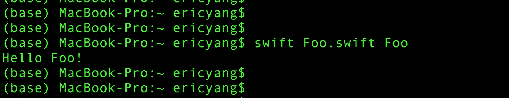

使用参数运行 Swift 文件

# 4.使用“swiftc”制作可执行文件

在 Swift 的世界里，让 Swift 文件可执行有两个步骤:`compile`和`link`。

*   我们用`compile`Swift 文件(`.swift`)来产生对象文件(`.o`)。
*   我们`link`把目标文件生成可执行文件。

构建可执行的 Swift 文件的最简单方法是一个命令:

```
$ swiftc Foo.swift
```

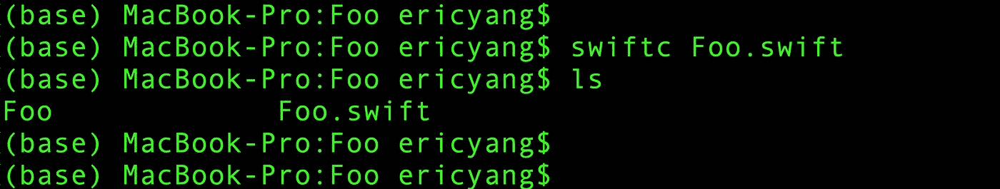

Foo '可执行文件

要运行可执行文件，我们使用以下命令:

```
$ ./Foo Foo
```

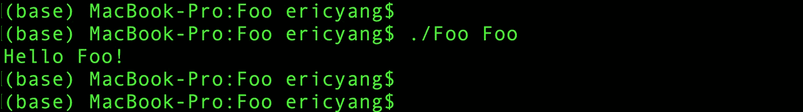

运行可执行文件

# 5.使用“swiftc”制作目标文件

目标文件(`.o`)是源代码(`.swift`)的机器代码表示。它是根据源代码编译的，但还不能运行。

例如，如果源文件依赖于一个系统库或另一个源文件，那么目标文件就需要链接到编译后的代码。

为了生成目标文件(`.o`)，我们使用`-c`标志通知编译器只进行编译并跳过链接:

```
$ swiftc -c Foo.swift
```

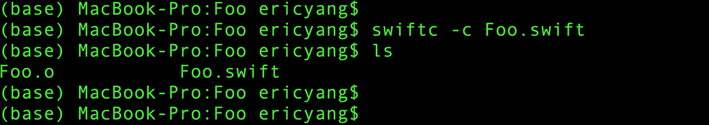

Foo.o '

为了指定输出对象的文件名，我们使用了`-o`标志:

```
$ swiftc -c Foo.swift -o Main.o
```


主界面

# 6.将多个目标文件链接到模块

将代码写入不同的文件以保持一个干净的结构是相当常见的。每个文件编译成目标文件后，我们需要把它们链接在一起，组成可执行模块。

让我们创建另一个名为`Event.swift`的 Swift 文件来保存我们计划要做的所有事件:

```
$ vi Event.swift
```

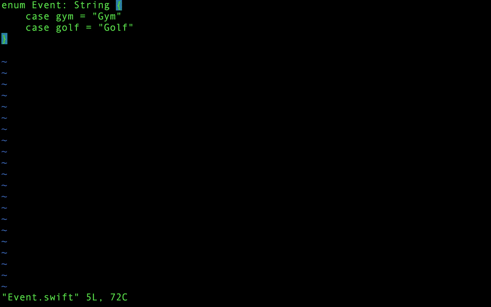

' Event.swift '

然后更新`Foo.swift`文件，以便能够打印出消息`“Hello Foo! Let’s go to the Gym!”`。

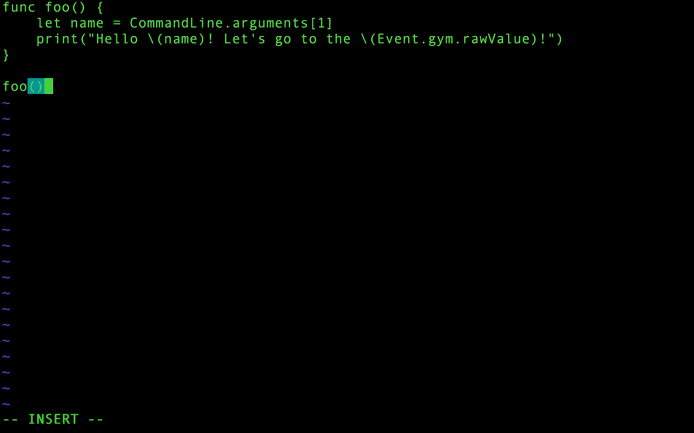

“Foo.swift”与事件

为了编译和链接这两个文件，我们需要将`Foo.swift`重命名为`main.swift`，因为`main.swift`是唯一允许我们在顶层放置可执行表达式`foo()`的地方。

要重命名它，我们使用`mv`命令:

```
$ mv Foo.swift main.swift
```

文件夹中现在有两个 Swift 文件:

```
.
|- main.swift
|- Event.swift
```

要将源代码编译到模块中，我们可以使用以下命令:

```
$ swiftc -c main.swift Event.swift -module-name Foo
```

*   `-c`标志指定源文件
*   `-module-name`告诉编译器源代码正在组成一个名为`Foo`的模块


编译多个文件

然后，我们需要链接目标文件来创建可执行模块:

```
$ swiftc -emit-executable main.o Event.o -o Foo
```

*   这里，我们传递两个而不是一个目标文件
*   我们通过使用`-o`标志指定可执行输出文件将是`Foo`

我们的目录现在看起来像这样:

```
.
|- main.swift
|- Event.swift
|- main.o
|- Event.o
|- Foo
```

运行我们的可执行文件并查看结果:

```
$ ./Foo Foo
```

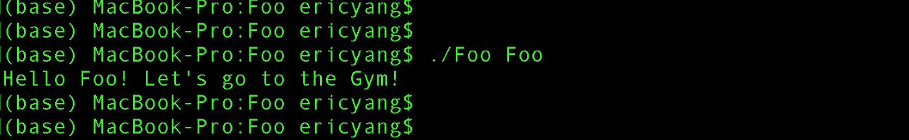

运行“Foo”可执行文件

# 7.编译 Swift 文件时导入框架

当我们将 iOS 或 macOS 框架`import`到 Swift 文件时，我们也可以从终端使用`swiftc`命令。

我们将以下代码添加到`MyView.swift`中，并创建一个带有自定义框架的`UIView`实例:

```
import UIKitfunc createView() -> UIView {let view = UIView(frame: CGRect(x:0,y:0,width:200,height:200))return view}let view = createView()print(view)
```

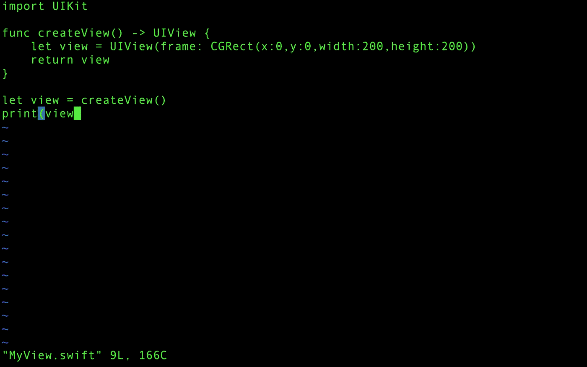

`'MyView.swift'`

我们使用下面的命令来编译`MyView.swift`文件:

```
$ swiftc -c MyView.swift -o MyView.o -sdk /Applications/Xcode.app/Contents/Developer/Platforms/iPhoneOS.platform/Developer/SDKs/iPhoneOS14.1.sdk -target arm64-apple-ios14.1
```

*   `-c`标志表示编译下面的源文件
*   `-o`指定输出文件名
*   `-sdk`是导入框架所在的源。对于这个示例，它是 Xcode SDKs 文件夹中的`iPhoneOS14.1.sdk`。
*   然后我们使用`-target`标志来指定它运行在 ARM64 设备(iPhone/iPad)的 iOS 14.1 上

然后我们使用`-emit-executable`标志将目标文件链接到可执行文件:

```
$ swiftc -emit-executable MyView.o -sdk /Applications/Xcode.app/Contents/Developer/Platforms/iPhoneOS.platform/Developer/SDKs/iPhoneOS14.1.sdk  -target arm64-apple-ios14.1
```

目录中的文件如下:

```
.
|- MyView.swift
|- MyView.o
|- MyView
```

# 8.创建可执行包的 Swift 命令

为了创建可执行的 Swift 包，我们运行以下命令:

```
$ swift package init --type executable
```

包的基本结构是自动生成的:

```
.
|- Package.swift
|- README.md
|- .gitignore
|- Sources
    |- Package
        |- main.swift
|- Tests
    |- LinuxMain.swift
    |- PackageTests
        |- PackageTests.swift
        |- XCTestManifests.swift
```

*   `Package.swift`是每个包裹的入口
*   自动生成了两个目标:`Package`和`PackageTests`
*   `Package`目标包含`main.swift`，这意味着它是可执行的
*   文件夹是我们测试的地方。每个目标都有自己的文件夹。
*   `Sources`文件夹是代码存放的地方。每个模块目标都有一个文件夹。
*   `executable modules`和`library modules`由`main.swift`文件区分

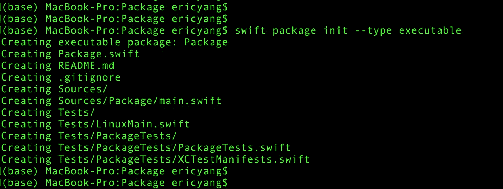

Swift 包裹

要构建、运行和测试包，我们只需使用以下命令:

```
$ swift build
$ swift run
$ swift test
```

*   `swift build`将解析、下载并编译包清单文件中提到的任何依赖项。然后，它将构建指定的目标依赖项(如果有的话)，最后是目标本身。
*   至于构建阶段，因为我们只有一个目标，所以我们可以省略它的名字。完整的命令是`$ swift run package`。
*   最好总是运行所有的测试。如果我们只想运行一个子集，`swift test`命令提供了一个`--filter`标志来完成这个任务。

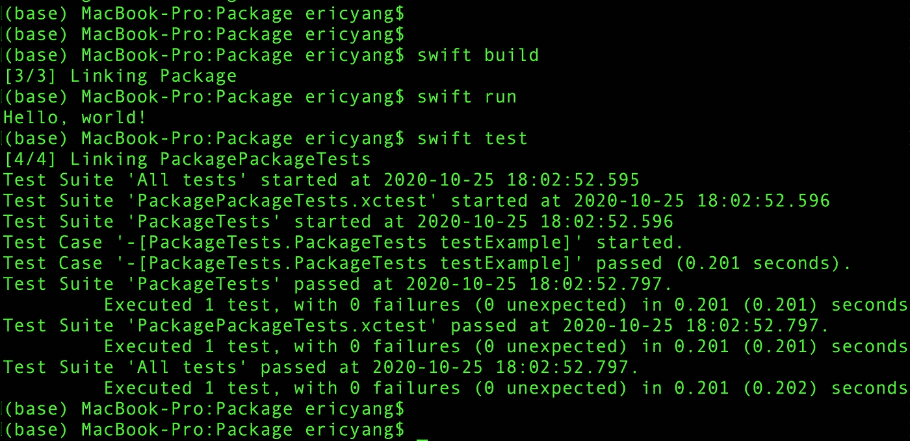

快速构建运行和测试

# 9.斯威夫特·REPL 用斯威夫特做实验

斯威夫特 read 代表交互式*阅读-评估-打印-循环* **。**这是另一种尝试 Swift 的方式。要开始，启动终端应用程序，并键入`swift`:

```
$ swift
```

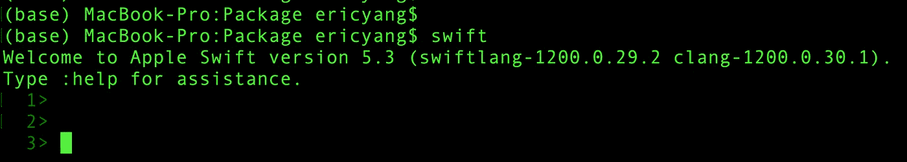

斯威夫特·REPL

只需输入 Swift 代码，就能看到它编译并运行:

```
1> let name = "Foo"
name: String = "Foo"
2> print(name)
Foo
```

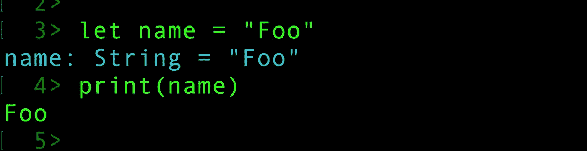

REPL 代码示例

要退出 REPL，请使用以下命令:

```
1> :quit
```

# 10.使用 LLDB 调试器

LLDB 是 macOS 上 Xcode 中的默认调试器，支持在桌面和 iOS 设备上调试 C、Objective-C、C++和 Swift。

对于样本`main.swift`文件:

```
func foo() {let name = CommandLine.arguments[1]print("Hello \(name)! Let's go to the \(Event.gym.rawValue)!")}foo()
```

以及相关的`Event.swift`文件:

```
enum Event: String {case gym = "Gym"case golf = "Golf"}
```

我们使用`-g`标志和`swiftc`命令来生成包含调试信息的可执行文件。

```
$ swiftc -g main.swift Event.swift
```

文件在以下文件夹中生成:

```
.
|- main.swift
|- Event.swift
|- main.dSYM
|- main
```

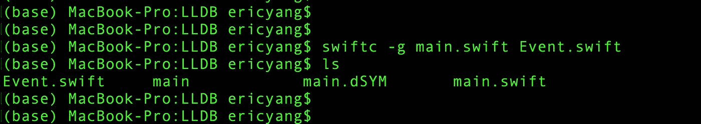

带'-g '标志的 Swiftc

我们可以使用 LLDB 调试器运行主要的可执行文件:

```
$ lldb main Foo
```

它将启动交互控制台运行`lldb`命令:

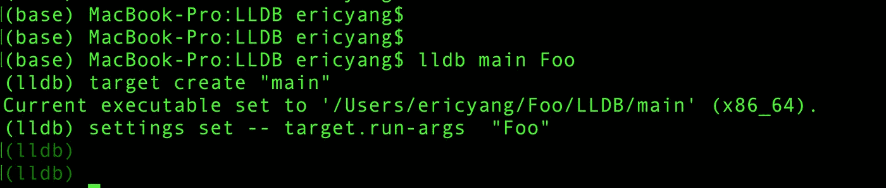

交互式控制台

要在第三行设置断点…

```
3: print("Hello \(name)! Let's go to the \(Event.gym.rawValue)!")
```

…我们使用 break ( `b`)命令:

```
(lldb) b 3
```

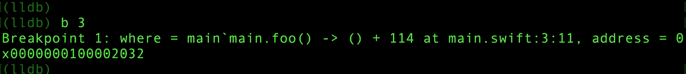

断点

然后我们用 run ( `r`)命令运行这个过程。该过程将在断点(第 3 行)处停止，并等待另一个命令。

```
(lldb): r
```

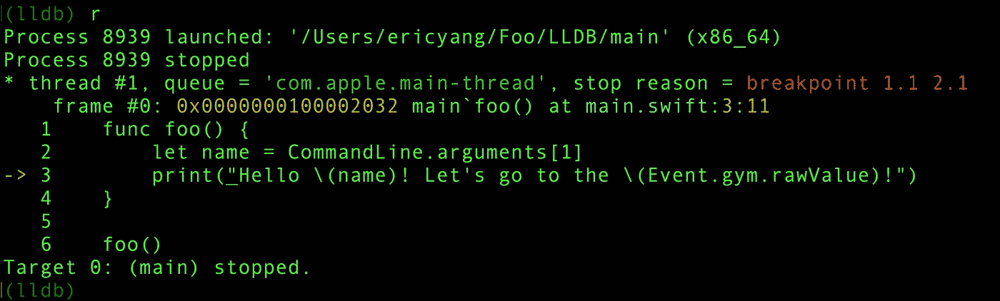

运行流程

为了打印出`name`的值，我们使用 print ( `p`)命令。

```
(lldb): p 
```

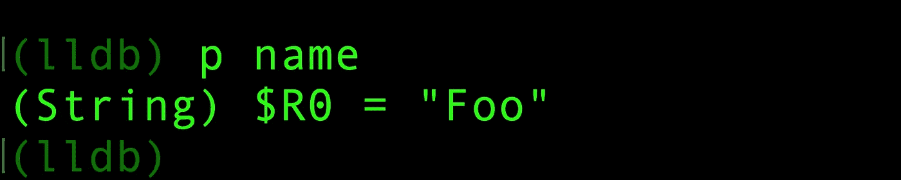

打印值

然后我们可以使用 continue ( `c`)命令来恢复进程，使用 breakpoint-disable ( `br di`)命令来禁用所有断点。

# 结论

Swift 命令是从终端编译和运行 Swift 代码的一种强大而轻量级的方式。当我们验证概念时，甚至当我们开发项目时，它们都很方便。

感谢您的阅读。上面提到的所有代码都可以在这个 [GitHub repo](https://github.com/ericleiyang/SwiftCommandsDemo) 中找到。