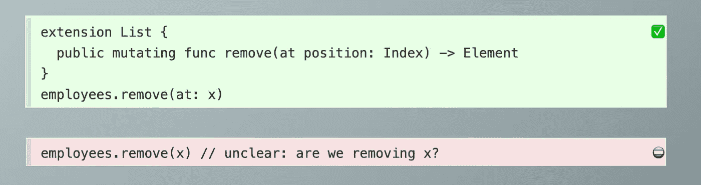
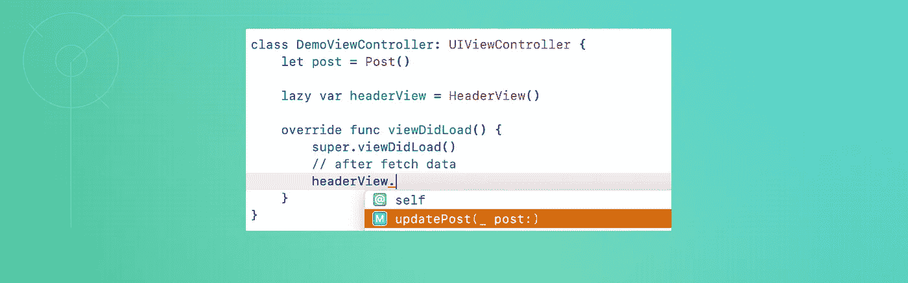
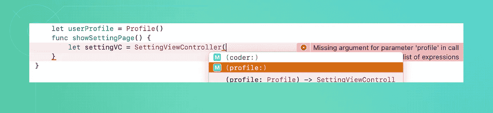
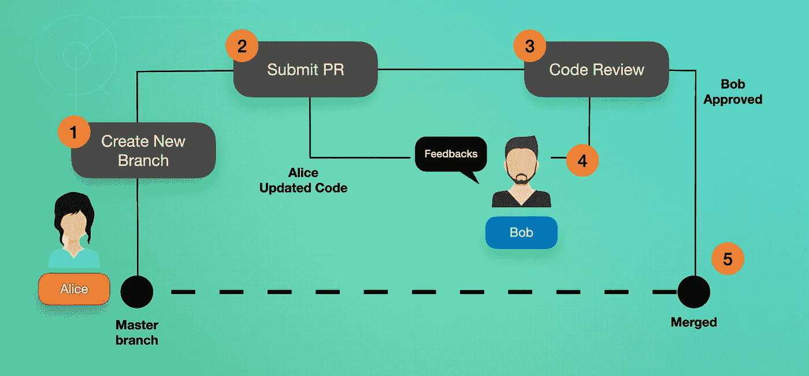

# 在 iOS 开发中避免意大利面条式代码的 10 个技巧

> 原文：<https://betterprogramming.pub/10-tricks-to-avoid-spaghetti-code-in-ios-development-3f5a0ab2f46f>

## 了解如何编写干净且可维护的代码

韦斯·希克斯在 [Unsplash](https://unsplash.com/?utm_source=unsplash&utm_medium=referral&utm_content=creditCopyText) 上的照片

作为产品所有者或开发者，我们希望创建设计精良、功能齐全的优秀应用。然而，具有高级 UI 设计和流程的复杂应用程序有时会导致编写出非常难以维护的灾难性代码。

*意大利面条代码*是开发人员中一个众所周知的术语。它指的是一个非结构化的、难以理解和维护的项目。大多数乱码项目都是由糟糕的软件开发实践造成的，比如功能冗余和不一致的命名。

一些开发人员可能会认为这是不可避免的，因为时间很短，有大量的功能需求和开发人员背景。然而，作为优秀的开发人员，我们应该总是寻找更好的方法来完成我们的任务。

在这篇文章中，我们将讨论我们可以用来改进代码的方法，使代码更加清晰和易于维护。

> "仅仅让代码工作是不够的."――罗伯特·c·马丁，[干净的代码:敏捷软件工艺手册](https://www.oreilly.com/library/view/clean-code-a/9780136083238/)

# 为什么要清理代码？

为什么我们应该保持代码的整洁，有三个主要因素。

## 1.容易追踪 bug

开发一个完全健壮的项目是困难的，但是解决不可追踪的 bug 要困难得多。这对于每个开发人员来说都是一场噩梦。然而，通过编写良好的代码，我们应该能够快速跟踪并修复任何出现的 bug 或错误。

## 2.可扩展性

每个产品或应用程序都有未来功能添加的路线图。新创建的 iOS 项目应该做好准备，在不频繁进行重大更改的情况下，用新的模块进行扩展。

## 3.易于理解和移交

不要把你丑陋的代码留给其他开发者去清理。我们必须负责使它尽可能的易读和简单。它应该不仅对您，而且对其他开发人员都很容易理解。

# 如何避免意大利面条代码

让我们回到我们的主题。有许多方法可以实现这一点，但是在本文中，我们将只讨论 iOS 开发中的十个关键点。

## 1.好好计划，更好地编码

约翰·施诺布里奇在 [Unsplash](https://unsplash.com/?utm_source=unsplash&utm_medium=referral&utm_content=creditCopyText) 上的照片

作为开发人员，不要跳过计划阶段，尽管你知道这很简单。我们应该记住，我们的应用程序会变得更大，有更多的功能。

一旦我们完成了快速研究，总是要听取前辈、朋友和有经验的开发人员的建议，尤其是当项目很复杂而你又没有太多经验的时候。事实上，它节省了大量的时间和金钱。

## 2.代码可读性

对于一个开发人员来说，写一千行别人能理解的代码是一项重要的技能。下面是我们在编写代码时可以采用的一些方法。

1.遵循适当的命名设计指南，如 [Swift 文档](https://swift.org/documentation/api-design-guidelines/#naming)中所述。

Swift.org[中的代码示例](https://swift.org/documentation/api-design-guidelines/#promote-clear-usage)

变量和方法的名字应该描述它们。

简单的命名示例

2.为更好的变量名和方法名启用语法检查。转到`Edit Format > Spelling and Grammar`

3.使用 [SwiftLint](https://github.com/realm/SwiftLint) 在整个项目中强制执行相同的样式和编写规则。

4.注释对于开发人员快速学习代码很重要。在此查看正确的[指南](https://swift.org/documentation/api-design-guidelines/#fundamentals)。另外，在最近的 WWDC21 上，苹果推出了新的 Xcode 文档工具，名为 [DocC](https://developer.apple.com/videos/play/wwdc2021/10166/) 。

5.在编写代码时保持一致。例如，如果所有的视图控制器都使用`segue`来导航，其他的视图控制器应该遵循同样的方法，而不使用`pushViewController()`。因此，任何与导航相关的问题都很容易通过查看`segue`调用和`prepareForSegue`来调试。

## 3.避免可变的全局变量

使用全局变量是轻松改变变量状态的最常见方法，可以在项目中的任何地方设置和读取变量的值。这种做法的问题是很难跟踪当前值的更新位置，并且很难测试。

*   通过将变量作为视图控制器的变量来传递，尝试将风险降至最低。
*   使用单例模式以正确的方式保持状态。

## 4.适当的用户默认管理

`UserDefault`以各种数据类型保存持久数据非常有用。

*   首先，通过使用 enum 或任何第三方库来避免硬编码的键，例如 [SwiftyUserDefaults](https://github.com/sunshinejr/SwiftyUserDefaults) 。
*   避免未跟踪的值更改(全局变量也有类似的问题)。创建一个助手类来管理值更新。因此，所有的值只能使用一个一站式的类来更改，而不是在项目中的任何地方。

## 5.复用性

保持简单，尽量少写代码。为了避免冗余代码，我们可以使用扩展、子类化和助手类。

例如，我们有几行代码来改变在多视图控制器中使用的背景样式。最简单的解决方案是在`UIViewController`扩展中添加一个新函数。因此，如果我们将来需要改变样式，我们可以很容易地更新该扩展中的特定功能。

这不是很简单吗？我的建议是，为了将来的灵活性，花更多的时间适当地构造你的代码。

此外，我总是试图通过将我的每个`UIViewController`分解成多个`UIView`组件来保持它的简单。我创建了一个[教程](https://medium.com/geekculture/slim-uiviewcontroller-break-into-multiple-uiview-components-78d7a67d7468)来解释这个过程。

## 6.避免回调地狱

有几种方法可以正确调用多个嵌套的回调函数。

*   使用`Result`类型干净地读取回调数据。
*   正如最近在 WWDC21 上宣布的那样，苹果在 Swift 5.5 中引入了一个 [async/await](https://developer.apple.com/videos/play/wwdc2021/10132/) 功能，我们可以用它来解决这个问题。除此之外，我们还可以使用 promise 库，比如 [PromiseKit](https://github.com/mxcl/PromiseKit) 和 [Then](https://github.com/freshOS/Then) 。厉害！

PromiseKit 代码示例

*   除了上面提到的那些方法之外，简单的方法(但是有点乱)是避免同时调用回调方法和执行数据处理。相反，尝试将方法调用和过程分开。比较下面例子中的两段代码。

将所有方法调用和过程写在一起是不好的做法

通过将代码分解成多个函数来创建更具可读性的代码

## 7.总是使用可编码的

WWDC17 中引入了 Swift 标准库 Codable ，使开发人员能够自动解析 JSON 数据，并使用可编码和可解码的协议进行编码。

永远不要使用`[String: Any]`或`Dictionary`类型来读取 JSON 数据属性。当我们的后端更新一个新的属性或结构时，这使得我们的代码看起来更加复杂和难以更新。通过使用 decodable，我们不再需要第三方库来将 JSON 数据映射到定义的对象模型中。你可以参考这篇[文章](https://www.hackingwithswift.com/read/7/3/parsing-json-using-the-codable-protocol)中的进一步解释。

## 8.访问控制

我理解不是每个人都会使用[访问控制](https://docs.swift.org/swift-book/LanguageGuide/AccessControl.html)。然而，如果我们考虑使用它的好处，我们可以编写更好的代码。事实上，它提高了编译时间和应用程序的性能。

例如，如果我们指定了对变量的`private`访问，其他类将不能访问它。它只能在同一个类中设置。因此，如果我们需要从外部更新，我们可以编写一个`public`函数来执行对该变量的特定更新。主要目标是跟踪变量的变化，以便可以容易地识别任何错误或缺陷。

如果只能在同一个类中访问，我们可能还需要将所有函数保持为`private`。请看下面一个简单的例子。

只有公共函数可以从类外部调用

在这个例子中，`HeaderView`类隐藏了除了`updatePost()`函数之外的所有变量。这是一个很好的实践，可以确保`post`对象只能从那个函数中设置。

另一个有用的例子是对一个类使用`final`，如果我们确认这个类不会被其他人用作子类(不能被继承)。

## 9.依赖注入

我认为依赖注入(DI)是对访问控制功能的补充，这一点我们在前面已经讨论过了。DI 似乎是一个复杂的模式，但它不是。它只是在创建对象时强制依赖对象传递的一种模式。

> “依赖注入意味着给一个对象它的实例变量。真的。就是这样。”— [詹姆斯·肖尔](http://www.jamesshore.com/Blog/Dependency-Injection-Demystified.html)

在下面这个简单的例子中，发生了一个错误，因为除非在初始化方法中传递了`Profile`对象，否则无法创建`SettingViewController`的实例。这太酷了。

## 10.同行代码审查

一个优秀的开发团队应该在他们的工作流程中包含这个过程，以确保他们在将代码投入生产之前写出好的代码。它是一个过程，在它被批准并与主要工作源代码合并之前，开发人员对彼此完成的源代码进行审查并提供反馈。

现在大家都用源码控制系统，比如 GitHub，Bitbucket。所以我们应该熟悉 [*拉请求*](https://docs.github.com/en/github/collaborating-with-pull-requests/proposing-changes-to-your-work-with-pull-requests/about-pull-requests) (PR)这个术语。已经完成一个模块(在一个单独的分支)的开发人员将提交一个 PR 到主/主要分支。然后代码会被其他开发人员审查。如果审查者批准，代码将直接合并到目标分支。评审者也可以通过提供改进反馈来拒绝批准。

代码审查过程(图片来源:作者)

最近，苹果在 WWDC21 上宣布了 Xcode 13 中的[协作工具](https://developer.apple.com/videos/play/wwdc2021/10205/)的增强，它允许开发人员在 Xcode 内部执行交互式代码审查和拉请求。

说实话，当我即将加入一个新的项目或公司时，我通常会问工作流程中是否有代码审查流程，以确保我将有更多的机会通过在一个好的团队中工作来提高我的开发技能。

# 下一步是什么？

太好了，我们已经涵盖了每一个重要的关键，这将有助于我们保持代码的整洁和可维护性。你可以尝试在你的项目中逐步实现这十点，看看你的开发流程和时间是如何改进的。

我们可以尝试在 iOS 项目中实现一些其他的高级方法，比如采用一个干净的框架，实现一个[设计模式](https://www.raywenderlich.com/477-design-patterns-on-ios-using-swift-part-1-2) (Singleton，Coordinator，等等。)，使用一个[架构模式](https://medium.com/ios-os-x-development/ios-architecture-patterns-ecba4c38de52) (MVVM，蝰蛇等。)和添加单元测试。

然而，请记住，我们**不应该过度设计**我们的项目，以至于它变得结构复杂、难以理解。

希望本文能帮助您提高开发技能。请分享，并感谢您的阅读。非常感谢您的反馈。祝编码愉快！

# 参考

[https://swift . org/documentation/API-design-guidelines/# naming](https://swift.org/documentation/api-design-guidelines/#naming)

[https://github.com/realm/SwiftLint](https://github.com/realm/SwiftLint)

[https://level up . git connected . com/alternatives-to-global-variables-34982 bec FCC](https://levelup.gitconnected.com/alternatives-to-global-variables-34982becfcc)

[https://developer . apple . com/documentation/dispatch/dispatch _ group](https://developer.apple.com/documentation/dispatch/dispatch_group)

[https://docs . swift . org/swift-book/language guide/concurrency . html](https://docs.swift.org/swift-book/LanguageGuide/Concurrency.html)

[https://developer.apple.com/videos/play/wwdc2021/10132/](https://developer.apple.com/videos/play/wwdc2021/10132/)

[https://docs . swift . org/swift-book/language guide/access control . html](https://docs.swift.org/swift-book/LanguageGuide/AccessControl.html)

[https://medium . com/@ roykronenfeld/semaphores-in-swift-e 296 ea 80 f 860](https://medium.com/@roykronenfeld/semaphores-in-swift-e296ea80f860)

[https://docs . github . com/en/github/collaboration-with-pull-requests/proposing-changes-to-your-work-with-pull-requests/about-pull-requests](https://docs.github.com/en/github/collaborating-with-pull-requests/proposing-changes-to-your-work-with-pull-requests/about-pull-requests)

[https://medium . com/IOs-OS-x-development/IOs-architecture-patterns-ecba 4c 38 de 52](https://medium.com/ios-os-x-development/ios-architecture-patterns-ecba4c38de52)