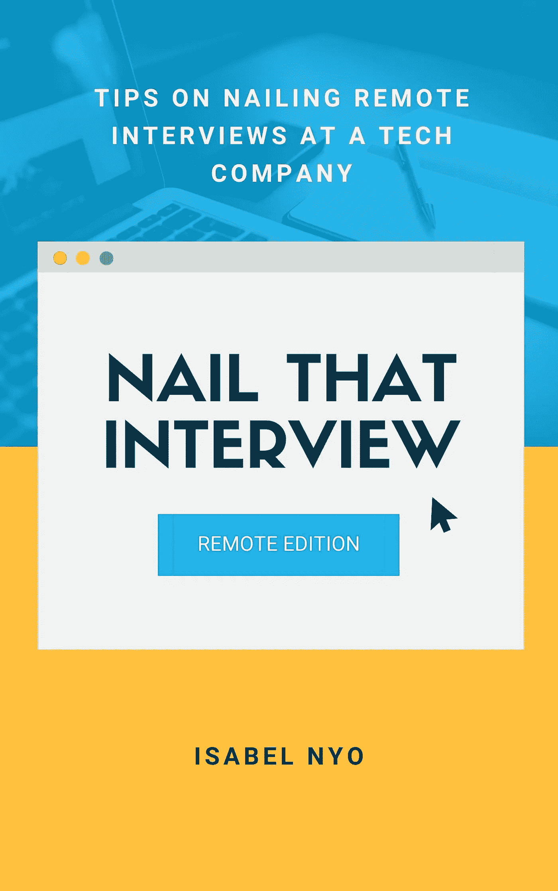

# 求职面试中不应该给出的 10 个不可接受的回答

> 原文：<https://betterprogramming.pub/10-unacceptable-responses-that-you-should-not-give-at-a-job-interview-b6f0d78c23e3>

## 为了增加进入下一轮的机会，你应该避免说什么

[梁杰森](https://unsplash.com/@ninjason?utm_source=medium&utm_medium=referral)在 [Unsplash](https://unsplash.com?utm_source=medium&utm_medium=referral) 上的照片。

我们都听说过这样一句老话，面试官通常会说:“答案没有对错之分。我们只是想更好地了解你。”让我告诉你:不要把这个建议看得太重。换句话说，不要上当。如果你想增加进入下一轮的机会，确实有些事情是你永远不应该在面试中说的。

仅在过去的一年里，我就面试了 100 多名应聘者，带着[完美的简历](https://gum.co/perfectresume)，我也见识了不少糟糕的面试。糟糕的面试是这样的:候选人立即知道他们做得不好，面试官也知道。其实也没什么特别的。有趣的是，当面试本身并不太糟糕，但面试官不愿意提出候选人，因为受访者说的一两件事。面试官通常称之为黄旗或红旗。当一个候选人有这样的旗帜时，即使他们成功地通过了其他问题，面试官也会对让被面试者上前并雇用他们有所保留。

在这篇文章中，我将和你分享十件你在求职面试中绝对不应该说的话，以及为什么你不应该说这些话。

# 与团队相关的面试问题

本·哈里特在 [Unsplash](https://unsplash.com?utm_source=medium&utm_medium=referral) 上拍照。

## **帮助团队中表现不佳的人**

*“有些人就是无能，帮不了他们。”*

在一个团队中工作的现实是，你在和那些比你强的人和那些不如你的人一起工作。面试官想了解的是你是如何帮助团队中表现不佳的人的。现在不是发表无知评论的时候。这句话让人觉得你刚刚解雇了某人，却没有给他们第二次机会。

## **关于帮助团队成员**

作为个人贡献者，帮助他人不是我的责任

这个问题的目的和上一个问题类似:面试官想了解你作为团队的一员是如何工作的。个人贡献者也是团队的一部分。事实上,“个人贡献者”一词并不代表“个人”,而且我发现这个词有误导性。作为一个被采访者，给出一个暗示你认为你可以独行侠的答案是不明智的。

## **向同事提供建设性反馈**

*“我只给过积极的反馈。我不喜欢让人觉得不舒服。我是一名优秀的团队成员。”*

建设性反馈不仅仅意味着负面反馈。[塔斯马尼亚大学](https://www.utas.edu.au/curriculum-and-quality/student-surveys/evaluate/constructive-feedback-principles)对什么是建设性反馈有一个很好的定义:

> “建设性反馈提供有用的意见和建议，有助于积极的结果、更好的流程或改进的行为。它为接受它的人提供鼓励、支持、纠正措施和指导。知道如何给出建设性的反馈是一项有价值的技能。
> 
> 建设性反馈可以是积极的(让某人知道他们做得很好)，消极的(让人们知道事情可以改进的方式)，或者中立的(只是客观的观察)。"

建设性的反馈是一份礼物，因为它的目的是引导你走向积极的结果。那些提供建设性反馈的人是真正的团队成员，因为他们考虑到了他人的最佳利益，并愿意提升他人的成功——即使提供这种反馈的过程可能会令人不舒服。

# 与技能相关的面试问题

照片由 [Avel Chuklanov](https://unsplash.com/@chuklanov?utm_source=medium&utm_medium=referral) 在 [Unsplash](https://unsplash.com?utm_source=medium&utm_medium=referral) 上拍摄。

## 在工作中学习新的东西

*“我真的没有时间去学习新的东西。如果您能迁移到我已经熟悉的 tool X 就好了。”*

在当今的商业环境中，学习新技能是工作的一部分。你不需要学习新技能的日子已经一去不复返了，因为你已经在这个行业工作了几年，从事类似的工作。相反，作为一名受访者，你可以就你的学习风格提供一个更有见地的答案:

*   你以前是如何学习一项新技能的。
*   你用了什么学习方法。
*   应用这种方法的主要收获是什么。
*   你将如何学习一种新工具，或者你需要学习的任何东西，以便在你面试的角色中取得成功。

## 论犯错与从失败中学习

有趣的是，我不记得上次我做错事是什么时候了

作为面试官，我会说“好的”，然后继续。然而，在我的采访笔记中，会有一些关于缺乏自我反省的内容。

## **关于处理意见不一的解决方案**

*“我把它上报给我的经理，让他们来处理。我不喜欢卷入冲突。”*

这个答案的问题不在于你把你的经理牵扯进来了。征求第三个人的意见，不管是不是你的经理，都是解决冲突的好办法。这个答案的真正问题在于，这里缺乏所有权，或许也缺乏对自己手艺的关心。我们现在是在 21 世纪，雇主不希望员工只是听命行事。他们希望员工对自己的工作充满热情，因此，他们愿意正面解决冲突。

# 与大局相关的面试问题

由[卢卡斯·布拉塞克](https://unsplash.com/@goumbik?utm_source=medium&utm_medium=referral)在 [Unsplash](https://unsplash.com?utm_source=medium&utm_medium=referral) 上拍摄。

## 在满足截止日期和公司目标方面

“我不认为我们应该有最后期限。好的软件开发是一门手艺。开发工作需要多长时间就需要多长时间，只要开发工作完成，软件就会准备好。”

是的，是真的。当我亲自听到这个消息时，我从椅子上掉了下来。当你被问及截止日期时，我的建议是拓宽你的视野，理解你的工作与公司目标的关系。

## **关于你对公司的贡献**

*“我只是个开发者。我来工作，我写代码。我还能做什么？”*

在我的文章[中，我把这样的开发人员称为“隧道视野编码员”，这是你在工程经理的职业生涯中会遇到的 7 种人](https://medium.com/better-programming/the-7-types-of-people-youll-meet-in-your-career-as-an-engineering-manager-e2d333165944)。虽然这个答案对初级开发人员来说并不是一个危险信号，但它显示出缺乏经验和对全局的了解，并且可能会成为需要大视野和影响他人的高级角色的障碍。

# 与动机相关的面试问题

吉尔贝托·奥利姆皮奥在 [Unsplash](https://unsplash.com?utm_source=medium&utm_medium=referral) 拍摄的照片。

## 关于寻找新角色的原因

“我要离开现在的公司，因为他们给我的薪水不够。”

这可能是真的，但是没有任何其他支持信息，这让你看起来像一个只在乎钱的人。

## **关于他们为什么对这份工作感兴趣**

*“我无法回答这个问题，因为我实际上并没有申请这份工作。我的朋友/招聘人员/家庭成员/等等。代表我做的，我在这里！”*

虽然你没有申请这个职位可能是真的(我没有申请我之前担任的三个职位)，但这不能成为你没有对公司和你申请的职位做任何研究的借口。不要在你不感兴趣的事情上浪费你和别人的时间。

# 充分利用你拥有的时间

在 [Unsplash](https://unsplash.com?utm_source=medium&utm_medium=referral) 上 [Prateek Katyal](https://unsplash.com/@prateekkatyal?utm_source=medium&utm_medium=referral) 拍摄的照片。

面试是双向的。你在评估面试官和潜在雇主的同时，他们也在评估你。虽然与某人一两个小时的谈话并不能给出一个人的完整画面，但在这种情况下，这就是你所拥有的全部。所以面试的时候要充分利用好自己的时间，展现出最好的自己，[准备](https://www.subscribepage.com/k8u2e8)，练习，只申请自己感兴趣的角色。

你是否厌倦了做许多工作面试，但从来没有得到一份工作？

**有一个问题:你还没有掌握面试技巧。**

应大众的要求，我最近写了一本电子书来帮助你掌握面试技巧。这本电子书揭示了所有你需要知道的技巧和策略来搞定工作面试。

它还包括可操作的策略，帮助你在面试中制定有说服力的回答。

[了解更多信息](https://www.subscribepage.com/k8u2e8)💡