# Visual Studio 代码的 10 个有用插件

> 原文：<https://betterprogramming.pub/10-useful-plugins-for-visual-studio-code-6ab62c0b14ee>

## 自动重命名标签，代码拼写检查，Gitlens，等等


照片由[克里斯娅·克鲁兹](https://unsplash.com/@krissiacc?utm_source=unsplash&utm_medium=referral&utm_content=creditCopyText)在 [Unsplash](https://unsplash.com/s/photos/ten?utm_source=unsplash&utm_medium=referral&utm_content=creditCopyText) 上拍摄

使用 WebStorm 多年后，我已经转而使用 Visual Studio 代码(俗称 VS 代码)。很难放下我熟悉而强大的 IDE，但我明白在这个开源时代，免费工具大行其道。我已经决定使用 VS Code，这是微软为 Windows、Linux 和 macOS 开发的源代码编辑器。

用了一段时间，发现 VS 代码不负我的期望。下面标有红框的扩展按钮非常有用。这个页面中显示的插件为这个所谓的文本编辑器带来了新的功能，并使它像一个付费的 IDE 一样好。

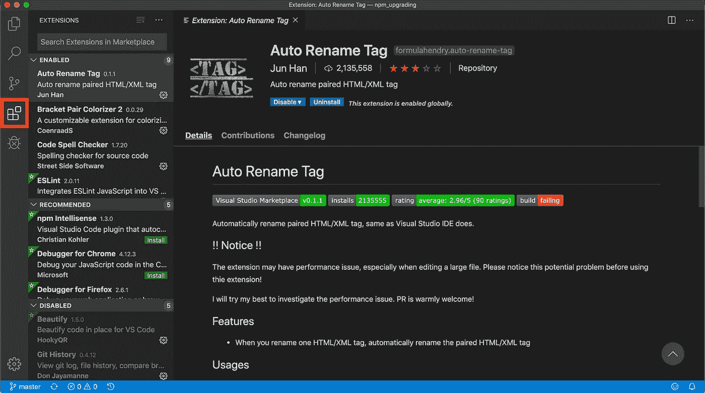

在左侧面板上，有三个插件区域:启用、推荐和禁用。在此之上，你可以搜索任何你想象的插件。真的！在这里，我将列出我最喜欢的 10 个插件。

# 首先，这里有一些简单易用的插件

## 自动重命名标签

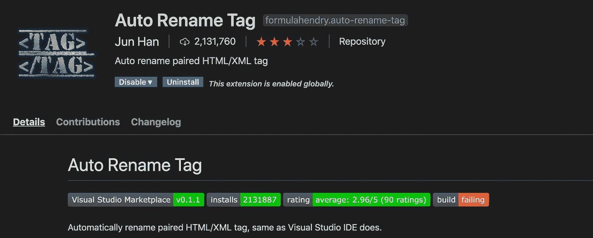

自动重命名标签自动重命名成对的 HTML/XML 标签。它可以更改开始标记或结束标记，然后相应的标记被更改以进行匹配。

这个插件启用后，就不会再有不匹配的标签了。它还节省了重复键入开始和结束标记的工作量。它完美地工作。

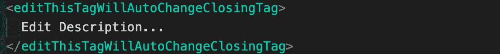

## 括号对着色程序 2

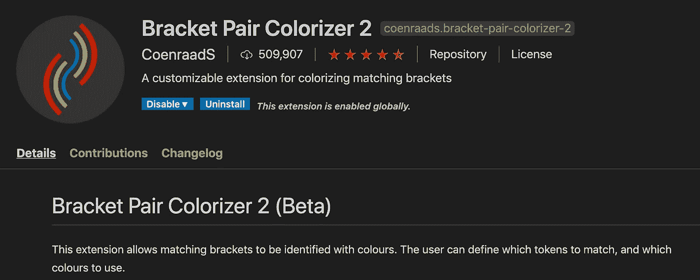

括号对着色程序 2 通过使用相同的颜色显示匹配的括号。这有助于识别左括号和右括号。

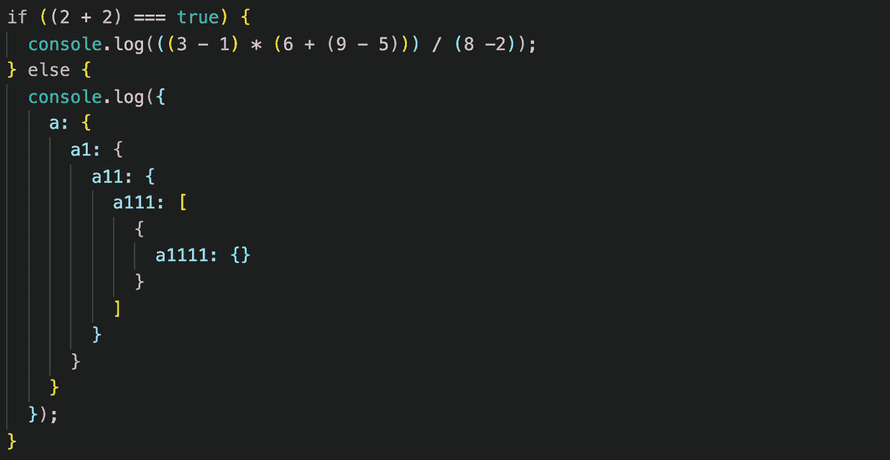

## 缩进-彩虹

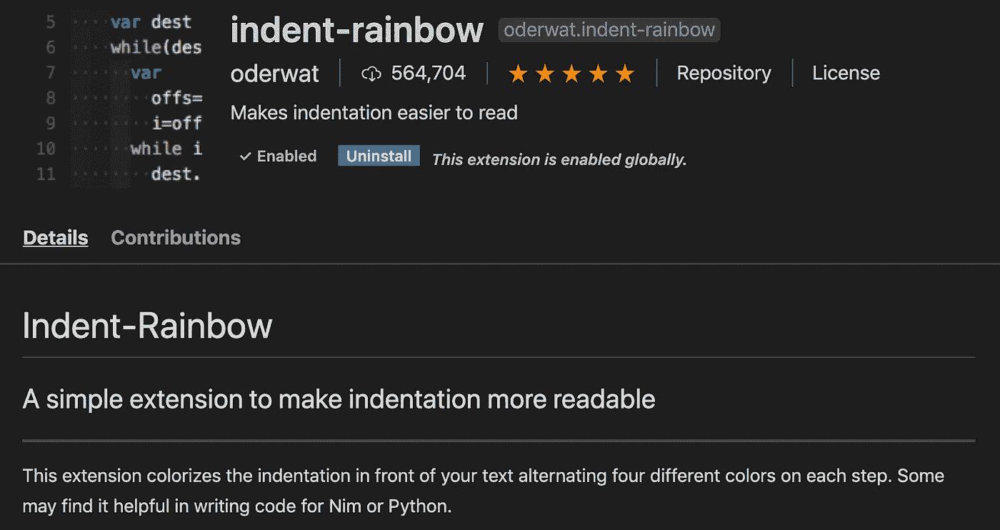

缩进-彩虹为文本前面的缩进着色，每一步交替四种不同的颜色。这有助于提高缩进的可读性。

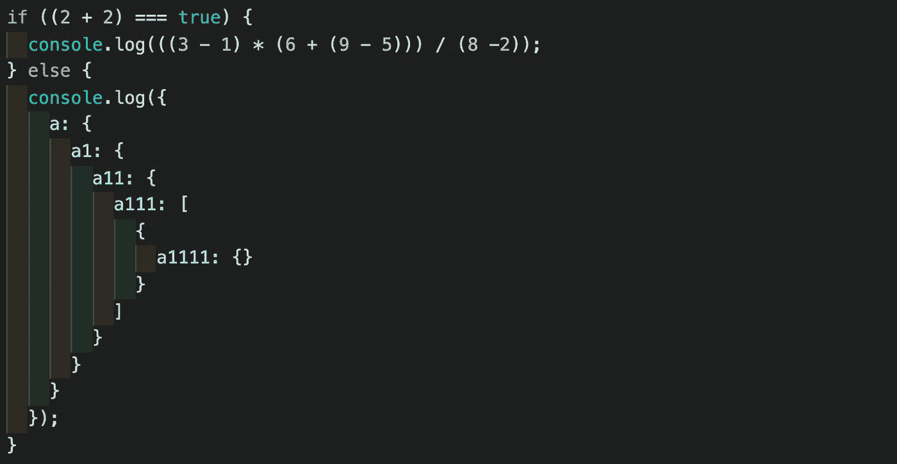

结合括号对着色 2 和缩进彩虹使你的代码更具可读性。

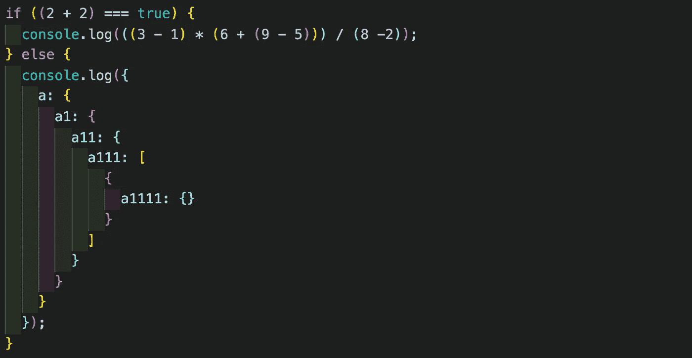

## 代码拼写检查器

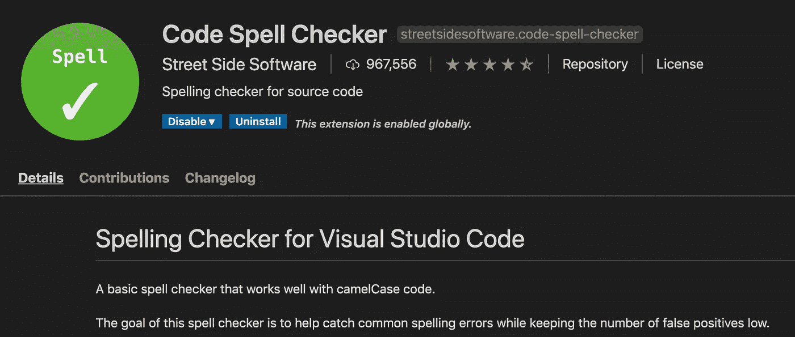

代码拼写检查器是一个拼写检查器，考虑 camelCase 代码。蓝色下划线清楚地表明哪些单词需要纠正。


如果您想将下面的“unmount”视为正确拼写，您可以右键单击将其添加到用户(全局)字典或文件夹(本地)字典。

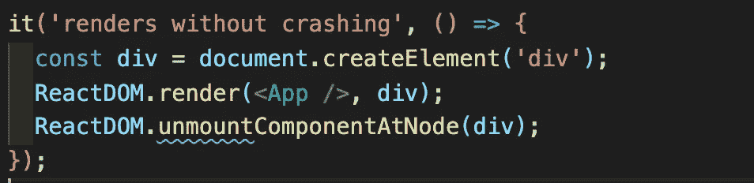

## 排序 JS 对象键

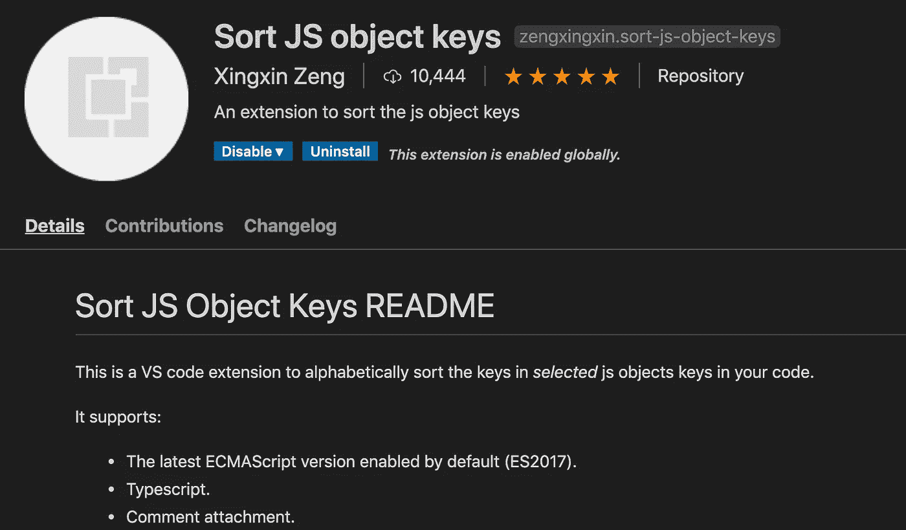

Sort JS object keys 是一个按字母顺序对选定 JavaScript 对象的键进行排序的工具。它可以按正常顺序或相反顺序对键进行排序。

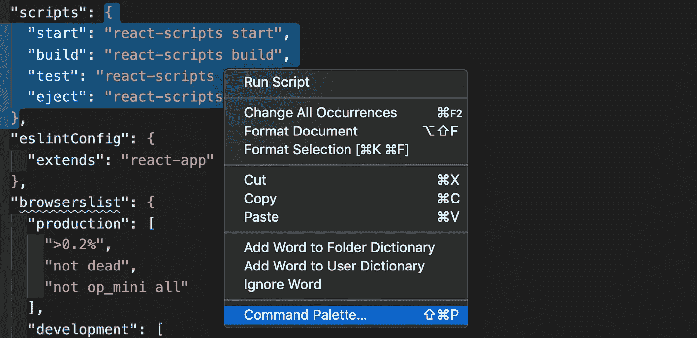

这是如何使用它:

1.在源代码中选择一个 JavaScript 对象，从`{`开始，到`}`结束，比如上面例子中`“scripts”`的定义。

2.右键单击选择以显示“命令调板…”

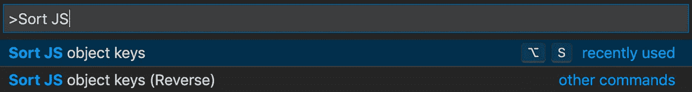

3.运行“排序 JS 对象键”正常排序键(快捷键:Option+S)，运行“排序 JS 对象键(Reverse)”以逆序排序键。

使用快捷键+S 可以简化步骤 2-3。

# 重物

你现在感受到插件的力量了吗？我们来看看几个重量级的。

## 埃斯林特

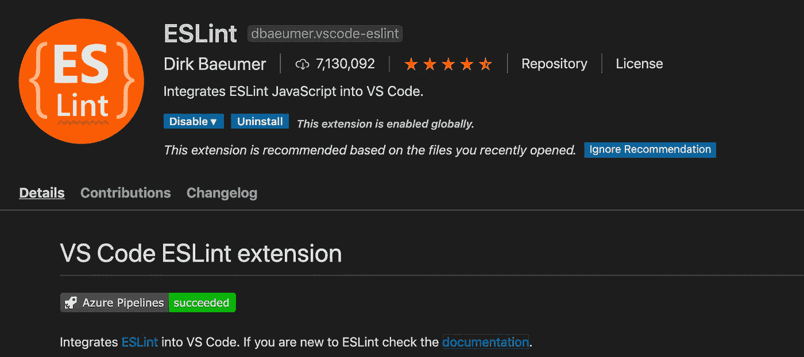

linter 是一个静态代码分析工具，用于识别 JavaScript 代码中的问题模式。ESLint 是最受欢迎的棉绒。它很容易扩展，并带有大量的自定义规则。它有最好的 ES6 支持。

请查看 vscode-eslint 的[官方文档。](https://github.com/microsoft/vscode-eslint)以下是如何让 ESLint 发挥作用的步骤:

1.  用多个选项设置`.vscode/settings.json`中的自动修复选项。

以下设置为所有提供程序打开自动修复，包括 ESLint:

```
"editor.codeActionsOnSave": {
  "source.fixAll": true
}
```

相比之下，此配置仅针对 ESLint 打开它:

```
"editor.codeActionsOnSave": {
  "source.fixAll.eslint": true
}
```

您也可以通过以下方式有选择地禁用 ESLint:

```
"editor.codeActionsOnSave": {
  "source.fixAll": true,
  "source.fixAll.eslint": false
}
```

2.建立一个 [ESLint 配置](https://eslint.org/docs/user-guide/configuring)，可以是`.eslintrc.*`文件的形式，也可以是`package.json`文件中的`eslintConfig`字段。以下是。`eslintrc.json`来自[汇总](https://github.com/rollup/rollup)的示例。

```
{    
  "root": true,    
  "rules": {        
    "indent": [ 2, "tab", { "SwitchCase": 1 } ],        
    "semi": [ 2, "always" ],        
    "keyword-spacing": [ 2, { "before": true, "after": true } ],        
    "space-before-blocks": [ 2, "always" ],        
    "no-mixed-spaces-and-tabs": [ 2, "smart-tabs" ],        
    "no-cond-assign": 0,        
    "no-unused-vars": 2,        
    "object-shorthand":  [ 2, "always" ],        
    "no-const-assign": 2,        
    "no-class-assign": 2,        
    "no-this-before-super": 2,        
    ***"no-var": 2,* **       
    "no-unreachable": 2,        
    "valid-typeof": 2,        
    "quote-props": [ 2, "as-needed" ],        
    "one-var": [ 2, "never" ],        
    "prefer-arrow-callback": 2,        
    "prefer-const": [ 2, { "destructuring": "all" } ],          
    "arrow-spacing": 2    
  },    
  "env": {        
    "es6": true,        
    "browser": true,        
    "node": true    
  },    
  "extends": [        
    "eslint:recommended",        
    "plugin:import/errors",        
    "plugin:import/warnings"    
  ],    
  "parserOptions": {        
    "ecmaVersion": 6,        
    "sourceType": "module"    
  },    
  "settings": {        
    "import/ignore": [ 0, [            
      "\\.path.js$"        
    ] ]    
  }
}
```

上面这个配置有一个 ESLint 规则:`“no-var”: 2`。

然后在 VS 代码中，`“var a = 1;”`加下划线表示有问题。如果您将光标悬停在该行上，它会显示问题描述并为您提供快速修复选项。

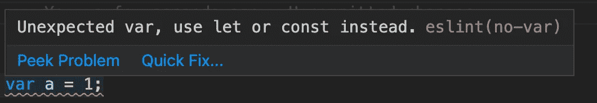

根据您的`.vscode/settings.json`选项，问题可能会自动修复为`“const a = 1;”`。这不是很好吗？

*   TSLint 不在我的名单上。虽然它是一个识别和报告错误并强制执行 TypeScript 约定的工具，但它已经被弃用了。推荐的方式是使用 ESLint 的 TypeScript 支持，`typescript-eslint`。
*   更漂亮也不在我的名单上。更漂亮的是格式化程序。它扫描文件的样式问题，并自动重新格式化代码，以确保遵循一致的规则，如缩进、间距、分号、单引号和双引号等。推荐的方式是使用 ESLint 比较漂亮的支持，`eslint-plugin-prettier`。

## 玩笑

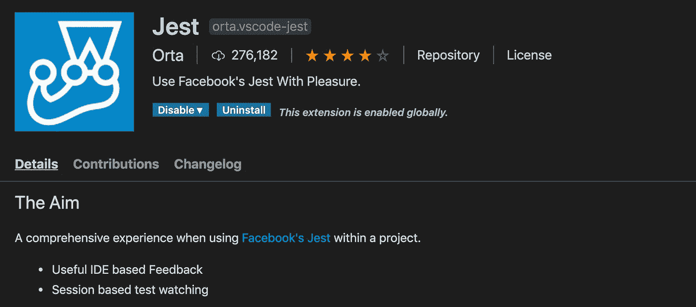

Jest 是 Babel、TypeScript、Node.js、 [React](https://reactjs.org/) 、Angular 或 Vue.js 项目使用的流行测试框架。它的目标是开箱即用，无需配置。

[Jest 插件](https://github.com/jest-community/vscode-jest)自动运行并在底部栏显示测试状态(见红框)。对于测试用例，它为通过的测试用例显示一个绿色的复选标记。

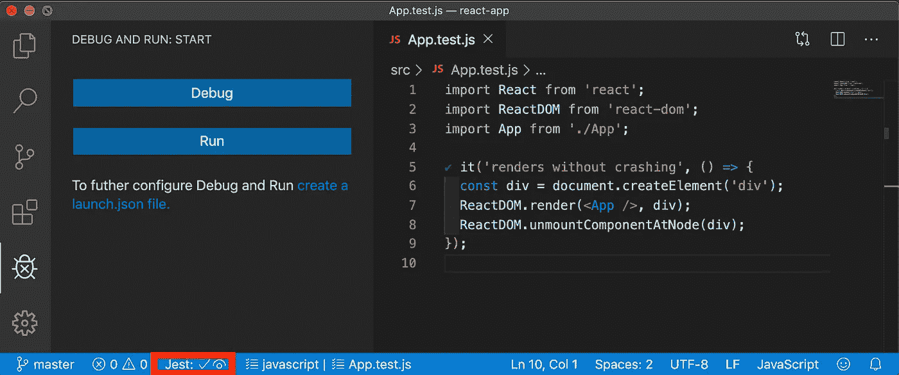

左边的面板显示了调试或者运行测试用例的菜单。

现在，将标签从`App`更改为未定义的`App1`。底部栏上的测试状态已更新，绿色复选标记变为红色 x。

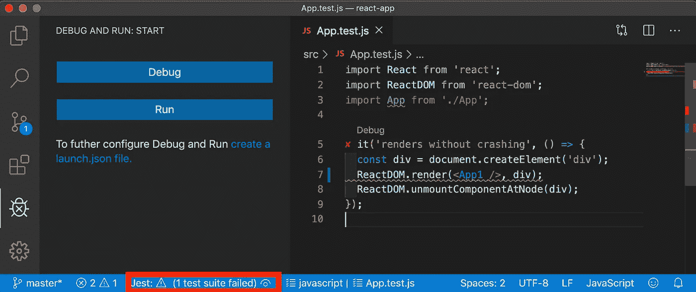

还有一个调试链接显示了上面失败的测试。这个链接是调试失败的测试用例的快捷方式。

“[如何使用 VS 代码调试单元测试用例](https://medium.com/better-programming/how-to-use-vs-code-to-debug-unit-test-cases-6aebfd7021bd)”对如何使用它给出了更深入的描述。

## 吉特朗斯

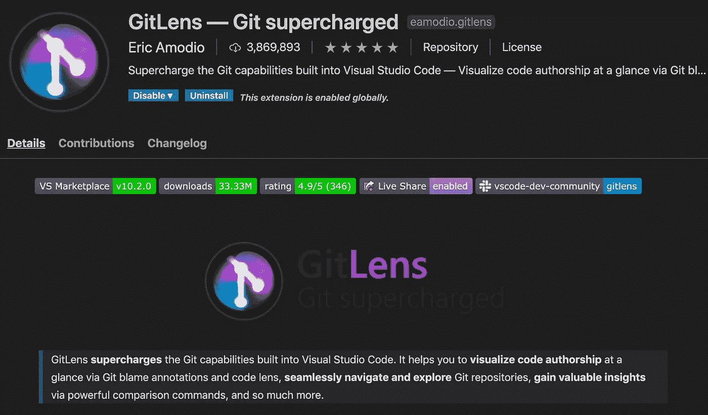

GitLens 支持除 VS 代码内置功能之外的额外 Git 功能。它帮助用户更好地理解代码，快速浏览一行或一个代码块何时以及为什么被修改——以及谁修改了它。

回顾历史，深入了解代码是如何以及为什么进化的。它允许毫不费力地探索代码库的历史和演变。《T2》的特色在它的官方网站上有很好的记录。

安装 GitLens 后，你会在左边找到这个 GitLens 按钮。如果你点击它，左边的面板会显示各种 Git 信息:存储库、文件历史、行历史等。如果你点击右边打开文件中的一行，它会显示错误信息。

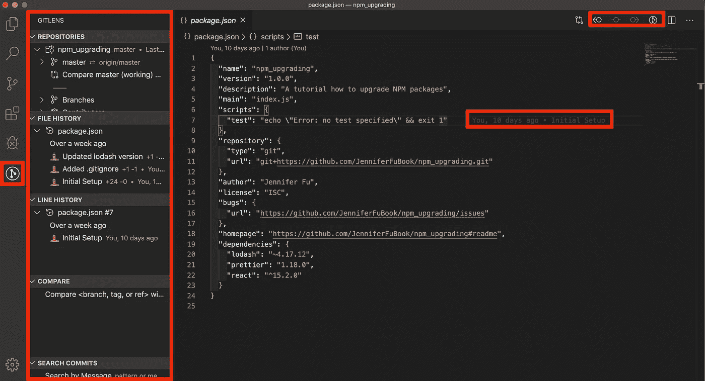

同样在 VS 代码的右上方，有一行 Git 命令。“切换文件责备注释”按钮是我的最爱之一。当它打开时，它显示 Git 日志信息。

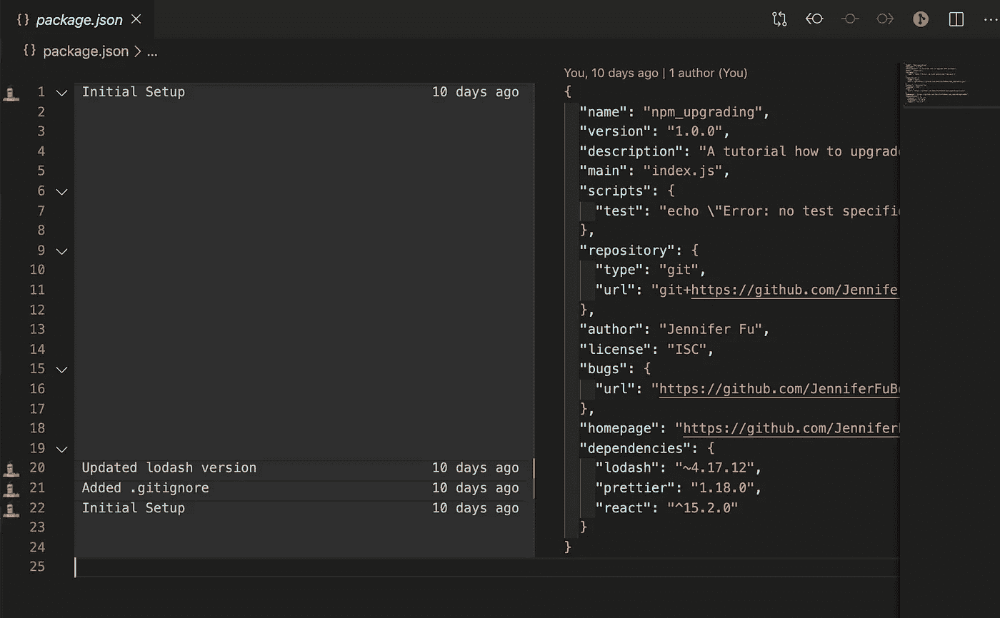

# 内置扩展

现在我们来看看 VS 代码的内置扩展，可以禁用但不能卸载。

通过搜索关键字“@bultin”或单击菜单项“… —>显示内置扩展”，可以列出一组内置扩展

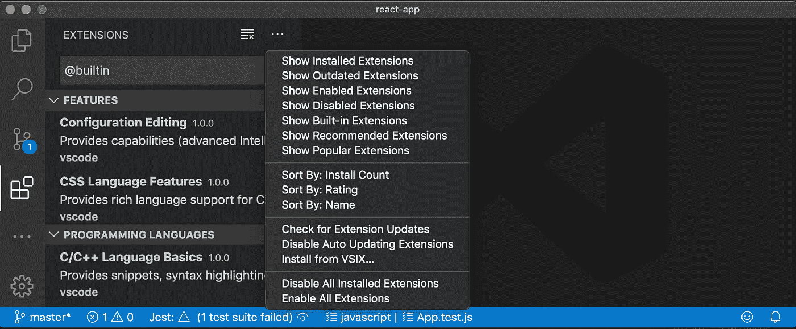

正如我们所说，GitLens 支持额外的 Git 功能。有哪些内置的 Git 功能？

## 饭桶

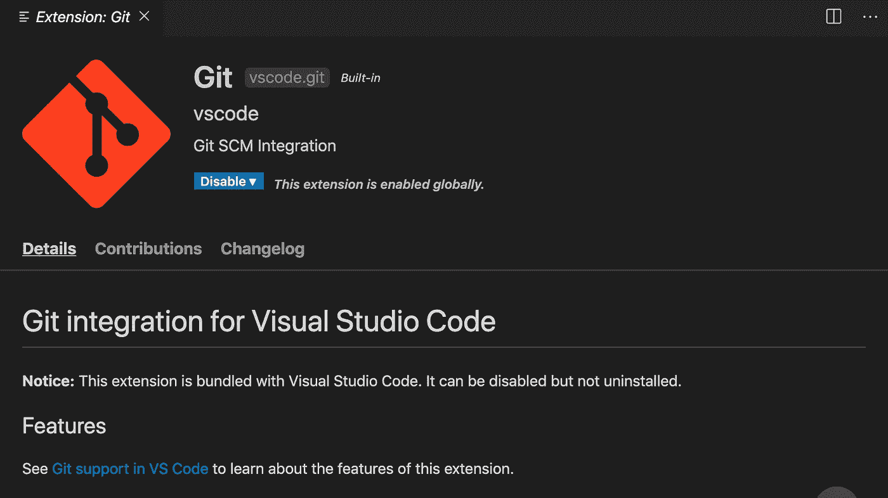

Git 支持基本的 Git 功能。在下面截图的底部，显示了当前分支的名称、脏指示器以及当前分支的传入和传出提交的数量。您可以通过点击状态指示器并从列表中选择 Git 引用来签出您存储库中的任何分支。

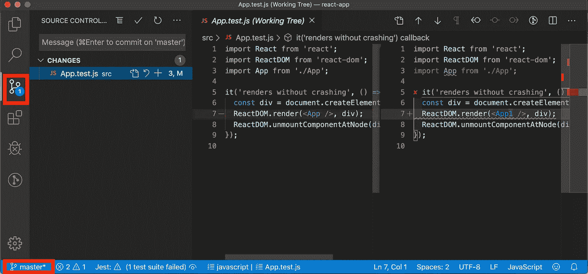

左边的 source-control 按钮显示了您的存储库中当前有多少变更的概述。选择此按钮，将显示当前存储库更改的详细信息:更改、暂存更改和合并更改。单击每个项目将详细显示每个文件中的文本更改。

关于 Git 对 VS 代码支持的细节，你可以查看[官方网站](https://code.visualstudio.com/docs/editor/versioncontrol#_git-support)。

## **Markdown 语言特性**

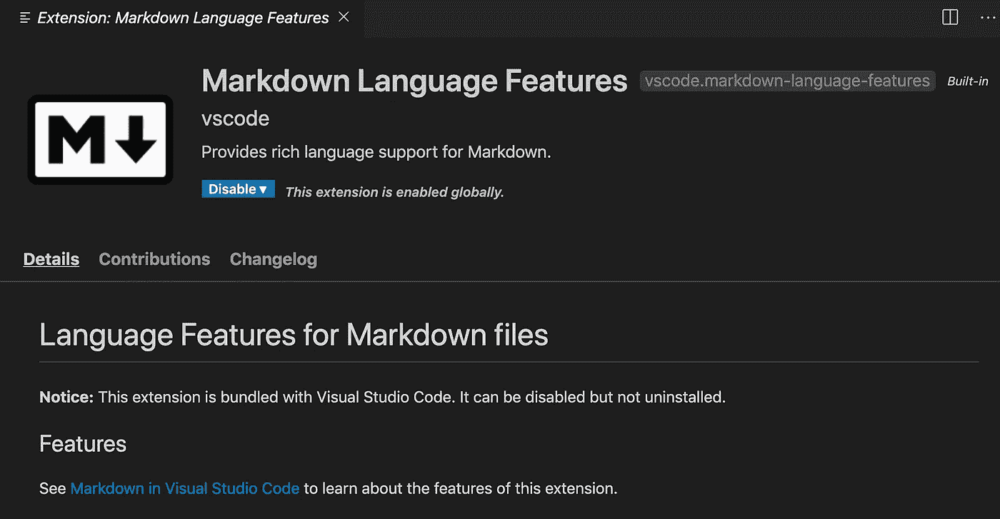

Markdown Language Features 是一种具有纯文本格式语法的轻量级标记语言。特定的输入可以转换成多种输出格式，通常是 HTML 格式。使用扩展名`.md`格式化自述文件很有帮助。更多详情，请点击查看[。](https://code.visualstudio.com/docs/languages/markdown)

它可以在几个步骤中使用:

1.选择一个`*.md`文件。

2.右键单击显示文件以显示命令选项板。

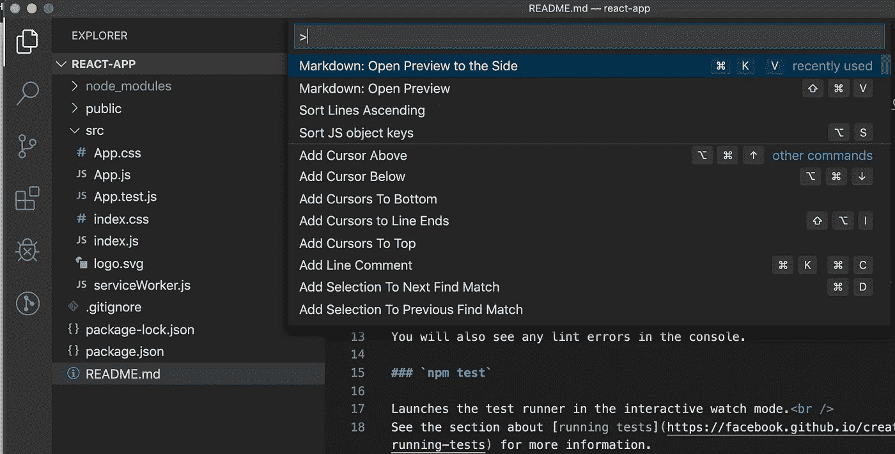

3.运行“Markdown:在侧面打开预览”打开预览和文件。在输入时，VS 代码自动同步 Markdown 编辑器和旁边的预览窗格。

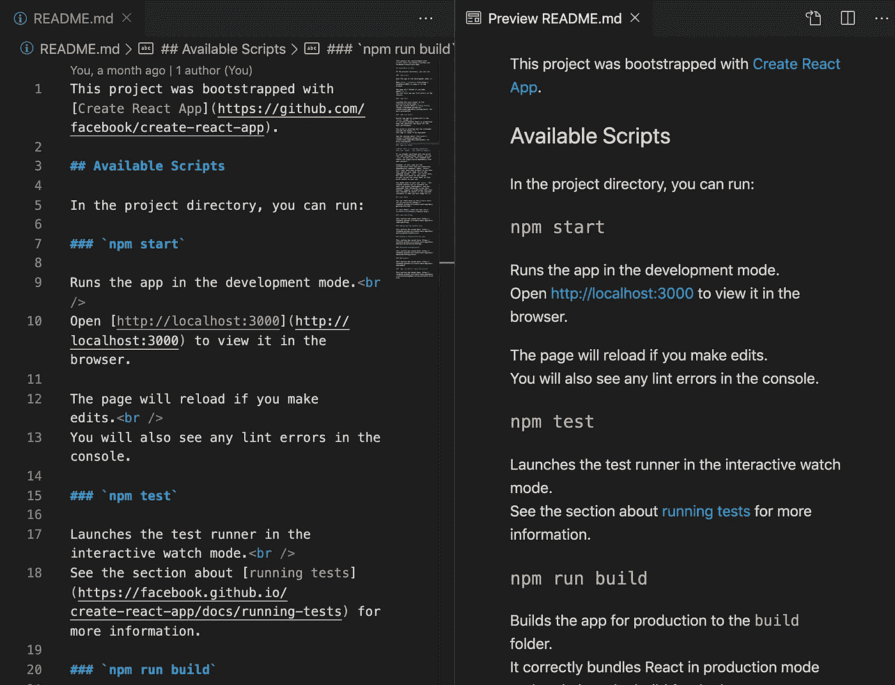

我玩这些 VS 代码插件玩得很开心。你为什么不给他们一个尝试？

# 结论

感谢阅读。我希望这有所帮助。你可以在这里看到我的其他媒体出版物。