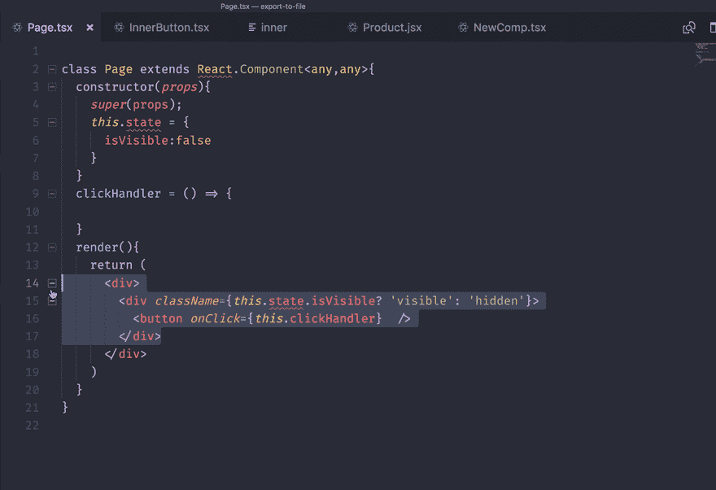
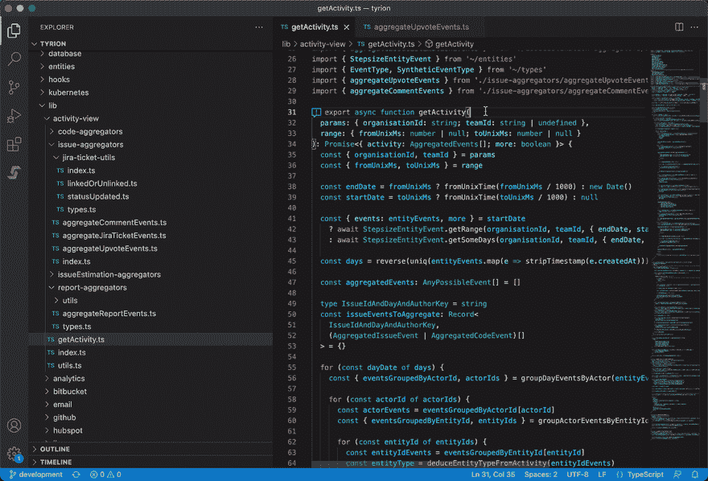
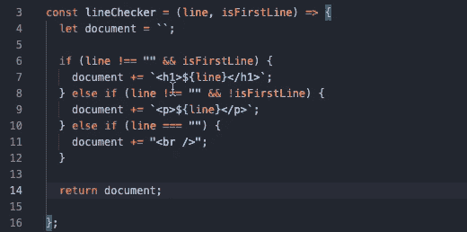
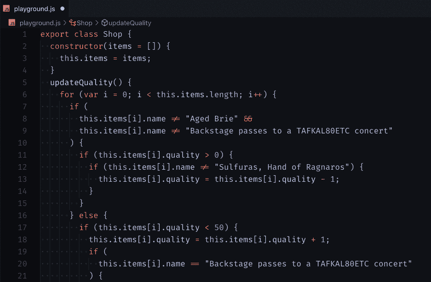
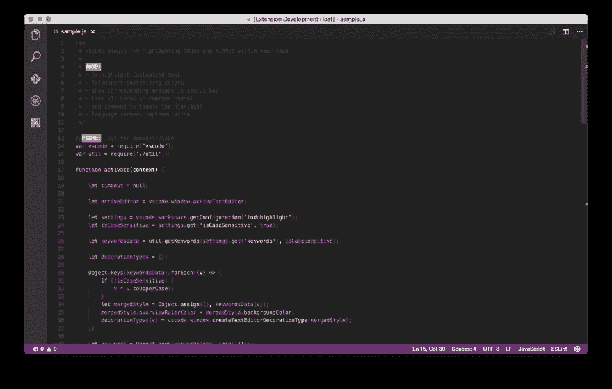
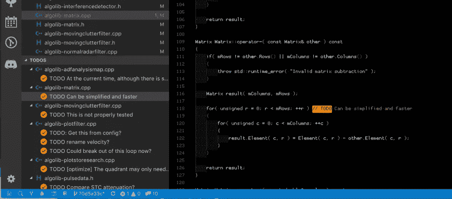
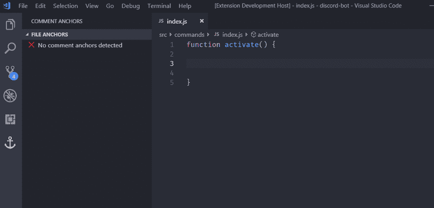
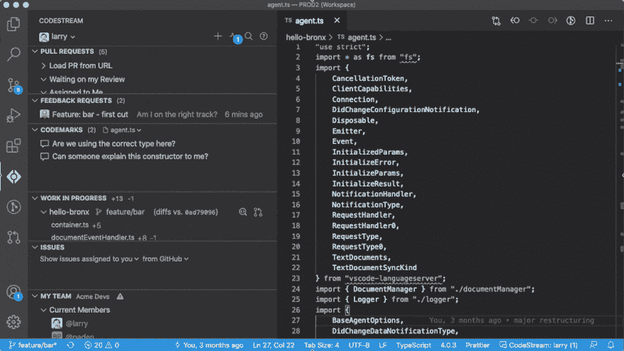
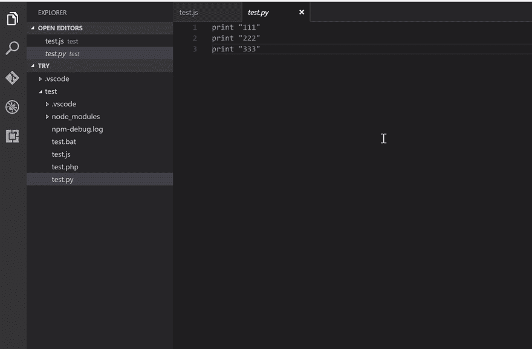

# 10 VS 代码扩展对抗技术债务

> 原文：<https://betterprogramming.pub/10-vs-code-extensions-to-fight-technical-debt-b76c41be33f7>

## 重构、自动化和提高团队生产力

由于技术债务，许多工程团队陷入困境，无法快速交付高质量的软件。

我交谈过的最好的工程团队使用正确的工具持续重构代码，改进他们的代码库交流，并解决技术债务。

这里有 VS 代码扩展可以帮助你做到这一点。

# **重构和技术债务工具**

## 1.[拾遗](https://marketplace.visualstudio.com/items?itemName=wix.glean)

Glean 为您的 React 代码库提供了重构工具:将 JSX 提取到一个新组件中，将类组件转换为功能组件，用钩子进行包装。它允许将 JSX 提取到新组件中，将类组件转换为功能组件，反之亦然，用条件包装 JSX，同时重命名状态变量及其设置器，等等。

## 2.[步长](https://www.stepsize.com/r/vscode?utm_medium=medium&utm_source=referral&utm_campaign=technical%20debt)

我们的团队专门为工程团队构建了 Stepsize，用于直接在 VS 代码编辑器中跟踪技术债务并对其进行优先级排序。

Stepsize 是一个健康代码库的编辑优先问题跟踪器。它允许工程团队:

*   直接从编辑器中创建和查看代码问题
*   跟踪和优先考虑代码改进，如技术债务
*   借助我们的吉拉集成，为您的冲刺添加关键问题

## 3. [JavaScript 助手](https://marketplace.visualstudio.com/items?itemName=p42ai.refactor)

JavaScript 助手将帮助您编写现代、清晰、简洁的代码。它为 JavaScript 和 TypeScript 提供了 48 个自动重构、清理和操作。

## 4. [Abracadabra，重构这个！](https://marketplace.visualstudio.com/items?itemName=nicoespeon.abracadabra&ssr=false#overview)

有了 Abracadabra，你可以在 VS 代码中快速安全地重构现有代码。

VS 代码附带了一些基本的重构。Abracadabra 为你的编辑器提供了快捷方式，可以立即触发最有用的编辑器，快速修复，在适当的时候提出重构建议，根据你的需要定制 UX 的选项，以及可以使用的重构。js，。jsx，。ts，。tsx 和。vue 文件。

# **待办事项和评论**

## 5.[待办事项高亮显示](https://marketplace.visualstudio.com/items?itemName=wayou.vscode-todo-highlight)

如果你喜欢用 TODO 和 FIXME 标签来标记代码段，但是总是忘记它们，那么这个插件将会解决你的问题。它突出显示代码中的 TODO 或 FIXME 短语，以便您不会忘记您想要修复或改进的内容。

## 6.[待办事项树](https://marketplace.visualstudio.com/items?itemName=Gruntfuggly.todo-tree)

Todo 树扩展将分散在应用程序中的所有任务收集到编辑器工作区左侧的一个树中。您可以在工作区中快速搜索注释标记，如 TODO 和 FIXME，并在树视图中查看它们。

## 7.[评论主播](https://marketplace.visualstudio.com/items?itemName=ExodiusStudios.comment-anchors)

注释锚点允许您在注释或字符串中放置锚点，以便在代码的上下文中放置书签。锚点可用于跟踪待办事项、写笔记、创建可折叠部分，或构建简单的导航，使浏览文件更加容易。

可以使用易于使用的侧边栏查看当前文件或整个工作区的锚点。

Comment Anchors 提供了许多配置选项，允许您根据自己的工作流程定制这个扩展，并提高工作效率。

## 8.[新遗迹码流](https://marketplace.visualstudio.com/items?itemName=CodeStream.codestream)

New Relic CodeStream 是一个开发者协作平台，它将基本的开发工具集成到 VS 代码中。通过在 IDE 中放置协作工具，消除上下文切换并简化代码讨论和代码审查。

*   创建和审查 GitHub 和 GitLab 拉请求
*   通过 PR 前代码评审获得有关工作进展的反馈
*   代码讨论和评论

# **自动化**

## 9.[索纳林](https://marketplace.visualstudio.com/items?itemName=SonarSource.sonarlint-vscode)

SonarLint 让您在编码问题出现之前就对其进行修复:SonarLint 就像拼写检查器一样，在您编写代码时突出显示错误和安全漏洞，并提供清晰的修复指导，因此您甚至可以在代码提交之前就对其进行修复。VS 代码中的 SonarLint 支持 JavaScript、TypeScript、Python、Java、HTML & PHP 代码的分析。

## 10.[代码运行器](https://marketplace.visualstudio.com/items?itemName=formulahendry.code-runner)

运行多种语言的代码片段或代码文件，如 C、C++、Java、JavaScript、PHP、Python、Perl、Perl 6、Ruby、Go 等等。

*   运行当前活动文本编辑器的代码文件
*   通过文件资源管理器的上下文菜单运行代码文件
*   在文本编辑器中运行选定的代码段

感谢阅读。