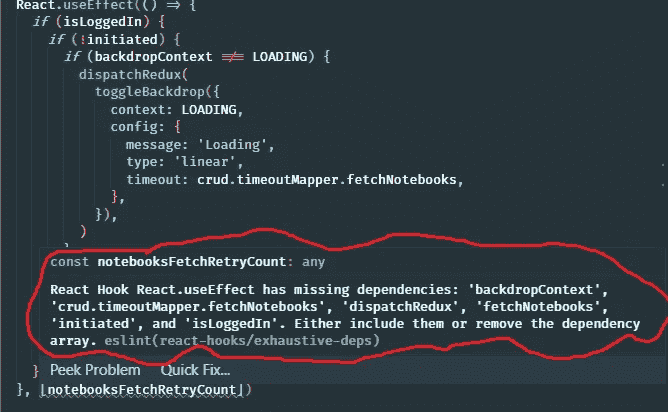
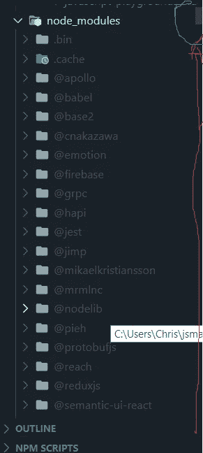
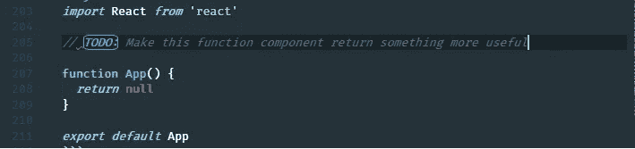
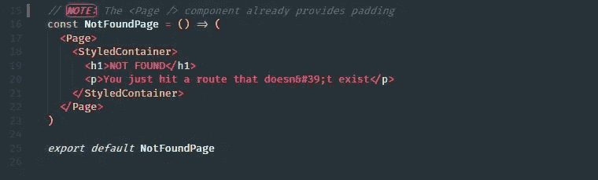
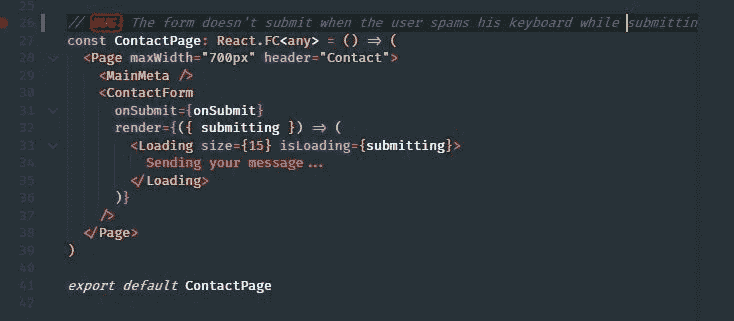
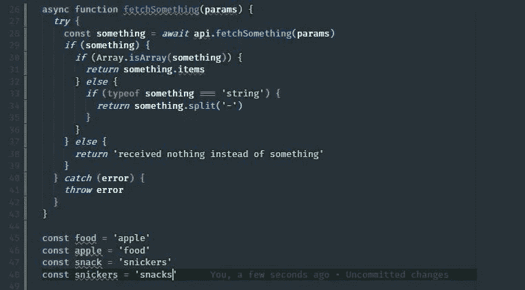
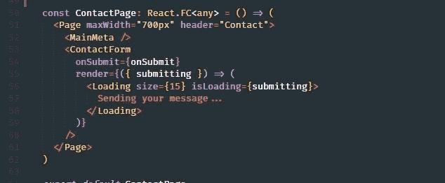
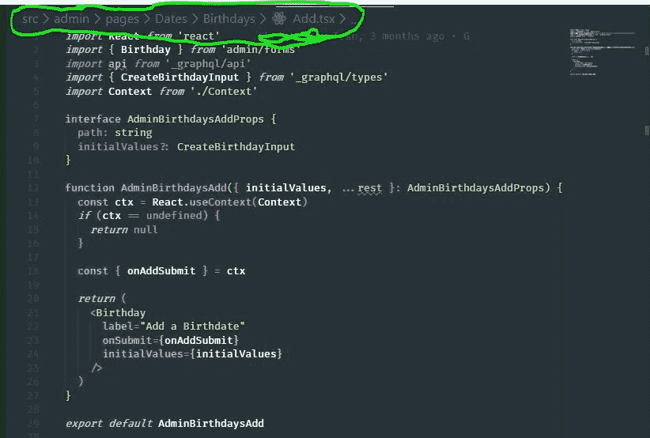

# 加速 React 开发流程的 10 个 VSCode 实践

> 原文：<https://betterprogramming.pub/10-vscode-practices-to-speed-up-your-react-development-flow-81252a3587ff>

## 利用像这样的开放机会


*Unsplash 上 Roman Synkevych 的照片*

如果你是一个 Visual Studio 代码用户，并且喜欢在 React 中开发项目，那么你可能已经经历过许多令人讨厌的重复代码，比如`React.useState`、`React.useContext`、`React.useReducer(reducer, initialState)`等等。

这些单独的键分散在键盘上的各个不同方向，让我们可怜的小手指在我们所有的 React 项目中一遍又一遍地写这些字符会变得令人恼火。

如果你在键盘上输入`React.useState`，你的指尖会指向以下方向:


对于这个简单的问题，我可能表现得有些夸张，但我对这篇文章的观点不是关于击键。当我们今天用 React 开发应用程序时，它是关于击键*和许多其他事情*。我明白了，我们应该尽可能地利用一切可以利用的机会来减轻不必要的压力，因为我们的健康和时间都很宝贵。

也就是说，我想花时间写这篇文章，通过告诉你加速 React 开发流程的有用方法，来帮助 React 开发人员找到节省尽可能多的时间和精力的方法。

# 1.扩展:用户片段

随着 React 的发展，我看到了许多伟大的事情发生，而[用户片段](https://code.visualstudio.com/docs/editor/userdefinedsnippets)就是其中之一。

这个方便的 VSCode 扩展允许您定义自己的自定义代码片段，您只需按几个字母就可以在整个项目中无限次地重复使用。

我在一家使用 React 构建平台的公司工作，令我惊讶的是，有些人在 React 中开发时甚至不知道这个特性的存在。

那么它是做什么的呢？

这个特性允许您创建任何自定义代码片段，您只需键入几个字母(您用自定义前缀声明)就可以在您的代码上生成。

例如，当我们创建一个将要使用`React.useReducer` API 的新组件时，我们可能至少要声明一个初始状态、一个 reducer 函数和类似`[state, dispatch] = React.useReducer(reducer, initialState)`的东西来实现它:

```
const initialState = {
  *//*
}function reducer(state = initialState, action) {
  switch (action.type) {
    default:
      return state
  }
}function MyComponent() {
  const [state, dispatch] = React.useReducer(reducer, initialState) return <div />
}
```

通过将这些内容放入您的用户代码片段，您可以节省宝贵的时间和精力:

你只要按下`rsr`，这段代码就会自动为你写出来。

以下是我喜欢在我的 React 项目中使用的一些常见片段:

通过给 CSS 元素临时边框来快速测试它们看起来是否正确:

```
{
  "border test": {
    "prefix": "b1",
    "body": "border: 1px solid red;"
  },
  "border test2": {
    "prefix": "b2",
    "body": "border: 1px solid green;"
  },
  "border test3": {
    "prefix": "b3",
    "body": "border: 1px solid magenta;"
  },
  "border test4": {
    "prefix": "b4",
    "body": "border: 1px solid blue;"
  },
  "border test5": {
    "prefix": "b5",
    "body": "border: 1px solid #fe7200;"
  }
}
```

在每个项目中，我通常都有一个包含通用原始组件的`components`文件夹，例如`Button`:

```
{
  "import Button from 'components/Button'": {
    "prefix": "btt",
    "body": "import Button from 'components/Button'"
  }
}
```

每次测试前设置/清理一些东西:

```
{
  "beforeEach(() => {})": {
    "prefix": "bfe",
    "body": ["beforeEach(() => {", "  $1", "})"]
  }
}
```

一些快速线路禁用器:

```
{
  "// @ts-ignore": {
    "prefix": "tsg",
    "body": "// @ts-ignore"
  },
  "eslint disable line": {
    "prefix": "eds",
    "body": "// eslint-disable-line"
  }
}
```

导入反应:

```
{
  "import react": {
    "prefix": "reaa",
    "body": "import React from 'react'"
  }
}
```

这并不是我使用的代码片段的完整列表，但是我希望它能帮助您理解通过利用用户代码片段可以节省多少时间和精力。

**奖励:**使用[项目片段](https://marketplace.visualstudio.com/items?itemName=rebornix.project-snippets)将其提升一个级别，这是一个 VSCode 扩展，除了在工作区级别*提供相同的功能。*

# 2.扩展:更漂亮

如果你没有用更漂亮的，那么请，我求你，放下一切，用它。

# 3.扩展+包:TypeScript + ESLint

大约四年前，当 Promises 正式进入 [ECMAScript 2015 规范](http://www.ecma-international.org/ecma-262/6.0/)时，React 生态系统正在蓬勃发展，革命性的技术改变了我们今天开发 web 应用的方式。

当时，TypeScript 是其中之一，因为它正在进入 React 生态系统，并逐渐在社区中被广泛采用。而且理由很充分！

TypeScript 是一个如此强大的工具，它可以让你在潜在的错误有机会发生之前节省大量的时间和精力。

除了它[通常提供的特性](https://www.typescriptlang.org/index.html)之外，它还有助于记录你的 React 组件，防止将来的错误发生，并教会你很多关于 JavaScript 语言本身的知识，而你不必花一分钱在电子书上学习这种语言中的奇怪东西。

在 react 项目中采用带有 ESLint 的 TypeScript 将在我们忘记 React 如何工作的情况下对您有所帮助:



# 4.快捷方式:向上/向下复制行

`Ctrl + D`会节省你很多时间。

# 5.快捷方式:查找当前文件中的所有匹配项

突出显示文件中您选择的关键字并按 Ctrl+Shift+L 将选择该关键字的所有匹配项。

当您想要重命名一个组件时，这是很有用的，因为很明显，当一个组件有子组件时，我们总是至少出现三次:

```
import React from 'react'function App() {
  return <h2>Useful content</h2>
}function Root() {
  return (
    <App>
      <p>Will I even be rendered?</p>
    </App>
  )
}
```

如果我们想将`App`重命名为其他名称，我们必须选择组件声明以及`Root`渲染块中的两个实例。

# 6.快捷方式:在项目中查找文件

当你寻找一个特定的文件时，不得不一直使用文件资源管理器很容易让人沮丧。当您想要分析 node_modules 目录中的文件时，这就成了一个大问题，因为 VSCode 会这样做:



红线表示还有多少内容可以滚动，蓝线表示滚动条的大小(滚动条会随着内容的增加而缩小)。这在扩展时会影响性能。

通过搜索文件名称，您可以轻松找到并打开位于项目中任何位置的文件，而无需移动鼠标一毫米。

只需按 Ctrl+T，输入文件名。你就完了。

# 7.扩展:自定义待办事项突出显示

这是一个有趣的扩展，但随着时间的推移，它已经成为我在严肃环境中的一个非常强大的工具。

首先，在某个地方写下待办事项是非常重要的:它可以在 Evernote 应用程序上，你的作文本上，一张撕掉的纸上，等等。

如果你像我一样使用[来突出显示](https://marketplace.visualstudio.com/items?itemName=wayou.vscode-todo-highlight)，你就是在注释中把待办事项放在你正在写的代码上面。TODO Highlight 扩展非常有用，因为当你在一行前面加上`TODO:`时，你的待办事项在屏幕上变成了彩色编码，如下所示:



但是，当您开始创建自己的自定义关键词并为其添加颜色效果时，TODO Highlight 的威力开始大放异彩:



这已经成为一个很有价值的功能，因为我能够很快重新获得焦点，并且理解每个文件中发生的事情，不管我回到哪里。

我最喜欢的`todohighlight`关键词是`BUG:`，因为它是红色的。我们通常将红色与错误或危险的东西联系在一起，所以这很容易引起我对代码中关键部分的注意:



# 8.扩展:Visual Studio 市场中任何酷的主题

结合一个很酷的 VSCode 颜色主题来开发 React 应用程序是让我开心的一个重要资产，这导致了更高质量的代码。

使用您喜欢的主题非常重要，因为 React 组件的颜色代码具有特定的外观或感觉，这将有助于您更轻松地开发 React 应用程序，如下所示:

非组件:



组件:



# 9.扩展:[ES7 React/Redux/graph QL/React-Native 片段](https://marketplace.visualstudio.com/items?itemName=dsznajder.es7-react-js-snippets)

这对你会很有帮助。

我个人不再用这个了，因为我用自己的片段。但是在过去，它对我的开发工作流程产生了巨大的积极影响。

# 10.功能:面包屑

伙计，时间过得真快。当[面包屑](https://code.visualstudio.com/updates/v1_26)在 VScode 中发布的时候，感觉就像昨天一样。

这让我在 React 开发时更加轻松，甚至在我最不期望的时候。

鉴于 React 的组件子/父层次结构的性质，这恰好在 React 中开发时进行得很好(只要您根据层次结构构建了目录结构)，因为它基本上向您显示了一个组件文件是从父目录派生的(在我的大多数情况下，它总是一个默认从`index.tsx`文件导出的组件):



上面的面包屑告诉我，`Add`是`Birthdays`的子节点，是`Admin`组件中的一个路由。

默认情况下，面包屑是启用的。但是重点是不要把面包屑功能想当然。它会以意想不到的方式无声无息地变得有用，所以把你更多的注意力放在它上面。

**奖励:**一些[面包屑的提示和窍门，](https://vscode.pro/tip/16/)给感兴趣的。

# 结论

这部分就结束了。我希望你发现这是有价值的，并期待在未来更多！