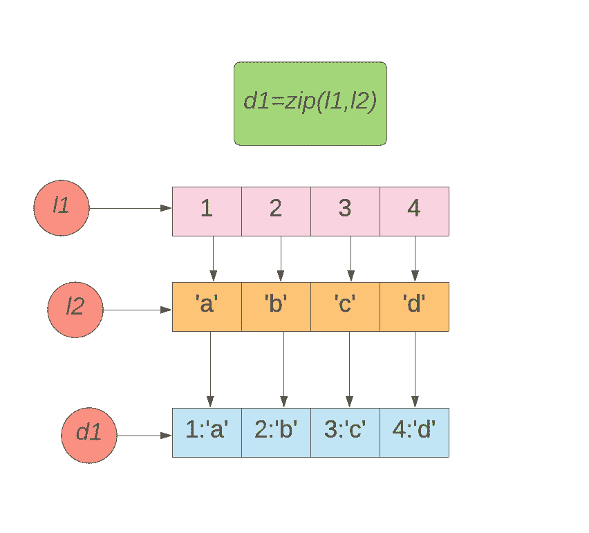
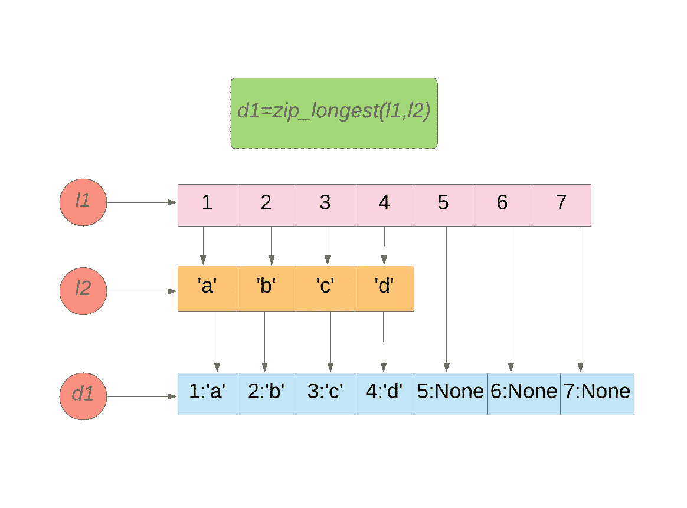
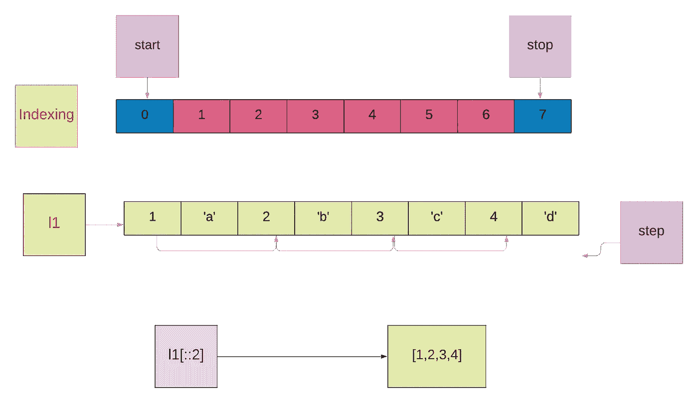
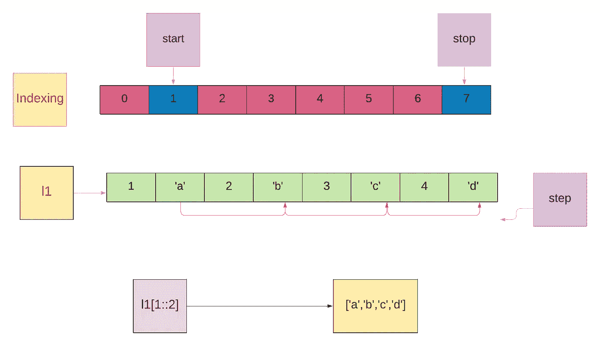

# 用 Python 将列表转换成字典的 10 种方法

> 原文：<https://betterprogramming.pub/10-ways-to-convert-lists-to-dictionaries-in-python-d2c728d2aeb8>

## 以您需要的形式获取数据


照片由 [Cristi Goia](https://unsplash.com/@cg?utm_source=unsplash&utm_medium=referral&utm_content=creditCopyText) 在 [Unsplash](https://unsplash.com/?utm_source=unsplash&utm_medium=referral&utm_content=creditCopyText) 上拍摄

# Python 数据结构

Python 列表和字典是 Python 中用来存储数据的两种数据结构。Python 列表是有序的对象序列，而字典是无序的。列表中的条目可以通过索引(基于它们的位置)来访问，而字典中的条目可以通过键而不是它们的位置来访问。

让我们看看如何将 Python 列表转换成字典。

## 将 Python 列表转换成字典的十种不同方法

1.  将元组列表转换为字典
2.  将两个相同长度的列表转换为字典
3.  将两个不同长度的列表转换为字典
4.  将可选键、值项的列表转换为字典
5.  将词典列表转换为单个词典
6.  使用 enumerate()将列表转换为字典
7.  使用字典理解将列表转换为字典
8.  使用 dict.fromkeys()将列表转换为字典
9.  使用字典理解将嵌套列表转换为字典
10.  使用 Counter()将列表转换为字典

# 1.将元组列表转换为字典

`dict()`构造函数直接从键值对序列构建字典。

```
*#Converting list of tuples to dictionary by using dict() constructor* color=[(**'red'**,1),(**'blue'**,2),(**'green'**,3)]
d=dict(color)
print (d)*#Output:{'red': 1, 'blue': 2, 'green': 3}*
```

# 2.将两个相同长度的列表转换为字典

我们可以使用`zip()`将两个长度相同的列表转换成字典。

`zip()`将返回元组的迭代器。我们可以使用**`dict()`构造函数将 zip 对象转换成字典。**

## **zip()**

**创建一个迭代器，聚合每个可迭代对象的元素。**

> **"`**zip**(**iterables*)` *:* 返回元组的迭代器，其中第 I 个元组包含来自每个自变量序列或可迭代对象的第 I 个元素。当最短的输入 iterable 用尽时，迭代器停止。使用一个可迭代的参数，它返回一个 1 元组的迭代器。如果没有参数，它将返回一个空迭代器。— Python [文档](https://docs.python.org/3.3/library/functions.html#zip)**

**示例:**

**使用 zip()**

****

**图片来源:作者**

# **3.将两个不同长度的列表转换为字典**

**我们可以使用`itertools.zip_longest()`将两个不同长度的列表转换成字典。**

**根据 [Python 文档](https://docs.python.org/3.8/library/itertools.html#itertools.zip_longest)**

> **"`zip_longest()` *:* 创建一个迭代器，从每个可迭代对象中聚合元素。如果 iterables 的长度不均匀，则用 fillvalue 填充缺少的值。迭代继续，直到最长的可迭代次数用完。在 zip()中，迭代继续进行，直到最短的可迭代次数用完。**

```
itertools.zip_longest(*iterables,fillvalue=None)
```

**使用`zip()`，迭代继续，直到最短的可迭代用尽。**

**使用 zip()**

**使用`zip_longest()`，迭代继续，直到****最长的可迭代次数用完。默认情况下，`fillvalue`就是`None`。******

******使用 zip_longest()******

************

******作者图片******

******`fillvalue`被提到为 *x* 。******

******使用 zip_longest()******

# ******4.将可选键、值项的列表转换为字典******

******我们可以使用切片将可选键、值的列表作为条目转换成字典。******

******切片返回一个新列表，其中包含列表中的一系列项目。我们可以指定一个索引范围。******

```
****s[i:j:k] — slice of *s* from *i* to *j* with step *k*****
```

******我们可以创建两个切片列表。第一个列表只包含键，下一个列表只包含值。******

```
****l1=[1,**'a'**,2,**'b'**,3,**'c'**,4,**'d'**]****
```

******从该列表创建两个切片对象。******

## ******第一个切片对象将只包含键******

******`l1[::2]`******

******`start`未提及。默认情况下，它将从列表的开头开始。******

******`stop`未提及。默认情况下，它会停在列表的末尾。******

******`stop`被提为 2。******

******`l1[::2]`使用步骤 2(可选元素)返回从头到尾包含元素的列表。******

```
****[1,2,3,4]****
```

************

******图片来源:作者******

## ******第二个切片对象将只包含值******

```
****l1=[1,**'a'**,2,**'b'**,3,**'c'**,4,**'d'**]****
```

******`l1[1::2]`******

******`start`被提为 1。它将从第一个索引开始切片。******

******`stop`未提及。它会停在列表的末尾。******

******`step`被提为 2。******

******`l1[1::2` ]使用步骤 2(可选元素)返回包含从第一个索引到末尾的元素的列表。******

```
****[**'a'**, **'b'**, **'c'**, **'d'**]****
```

************

******图片来源:作者******

******现在我们可以使用`zip()`函数合并这两个列表。******

****使用切片将列表转换为字典****

# ****5.将词典列表转换为单个词典****

****可以通过以下方式将字典列表转换为单个字典:****

*   ****`dict.update()`****
*   ****词典理解****
*   ****`Collections.ChainMap`****

## ****字典更新()****

****我们可以使用`dict.update()`将字典列表转换成单个字典。****

*   ****创建一个空字典。****
*   ****使用`for`循环遍历字典列表。****
*   ****现在使用`dict.update()`将每个条目(键值对)更新到空字典中。****

****使用 dict.update()****

## ****词典理解****

****字典理解由方括号`{}`组成，包含两个用冒号分隔的表达式，后跟一个`for`子句，然后是零个或多个`for`或`if`子句。****

```
**l1=[{1:**'a'**,2:**'b'**},{3:**'c'**,4:**'d'**}]
d1={k:v **for** e **in** l1 **for** (k,v) **in** e.items()}**
```

****`for e in l1` —返回列表中的每个项目`{1:’a’,2:’b’}`。****

****`for (k,v) in e.items()` —返回该项中的键、值对。`(1,’a’)`****

****`k:v` —在字典 d1 中更新****

****词典理解****

## ****收藏。链式地图****

****通过使用`collections.ChainMap()`，我们可以将字典列表转换为单个字典。****

****根据 [Python 文档](https://docs.python.org/3/library/collections.html#collections.ChainMap)****

> ****"`ChainMap` ***:*** 链映射将多个字典或其他映射组合在一起，以创建单个可更新的视图。"****

****返回类型将是`ChainMap object`。我们可以使用`dict()` 构造函数转换成字典。****

# ****6.使用 Enumerate()将列表转换为字典****

****通过使用`enumerate()`，我们可以将一个列表转换成一个以索引为关键字，列表项为值的字典。****

****`enumerate()` 将返回一个枚举对象。****

****我们可以使用`dict()`构造函数转换成 dict。****

****根据 [Python 文档](https://docs.python.org/3/library/functions.html#enumerate):****

> ****"`enumerate(*iterable*, *start=0*)` *:* 返回一个枚举对象。iterable 必须是一个序列，一个 [i](https://docs.python.org/3/glossary.html#term-iterator) 畸胎，或者其他一些支持迭代的对象。由`enumerate()`返回的迭代器的 `__next__()`方法返回一个元组，该元组包含一个计数(从开始，默认为 0)和在 iterable 上迭代获得的值。****

****枚举()****

# ****7.使用字典理解将列表转换为字典****

****通过使用字典理解，我们可以将键列表转换为具有相同值的字典。****

```
**d1={k:**"a" for** k **in** l1}**
```

****它将遍历列表，并将其条目更改为一个键(`k`)，所有键的值都将是`a`。****

# ****8.使用 dict.fromkeys()将列表转换为字典****

****`dict.from keys()`将接受一个被转换成字典键的键列表，以及一个要被赋值的值。****

****所有键都将被赋予相同的值。****

# ****9.使用字典理解将嵌套列表转换为字典****

****我们可以通过使用字典理解将嵌套列表转换成字典。****

****`l1 = [[1,2],[3,4],[5,[6,7]]]
d1={x[0]:x[1] for x in l1}`****

****它将遍历列表。****

****它将把位于索引 0 的项目作为键，索引 1 作为值。****

# ****10.使用 Counter()将列表转换为字典****

> ****"`Counter`*:***Counter 是一个 dict 子类，用于对可散列对象进行计数。它是一个集合，其中的元素存储为字典键，它们的计数存储为字典值。计数可以是任何整数值，包括零或负计数。— Python [文档](https://www.kite.com/python/docs/collections.Counter#:~:text=A%20Counter%20is%20a%20dict,including%20zero%20or%20negative%20counts.&text=Like%20dict)******

```
****collections.Counter(iterable-or-mapping)****
```

******`Counter()` 将列表项转换为键，并将它们的频率转换为值。******

****计数器()****

# ****我的其他博客链接****

****[掌握 Python 词典要知道的 15 件事](https://medium.com/analytics-vidhya/15-things-to-know-to-master-python-dictionaries-56ab7edc3482)****

****[Python 列表上的前 25 个问题](https://medium.com/analytics-vidhya/top-25-questions-on-python-list-e48cfef8a797)****

****[用 Python 合并字典的 7 种不同方式](https://levelup.gitconnected.com/7-different-ways-to-merge-dictionaries-in-python-30148bf27add)****

****[在 Python 中合并列表](https://levelup.gitconnected.com/7-different-ways-to-merge-dictionaries-in-python-30148bf27add)****

# ****资源****

****[数据结构— Python 3.8.5 文档](https://docs.python.org/3/tutorial/datastructures.html#dictionaries)****

****[itertools.zip_longest()](https://docs.python.org/3/library/itertools.html#itertools.zip_longest)****

****[链图](https://docs.python.org/3/library/collections.html#collections.ChainMap)****

****[枚举](https://docs.python.org/3/library/functions.html#enumerate)****

****[计数器](https://docs.python.org/3.8/library/collections.html#collections.Counter)****

****[zip()](https://docs.python.org/3.3/library/functions.html#zip)****

*****关注此空间，了解更多关于 Python 和数据科学的文章。如果你喜欢多看我的教程，就关注我的* [***中***](https://medium.com/@IndhumathyChelliah)[***LinkedIn***](https://www.linkedin.com/in/indhumathy-chelliah/)*[***推特***](https://twitter.com/IndhuChelliah) ***。********

*****感谢阅读！*****