# 提高 Python 应用程序性能的 10 种方法

> 原文：<https://betterprogramming.pub/10-ways-to-improve-your-python-applications-performance-78e697e8dc2a>

## 成为 Python 专业人士的技巧


沙哈达特·拉赫曼在 [Unsplash](https://unsplash.com?utm_source=medium&utm_medium=referral) 上拍摄的照片

每当我们使用 Python 应用程序时，概要分析都是必要的，因为它提高了应用程序的性能——更快的用户响应时间和对输入的快速处理。分析有助于优化代码，例如，用消耗较少资源的语句和函数替换消耗过多 CPU 资源的语句和函数。有必要优化云环境的利用率，因为在云环境中，一切通常都是按使用付费的。因此，如果程序或应用程序使用了大量资源，将会给组织带来巨大的成本。

# 1.正确利用 CPU 资源的分析

在 Python 中，我们使用分析器来找出程序的统计数据，例如执行函数所用的时间、调用函数的次数、使用了多少内存等等。Python 内置了一些分析器，比如 cProfile、line_profiler 和 memory_profiler，它们可以给你很多关于程序的统计数据。

当我们在生产环境中运行 Python 时，可能会出现这样的情况:许多 CPU 资源被一个程序或代码使用，只剩下很少的内存来执行其他程序。当应用程序或服务器无法处理用户请求时，这会导致较慢的响应和拒绝服务。

# 2.使用连续剖面仪

第一:什么是连续剖析？我们从生产环境中捕获生产线级性能数据，并将其交付给开发人员和其他团队，以便在持续分析中进行快速分析。如果有了这个系统，我们将能够逐行了解代码的性能，比如内存和 CPU 的使用情况；即一些重要的有限资源的耗尽，当耗尽时可能导致瓶颈。有许多连续的分析器，但是对于本文，我们只看一个。

[gProfiler](https://profiler.granulate.io/) 是一个开源的持续剖析工具，远优于 Python 中可用的剖析工具。它可以跟踪各种语言的统计数据，包括 Python、Java 和 Go。它是即插即用的，所以它提供了无缝的产品概要，不需要修改代码；所有需要的是一个简单的安装。你需要做的就是创建一个帐户来获得 API 密匙。

使用下面的命令在您的服务器上下载并运行 gProfiler。

```
wget [https://github.com/Granulate/gprofiler/releases/latest/download/gprofiler](https://github.com/Granulate/gprofiler/releases/latest/download/gprofiler)sudo chmod +x gprofilersudo ./gprofiler -cu --token **"<API_TOKEN_HERE>"** --service-name **"Service name"**
```

一旦它被安装和执行，它就开始监控你的服务器上的所有 Python 程序。

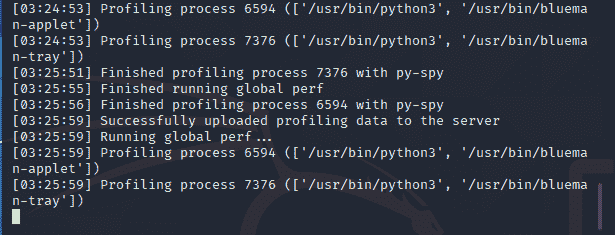

此后，不需要进行手动分析。gProfiler **在后台**运行，自动监控所有程序，同时使用更少的 CPU 资源。因此，它减少了您需要使用的云空间量，从而减少了您需要为云环境花费的**资金**。您将在[仪表板](https://profiler.granulate.io/view)、上看到所有数据，以便您可以查看和检查这些数据。

# 3.Python 片段应该小而轻

编写代码时，尽量保持简单，不要声明大量不需要的变量或函数——将一个变量的值赋给第二个变量，第二个变量赋给第三个变量会占用太多的缓冲内存和 CPU 资源。当我们编写代码时，我们总是考虑该特性是否是必需的。

Python 为开发人员提供了一种方法，使他们可以在一行中用多个运算符进行多重比较。

```
a = 12print(2 < a < 20)
print(1 == a < 11)
```

用户输入分配给变量“a”的任何值，当前分配给它的值是 12。因此它将基于它执行比较。

上面代码片段的输出如下所示

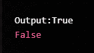

因为第一个条件为真，所以结果为“真”，因为第二个条件为假，所以输出为“假”

# 4.多重编码方法

要在 Python 中执行单个操作，有几个选项。在实施之前考虑这些选项有助于找到应对任何挑战的最佳答案。它鼓励开发者走出盒子去寻找解决方案。但是，作为开发人员，我们可以更进一步，通过做一些测试来确定哪种策略更好，以及从哪种策略我们可以在更短的时间内获得可靠的结果。

*示例:*我们如何使用 python 来添加数字。

```
number1 = 1.5
number2 = 6.3sum = number1 + number2print('The sum of {0} and {1} is {2}'.format(number1, number2, sum))
```

在上面的代码片段中，我们使用一个简单的 python 程序将两个数字“数字 1”和“数字 2”相加。该程序的输出将是

*输出:*

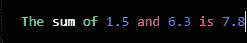

我们也可以用不同的方法创建这个程序，就像我们可以用函数来实现一样。

```
def add_num(number1, number2):
    sum = number1 + number2;
    return sum;num1 = float(input("input the number one: "))
num2 = float(input("input the number second: "))print("The sum is", add_num(num1, num2))
```

在上面的代码片段中，我们使用了一个名为 add_num 的函数。用户必须输入`num1`和`num2`的值，函数`add_num`将进行计算。

输出:

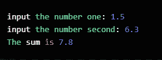

在 Python 中，我们有多种编码方法来解决一个问题。

# 5.尽可能避免循环

当开发人员在程序中使用许多循环时，会给服务器带来额外的负担，因为它需要更加努力地工作才能获得正确的结果。

例如，将数组的长度保存在单独的变量中，而不是在循环的每次迭代中读取数组的长度，这有助于减少响应时间，同时保持相同的功能。

在 Python 中，我们可以创建一个“集合”或“联合”来存储许多值，而不考虑循环。

```
a = 4
b = 4
for x in a:
    for y in b:
        if x == y:
            print("Compare")
```

没有必要使用循环:“集合(a)”或“集合(b)”就足够了。

# 6.键的排序和使用生成器

在 Python 中，“生成器”帮助开发人员创建他们自己的迭代器函数，这些函数不是一次返回一个项，而是使用迭代器对象返回一系列值。

注意 **:** 没有使用 return 语句，因为它会结束程序。

您可以在下面的代码片段中看到，我们可以声明一个使用迭代器的函数，这使得代码片段的执行速度比以前更快，最重要的是，它易于实现。

```
def mygenerator():
    print('First item')
    yield 10 print('Second item')
    yield 20 print('Last item')
    yield 30for item in mygenerator():
    print(item)
```

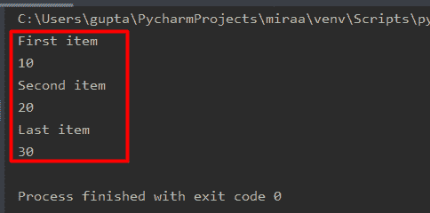

因此，它总是有助于减少反应时间和代码优化。

要在 Python 中排序，请避免使用默认的排序函数。相反，使用键，从优化的角度来看，键总是更好的，对字符串和整数都有效。在前面的代码片段中，我们将一个索引值传递给`item.getter`。这种情况下我过了“0”。当我改变它时，输出将基于索引而改变。

```
import operatorli = [(1, 5, 8), (6, 2, 4), (9, 7, 5)]li.sort(key = operator.itemgetter(0))print("Sorted output basis of keys", li)
```

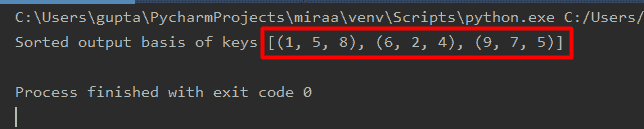

# 7.使用 xrange()代替 range()

在 Python 中，开发人员使用`range()`和`xrange()`函数在循环中提供迭代。

1.  `range()`:调用`[range()](https://www.w3schools.com/python/ref_func_range.asp)`函数时，保存指定范围内所有整数的相关数据，并返回数字列表。
2.  `xrange()`:但是在 [xrange](https://www.educba.com/python-xrange/) 中，数据的存储是在从一个循环中调用对象并显示特定范围的地方使用的。当迭代大范围的数据时，它提供了良好的性能。
    注意:在 Python 2.0 之前，这两个函数的行为是不同的。在 Python3 中，它们都产生相同的结果。

# 8.使用 join()函数连接字符串

我们可以使用“+”或使用`join()`函数连接一个字符串；两者都是内置的。

1.  “+”的使用:

```
x = 'Testing' + 'is' + 'done'print(x)
```

我们可以清楚地看到,+不会在输出中提供任何空格。

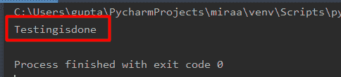

2.Join:但是当我们使用`join`连接字符串时，我们可以提供空间。它将列表、元组、字符串或集合等可迭代对象连接在一起。

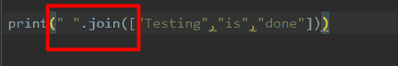

join 函数作用于基于字符串的函数，从这里开始，我们只想插入空格。

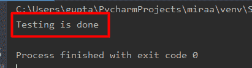

从上面的输出中，我们可以看到 join()通过组合所有 iterable 对象返回一个字符串。

# 9.itertools 的使用

在 Python 中，`itertools`是用于高效迭代的内置功能，只需使用`import itertools`就可以将它们包含在我们的代码片段中。

在`itertools`中，我们有许多帮助开发者的选项:

1.  `itertools.count()`:用于程序需要无限计数的地方。
2.  `itertools.cycle()`:当用户需要从有限的输入集合中得到一个无限的序列时使用。
3.  `itertools.islice()`:当用户想从一个无限序列中提取一个有限切片时使用。
4.  `itertools.filterfalse()`:只过滤那些函数评估为`false`的输入。

`[itertools](https://docs.python.org/3/library/itertools.html)`通过支持内存的功能提供简单、快速的开发。它用于排列和组合。

```
import itertoolsiter = itertools.permutations(["A", "B", "C"])print(list(iter))
```

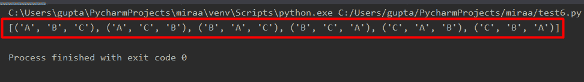

# 10.使用更少的全局变量

变量的声明永远在开发者手里。因此，开发人员可以实现这种做法来声明最少数量的全局变量。尽管这减少了内存空间或执行时间，但它也跟踪了变量。

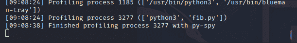

# 结论

在本文中，我们介绍了开发人员提高基于 python 的应用程序性能的 10 种方法。

最重要的建议是不要错过对应用程序进行概要分析——没有这个，就不可能监控代码的性能，所以你实际上不知道它是否有效。