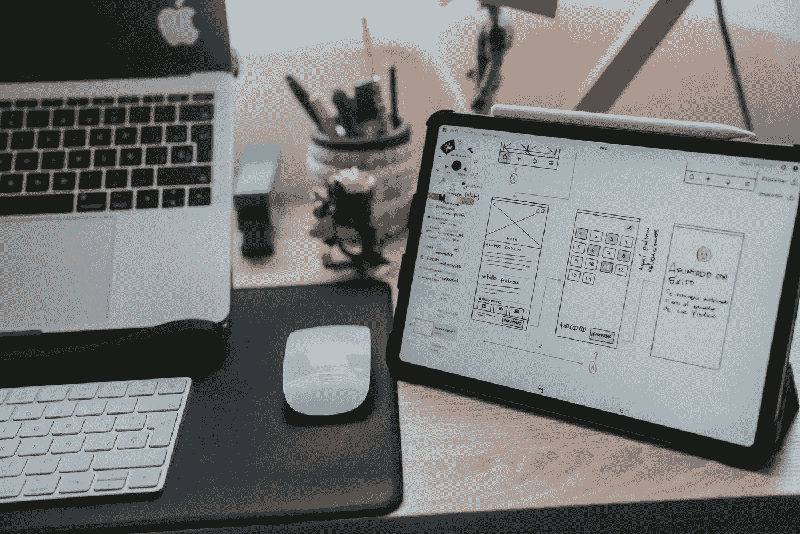
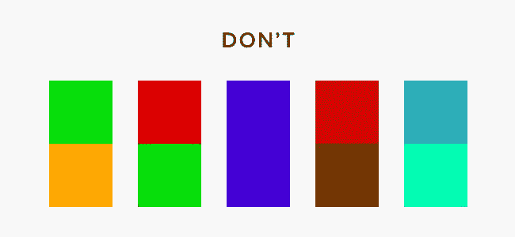
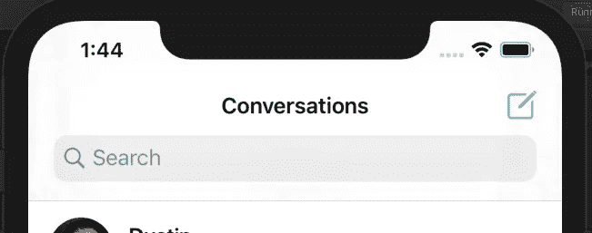
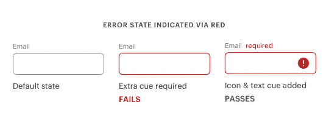
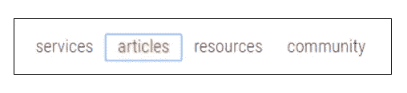
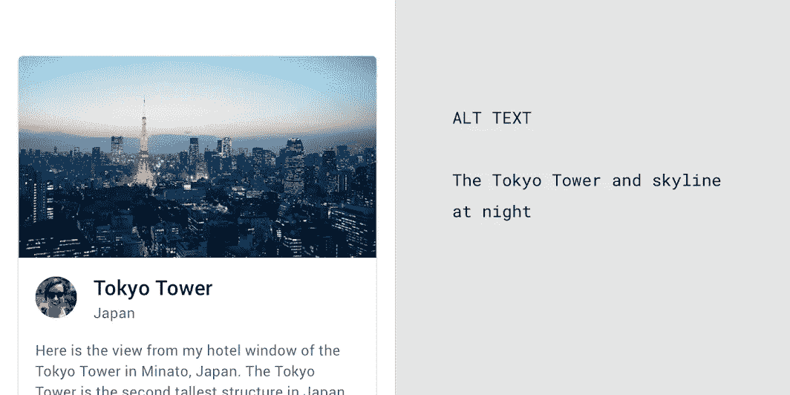
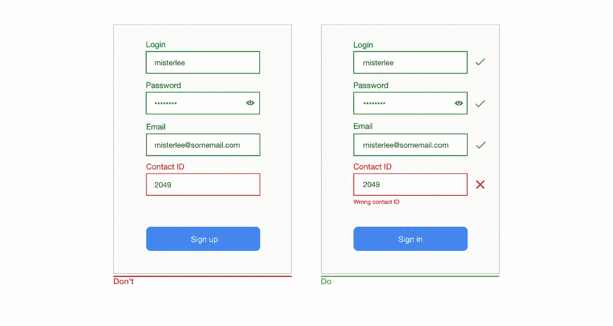
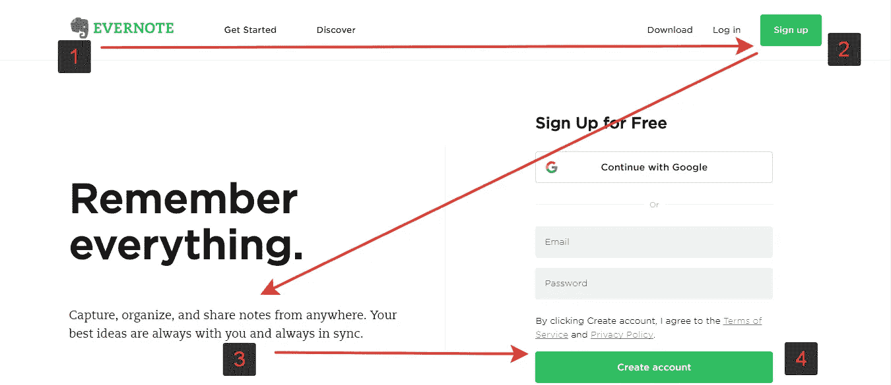

# 让你的用户界面设计更容易理解的 10 种方法

> 原文：<https://betterprogramming.pub/10-ways-to-make-your-ui-designs-more-accessible-5544c1e8d663>

## #10:知道可及性不是创新的障碍

阿尔瓦罗·雷耶斯在 [Unsplash](https://unsplash.com/@alvarordesign?utm_source=unsplash&utm_medium=referral&utm_content=creditCopyText) 上拍摄的照片

UI(用户界面)设计者的首要目标是为所有用户创造良好的体验，不管他们的能力如何。当我们考虑到大约有 2.85 亿人视力受损，1.1 亿至 1.9 亿成年人有严重的行动困难，以及全球有 3.6 亿人患有致残性听力损失时，这一点变得更加重要。

作为一名开发者，你应该希望你的网站易于访问，易于浏览，易于理解，并且可供所有人使用。万维网创始人蒂姆·伯纳斯·李也重申了这一点，他说:

> *“网络的力量在于它的普遍性。无论是否残疾，每个人都能获得是一个重要方面。”*

所以这里有十种方法可以让你的用户界面设计更容易理解和包容，并确保你是为所有人设计的。

# 1.使用颜色和对比来创造区别

色彩是设计的主要方面之一。确保背景和前景之间的适当对比，使用适当的色调来创造区别，突出重要的信息是使你的网站更容易访问的一些最简单的方法。

毕竟，为色盲用户或戴处方眼镜的人设计和为没有这些障碍的人设计一样重要。

您可以使用工具 [WebAIM 色彩对比检查器](https://webaim.org/resources/contrastchecker/)来实现平衡的色彩对比。该工具允许您输入特定的十六进制代码或从色轮中选择，然后进行增量调整，以达到元素之间的 AA(最小对比度)或 AAA(增强对比度)对比度标准。

# 2.使用清晰一致的导航选项

当决定一个网站的可访问性时，导航的便利性是最重要的因素之一。

*   确保网站中跨页面的导航具有一致的命名、样式和定位。
*   为用户提供站点搜索或站点地图。
*   通过提供方向提示，如面包屑和清晰的标题，帮助用户了解他们在网站或页面上的位置。

# 3.不仅仅使用颜色来表示状态变化

虽然颜色可以用来传达信息，但它不应该是传达信息的唯一方式。当使用颜色来区分元素时，请确保始终提供不依赖于颜色感知的附加标识，以使您的设计易于理解。

实现这一点的一些方法有:

*   除了颜色之外，使用星号来表示必填的表单字段。
*   使用标签来区分图形上的区域。
*   添加说明性文本。

# 4.为键盘用户提供视觉焦点指示

一些用户使用 tab 键在可聚焦的元素之间跳转(例如，链接、表单域和任何其他用 HTML `tabindex`属性添加到 Tab 键顺序的内容)。

然而，键盘用户通常很难说出他们在页面上的位置。因此，设计者必须始终提供一个清晰可见的指示，表明用户当前所在的页面元素。

虽然网络浏览器有默认的焦点指示器，但它们并没有那么好。因此，为链接、按钮、表单域、菜单项、小部件、日历选择器等可聚焦元素修改`CSS hover:`是一个好主意。(可聚焦元素几乎总是交互的。)

一个有效的焦点指示器:

*   具有良好的对比度
*   具有与元素互补的形状和大小
*   使用互补但引人注目的配色方案
*   动画帮助用户跟踪焦点移动
*   适度降级(在较旧的浏览器上可见)
*   在不同的浏览器中是一样的

# 5.提供图像/媒体选择

网页上的所有媒体类型，无论是音频、视频还是图像，都必须有文本替换来描述它们所代表的信息或功能(除非图像纯粹是装饰性的)。

## 开发人员最佳实践

*   所有图像都必须有一个描述性的 alt 属性:当图像没有 alt 文本时，提供一个空的 alt 属性，而不是根本不使用 alt 属性。这表明该图像没有任何功能意义。
    ``
*   将`<fig>`和`
`用于图像组和更具表现力的标题。
*   从辅助技术中隐藏纯粹的装饰性图像:没有任何功能或信息内容的图像是装饰性图像。这些可以通过多种方式对屏幕阅读器隐藏:
    -使用空`alt`属性
    -使用 ARIA `role="presentation"`
    -使用 CSS 背景图片

# 6.设计可访问的表单

没有人喜欢填写输入混乱、预期格式不明确、错误信息含糊不清或缺少键盘可访问性的表单。现在再加上损伤或残疾，你将会经历一次令人沮丧的经历。

为了确保您的页面用户不必经历这些，在设计可访问的表单时，您必须记住以下几点。

*   所有输入字段都应该有明确的关联标签。总是使用实际的`label` HTML 元素，而不是简单的`span`或`div`元素。
*   使用占位符文本让用户了解输入的格式和性质。但是，千万不要用它来代替标签，因为一旦用户输入了一些信息，占位符文本就会消失。
*   始终确保清楚地标识必填和可选字段。
*   在验证表单时，应该尽快显示错误消息，最好是在客户端显示，而不是等到整个表单提交后才显示。错误消息应该尽可能有意义和清晰。
*   通过 Tab 键，键盘用户应该可以访问表单的所有元素。tab 键的顺序应该是连续的，并且应该对用户有意义。

# 7.确保交互元素易于识别

为交互元素提供独特的风格，比如链接和按钮，使它们易于识别。例如，更改鼠标悬停、键盘聚焦和触摸屏激活时链接的外观。确保交互式元素的样式和命名在整个网站中使用一致。

# 8.用可视化层次结构组织内容

建立一个视觉层次结构需要密切关注 UI 元素在你的网页设计中是如何定位的，并在这些元素之间创造一致性来驱动意义。

*   不要拥挤你的屏幕，否则你会吓到用户。
*   视力受损的人可能需要放大屏幕上的项目，因此要使内容具有可伸缩性。
*   行动号召按钮应该清晰、有特色。
*   将重要信息放在眼睛高度附近。
*   使用合适的标题对相关内容进行分组。
*   使用空白和邻近使内容之间的关系更加明显。

z 型视觉层次

# 9.进行用户测试

即使你已经尽了最大努力使你的网站尽可能地具有可访问性，但是在某些方面，使用辅助技术的人可能会发现它们并不像你希望的那样用户友好。

识别和纠正这些问题的最好和最有效的方法是通过用户测试。在整个产品开发项目中进行非正式的评估比在项目结束时进行正式的可用性测试更有效。

用户测试有很多好处。至关重要的是，您将能够了解您的设计的功能限制范围，然后提供针对这些限制的解决方案。

测试给你机会去探索、调查和理解真实的人是如何处理你的设计的。

# 10.要知道可及性并不是创新的障碍

创建无障碍设计的最重要的部分之一在于知道它绝不是创新的障碍。设计约束不会让你的产品变得乏味，而是给你新的想法，让你探索如何为你的所有用户制造更好的产品。

像对待任何一组设计约束一样，接受可访问性准则。他们是为不同的观众创造惊人产品的挑战的一部分。

附加阅读:

 [## 网络开发人员和设计人员必备的 11 个 Chrome 扩展

### 有用的扩展，使您的任务更容易

better 编程. pub](/11-must-have-chrome-extensions-web-developers-and-designers-3482a1ca6349)