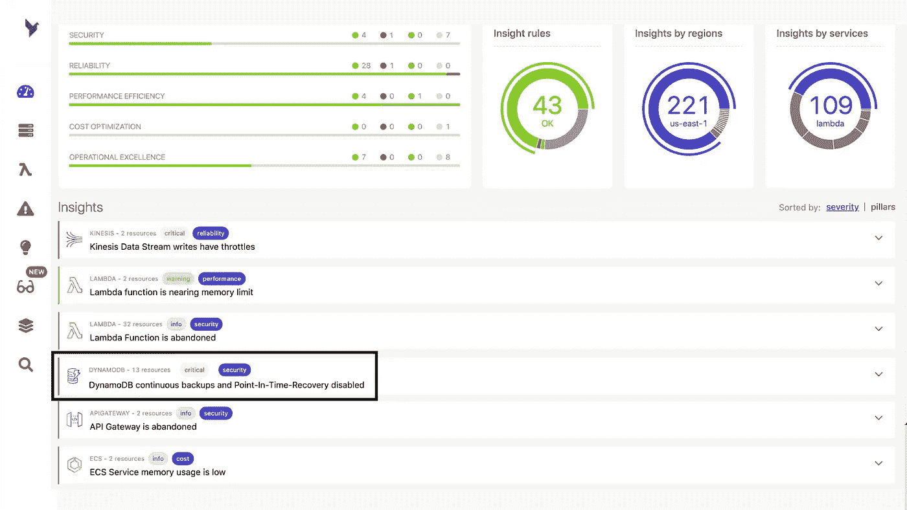
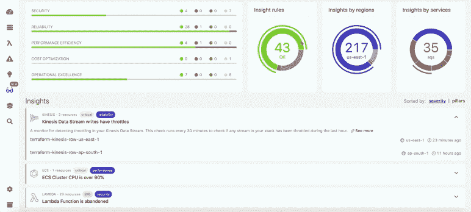
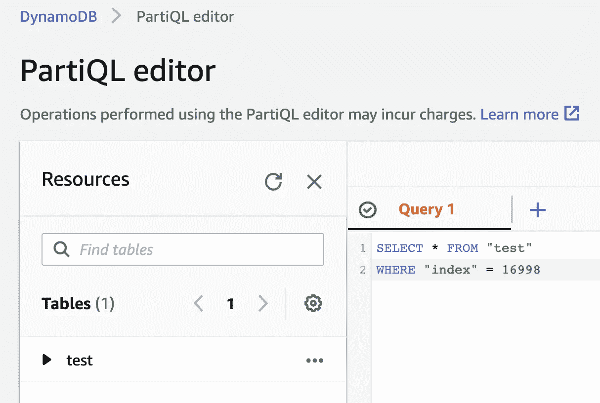

# 保护任务关键型数据库的 10 种方法

> 原文：<https://betterprogramming.pub/10-ways-to-protect-your-mission-critical-database-7d99d7a52c79>

## “每件事都会失败。”—沃纳·威格尔

照片由 [Gnist 设计](https://www.pexels.com/@gnist?utm_content=attributionCopyText&utm_medium=referral&utm_source=pexels)来自 [Pexels](https://www.pexels.com/photo/black-metal-padlock-706500/?utm_content=attributionCopyText&utm_medium=referral&utm_source=pexels) | [品牌内容披露](https://www.annageller.com/disclosure)

[数据是新油](https://ana.blogs.com/maestros/2006/11/data_is_the_new.html)。我们不仅依靠它来做决策，而且作为一个企业来运营。数据丢失会导致严重的财务后果和名誉损失。

在这篇文章中，你会发现十种可行的方法来保护你最有价值的资源。

# 1.备份，备份，备份

这不用说，我们都知道。我们需要一个备份策略和一个自动的方法来定期拍摄数据库的快照。

但是，面对当今的大量数据，实施一个可靠的备份计划来快速恢复数据库变得非常困难。因此，制定恢复时间目标和恢复点目标的策略并实施能够满足您的业务连续性计划的解决方案至关重要。

## RPO 与 RTO

恢复点目标(RPO)描述了我们可以容忍的停机时间。根据您的业务连续性计划，RPO 为 10 意味着您的业务不能承受超过 10 小时的数据丢失。您可以从备份的“陈旧程度”以及恢复时间的角度来考虑 RPO。RPO=10 时，我们允许数据在恢复后 10 小时内保持陈旧(即不包含过去 10 小时内所做的更改)。

相比之下，恢复时间目标(RTO) 描述了数据库必须再次启动的时间。RTO 为 3 意味着不管备份的新鲜程度如何，数据库[必须在停机发生后的三个小时内启动并运行](https://en.wikipedia.org/wiki/Disaster_recovery)。

# 2.测试您的恢复方案

以下可能是最糟糕的情况:您制定了备份策略并定期拍摄快照，但是当故障发生时，您注意到这些备份没有按预期的工作，或者您找不到它们。测试恢复场景至关重要。

网飞开创了“[混沌工程](https://en.wikipedia.org/wiki/Chaos_engineering)”——一种在生产系统上测试故障场景的学科，以确保你的基础设施真正具有弹性。

不要指望从未经过测试的备份和恢复计划。否则，你可能会陷入“祈祷好运”的策略。

请注意，如果您依赖于某个完全托管的服务所执行的备份，而您对快照没有实际的访问权限，那么您可能会面临恢复数据库所需时间超过您的 RTO 和 RPO 策略所允许的风险。由于时区差异和可能需要远距离传输的大量数据，恢复时间可能比您预期的要长。

因此，自己定期拍摄快照可能会有所帮助，而不是仅仅依赖特定提供商的备份。

# 3.记录依赖该数据的流程(基础)

如果您的数据库停机，哪些进程会受到影响？将此信息记录在某处很有价值，这样可以减轻故障的影响，并能够通过重新启动相应的流程和限制停机时间的影响来快速恢复。

# 4.应用最低特权安全原则

我们都希望信任他人，但是允许过多的开发人员进入而不教育他们如何使用这些生产资源可能会适得其反。只有少数受信任的人(可能是开发人员或高级工程师)可以直接修改或终止生产资源。在构建任何 IT 解决方案时，最好使用开发数据库，并对生产资源拥有只读权限。

最重要的是，定期检查这些权限是明智的。也许已经离开公司的人仍然可以使用生产资源。

# 5.将您的生产数据库命名为

如果您的生产数据库没有被命名为`prod`资源，并且有人将其混淆为其他资源，该怎么办？最佳实践是确保生产资源被正确命名，以便人们通过查看资源就知道必须非常小心地对待它。

这对您来说似乎是显而易见的，但是如果没有适当的沟通和教育用户，有人可能会将一个命名不当的生产数据库混淆为一些可以关闭的临时资源(例如操场集群)。

# 6.不要相信任何手动配置的资源

如果您的资源是手动配置的，那么在出现故障的情况下重现配置会变得更加困难。现代 DevOps 和 GitOps 文化引入了一种非常有用的代码形式的基础架构范例，它可以极大地帮助构建特定资源的精确副本，以用于开发或恢复场景。

# 7.不要让一个人管理整个基础架构

如果发生故障时，唯一知道如何配置和使用系统的人不在，那么恢复任何特定系统都是一项挑战。在这种用例中，知识仓库尤其危险。至少有一个额外的人可以接管这个责任是有益的。

通常，即使是员工之间的时区差异也会大大有助于更快地修复任何生产停机，从而满足您的 RTO。

# 8.在给员工任何资源之前，让他们了解这些资源

这一点与防止知识孤岛有关，但更针对教育开发人员。任何时候，当我们给予某人不仅仅是对生产资源的只读访问权限时，我们都应该教育他们如何正确使用这种资源，以及单个表的潜在停机时间可能会产生什么影响。

一如既往，有效的沟通是我们最好的朋友。

# 9.使用无服务器并监控您的资源

使用 AWS RDS 之类的数据存储很好，但也有不好的一面。最终，我们仍然有责任确保我们的数据库保持健康。当使用 DynamoDB 等无服务器数据存储时，我们可以依靠 AWS DevOps 专家来监控和保持底层服务器的健康。

如果您利用一个可观察性平台，如 [Dashbird](https://dashbird.io/) ，您可以快速识别无服务器基础架构中配置错误的资源或故障。dash bird[最近发布了一个名为“架构良好的镜头”的功能](https://dashbird.io/blog/introducing-well-architected-insights/)，它可以持续扫描你的资源以发现异常。例如，它会提醒您任何没有启用连续备份和时间点恢复的 DynamoDB 表。这是确保您的数据存储保持健康和弹性的最简单方法之一，因为:

*   AWS 负责服务背后的无服务器计算和存储，确保高可用性和容错能力。
*   如果您的架构偏离了设计良好的框架中定义的标准，例如当您的资源没有正确配置或缺少备份时，Dashbird 会提醒您。

在下图中，您可以看到 Dashbird 自动检测到备份未启用:

架构良好的 Lens 确保您的 DynamoDB 表具有持续的备份，能够实现快速的时间点恢复。图片由 [Dashbird](https://dashbird.io/) 提供。

除了恢复信息，您还可以发现更多关于无服务器资源的信息，如下图所示。例如，当您的实时数据流有写限制时，您会得到通知。最后，您会看到一个关于您的架构与架构良好的框架的符合程度的分数。

精心设计的镜头。图片由 [Dashbird](https://dashbird.io/) 提供。

如果阻止您使用 DynamoDB 的唯一原因是您仍然想使用 SQL，那么您可能想看看[part QL](https://docs.aws.amazon.com/amazondynamodb/latest/developerguide/ql-gettingstarted.html)。这种由 AWS 开发的查询语言允许您直接从 AWS 管理控制台查询 DynamoDB 表(和许多其他数据存储)，如下图所示:

将 DynamoDB 与 PartiQL 一起使用。图片由作者提供。

# 10.如果可能，将存储与计算分开

这一点与分析数据库有关。[让你的计算和存储相互独立是分析数据存储的一个好习惯](https://towardsdatascience.com/why-you-are-throwing-money-away-if-your-cloud-data-warehouse-doesnt-separate-storage-and-compute-65d2dffd450f)。想象一下，您的数据被持久地存储在诸如 S3 这样的对象存储中，您可以使用 AWS Athena 或 Presto 这样的无服务器引擎来查询它。将数据的存储方式和查询方式分开，可以更容易地确保分析基础架构的弹性。

您可以在 S3 存储桶之间建立自动复制，启用版本控制(允许您恢复被删除的资源)，甚至通过利用[对象锁](https://docs.aws.amazon.com/AmazonS3/latest/userguide/object-lock.html)来防止任何人从 S3 覆盖或删除任何东西。然后，即使删除了 Athena 表定义，您的数据仍然存在，可以很容易地根据 AWS Glue 中的模式定义进行查询。

我非常喜欢将提取的原始数据存储到对象存储中，然后再加载到任何数据库中。这允许您将它用作中转区或数据湖，并允许在分析管道中有更大的弹性。关系数据库连接是脆弱的。假设您正在将大量数据从某个源系统直接加载到数据仓库中。然后，在 ETL 作业完成前不久，它失败了，因为由于一些网络问题，连接被远程主机强制关闭。不得不重做提取步骤会给源系统带来额外的负担，或者由于 API 请求限制，这甚至是不可能的。

# 结论

在本文中，我们研究了保护任务关键型数据存储的十种方法。如今，数据是如此重要的资源，以至于停机会导致重大的财务和声誉损失。请确保从战略上着手，并测试您的恢复方案。

# **参考资料和资源**

*   克莱夫·亨比
*   灾难恢复— [维基百科](https://en.wikipedia.org/wiki/Disaster_recovery)
*   混沌工程— [维基百科](https://en.wikipedia.org/wiki/Chaos_engineering)
*   part QL—[dynamo db 文档](https://docs.aws.amazon.com/amazondynamodb/latest/developerguide/ql-gettingstarted.html)
*   [架构良好的洞察力](https://dashbird.io/blog/introducing-well-architected-insights/) — Dashbird