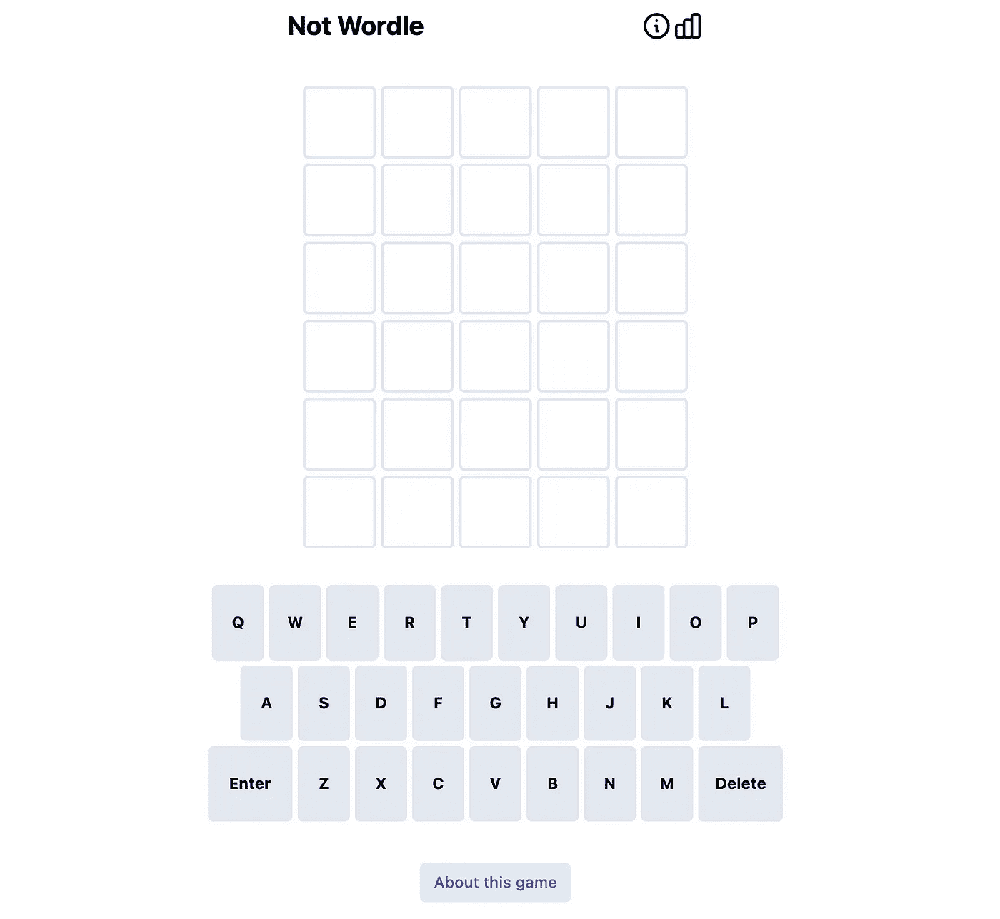
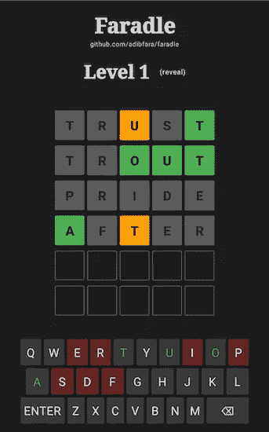
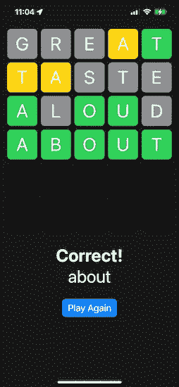

# 10 多个 Wordle GitHub 存储库，以理解跨语言的代码

> 原文：<https://betterprogramming.pub/10-wordle-github-repositories-to-understand-the-code-across-languages-f8f014d8ffe6>

## 从 Jetpack Compose 到 SwiftUI，我们为每个人提供了一个 Wordle 实现

克里斯托夫·保罗·高在 [Unsplash](https://unsplash.com?utm_source=medium&utm_medium=referral) 拍摄的照片

2022 年，沃尔多成了推特拉蒂镇的热门话题。这款基于单词的猜谜游戏由软件工程师乔希·沃德尔(Josh Wardle)开发，已经引起了人们的关注，这可能是因为它有类似算法的规则。

六次机会，每次你提交一个猜测，字母就会变成绿色、黄色或灰色——其中绿色表示字母的正确位置，黄色表示字母存在，但位置不正确，灰色表示字母不存在。

从应用程序开发人员到数据科学家，Wordle 已经为每个人戴上了程序员的帽子。下面，我编译了几个 GitHub 库，它们展示了 Wordle 难题的有趣实现。

# 使用 TypeScript

首先，[汉娜](https://github.com/hannahcode)使用 TypeScript、React 和 Tailwind 制作了一个 Wordle 克隆版。为什么要使用这种技术堆栈？它如何获取单词列表？

查看 [GitHub 库](https://github.com/hannahcode/wordle)获取完整的源代码和支持它的设计决策。

来自 [Wordle 克隆游戏](https://github.com/hannahcode/wordle)的截屏

使用 TypeScript 实现的两个更有趣的 GitHub 存储库是:

*   [Vue-Wordle](https://github.com/yyx990803/vue-wordle)
*   这是一个多人模式，也可以远程玩。

# Kotlin 和 Jetpack 组成

[Adib Faramarzi](https://github.com/adibfara) 创建了一个 [Android 应用程序，它使用 Jetpack Compose](https://github.com/adibfara/Faradle) 来创建自定义关键字和游戏视图，从而使 Wordle 更加有趣和直观。

截图来自 [Fardle](https://github.com/adibfara/Faradle)

如果你正在寻找一个跨 iOS、Android 和桌面的 Kotlin 多平台实现——[John O ' Reilly](https://github.com/joreilly)向我们展示了如何在这个 [WordMasterKMP 知识库](https://github.com/joreilly/WordMasterKMP)中实现。

# 使用 Python 或 R

想在不离开终端的情况下猜猜今天的单词吗？不要担心！这里有三个 Python 实现可以做到这一点。

*   Frost Ming 的 [wordle-tui](https://github.com/frostming/wordle-tui) 实现在你的命令行中模拟了整洁的 Web UI。
*   另一方面， [wordle-cli](https://github.com/klipspringr/wordle-cli) 提供了一些定制功能——比如与随机解决方案或者当天的“官方”wordle 进行对抗。
*   [wordle-solver](https://github.com/jason-chao/wordle-solver) 是一款帮助你交互式解决难题的工具——以防你没有主意。

用 R 编写的 mikefc 的 [wordle](https://github.com/coolbutuseless/wordle) 包可以让你在主机上玩游戏，或者如果你真的陷入了猜字游戏，可以使用`filter_words()`功能。

# 使用 Go、Rust 或 C#

如果你是一名 Golang 开发者，请查看 gordle 或 termle。

或者 [Wordlet](https://github.com/scottluptowski/wordlet) 如果你正在寻找一个 Rust CLI 实现(这个可以让你设置主题和难度)。

如果你想通过 tweets 的无剧透 Wordle 结果来逆向工程解决方案， [David Ebbo](https://github.com/davidebbo) 在他的 [WordleReverseSolver 知识库](https://github.com/davidebbo/WordleReverseSolver)中提供了一个详细的 C#解决方案和文章。

# 使用 Swift

如果你正在寻找一个 SwiftUI 实现，埃里克·奥尔森的 [wordle-clone](https://github.com/erikolsson/wordle-clone) 值得一试:

[来源](https://github.com/erikolsson/wordle-clone)

或者像前面一样，您总是可以看到命令行是如何工作的。埃内科·阿朗索的文章展示了如何使用 Swift 构建一个命令行界面。

我希望跨编程语言和框架的对比 Wordle 实现能启发你！