# 开发人员的 10 个工作生活窍门

> 原文：<https://betterprogramming.pub/10-work-life-hacks-for-a-developer-8679659ebc45>

## 从在 GitHub 上在线打开 VS 代码到用 Bash 别名运行冗长的命令


由作者设计的 [Unsplash](https://unsplash.com/s/photos/computer?utm_source=unsplash&utm_medium=referral&utm_content=creditCopyText) 上的 [Domenico Loia](https://unsplash.com/es/@domenicoloia?utm_source=unsplash&utm_medium=referral&utm_content=creditCopyText) 照片

在你的日常/冲刺或工作周中，你花多少时间完成一项任务？你认为你所花的时间足够有成效吗？最有可能的是，你可能会浪费更多的时间来寻找东西，或者你可能不知道有一个简单的方法来做这件事。

今天，我将带给你最重要和不为人知的技巧，它们将帮助每个程序员提高他们的生产力。有些人可能已经在他们的开发过程中使用了这些技巧！但是我确信有相当多的程序员不知道这样的事情存在。所以准备好大吃一惊吧！

# 1.在 GitHub 上在线开放 VS 代码

如果你是一个网页开发者，你最喜欢的 IDE 肯定是 VS 代码。因为它是最流行的、轻量级的，并且拥有最好的 IDE web 开发选项。

对于 GitHub，您可以克隆或下载代码，然后在 VS 代码中打开它。我知道在本地打开 vs 代码来做快速修复有点令人沮丧。

但是你知道有一个在线版本的 VS 代码可以轻松浏览和修改代码吗？你只需要按下句号(“.”)键入存储库的主入口点。

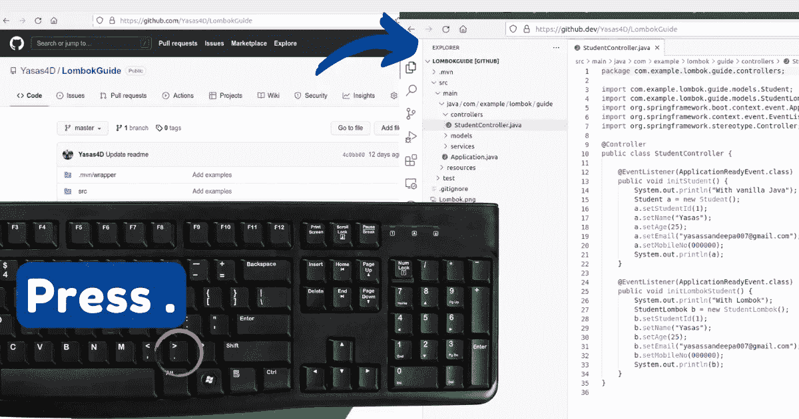

按句号键打开 VS 代码在线(图片由作者提供)

这是一个来自零安装[微软 Visual Studio 代码](https://vscode.dev)的服务，完全在浏览器中运行。

这允许您轻松地对任何文件进行轻量级的代码更改。此外，您可以添加新文件并直接提交到分支。你可以在任何地方运行它，比如在你的平板电脑上。

限制是您不能在这个 web 编辑器中运行或调试您的应用程序。但是快速修复和节省您的宝贵时间将会非常有用。

# 2.自动将 JSON 转换成对象模型

假设您的新 API 提供了下面的 JSON 响应，现在您需要将它集成到您的前端。如果您遵循面向对象的概念，您需要将这个 API 响应映射到类/接口。

我希望你们大多数人都熟悉 TypeScript。为如此复杂的 JSON 对象创建类型是极其乏味和耗时的。另外，如果你熟悉 dart 语言(在 Flutter 中使用)，我们需要创建类，并为每个类添加工厂方法。真的很繁琐，会耗费你宝贵的时间。

有什么简单的方法吗？是的，当然。

给你介绍一下**[**quick type . io**](https://app.quicktype.io/)**

**这个应用程序将从 JSON 模式生成强类型模型和序列化程序。它可以立即将复杂的 JSON 模式转换成对象模型。此外，它还支持许多语言，如 C#、C++、Java、Swift、dart 等等。这是一个完全免费的开源工具。**

**我在 Flutter 中将 JSON 模式转换成 dart 对象时大量使用了这个。**

**您只需要粘贴 JSON 响应并选择首选语言。它会立即转换并给出结果。**

**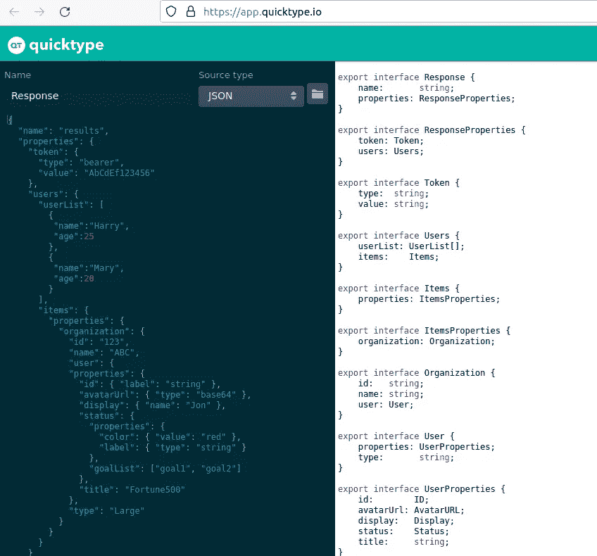**

**为 Typescript 语言生成的结果(图片由作者提供)**

**复制并粘贴上面的 JSON 模式，让奇迹发生吧！**

**因此，从此以后，您不需要手动编写模型类和序列化代码。这将自动推断类型，并节省您的工作时间。**

# **3.易于调试**

**调试是去除 bug 的艺术。添加一个好的旧的`console.log()`用于调试可能是开发人员最常见的做法之一。旧习难改。**

**大多数开发人员觉得使用`console.log()`而不是 IDE 调试器很舒服，因为这需要一些时间来配置，而且他们不想让日志记录变得复杂。但是为每个需要检查的函数添加一个`console.log()`是痛苦而繁琐的。**

**救命恩人来了！您可以在任何前端框架中拥有零配置的调试器。**

**引入`debugger;`它需要一个类似的过程，就像您使用 IDE 向代码添加断点一样。但是这种方式简单多了。**

**不管你的框架/库是什么，这都能工作。因此它可以用于 React、Angular、Vue 或任何其他平台。我们来看看这个怎么加。**

**您可以在代码库中的任何地方添加一个`debugger`。出于演示的目的，在我的 react 应用程序中提交一个简单的表单后，我添加了一个`debugger`。**

**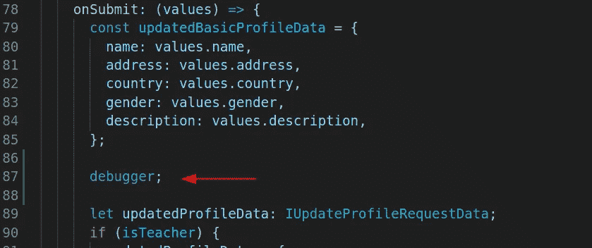**

**添加调试器(图片由作者提供)**

**一旦添加了调试器；然后只需打开 inspect 来启动应用程序的进程。现在，您需要从 UI 导航到执行函数的位置。当浏览器中的 JavaScript 引擎到达调试器时，它将停止执行，并显示您放置调试器的确切位置。**

**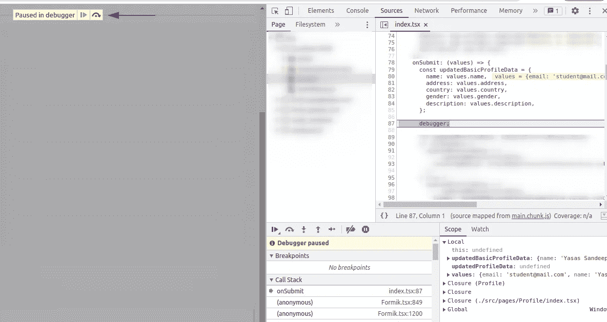**

**浏览器一旦到达调试器就停止执行(图片由作者提供)**

**现在，您可以检查并查看收到了哪些数据/对象。当您将鼠标悬停在已经执行的代码片段上时，您可以看到分配给每个代码片段的值。**

**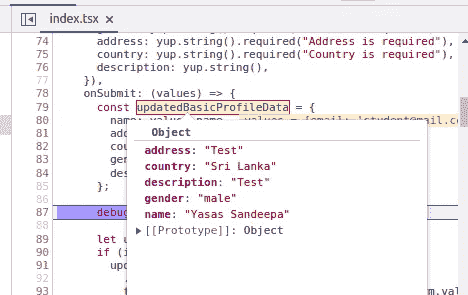**

**悬停在变量上(图片由作者提供)**

**看这有多简单！**

**这样做的额外好处是，您可以一个接一个地单步执行接下来的代码行，并深入执行函数。按下 F10 或单击调试器窗口中的“单步执行”图标，它将执行下一行。**

**所以你不必担心一次又一次地添加调试器。您可以一次性检查整个代码库。**

**这一招一定会减少你的日志时间。但是我强烈建议您使用 IDE 调试器或调试工具，因为它提供了比普通调试更多的功能。**

# **4.一个选项卡**

**在开发的时候，我们会在网上搜索很多东西。为此，我们在浏览器中打开了许多标签。标签越来越多。最终，它变得如此之小，以至于我们都认不出它的名字了。(标签混乱)很难再找到相关的标签，我们浪费了太多时间一个一个地浏览。**

****

**浏览器中杂乱的选项卡(作者图片)**

**引入一个选项卡。只需点击一下，您所有的标签将变得容易访问。这是一个标签管理浏览器扩展，你可以免费安装。**

*   **火狐-[https://addons.mozilla.org/en-US/firefox/addon/onetab/](https://addons.mozilla.org/en-US/firefox/addon/onetab/)**
*   **chrome-[https://chrome . Google . com/web store/detail/one tab/chphlpggbolifaimnlloiipkdnihall](https://chrome.google.com/webstore/detail/onetab/chphlpgkkbolifaimnlloiipkdnihall)**

**超级好用。你只需要点击一个标签图标，它会把你所有的标签折叠成一个标签。**

**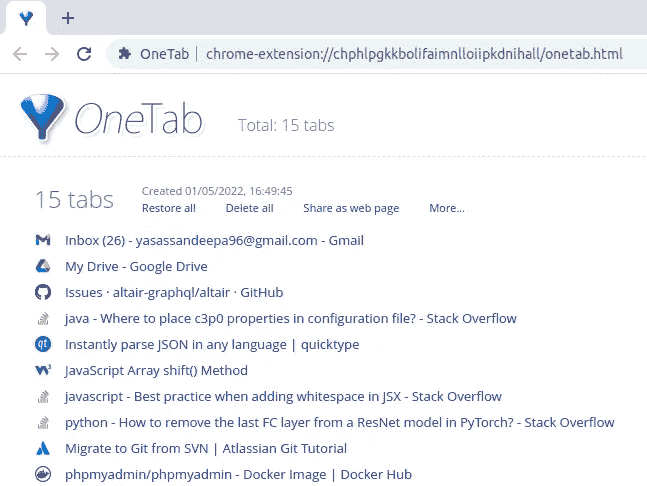**

**点击一个标签图标(作者图片)后**

**现在你所有的标签都清晰可见了，你可以点击任何你想要的标签。**

**这不仅是一个标签混乱减少，但它有这么多的功能。**

**最重要的是，通过减少打开标签的数量，它将节省高达 95%的内存。此外，标签可以被锁定和存储，以供将来作为书签参考。这将保留一个标签历史。**

****

**标签历史(按作者分类的图片)**

**一个选项卡可以让您轻松地将选项卡作为 URL 列表导出和导入。此外，您可以从选项卡列表中创建一个网页，并与您的朋友共享。**

**这是一个如此小的野兽，你一定要尝试一下！**

# **5.在邮递员中自动添加不记名令牌**

**如果你是后端开发人员，你肯定会用 Postman 来检查 API 端点。但是，你是否恰当地使用了它，或者最大限度地利用了它？邮递员可以做很多事情。我给你带来了一个自动存储令牌的简单技巧。**

**希望大家熟悉 JWT 令牌认证。通常，当使用 Postman 测试 auth 端点时，您发送一个登录请求，复制令牌并将其放入授权中的无记名令牌部分。你为什么浪费这么多时间做那件事？做这件事有一个简单的方法。**

**您可以在 postman 中将令牌添加到授权头的过程自动化。你只需要做简单的三步。**

1.  **创造新环境**
2.  **转到集合上的授权选项卡，然后将类型设置为不记名令牌，并将值设置为`{{access_token}}`**
3.  **将`pm.environment.set("access_token",pm.response.json().token);`线放入测试选项卡**

**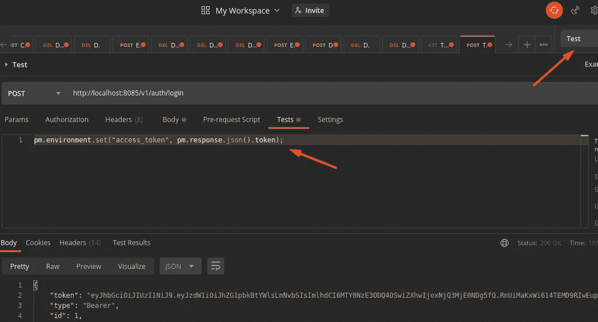**

**设置 Postman 自动添加令牌(图片由作者提供)**

**正确配置后，您不需要为新请求手动复制粘贴令牌。它会自动将其设置为变量。这样可以节省你的宝贵时间！**

# **6.使用 Bash 别名运行冗长的命令**

**如果你正在使用基于 Linux 的发行版，你应该知道记住冗长的命令有多难。此外，一遍又一遍地输入同样冗长的命令也很麻烦。**

**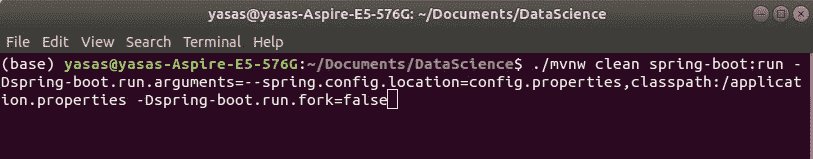**

**使用自定义配置命令运行 Spring boot(图片由作者提供)**

**但是如果您知道这个技巧，您就不再需要担心输入冗长的命令或者搜索 bash 历史记录来查找以前输入的命令了！**

**bash 别名介绍，命令的快捷方式！**

**您可以使用任何容易记住的名称来创建别名来运行这些冗长的命令。Bash 别名不仅简化了任务，还为用户节省了时间。这可以大大提高你的效率。**

**这是通过通常在`$HOME/.bashrc`中定义的`.bashrc`文件完成的**

**您可以编辑该文件，并根据需要添加任何别名。我将快速指导您创建一个别名来查找一个目录及其所有子目录下的文件总数。**

**如果你遵循正常程序，你需要键入`find . -type f | wc -l`命令。**

****

**查找命令(图片由作者提供)**

**但是使用这种方法，您可以创建一个快捷方式来调用这个命令。**

**首先，运行`nano .bashrc`在 **nano** 编辑器中打开`~/.bashrc`文件。(您应该在您的主目录中)然后在文件的底部创建一个别名，使用任何喜欢的名称。**

**您可以直接输入命令，也可以创建一个 sh 文件并链接到这个文件。**

**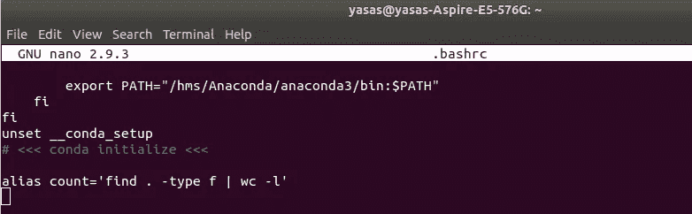**

**制作别名以查找命令(图片由作者提供)**

**最后，键入`source ~/.bashrc`使更改生效。现在你只需要输入名字，它就会执行命令。**

**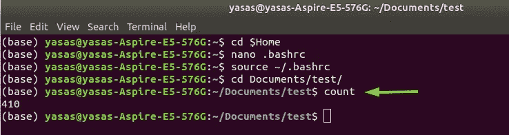**

**测试运行(图片由作者提供)**

**看看这有多简单。现在您只需要输入 count 就可以得到这个目录中所有文件的数量。**

**此外，您还可以轻松设置多种工作环境。例如，您可以轻松地在一个控制台上运行 Java 8，在另一个控制台上运行 Java 11。您只需要在 shell 脚本文件中添加导出，并为其创建一个别名。**

**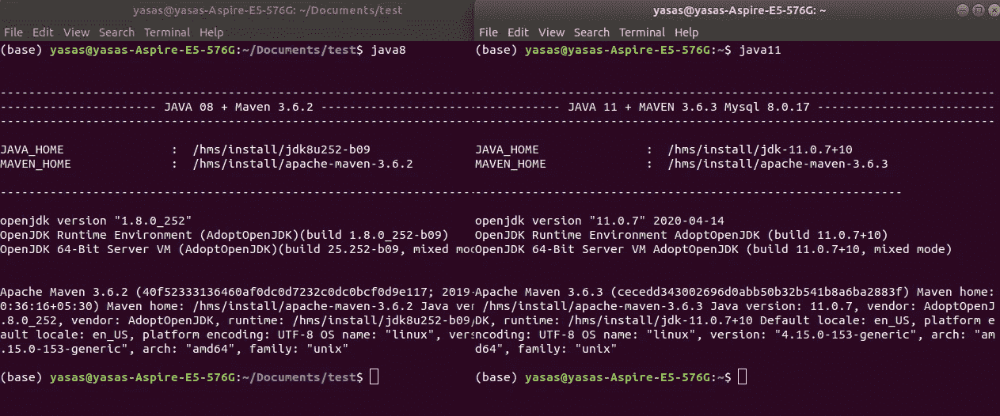**

**使用别名运行 Java8 和 Java11(图片由作者提供)**

# **7.Email-JS 直接从客户端发送邮件**

**你想知道投资组合网站(那些没有后端服务器的网站)怎么会有联系我的表单吗？这是诀窍。**

**介绍 [**EmailJS**](https://www.emailjs.com/) 。一个简单的服务，允许您直接从客户端 JavaScript 代码发送电子邮件**

**你只需要将 EmailJS 连接到一个支持的电子邮件服务(如 Gmail、Outlook、Yahoo 等)，创建一个电子邮件模板，并使用 Javascript 触发电子邮件。**

**请看下面的短片演示，它展示了这是如何发生的。**

**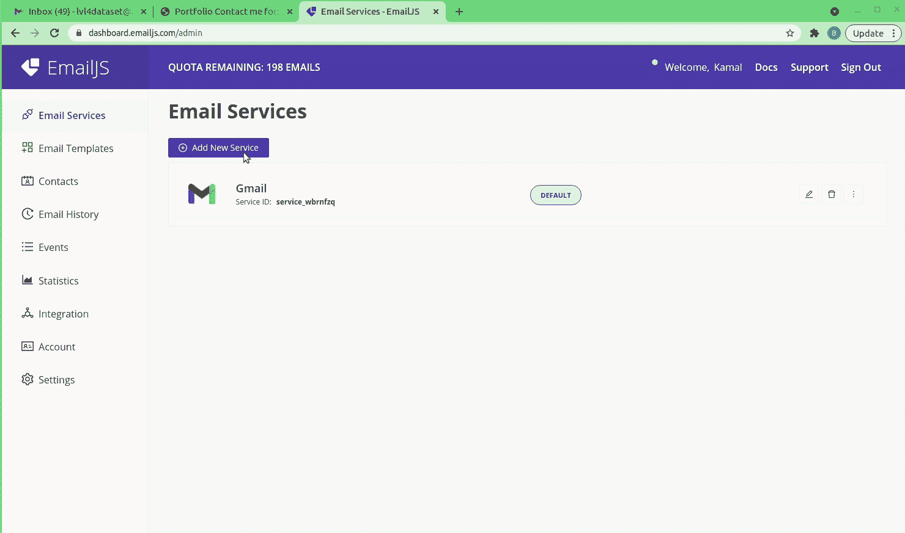**

**EmailJS 演示(Gif 图片由作者提供)**

**有了 EmailJs，你可以每月免费发送 200 封邮件。**

**此外，如果你是大学生，这个东西对你的项目演示也很有价值。还有一个 npm 包和 API 集成。**

**你可以在这里 查看我在 GitHub[T5 上的实现。所有必要的细节都在 readme 文件中，您可以很容易地参考它并将 EmailJS 应用到您的应用程序中。](https://github.com/Yasas4D/contact-me-form)**

**EmailJS 提供了额外的功能，如自动回复、添加附件、要求验证码验证等。你可以从[这里](https://www.emailjs.com/)探索更多。**

# **8.采访位**

**这将是一个采访黑客！**

**有多少程序员害怕面对面试？有些人可能很有才华，但缺乏沟通技巧。所以他们在面对面试的时候会遇到困难。**

**但是如果你意识到了这个网站，那么面对面试的时候，你一定会觉得很自信。**

**该平台通过协作式实时代码编辑器和内置的音频呼叫随时提供模拟面试。这样你就可以面对与你同等专业水平的人进行面试，这是一次真正的面试经历。**

****

**[https://www.interviewbit.com/](https://www.interviewbit.com/)**

**这也将允许用户通过提供编码练习问题来改进他们的编码。(类似于 [HackerRank](https://www.hackerrank.com/) 平台)问题被分类到不同的桶中，因此逐个学习每个主题非常容易。**

**它也很好地解释了编程概念。**

**所以准备好你的下一次面试吧！你最终会得到一家大公司的好工作机会。**

# **9.在线运行您的存储库，协作编码和免费部署**

**为应用程序设置开发环境很麻烦。您需要用正确的版本安装必要的库来运行它。但是这个技巧可以帮助你毫不费力地运行你的应用程序。**

**为您带来 [CodeSandbox](https://codesandbox.io/) ！**

**CodeSandbox 是一个用于快速 web 开发的在线编辑器。这使得开发人员只需在浏览器中访问一个 URL 就可以开始开发应用程序。您可以编辑代码并实时查看更改。只需轻轻一点，您就可以快速制作原型、探索和分享您的作品。**

**它消除了与项目设置相关的所有复杂性，并允许轻松开发和实时协作编码。**

**因此，作为起点，您可以将本地项目或 GitHub 项目导入 CodeSandbox。当从 GitHub 导入时，您可以进行更改，或者创建一个 PR 或者直接提交更改。**

**另外，有一个特殊的技巧可以将任何 ***公共*** GitHub 仓库导入 CodeSandbox。去任何一个公共的 GitHub 库。我的[主题转换器](https://github.com/Yasas4D/ThemeChanger)应用。然后在 URL 部分，在' hub '和'之间追加' ***框*** '。com '零件。**

```
Change the GitHub URL:
[https://github.com/Yasas4D/ThemeChanger](https://github.com/Yasas4D/ThemeChanger)To:
[https://github**box**.com/Yasas4D/ThemeChanger](https://github.com/Yasas4D/ThemeChanger)
```

**这将重定向到 CodeSandbox，打开你的 GitHub 项目。**

**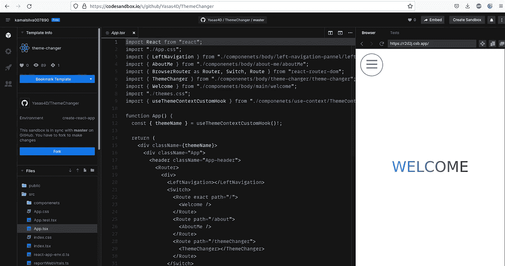**

**代码沙盒中我的主题转换器应用程序(图片由作者提供)**

**这不仅允许在 web 上执行您的应用程序，而且最重要的是，这允许**实时协作。(谷歌文档样式)****

**您可以在沙盒中与其他人同时创建、删除、编辑和移动文件和代码。**

**在活动栏中有一个活动标签。您可以获得一个实时 URL 链接，与其他 CodeSandbox 用户共享。然后，他们可以加入您的会话，并与您在同一个沙箱中进行无缝实时协作。**

**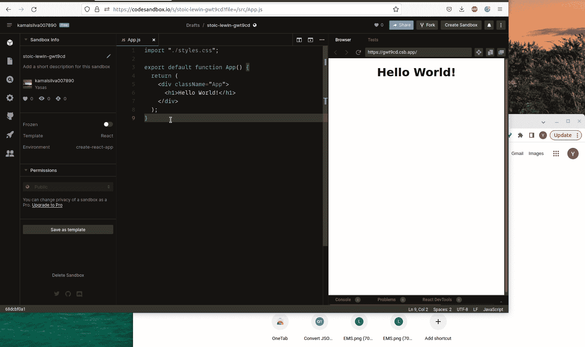**

**CodeSandbox 中的实时协作(Gif 由作者提供)**

**CodeSandbox 的另一个很酷的特性是，它还可以部署应用程序的生产版本。这使得你可以在 [Vercel](https://vercel.com) 、 [Netlify](https://netlify.com) (你甚至不需要连接到你的账户)或 GitHub 页面中部署你的应用程序，并且完全免费！**

**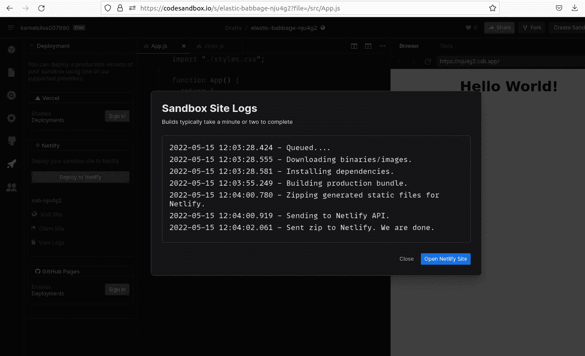**

**将应用程序部署到 Netlify(图片由作者提供)**

**CodeSandbox 提供了如此多的特性，你可以在这里阅读它们的原始文档[。这是一个满足您所有需求的完整包。](https://codesandbox.io/docs)**

# **10. ***静态*代码分析器****

**作为我的最后一招，我决定提高你的编码质量。我知道你们大多数人每天都要面对代码审查。但是作为人类，我们的眼睛可能无法在第一时间捕捉到这些错误/小问题。**

**这些可以在编译时识别出来，但是有些甚至在编译时也检测不出来。这些愚蠢的语法错误或你在评审过程中的微观互动将会妨碍你的工作效率，最终会占用你的时间去修复另一个错误或开发你的应用程序的下一个伟大功能。**

**我们可以通过使用静态代码分析器来缓解这个问题。有些人对名称、Linter 或代码检查器很熟悉。**

**它允许在代码运行之前检查潜在的错误和漏洞。它会自动扫描你的代码中可能导致代码错误或不一致的缺陷。有些人甚至可以帮你修理它们！**

**这个过程将提高代码的质量，加强编码标准，并展示潜在的漏洞。有许多静态代码分析器支持几乎所有的语言。**

*   **[ESLint](https://eslint.org/):[JS 界最受欢迎的](https://trends.google.com/trends/explore?geo=US&q=eslint,jshint,jslint) linter。**
*   **[Stylelint](https://github.com/stylelint/stylelint):CSS 和类似 CSS 的语法如 [Sass](https://sass-lang.com/) 的林挺工具。**
*   **Awesome ESLint:Awesome 配置、解析器、插件和其他工具的简单列表。**
*   **[Checkstyle](https://checkstyle.sourceforge.io/) :自动化检查 Java 代码的过程。**
*   **[SonarQube](https://www.sonarqube.org/) :结合静态和动态分析的高级代码质量保证工具。**

**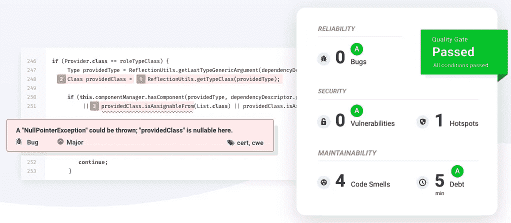**

**SonarQube 分析—[https://www.sonarqube.org/](https://www.sonarqube.org/)**

**出于演示的目的，我将向您展示 ESLint 是如何工作的。我为此创建了一个演示 React 项目。你能指出我在下面添加的错误吗？**

**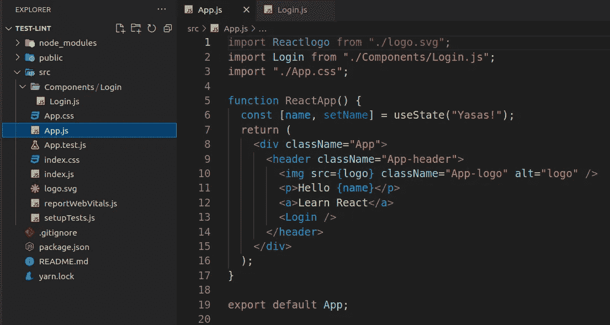**

**你能发现错误吗？(图片由作者提供)**

*   **我在导入中更改了徽标的名称，但忘记在代码中更改它。**
*   **登录组件的导入不正确，`useState`未被导入。**
*   **我更改了类名，但是忘记在导出中更改它。**
*   **代码中没有使用一些变量。**

**如果没有棉绒，这些问题可能很难识别。让我们看看这些问题是否会在我们建立 ESLint 之后出现。**

**首先，您需要为 [VS 代码](https://marketplace.visualstudio.com/items?itemName=dbaeumer.vscode-eslint)安装 ESLint 扩展。**

**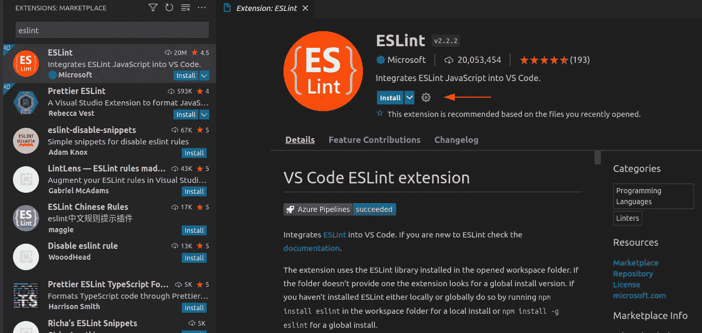**

**安装 VS 代码的 ESLint 扩展**

**然后，您可以将 ESLint 安装为项目的开发依赖项。**

```
yarn add eslint --dev
```

**然后，您应该设置一个配置文件，最简单的方法是:**

```
yarn create [@eslint/config](http://twitter.com/eslint/config)
```

**运行这个之后，您的目录中就会有一个`.eslintrc`配置文件。最初，没有规则，但是您可以在其中定义自定义规则，它将覆盖默认配置。试试下面的规则。**

```
rules: {
  quotes: ["error", "double"],
  "react/react-in-jsx-scope": "off",
  "react/jsx-filename-extension": [1, { extensions: [".js"] }],
}
```

**您可以为此添加更多规则。要了解 ESLint 的高级配置设置，请参考官方文档[这里](https://eslint.org/docs/user-guide/configuring/)。我将创建一篇单独的文章来解释这些配置。**

**现在让我们检查代码，看看我们的林挺工具给出了什么输出。(或者，您可以运行`yarn lint`**

**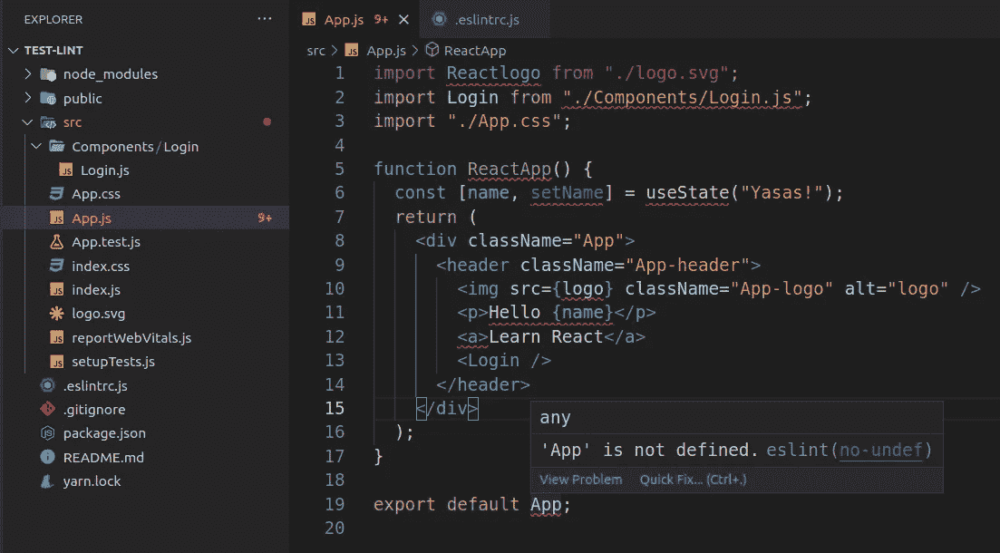**

**ESLint 给出了一条弯弯曲曲的红线来表示问题(图片由作者提供)**

**看看现在发现问题有多容易！您可以将鼠标悬停在红线上并查看问题。在某些情况下，它将提供快速修复。**

**正如您所经历的，如果没有棉绒，这些问题可能很难识别。这将节省您的宝贵时间，并提高编码质量。**

# **奖励——生活小贴士**

****

**照片由[杰森·霍根](https://unsplash.com/@jasonhogan?utm_source=unsplash&utm_medium=referral&utm_content=creditCopyText)在 [Unsplash](https://unsplash.com/s/photos/victory?utm_source=unsplash&utm_medium=referral&utm_content=creditCopyText) 上拍摄**

****了解你的框架** 掌握一个框架一门语言。**

**有一个概念叫 T 型学习。竖线(I)代表专业知识技能。(你的核心技能)。单杠代表广泛的一般知识和软技能。它显示了在核心领域之外工作的能力。**

**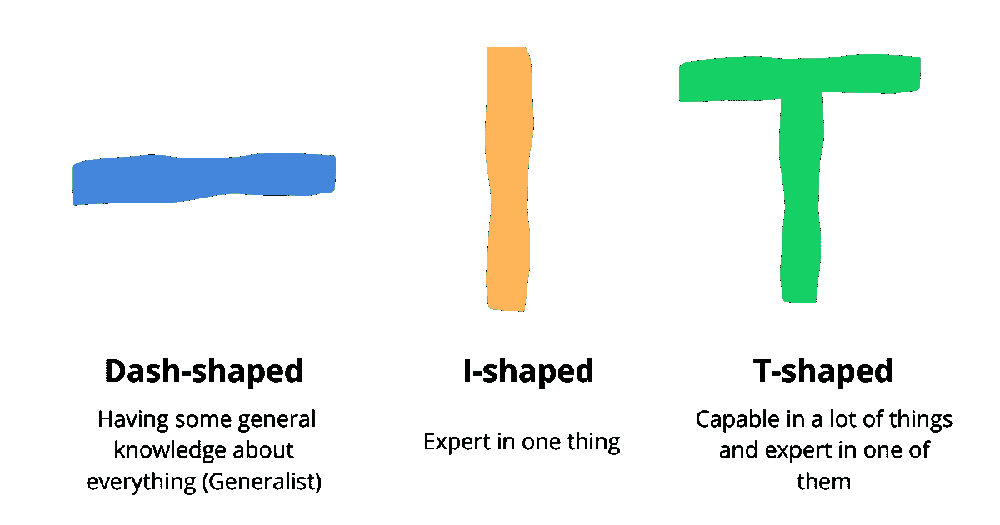**

**t 型工程矩阵(图片由作者提供)**

**所以，努力做一个 T 型的开发者，你会在 IT 行业获得很大的需求。**

****质量重于数量&注重简单** 你写了多少代码行并不重要，重要的是你的编码质量。你需要清晰准确地编写标准代码。**

**为此，你需要遵循软件开发最佳实践，比如[实](https://en.wikipedia.org/wiki/SOLID)、[亲](https://en.wikipedia.org/wiki/KISS_principle)、[干](https://wiki.c2.com/?DontRepeatYourself)等。熟悉设计模式。确保你正确地学习了这个概念。我打算在不久的将来也写这些东西。**

****不断学习** 你选择了一个需要不断学习的职业。学会爱它。每天尝试解决至少 1 到 2 个问题，学习新概念。问题的大小无关紧要。重要的是你每天都这么做。这有助于保持一致性，从长远来看非常有帮助。**

****如果你被困在一个问题中，休息一会儿再回来**
假设你正在拼命解决一个问题。你会尝试一切，但仍然可能无法找到解决方案。如果你遇到这样的情况，你需要从电脑前退一步。**

**做点什么让你不再想编码。做些放松的事情。一旦你感到神清气爽，精力充沛，再次尝试那个问题，你将最终点击你的大脑！这是研究人员已经证实的方法。**

**想想你自己吧，我们的时间都很紧。但是我们也需要为自己着想。它不是编码，也不是金钱！但是健康和体面的生活。**

**总是吃健康的食物。随身带着水，10-20 分钟后喝几口。也不要在同一个位置等待几个小时。每天至少锻炼 20 分钟来保持你的身体。**

**这些建议将有助于你的长途旅行！**

# **最后的想法**

**我已经讨论了程序员应该知道的最有趣和隐藏的技巧。如果你觉得这些技巧有用，下次你在做项目的时候，把它们应用到你自己的环境中。**

**这会让你的生活更轻松，节省你的宝贵时间。此外，如果你知道一些更好的，把它们放在评论区。**

**永远不要停止学习！快乐编码。**