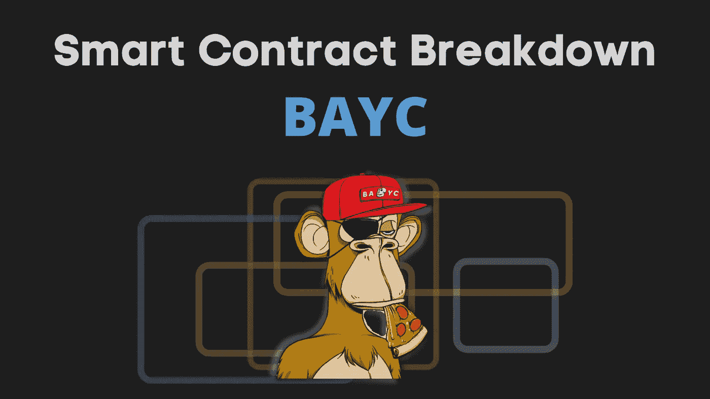
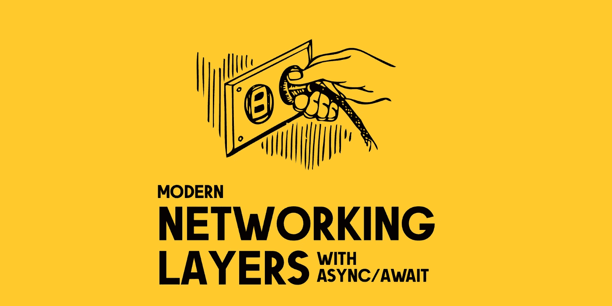

# 来自 Medium 的 100 多篇精选编程文章(2022 年 3 月)

> 原文：<https://betterprogramming.pub/100-hand-picked-programming-articles-from-medium-march-2022-c1bdda395486>

## 过去一个月里我们发现的最好的故事

嘿大家好，

三月份的编程文章综述涵盖了优化 SQL 代码的一些方法、SwiftUI 和 Jetpack Compose 之间的并列比较、一些智能契约分析、更多软件工程实践、几个启发您构建应用程序和游戏的实践教程，并带有一些幽默。一定要读一读，强调一下，并给他们一些掌声。

事不宜迟，让我们进入 2022 年 3 月以来我们最喜欢的阅读——不分先后。

# 编程；编排

兰迪·塔兰皮在 [Unsplash](https://unsplash.com/s/photos/motivational-quotes?utm_source=unsplash&utm_medium=referral&utm_content=creditCopyText) 上的照片

*   [微前端的未来](/the-future-of-micro-frontends-2f527f97d506)作者[艾哈迈德·塔里克](https://medium.com/u/9119c54d607d# </a>的交互式摄像机，由<a class=)
*   [IDEs，墙上的 IDEs，哪一个是最好的？](/ides-ides-on-the-wall-which-is-the-best-of-them-all-26a462222726)由[安迪](https://medium.com/u/5fa30a3e12cb?source=post_page-----c1bdda395486--------------------------------)
*   [如果编程语言是迪士尼公主](https://code.likeagirl.io/if-programming-languages-were-disney-princesses-6a5f128d9637)由[导演](https://medium.com/u/d00525b1bbf0?source=post_page-----c1bdda395486--------------------------------)
*   [贾森·曼宁](https://medium.com/@jasonkylemanning/the-coding-tortoise-8c3e41bf30dd)的《编码乌龟

# 计算机编程语言

作者图片

*   [Fugue 和 duck db:Python 中的快速 SQL 代码](https://towardsdatascience.com/fugue-and-duckdb-fast-sql-code-in-python-e2e2dfc0f8eb)作者 [Khuyen Tran](https://medium.com/u/84a02493194a?source=post_page-----c1bdda395486--------------------------------)
*   [D-Tale:你见过的最好的 Python 库之一](https://towardsdatascience.com/d-tale-one-of-the-best-python-libraries-you-have-ever-seen-c2deecdfd2b)作者 [Ismael Araujo](https://medium.com/u/6b00d9d9f8df?source=post_page-----c1bdda395486--------------------------------)
*   [将 SQL 翻译成 Python —第 2 部分](https://towardsdatascience.com/translating-sql-into-python-part-2-5b69c571ddc3)作者 [Holly Dalligan](https://medium.com/u/19d0fc7fc960?source=post_page-----c1bdda395486--------------------------------)
*   你可能不知道由[当归罗杜卡](https://medium.com/u/f8bc34d63aee?source=post_page-----c1bdda395486--------------------------------)
*   [Django Model Decorators——Tamas K Stenczel](/django-model-decorators-tips-and-tricks-with-implementation-c4c027d24a7f)的实施技巧和诀窍
*   [由](/build-a-question-answering-app-using-pinecone-and-python-1d624c5818bf) [Kirshi Yin](https://medium.com/u/6fff8a84be27?source=post_page-----c1bdda395486--------------------------------) 用松果和 Python 构建一个问答 App
*   [如何用 Python](https://medium.com/towards-formula-1-analysis/how-to-recreate-the-formula-1-aws-corner-analysis-in-python-37c26363c47b) 重现一级方程式赛车 AWS 弯道分析作者 [Jasper](https://medium.com/u/fe059e15d733?source=post_page-----c1bdda395486--------------------------------)
*   [你不需要样本数据，你需要 Python Faker](https://towardsdatascience.com/you-dont-need-sample-data-you-need-python-faker-fa87c2a119a9)by[Christopher Tao](https://medium.com/u/b8176fabf308?source=post_page-----c1bdda395486--------------------------------)

# JavaScript 和 Web 开发

照片由 [Krys Amon](https://unsplash.com/@krysamon?utm_source=medium&utm_medium=referral) 在 [Unsplash](https://unsplash.com/?utm_source=medium&utm_medium=referral) 上拍摄

*   [看一看 Remix React 框架:全栈开发者指南](/end-to-end-guide-to-remix-a-full-stack-web-framework-8dc56eb6a9c7)作者 [Jennifer Fu](https://medium.com/u/faf2e58f3d28?source=post_page-----c1bdda395486--------------------------------)
*   [通过减少](/request-batching-in-react-b8fd0656b28b) [Vinicius De Antoni](https://medium.com/u/6911513a654d?source=post_page-----c1bdda395486--------------------------------) 的 API 调用次数来提高 React 应用程序的性能
*   [使用 Immer 优化](/using-immer-to-optimise-redux-reducer-3590bd2f5223)[维奈米塔尔](https://medium.com/u/1c136e1c0b4d?source=post_page-----c1bdda395486--------------------------------)的冗余减速器
*   [Bruno Sabot](/loading-gists-in-a-nextjs-application-cb60e3f9d523)在 NextJS 应用中加载 Gists
*   [如何为角度组件编写有用的测试](/how-to-reach-100-test-coverage-without-testing-anything-64d07d226bff)作者 [Michael Seemann](https://medium.com/u/e98ee43541c0?source=post_page-----c1bdda395486--------------------------------)
*   [曹兰 Async js vs . Async/Await:node . js 中的异步操作用什么？](/caolan-asyncjs-vs-async-await-what-to-use-for-async-operations-in-node-js-90307c73f12b)作者[里沙卜·拉瓦特](https://medium.com/u/eda8e048f3f4?source=post_page-----c1bdda395486--------------------------------)
*   [用 Next.js 构建你自己的翻译钩子](/build-your-own-usetranslation-hook-with-next-js-2c65017d323a)
*   [如何让你的 TypeScript 泛型函数更安全更易用](/figuring-types-in-typescript-generic-functions-9479dd2fc3ea)作者 [Dmitry Shamshurin](https://medium.com/u/c4c7ecf62334?source=post_page-----c1bdda395486--------------------------------)
*   [Panos Zafeiropoulos](/jwt-and-passport-jwt-strategy-for-your-nestjs-rest-api-project-cafa9dd59890)[为您的 NestJS REST API 项目](https://medium.com/u/15057d2e439b?source=post_page-----c1bdda395486--------------------------------)制定的 JWT 和护照 JWT 策略
*   [GraphQL 查询由](https://markustripp.medium.com/graphql-queries-for-implementing-a-custom-shopify-storefront-332e7a51a716) [Markus Tripp](https://medium.com/u/1e82323e6615?source=post_page-----c1bdda395486--------------------------------) 实现的自定义 Shopify 店面
*   [如何使用 React 和 Apollo GraphQL 的乐观用户界面](https://szaranger.medium.com/how-to-use-optimistic-ui-with-react-and-apollo-graphql-b64c4ea2fc71)
*   [对 React-boilerplate](https://medium.com/@ahmed.shawky5300/typescript-support-for-react-boilerplate-8a9c00ed368d) 的类型脚本支持 [Ahmed Shawky](https://medium.com/u/3cccf79d5e04?source=post_page-----c1bdda395486--------------------------------)
*   继 Webpack 之后，Bun 是下一个大事件吗？作者[何塞·格兰哈](https://medium.com/u/8ae6a5b70ece?source=post_page-----c1bdda395486--------------------------------)
*   [Spotify OAuth2 在 NestJS 应用程序中的认证](/spotify-oauth2-authentication-in-a-nestjs-application-307b25b2e49e)由 [Marcus](https://medium.com/u/2ddabb2682ef?source=post_page-----c1bdda395486--------------------------------)
*   [扩展诊断](https://blog.angular.io/angular-extended-diagnostics-53e2fa19ece9?source=list-9833cc01f515--------63-------75a86df3d48f------------------------)由[道格·帕克](https://medium.com/u/33aa89cf5aa5?source=post_page-----c1bdda395486--------------------------------)
*   [9 个 JavaScript 控制台提示，将提高你的调试技能](https://blog.bitsrc.io/9-javascript-console-tips-that-will-improve-your-debugging-skills-1899e37469d5)由[苏尼尔桑德胡](https://medium.com/u/a7b125868703?source=post_page-----c1bdda395486--------------------------------)
*   [由](https://blog.bitsrc.io/taking-react-to-the-command-line-with-ink-6872ab61b7b5) [Fernando Doglio](https://medium.com/u/d55832d5b3b1?source=post_page-----c1bdda395486--------------------------------) 用墨水对命令行做出反应
*   [迈尔斯·巴登](https://medium.com/@milesbardon/combining-graphql-schemas-for-federated-subgraphs-c50c5e8e9de0)[为联邦子图](https://medium.com/u/bfd0e208ec29?source=post_page-----c1bdda395486--------------------------------)组合 GraphQL 模式
*   [亚历克斯·济托-沃尔夫在“离线模式”下缓存网站资产](https://alexzitowolf.medium.com/cache-website-assets-in-offline-mode-fb843c58feef)
*   [具有惰性加载组件的 CLS 的二重性](/the-duality-of-cls-with-lazy-loading-components-c0a0e06eabf8)作者[西蒙·威奇](https://medium.com/u/946efead98b3?source=post_page-----c1bdda395486--------------------------------)

# Web3

*   [无聊猿游艇俱乐部:智能合同破裂](/bored-ape-yacht-club-smart-contract-breakdown-6c254c774394)由[纳扎尔·伊拉马诺夫](https://medium.com/u/7313b3fb800?source=post_page-----c1bdda395486--------------------------------)
*   [困扰 Web3 生态系统的安全问题](/security-issues-plaguing-the-web3-ecosystem-a927a1f4852a)作者[塞缪尔·奥卡弗](https://medium.com/u/9bce9c91516b?source=post_page-----c1bdda395486--------------------------------)
*   [解析自主艺术 NFT 智能合约](/analyzing-autonomous-art-nft-smart-contract-aa4547b31eb3)作者[赵思聪](https://medium.com/u/8e6bcf52156c?source=post_page-----c1bdda395486--------------------------------)
*   [Abhishek Chauhan](/create-a-full-stack-nft-marketplace-on-the-polygon-network-20176b3a9e33)[在多边形网络](https://medium.com/u/2f9c93482971?source=post_page-----c1bdda395486--------------------------------)上创建一个全栈 NFT 市场
*   [由](https://javascript.plainenglish.io/build-a-twitter-clone-using-react-and-solidity-8aa8a1715186) [Kavit (zenwraight)](https://medium.com/u/54373ca837df?source=post_page-----c1bdda395486--------------------------------) 使用 React 和 Solidity 构建 Twitter 克隆
*   [来自](https://medium.com/@kyzooghost/four-practical-solidity-patterns-from-gnosis-safe-e8251f90a7ba) [kyzooghost](https://medium.com/u/fa893bf8c31e?source=post_page-----c1bdda395486--------------------------------) 的灵知保险箱的四种实用稳固模式
*   [如何监听以太坊上的加速和取消交易？](/how-to-listen-for-speed-up-and-canceled-transactions-on-ethereum-b2e850796e1c?source=user_profile---------0-------------------------------)作者[西蒙·科尔博](https://medium.com/u/2a924db2d656?source=post_page-----c1bdda395486--------------------------------)
*   [坚固性教程:关于进口的一切](/solidity-tutorial-all-about-imports-c65110e41f3a)作者 [Jean Cvllr](https://medium.com/u/9961ad92249e?source=post_page-----c1bdda395486--------------------------------)
*   [通过龙卷风现金](/understanding-zero-knowledge-proofs-through-the-source-code-of-tornado-cash-41d335c5475f)的源代码理解零知识证明[拉茨洛·法泽卡斯](https://medium.com/u/792a8f999852?source=post_page-----c1bdda395486--------------------------------)
*   [使用 Hardhat 将智能合同与 NextJS 和 Typescript](/integrating-smart-contracts-using-hardhat-with-nextjs-typescript-7206890b9cd8) 集成由 [Will Kelly](https://medium.com/u/eb31cc59ce23?source=post_page-----c1bdda395486--------------------------------)
*   [Hardhat 和 Celo |使用 Hardhat](https://medium.com/celodevelopers/hardhat-and-celo-the-ultimate-guide-to-deploy-celo-dapps-using-hardhat-747f42ad0788) 部署 Celo dApps 的终极指南，作者 [joenyzio](https://medium.com/u/eccdfdd4e1d3?source=post_page-----c1bdda395486--------------------------------)
*   [通过](/sending-static-calls-to-a-smart-contract-with-ethers-js-e2b4ceccc9ab) [Jelilat Anofiu](https://medium.com/u/f25d000d9167?source=post_page-----c1bdda395486--------------------------------) 向 Ethers.js 智能合约发送静态调用

# 软件工程

*   [为什么要提防 AWS Amplify](/beware-of-next-js-on-aws-amplify-5a1286db2a6a) 上的 Next.js 作者 [Chris Vibert](https://medium.com/u/e2ea38f4e9cf?source=post_page-----c1bdda395486--------------------------------)
*   [迁移到多集群管理的 Kafka，零宕机](https://medium.com/wix-engineering/migrating-to-a-multi-cluster-managed-kafka-with-0-downtime-b936655f888e)作者 [Natan Silnitsky](https://medium.com/u/32e883029628?source=post_page-----c1bdda395486--------------------------------)
*   [领域驱动设计与](https://medium.com/@TonyBologni/domain-driven-design-vs-functional-core-imperative-shell-4a38c6c86733)[Anton stckl](https://medium.com/u/492da60d28ea?source=post_page-----c1bdda395486--------------------------------)的功能核心、命令式外壳
*   [将 DevOps 应用于 APIOps 的 API 开发](/applying-devops-to-api-development-for-apiops-21e2e605333e)作者 [John Vester](https://medium.com/u/643304666902?source=post_page-----c1bdda395486--------------------------------)
*   [构建更好的无服务器 API，首先是存储](/build-better-serverless-apis-by-going-storage-first-597784f8f399)
*   [通过](/semantically-inflect-your-api-routes-671d44814095) [Cheth Rowe](https://medium.com/u/9d2a77ed6c27?source=post_page-----c1bdda395486--------------------------------) 在语义上改变你的 API 路由
*   [由](https://towardsdatascience.com/i-tried-scaling-sagemaker-pipeline-executions-and-this-happened-31279b92821e) [Sofian Hamiti](https://medium.com/u/14b80419c84e?source=post_page-----c1bdda395486--------------------------------) 使用弹性管道缩放 MLOps
*   [深入 Kafka 分区，构建自定义分区分配器](https://blog.devgenius.io/diving-into-kafka-partitioning-by-building-a-custom-partition-assignor-656eb99bf885)作者[凯尔·卡特](https://medium.com/u/3b3f652fa3f9?source=post_page-----c1bdda395486--------------------------------)
*   [为什么蒸汽管道越过了博特 3](https://medium.com/kernel-space/why-steampipe-over-boto3-e51eddc7ea14) 由[哈沙·考什克](https://medium.com/u/77e2b030f817?source=post_page-----c1bdda395486--------------------------------)
*   [王牌系统设计访谈——/Lyft](https://towardsdatascience.com/ace-the-system-design-interview-uber-lyft-7e4c212734b3)作者[张](https://medium.com/u/6bee41715a0e?source=post_page-----c1bdda395486--------------------------------)
*   [使用 Elasticsearch 7 和 PostgreSQL 在 Docker 中运行网飞导体 3](/running-netflix-conductor-3-in-docker-using-elasticsearch-7-and-postgresql-b415988dd74a)由 [Erik Burger](https://medium.com/u/d207c006936d?source=post_page-----c1bdda395486--------------------------------)
*   [软件评估:点数对时间](/software-estimation-points-vs-time-b5a953e00f11)作者[阿曼达·金特](https://medium.com/u/a1d710e0dbe5?source=post_page-----c1bdda395486--------------------------------)
*   [新手微服务——开发简单的 URL shortener(node . js+MySQL+rabbit MQ+Redis+Docker)](https://ivanostojic.medium.com/microservices-for-beginners-developing-simple-url-shortener-2e6fab5c473e)作者[伊万·奥斯托吉奇](https://medium.com/u/6aa9fabb8d49?source=post_page-----c1bdda395486--------------------------------)
*   [无服务器云:由](/serverless-cloud-a-first-look-7abb3cd04cf7)[肖恩·甘利](https://medium.com/u/65296dc43595?source=post_page-----c1bdda395486--------------------------------)制作的初看
*   [安库尔·刘冰](https://ankurraina.medium.com/monitor-business-kpis-with-mongodb-charts-8e682271ea25)[用 MongoDB 图表](https://medium.com/u/2065760369b6?source=post_page-----c1bdda395486--------------------------------)监控业务 KPI
*   [Nassos Michas](/high-availability-ha-load-balancing-lb-kubernetes-k8s-api-alpine-keepalived-haproxy-fe577e40c80)为您的 Kubernetes API 提供纯软件高可用性和负载平衡
*   [如何用无服务器插件](https://medium.com/@serverlessinc/how-to-handle-your-python-packaging-in-lambda-with-serverless-plugins-e4d682d16435)在 Lambda 中处理你的 Python 打包[无服务器](https://medium.com/u/10625560e1ed?source=post_page-----c1bdda395486--------------------------------)
*   三个最好的朋友:特拉福、安西布尔和詹金斯
*   [解决事件驱动的微服务中的并发](https://itnext.io/solving-concurrency-in-event-driven-microservices-79bbc13b597c)作者[雨果·罗查](https://medium.com/u/db12ca69165?source=post_page-----c1bdda395486--------------------------------)
*   [Matt Little](https://medium.com/@TheMattLittle/provisioning-a-jenkins-server-on-aws-using-terraform-4cd1351b5d5f)使用 Terraform 在 AWS 上提供 Jenkins 服务器
*   [明确区分内外域螺旋桨方式](https://medium.com/propelleraero-product-and-engineering/clear-separation-between-internal-and-external-domains-the-propeller-way-585f4d33ea86)由[安东尼·谢雷尼](https://medium.com/u/b4b1564c1f5b?source=post_page-----c1bdda395486--------------------------------)

# 移动应用程序开发

## 机器人

[Vojtech Bruzek](https://unsplash.com/@vojtechbruzek?utm_source=medium&utm_medium=referral) 在 [Unsplash](https://unsplash.com/?utm_source=medium&utm_medium=referral) 上拍摄的照片

*   [SwiftUI vs Jetpack 由 Android 工程师编写](https://proandroiddev.com/swiftui-vs-jetpack-compose-by-an-android-engineer-6b48415f36b3)由 [Gérard Paligot 编写](https://medium.com/u/7055bef5fa63?source=post_page-----c1bdda395486--------------------------------)
*   [破解安卓屏幕尺寸](/cracking-android-screen-sizes-88228822-98b28d23260c)作者[海克·姆克希扬](https://medium.com/u/ed52c436296?source=post_page-----c1bdda395486--------------------------------)
*   [Jetpack Compose —由](https://hannaholukoye.medium.com/jetpack-compose-expandable-card-dde1f0f83886) [Hannah Olukoye](https://medium.com/u/cb9d86a42a08?source=post_page-----c1bdda395486--------------------------------) 制作的扩展卡
*   [清洗器预览由](https://proandroiddev.com/cleaner-previews-in-compose-with-previewparameter-1bb9c48facbc) [Hitesh Chopra](https://medium.com/u/b81f8a3e4d84?source=post_page-----c1bdda395486--------------------------------) 用预览参数合成
*   [用 Jetpack 创作的连锁动画](/chaining-animations-with-jetpack-compose-b4ff6e2e047d)作者[斯蒂芬·维努兹](https://medium.com/u/c11030d62971?source=post_page-----c1bdda395486--------------------------------)
*   [等待多个协程](https://proandroiddev.com/awaiting-multiple-coroutines-the-clean-way-75469f8df160)由[马特·罗伯森](https://medium.com/u/1b2d1a9e36f0?source=post_page-----c1bdda395486--------------------------------)
*   [探索 Jetpack 中的 MovableContentOf 由](/exploring-movablecontentof-in-jetpack-compose-6807a43047cd) [sinasamak](https://medium.com/u/79f8714c1608?source=post_page-----c1bdda395486--------------------------------) 撰写
*   [匕首/刀柄 vs. Koin 为 Jetpack 编写应用](/dagger-hilt-vs-koin-dependency-injection-for-jetpack-compose-apps-2e598f00aff)作者 [Patryk Kosieradzki](https://medium.com/u/1419cf36418?source=post_page-----c1bdda395486--------------------------------)
*   [与安卓处理程序渐行渐远。请改用协程和作业！](/drift-away-from-android-handlers-use-coroutines-and-jobs-instead-581815dd3e72)作者[达内什·卡特](https://medium.com/u/317abb4f7762?source=post_page-----c1bdda395486--------------------------------)
*   [玩 Jetpack Compose GraphicsLayer 修改器](https://medium.com/mobile-app-development-publication/have-fun-with-jetpack-compose-graphicslayer-modifier-e39c12a4791f)由 [Elye](https://medium.com/u/5742b4fcf89e?source=post_page-----c1bdda395486--------------------------------)
*   [Marcel pintó](https://medium.com/androiddevelopers/demystifying-jetpack-glance-for-app-widgets-8fbc7041955c)为 app widgets 揭秘 Jetpack Glance
*   [由](https://medium.com/@viniciusviana_61216/a-deep-dive-into-kotlin-coroutines-a621d2978451) [Vinicius Viana](https://medium.com/u/4f434599e4ea?source=post_page-----c1bdda395486--------------------------------) 对 Kotlin Coroutines 的深入探究
*   [处理 Android 上模态的反压由](https://proandroiddev.com/handling-back-press-on-android-compose-d345c0caea6a)[亚历山大·扎依采夫](https://medium.com/u/6c59eafdbea8?source=post_page-----c1bdda395486--------------------------------)撰写
*   [构建设计系统:什么是火烈鸟设计](https://popovanton0.medium.com/building-a-modern-design-system-using-jetpack-compose-8bd8084e8b0c)作者[安东·波波夫](https://medium.com/u/bf08ceb7f933?source=post_page-----c1bdda395486--------------------------------)
*   [Jetpack 合成副作用—由](/jetpack-compose-side-effects-launchedeffect-with-example-99c2f51ff463) [Emre Memil](https://medium.com/u/5a03170297a4?source=post_page-----c1bdda395486--------------------------------) 用示例启动效果

## ios

*   [iOS 中使用 Async/Await 的现代网络层](/modern-networking-layers-in-ios-using-async-await-ab98a4b5802c)作者 [Daniele Margutti](https://medium.com/u/c71a0dc753e2?source=post_page-----c1bdda395486--------------------------------)
*   [带 SwiftUI 的 Cookies 应用程序的购物车功能](https://medium.com/@elena.rubilova/cart-functionality-for-cookies-app-with-swiftui-dc87d327e038)作者 [Elena Rubilova](https://medium.com/u/7e8822aac723?source=post_page-----c1bdda395486--------------------------------)
*   [swift ui](/wheel-picker-view-in-swiftui-6de7077b4791)中的车轮拾取器视图由 [Sarah](https://medium.com/u/267e16a7c893?source=post_page-----c1bdda395486--------------------------------)
*   [通过](https://medium.com/@eng.angloesam2010/read-local-file-with-combine-50d710bedbd9) [Angelo E. Saber](https://medium.com/u/54814a3cd817?source=post_page-----c1bdda395486--------------------------------) 用联合收割机读取本地文件
*   [iOS 中函数式反应式编程的状态:rx swift vs .](/the-state-of-functional-reactive-programming-on-ios-comparaison-between-the-open-source-framework-126b7ec15658)[Pierre-Yves touz ain](https://medium.com/u/277a4e4b4517?source=post_page-----c1bdda395486--------------------------------)的 Combine
*   [iOS 上的 SQLite:MVVM 之路](/sqlite-on-ios-the-mvvm-way-8a4827d62519)作者 [Mattia Righetti](https://medium.com/u/8a0f76e4dcab?source=post_page-----c1bdda395486--------------------------------)
*   [使用 URLProtocol](/writing-integration-tests-for-your-network-layer-using-urlprotocol-1de8d310193a) 为你的网络层编写集成测试
*   [Mark Lucking](/build-a-rubik-cube-using-sceneview-and-swiftui-dea9e622ef43)[使用 SceneView 和 SwiftUI](https://medium.com/u/cad7f7bef2a?source=post_page-----c1bdda395486--------------------------------) 构建一个魔方
*   [在 SwiftUI 中使用新的 iOS 15 DynamicTypeSize](/using-the-new-ios-15-dynamictypesize-in-swiftui-8e8e860aebde)由 [Rudrank Riyam](https://medium.com/u/f79b60908c24?source=post_page-----c1bdda395486--------------------------------)
*   [同时滚动 SwiftUI 中的滚动视图](/simultaneously-scrolling-scrollviews-in-swiftui-2e8ef70ee993)作者[大卫·斯坦纳彻](https://medium.com/u/81b11dad6e9b?source=post_page-----c1bdda395486--------------------------------)
*   [通过](https://medium.com/mobile-app-development-publication/insert-swiftui-view-cell-into-ios-uicollectionview-affa1d92f749) [Elye](https://medium.com/u/5742b4fcf89e?source=post_page-----c1bdda395486--------------------------------) 将 SwiftUI 视图单元格插入 iOS UICollectionView
*   [学习 SwiftUI Spring 动画:基础与超越](https://medium.com/@amosgyamfi/learning-swiftui-spring-animations-the-basics-and-beyond-4fb032212487)作者[阿莫斯·加姆菲](https://medium.com/u/818279682501?source=post_page-----c1bdda395486--------------------------------)
*   [如何避免在 SwiftUI 中使用 any view](https://levelup.gitconnected.com/how-to-avoid-using-anyview-in-swiftui-18b7cfb1f208)作者[natasha fade EVA](https://medium.com/u/600edcbd1826?source=post_page-----c1bdda395486--------------------------------)
*   [可以在 UIViewController 上使用 SwiftUI 预览吗？](/is-it-possible-to-use-swiftui-preview-on-uiviewcontroller-b86425167765)作者[克雷顿·桑多斯](https://medium.com/u/653377a36269?source=post_page-----c1bdda395486--------------------------------)
*   [开始使用 Vapor 4 —通过构建 Todo 应用程序学习](/getting-started-with-vapor-4-part-1-3d731e64fb45)作者 [Fernando Moya de Rivas](https://medium.com/u/30da8e1508ce?source=post_page-----c1bdda395486--------------------------------)
*   [SwiftUI:选择应用架构](/swiftui-choosing-an-application-architecture-6ec9289f8e8f)作者 [Michael Long](https://medium.com/u/ba1bf5213360?source=post_page-----c1bdda395486--------------------------------)
*   [由](https://broken-bytes.medium.com/decoupling-navigation-in-swiftui-b78fbe7445ac) [Marcel Kulina](https://medium.com/u/23c91d1417b4?source=post_page-----c1bdda395486--------------------------------) 在 SwiftUI 中解耦导航
*   [安德鲁·摩根](https://medium.com/realm/building-a-collaborative-ios-minesweeper-game-with-realm-935fcb68f0c3)[与 Realm](https://medium.com/u/c1a6e3441e1a?source=post_page-----c1bdda395486--------------------------------) 合作开发一款 iOS 扫雷游戏

## 跨平台

*   [在 Flutter](/building-generic-and-performant-networking-layer-in-flutter-b25c2b1b89a4) 中构建通用的高性能网络层 [Dmitry Klimkin](https://medium.com/u/5c5e10e6bbef?source=post_page-----c1bdda395486--------------------------------)
*   [颤振单元测试——初学者指南](/flutter-unit-testing-the-beginners-guide-35105164722e)由 [Bharath](https://medium.com/u/a78bd0833de8?source=post_page-----c1bdda395486--------------------------------) 编写
*   [如何从 VS 代码](/how-to-run-flutter-app-on-multiple-emulation-devices-at-the-same-time-in-vs-code-9d0204518a5)在多个仿真设备上同时运行一个 Flutter 应用程序 [Radhika patel](https://medium.com/u/b73e9355390a?source=post_page-----c1bdda395486--------------------------------)
*   [解决 AppLocalizations 没有任何围绕](https://tynn.medium.com/resolving-applocalizations-without-any-buildcontext-around-ef3490b84ab6)的构建上下文[克里斯蒂安·施密茨](https://medium.com/u/3d7968f343c?source=post_page-----c1bdda395486--------------------------------)
*   [由](/flutter-and-sonarqube-for-static-code-analysis-51368a85c51c) [Catalin Patrascu](https://medium.com/u/4c60ea699637?source=post_page-----c1bdda395486--------------------------------) 进行静态代码分析
*   [Kotlin 多平台:Android & iOS 购物清单，包括](https://kkaan.medium.com/kotlin-multiplatform-a-shopping-list-for-android-ios-including-flow-a383ffa4abb7) [Kaan K.](https://medium.com/u/8a14448214e0?source=post_page-----c1bdda395486--------------------------------) 的流程
*   [在微软手机上开源](https://medium.com/microsoft-mobile-engineering/open-source-at-microsoft-mobile-e46d99a0ae5)由[yasovardhanania](https://medium.com/u/7328b0abbfe5?source=post_page-----c1bdda395486--------------------------------)
*   [Kotlin 多平台移动(KMM) at Granular](https://medium.com/granular-engineering/kotlin-multiplatform-mobile-kmm-at-granular-983f7becfd52) 作者 [Andrea Prearo](https://medium.com/u/74b5380ff1ee?source=post_page-----c1bdda395486--------------------------------)
*   [如何在 react native](https://hartaniyassir.medium.com/how-to-create-a-popup-menu-in-react-native-d2fc8908e932) 中创建弹出菜单[雅西尔·哈特尼](https://medium.com/u/26fa966be9a4?source=post_page-----c1bdda395486--------------------------------)
*   [John Vester](/exploring-the-salesforce-mobile-sdk-using-react-native-34f05217c1d4)[使用 React Native](https://medium.com/u/643304666902?source=post_page-----c1bdda395486--------------------------------) 探索 sales force Mobile SDK
*   [扑动+火焰:用扑动制作游戏入门？](https://darkobacic.medium.com/flutter-flame-intro-to-making-games-with-flutter-c4f5b2209a34)由[达科·巴西奇](https://medium.com/u/5327ba7119a5?source=post_page-----c1bdda395486--------------------------------)

暂时就这样吧！感谢阅读。直到下一次，

[Anupam](https://medium.com/u/9833cc01f515?source=post_page-----c1bdda395486--------------------------------) 和更好的编程团队。