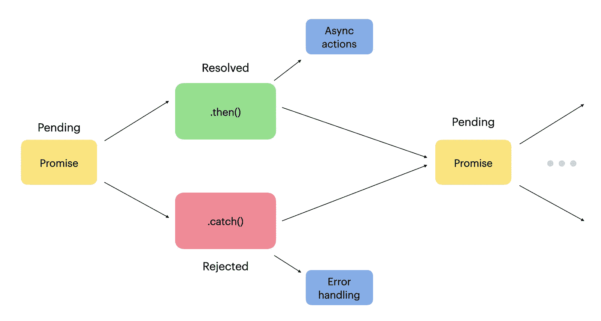
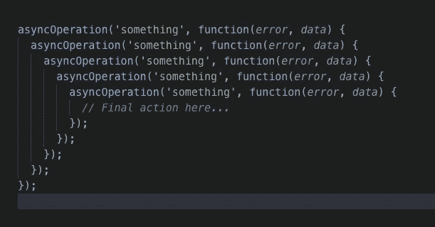
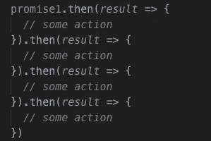
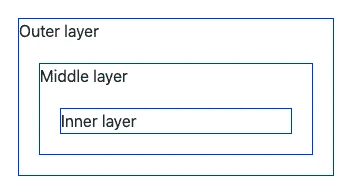
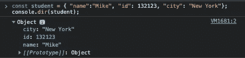

# 2021 年 100 个 JavaScript 面试问答

> 原文：<https://betterprogramming.pub/100-javascript-interview-questions-58e22e30f7f1>

## 赢得下一次编程面试


照片由 [Maranda Vandergriff](https://unsplash.com/@mkvandergriff?utm_source=medium&utm_medium=referral) 在 [Unsplash](https://unsplash.com?utm_source=medium&utm_medium=referral) 上拍摄

这里有一个全面的 100 个节目面试问题和答案的清单。除了面试之外，如果您正在为 JavaScript 考试而学习，这些也很方便。

即使您没有参加编程面试或考试，这个列表也是值得的——它涵盖了 JavaScript 的大部分重要概念。

让我们开始吧。

# 1.什么是 JavaScript？

JavaScript 是一种客户端/服务器端编程语言。JavaScript 可以插入到 HTML 中，使网页具有交互性，并支持用户参与。

# 2.JavaScript 中的提升是什么？

提升意味着所有的声明都被移动到范围的顶部。这发生在代码运行之前。

对于函数，这意味着您可以从作用域中的任何地方调用它们，甚至在它们被定义之前。

对于变量，吊装有点不同。它在范围的顶部为它们分配`undefined`。

例如，在定义变量之前调用它:

```
console.log(dog);
var dog = "Spot";
```

结果:

```
undefined
```

这可能令人惊讶，因为您可能预计它会导致错误。

如果您声明一个函数或变量，无论您在哪里声明，它总是被移到作用域的顶部。

# 3.isNan()函数的作用是什么？

您可以使用`isNan()`功能来检查值的类型是否是数字并且是`NaN`。

(是的，`NaN`是`number`型，尽管它的名字是“非数字”。这是因为它是一个隐藏的数字类型，尽管它没有数字值。)

例如:

输出:

```
Not a Number! Cannot be a weight.
220.00000000000003
```

# 4.JavaScript 中的负无穷大是什么？

在 JavaScript 中，如果用零除一个负数，就会得到负无穷大。

例如:

```
console.log(-10/0)
```

输出:

```
-Infinity
```

# 5.什么是未声明的变量？一个未定义的变量怎么样？

*   **未声明的变量**在程序中根本不存在。如果您的程序试图读取未声明的变量，则会引发运行时错误。

调用未声明变量的示例显然会导致错误:

```
console.log(dog);
```

输出:

```
error: Uncaught ReferenceError: dog is not defined
```

*   **未定义变量**在程序中声明，但没有值。如果程序试图读取未定义的变量，将返回一个未定义的值，并且应用程序不会崩溃。

未定义变量的一个例子是:

```
let car;
console.log(car);
```

输出:

```
undefined
```

# 6.JavaScript 中有哪些类型的弹出框？

三种弹出窗口分别是`alert`、`confirm`、提示。让我们看看每一个的示例用法:

## [警报](https://developer.mozilla.org/en-US/docs/Web/API/Window/alert)

例如:

```
window.alert("Hello, world!");
```

## [确认](https://developer.mozilla.org/en-US/docs/Web/API/Window/confirm)

例如:

```
if (window.confirm("Are you sure you want to go?")) {
  window.open("exit.html", "See you again!");
}
```

## [提示](https://developer.mozilla.org/en-US/docs/Web/API/Window/prompt)

例如:

```
let person = window.prompt("Enter your name");if (person != null) {
  console.log('Hello', person);
}
```

# 7.==和===有什么区别？

*   `==`比较数值
*   `===`比较值和类型

示例:

# 8.隐式类型强制是做什么的？举个例子。

隐式类型强制意味着在幕后将值从一种类型转换为另一种类型。当表达式的操作数属于不同类型时，会发生这种情况。

例如，字符串强制意味着对一个数字应用`+`运算符，字符串会自动将该数字转换为字符串。

例如:

但是在处理减法的时候，强制是反过来的。它将字符串转换成数字。

例如:

# 9.JavaScript 是静态类型语言还是动态类型语言？这是什么意思？

JavaScript 是动态类型的。

这意味着在运行时检查对象的类型**。**(在静态类型语言中，在编译时检查类型。)

换句话说，JavaScript 变量与类型无关。这意味着您可以毫无问题地更改数据类型。

```
var num = 10;
num = "Test";
```

在静态类型语言中，比如 C++，用这种方式将整数转换成字符串是不可能的。

# 10.JavaScript 中的 NaN 是什么？

`NaN`意为“非数字”。这意味着一个在 JavaScript 中不是正式数字的值。

可能令人困惑的是用`typeof()`函数对`NaN`进行类型检查的结果是`Number`。

```
console.log(typeof(NaN))
```

输出:

```
Number
```

为了避免混淆，使用`isNaN()`来检查一个值的类型是 NaN 还是 not number。

# 11.JavaScript 中的 spread 运算符是什么？

Spread 运算符允许将 iterables(数组/对象/字符串)扩展为单个参数/元素。让我们举个例子来看看这种行为，

```
function sum(a, b, c) {
  return a + b + c;
}const nums = [15, 25, 35];console.log(sum(...nums));
```

输出:

```
75
```

# 12.JavaScript 中的闭包是什么？

JavaScript 中的[闭包](https://javascript.plainenglish.io/closures-in-javascript-made-simple-afb0c7dab5f1)意味着内部函数可以访问外部函数的变量——即使外部函数已经返回。

例如，要创建一个自身递增 1 的计数器，可以使用闭包:

这里`createCounter()`是外部函数`increment()`是内部函数。现在您可以按如下方式使用它:

```
const add = createCounter();add();
add();
add();
```

输出:

```
1
2
3
```

这是因为存储内部函数`increment()`的`add`仍然可以访问`createCounter()`函数的`counter`变量。这是可能的，因为 JavaScript 的封闭性:内部函数可以访问外部函数的变量，即使外部函数已经返回。

# 13.JavaScript 中如何处理异常？

如果一个表达式**抛出**错误，你可以用`**try**…**catch**`语句来处理它们。

使用这种结构的想法是尝试运行一个表达式，比如一个有输入的函数，并捕捉可能的错误。

例如:

# 14.什么是网络存储？

Web storage 是一个 [API](https://medium.com/geekculture/what-is-an-api-73390e115b76) ，它为浏览器提供了一种将键值对存储到用户浏览器本地的方式。使用网络存储使这个过程比使用 cookies 更直观。

Web 存储提供了两种存储数据的方式:

*   **本地存储** —为客户端存储无截止日期的数据。
*   **会话存储** —仅存储一个会话的数据。浏览器一关闭，数据就没了。

以下是如何保存、访问和删除`sessionStorage`中的项目的示例:

下面是您如何使用`localStorage`完成同样的操作:

# 15.你为什么需要网络存储？

**网络存储**(问题 14) 使得在本地存储大量数据成为可能。关键是它不会影响网站的性能。

使用 web 存储，信息不会存储在服务器中。与 cookies 相比，这是一种更可取的方法。

# 16.什么是模块？

模块是可重用代码的单元。通常，您可以从模块中将有用的函数或构造函数导入到项目中。

从模块导入功能可能如下所示:

```
import { hello } from './modules/helloWorld.js';
```

# 17.JavaScript 中的“范围”是什么意思？

范围定义了“代码的可见性”。

更正式地说，作用域描述了变量、函数和其他对象在代码中的可访问位置。范围是在运行时在代码中创建的。

例如，块范围意味着花括号之间的“区域”:

```
if(true) {
   let word = "Hello";
}console.log(word); // ERROR OCCURS
```

这里，变量`word`除了在 if 语句中，不能从其他地方访问。

# 18.JavaScript 中有哪些高阶函数？

高阶函数对另一个函数进行运算。它要么接受一个函数作为参数，要么返回另一个函数。

例如:

```
function runThis(inputFunction) {
  inputFunction();
}

runThis(function() { console.log("Hello world") });
```

输出:

```
Hello world
```

另一个例子:

输出:

```
Hello world
```

# 19.JavaScript 中的“this”关键字是什么？

这是指对象本身。

例如:

输出:

```
Matt
```

为了让`getName()`方法在`student`对象中工作，对象必须访问它自己的属性。这可以通过对象中的`this`关键字来实现。

# 20.call()方法是做什么的？

`call()`方法可以用来调用一个对象对另一个对象的方法。

```
obj1.func.call(obj2)
```

例如:

输出:

```
Sofie
```

`Call()`方法也可以通过指定所有者对象来调用函数。

例如:

输出:

```
Hello Matt
```

`call()`也可以接受参数。

例如:

输出:

```
Hello Matt, you are awesome
```

# 21.什么是 apply()方法？

`apply()`方法与`call()`方法的作用相同。不同之处在于`apply()`方法接受数组形式的参数。

例如:

输出:

```
Hello John. How are you?
```

在生产线上:

```
let result = greet.apply(person, ['Hello', 'How are you?']);
```

在`greet()`功能中`‘Hello’`被分配给`greeting`而`‘How are you?’`被分配给`message`。

# 22.bind()方法是什么？

`bind()`方法返回一个新函数，它的`this`已经被设置为另一个对象。

与`apply()`和`call()`不同，`bind()`不会立即执行功能。相反，它返回函数的新版本，其`this`被设置为另一个值。

让我们看一个例子:

这样**不会**印出名字`“John”`，而是印出`undefined`。为了理解为什么会发生这种情况，请以同样的方式重写最后一行:

```
let func = person.getName;
setTimeout(func, 1000);
```

`setTimeout()`从`person`对象单独接收函数**，但没有`person`的名称。因此当`setTimeout()`调用`person.getName`时，`name`就是`undefined`。**

**要解决这个问题，您需要将`getName()`方法绑定到`person`对象:**

```
let func = person.getName.bind(person);
setTimeout(func, 1000);
```

**输出:**

```
John
```

**让我们来看看这种方法是如何工作的:**

*   **`person.getName`方法被绑定到`person`对象。**
*   **绑定函数`func`现在将其`this`值设置为`person`对象。当您将这个新绑定的函数传递给`setTimeout()`函数时，它知道如何获得`person`的`name`。**

# **23.什么是 currying？**

****curry**是指将一个有 n 个自变量的函数，转化为 n 个一个或更少自变量的函数。**

**例如，假设您有一个对两个数字求和的函数`add()`:**

```
function add(a, b) {
    return a + b;
}
```

**您可以通过以下方式调用此函数:**

```
add(2,3)
```

**接下来让我们来看看这个函数:**

```
function add(a) {
  return function(b) {
    return a + b;
  }
}
```

**现在，您可以通过以下方式调用这个 curried 函数:**

```
add(2)(3)
```

**Currying 不会改变函数的行为。它改变了调用的方式。**

# **24.JavaScript 中的承诺是什么？**

**承诺是一个可能在未来产生价值的对象。**

**承诺总是处于一种可能的状态:履行、拒绝或待定。**

**创建一个承诺看起来像这样:**

```
const promise = new Promise(function(resolve, reject) {
    // implement the promise here
})
```

**例如，让我们创建一个承诺，在被呼叫后两秒钟就解决了。**

```
const promise = new Promise(resolve => {
  setTimeout(() => {
    resolve("Hello, world!");
  }, 2000);
}, reject => {});
```

**现在，promises 的关键是您可以在 promises 通过使用`.then()`方法解决后立即执行代码:**

```
promise.then(result => console.log(result));
```

**输出:**

```
Hello, world!
```

**承诺可以链接在一起，这样一个解决的承诺返回一个新的承诺。**

**这是一个承诺的流程图，也说明了如何将它们联系起来:**

****

# **25.为什么要用承诺？**

**在 JavaScript 中，承诺对异步操作很有用。**

**在过去，人们必须用回调来处理异步操作，也就是说，在操作完成后立即执行函数。这造成了“回调地狱”，一个嵌套回调的金字塔形状的代码。**

****

**承诺通过减少回调地狱和编写更干净的代码为回调提供了另一种方法。这是可能的，因为承诺可以通过以下方式链接:**

****

# **26.JavaScript 中的回调函数是什么？**

**回调函数是作为参数传递给另一个函数的函数。这个函数在传递给它的函数内部执行，当某个动作完成时就“回调”它。**

**让我们来看一个例子:**

**这段代码提示您输入一个名字，当您输入这个名字时，它会对这个名字说“Hello”。所以回调函数，在本例中是`greetName`，只在你输入名字后执行。**

# **27.为什么在 JavaScript 中使用回调？**

**回调是有用的，因为 JavaScript 是一种事件驱动的语言。换句话说，它不是等待响应，而是在监听其他事件的同时继续执行。**

**上面的例子展示了 JavaScript 中回调的用处:**

# **28.JavaScript 中的严格模式是什么？**

****严格模式**允许你设置你的程序在一个严格的上下文中运行。这阻止了采取某些行动。此外，还会引发更多异常。**

**表达式`"use strict";`告诉浏览器启用严格模式。**

**例如:**

```
"use strict";
number = 1000;
```

**这将导致一个错误，因为严格模式阻止您向未声明的变量赋值。**

# **29.什么是立即调用的函数？**

**被立即调用的函数(IIFE)在被定义后立即运行。**

**例如:**

```
(function(){ 
  // action here
})();
```

**要理解生活是如何运作的，请看它周围的括号:**

*   **当 JavaScript 看到关键字`function`时，它假设有一个函数声明即将到来。**
*   **但是上面的声明是无效的，因为函数没有名字。**
*   **为了解决这个问题，使用声明周围的第一组括号。这告诉解释器这是一个函数表达式，而不是一个声明。**

```
(function (){
   // action here;
})
```

*   **然后，为了调用函数，需要在函数声明的末尾添加另一组括号。这类似于调用任何其他函数:**

```
(function (){
  // action here
})();
```

# **30.什么是饼干？**

**cookie 是存储在计算机上的一个小数据包。**

**例如，网站可以在访问者的浏览器上放置 cookies，以便在用户下次访问该页面时记住登录凭证。**

**在幕后，cookies 是具有键值对的文本文件。要创建、读取或删除 cookies，请使用`document.cookie`属性。**

**例如，让我们创建一个保存用户名的 cookie:**

```
document.cookie = "username=foobar123";
```

# **31.为什么在 JavaScript 中使用严格模式？**

**严格模式有助于编写“安全”的 JavaScript 代码。这意味着糟糕的语法实践会转化为真正的错误。**

**例如，严格模式禁止创建全局变量。**

**要声明严格模式，请在您希望处于严格模式的语句前添加`‘use strict’;`语句:**

```
'use strict';
const sentence = "Hello, this is very strict";
```

# **32.双惊叹号是做什么的？**

**在 JavaScript 中，双感叹号将任何东西转换为布尔值。**

**这是因为 JavaScript 中的任何东西本质上都是“真”或“假”的。**

# **33.如何删除属性及其值？**

**您可以使用`delete`关键字从对象中删除属性及其值。**

**让我们来看一个例子:**

```
var student = {name: "John", age:20};
delete student.age;
console.log(student);
```

**输出:**

```
{name: "John"}
```

# **34.如何在 JavaScript 中检查变量的类型？**

**使用`typeof`操作器。**

```
typeof "John Abraham"  // Returns "string"
typeof 100             // Returns "number"
```

# **35.JavaScript 中什么是 null？**

**`null`代表没有价值。它强调了变量不指向任何对象。**

**`null`的类型是一个`object`:**

```
var name = null;
console.log(typeof(name))
```

# **36.空 vs 未定义？**

## **空**

**`null`:**

*   **是一个指示变量不指向任何对象的值。**
*   **属于类型`object`。**
*   **表示 null、空或不存在的引用。**
*   **表示缺少变量值。**
*   **通过原始操作转换为`0`。**

## **不明确的**

**`undefined`:**

*   **代表已声明但没有值的变量的值**
*   **属于类型`undefined`。**
*   **表示变量不存在。**
*   **通过原始操作转换为`NaN`。**

# **37.可以用 JavaScript 访问历史吗？**

**是的，这是可能的。您可以通过包含浏览器历史记录的`window.history`访问历史记录。**

**要检索上一个和下一个 URL，请使用以下方法:**

```
window.history.back()
window.history.forward()
```

# **38.什么是全局变量？**

**代码中到处都有全局变量。**

**要创建全局变量，请省略 var 关键字:**

```
x = 100; // Creates a global variable.
```

**同样，如果你在任何函数之外使用`var`创建一个变量，你就创建了一个全局变量。**

# **39.JavaScript 和 Java 有关系吗？**

**没有。**

**它们是两种不同的编程语言，彼此毫无关系。**

# **40.什么是 JavaScript 事件？**

**事件是发生在 HTML 元素上的事情。当在 HTML 页面中使用 JavaScript 时，它可以对事件做出反应，比如按钮点击。**

**让我们创建一个 HTML 页面，其中有一个按钮，当单击该按钮时，会出现一个警告:**

# **41.preventDefault()方法是做什么的？**

**`preventDefault()`取消方法。名称`preventDefault`很好地描述了这种行为。它防止事件采取默认行为。**

**例如，您可以在单击“提交”按钮时阻止表单提交:**

# **42.setTimeout()方法是什么？**

**`setTimeout()`方法在指定的毫秒数后调用一次函数。例如，让我们在一秒钟后记录一条消息(`1000ms`):**

```
setTimeout(function() {
    console.log("Good day");
}, 1000);
```

# **43.setInterval()方法是什么？**

**`setInterval()`方法以自定义的时间间隔周期性地调用一个函数。**

**例如，让我们定期每秒记录一条消息:**

```
setInterval(function() {
    console.log("Good day");
}, 1000);
```

# **44.什么是 ECMAScript？**

**ECMAScript 是构成 JavaScript 基础的脚本语言。**

**ECMAScript 由 ECMA 国际标准组织标准化(查看 [ECMA-262](https://www.ecma-international.org/publications-and-standards/standards/ecma-262/) 和 [ECMA-402](https://www.ecma-international.org/publications-and-standards/standards/ecma-402/) 规范)。**

# **45.JSON 是什么？**

**JSON (JavaScript Object Notation)是一种用于交换数据的轻量级数据格式。**

**例如，这里有一个 JSON 对象:**

```
{
    'name': 'Matt',
    'address': 'Imaginary Road 22',
    'age': 32,
    'married': false,
    'hobbies': ['Jogging', 'Tennis', 'Padel']
}
```

**JSON 的语法规则是:**

*   **数据是以键值对的形式存在的。**
*   **数据用逗号分隔。**
*   **花括号定义了一个对象。**
*   **方括号定义一个数组。**

# **46.JSON 用在哪里？**

**当向和服务器发送数据时，数据必须是文本格式，反之亦然。**

**JSON 是一种纯文本格式，允许向服务器发送数据，也允许从服务器向浏览器发送数据。几乎所有编程语言都支持 JSON，所以它也可以用于其他语言。**

# **47.为什么要用 JSON stringify？**

**当你向服务器发送数据时，它必须是一个字符串。**

**要将 JavaScript 对象转换成字符串，可以使用`JSON.stringify()`方法。**

```
var dataJSON = {name: "Matt", age: 51};
var dataString = JSON.stringify(dataJSON);console.log(dataString);
```

**输出:**

```
'{"name":"Matt","age":51}'
```

# **48.如何将 JSON 字符串转换成 JSON 对象？**

**当你从服务器接收数据时，它总是字符串格式。要将 JSON 字符串转换成 JavaScript 对象，可以使用`JSON.parse()`方法。**

```
var data = '{"name":"Matt", "age":51}';
var dataJSON = JSON.parse(data);console.log(dataJSON);
```

**输出:**

```
{
    name:"Matt",
    age:51
}
```

# **49.如何给一个变量赋一个默认值？**

**在赋值中使用逻辑运算符`||`来提供默认值。**

```
const a = b || c;
```

**这样，如果`b`为假，那么`c`将被分配给`a`。(Falsy 表示`null`、`false`、`undefined`、`0`、空串或`NaN`。)**

# **50.你能为一个函数定义属性吗？**

**是的，因为函数也是对象。**

**让我们来看一个例子:**

```
let func = function(x) {

};func.property1 = "Hello there";console.log(func.property1);
```

**输出:**

```
Hello there
```

# **51.承诺中的 race 方法是什么意思？**

**`Promise.race()`方法返回先解决或拒绝的承诺。**

**让我们用一个例子来说明，第二个承诺比第一个承诺解决得更快:**

**输出:**

```
the second promise was faster
```

# **52.promise.all()方法是做什么的？**

**`Promise.all`是一个接受承诺数组作为输入的承诺。它在以下情况下得到解决:**

*   **要么所有输入承诺都得到解决。**
*   **或者他们中的任何一个被拒绝。**

**例如，`promise.all`等待所有这三个承诺完成:**

**一秒钟后的输出:**

```
["Yay", 10, 100]
```

# **53.eval()函数是什么？**

**`eval()`函数评估字符串中的代码。要计算的字符串可以是表达式、变量、语句或语句序列。**

**例如:**

```
console.log(eval("5+10"));
```

**输出:**

```
15
```

# **54.什么是事件冒泡？**

**在事件冒泡中，事件通过在最里面的元素上运行事件处理程序开始。然后它触发父元素的事件处理程序，直到它到达最外面的元素。**

**最好的方法是创建一个包含 div 的 HTML 文档:**

**在每个`div`中，都有一个 JavaScript `alert`，当单击 div 时会被触发。**

**结果页面如下所示:**

****

**如果您现在单击`Inner layer`，它将触发分配给该 div 的`alert`，并触发父 div 的警报。**

# **55.什么是时间死区？**

**时间死区意味着变量的不可及性，即使它已经在作用域中。**

**让我们首先来看看，当您试图将一个未初始化的变量记录到控制台时会发生什么:**

```
console.log(x);
var x = "Yay";
```

**输出:**

```
undefined
```

**您可能认为这会导致错误，但是它会打印出`undefined`。**

**发生这种情况是因为提升，这意味着所有的声明都被移动到范围的顶部。由于提升的原因，上面的代码表现如下:**

```
var x;console.log(x);
x = "Yay";
```

**这里`undefined`被自动赋给顶部的变量。这使得在定义它之前使用它成为可能。**

**但是让我们看看当我们用`let`代替`var`做同样的事情时会发生什么:**

```
console.log(x);
let x = 10;
```

**输出:**

```
error: Uncaught ReferenceError: Cannot access 'x' before initialization
```

**这是因为`let`与`var`的吊装方式不同。当`let`变量被提升时，它不会变成`undefined`。相反，在它被赋值之前，它是不可到达的，或者处于暂时的死区。**

# **56.什么是 URI？**

**URI 或统一资源标识符是一组用于区分资源的字符。URIs 允许互联网协议在资源之间执行动作。**

**URI 可能是这样的:**

```
hello://example.com:8042/there?name=jack#sumthing
```

# **57.什么是 DOM？**

**当网页加载后，浏览器为该页面创建一个 DOM。这给了 JavaScript 创建动态 HTML 的能力。**

**DOM 或文档对象模型充当 HTML 文档的 API。它定义了文档的结构。它还指定了如何访问和修改文档。**

# **58.文档加载 vs DOMContentLoaded？**

*   **当 HTML 文档被加载和解析后，触发`DOMContentLoaded`事件。它不会等待资产(比如样式表和图像)。**
*   **只有在加载了整个页面(包括所有资产)之后，才会触发文档加载事件。**

**例如，下面是如何使用 DOMContentLoaded 来通知 DOM 何时已完全加载:**

```
window.addEventListener('DOMContentLoaded', (event) => {
    console.log('DOM is now loaded!');
});
```

**下面是一个示例，说明如何在加载特定页面时添加监听器:**

```
window.addEventListener('load', (event) => {
  console.log('The page is now loaded!');
});
```

# **59.HTML 属性 vs DOM 属性？**

**当你写 HTML 的时候，你可以定义 HTML 元素的属性。然后，当您用浏览器打开页面时，您的 HTML 代码将被解析。此时，创建了一个 DOM 节点。这个 DOM 节点对应于您刚刚编写的 HTML 文档。这个 DOM 节点是一个具有属性的对象。**

**例如，这个 HTML 元素:**

```
<input id="my-input" type="text" value="Name:">
```

**有三个属性，`id`、`type`和`value`。**

**当浏览器解析这个 HTML 元素时**

*   **它获取这个`input`字段并从中烘焙一个`[HTMLInputElement](https://developer.mozilla.org/en-US/docs/Web/API/HTMLInputElement)`对象。**
*   **这个物体有`accept`、`accesKey`、`align`等几十种属性。**
*   **它还将一些原始的 HTML 属性转化为属性，比如`id`和`type`。但是例如,`value`属性并不引用`value`属性。**

# **60.什么是同源政策？**

**同源策略是一种有价值的安全机制。它防止 JavaScript 在域边界上发出请求。**

**来源是指 URI 方案、主机名和端口号。同源策略使得一个页面上的脚本无法访问另一个页面上的敏感数据。**

# **61.JavaScript 是编译语言还是解释语言？**

**JavaScript 是一种解释型语言。**

**浏览器中的解释器读取 JavaScript 代码，解释每一行并运行它。**

# **62.JavaScript 是区分大小写的语言吗？**

**JavaScript 是一种区分大小写的语言。**

**关键字、变量、函数名等等需要一致的大写。**

**为了演示，这段代码是有效的**

```
let i = 1;while(i < 2) {
  console.log(i);
  i++;
}
```

**但事实并非如此，因为`while`是大写的，尽管它不应该大写。**

```
**let** i = 1;WHILE(i < 2) {
  console.log(i);
  i++;
}
```

# **63.JavaScript 中有多少线程？**

**JavaScript 使用单线程。它不允许编写解释器可以在多个线程或进程中并行运行的代码。**

**这意味着它按顺序执行代码，并且必须先执行完一段代码，然后才能执行下一段。**

**一个很好的例子就是在网页上显示一个警告。一旦警报弹出，您将无法与页面进行交互，直到警报关闭。**

```
alert("Hello there!");
```

# **64.“break”语句是做什么的？**

**`break`语句跳出循环，继续执行循环外的代码。**

**例如，该循环在遇到数字`5`后终止:**

```
Number is 0
Number is 1
Number is 2
Number is 3
Number is 4
Yay
```

# **65.“继续”语句是做什么的？**

**`continue`语句跳过一轮循环。**

**例如，此循环跳过数字 2 和 3:**

**输出:**

```
0
1
4
```

# **66.什么是正则表达式？**

**正则表达式，也称为 [regex](https://www.codingem.com/regex/) 或 [regexp](https://www.codingem.com/regex/) ，是构成搜索模式的一组字符。它是 JavaScript 和其他编程语言中常用的模式匹配工具。**

**例如，让我们使用正则表达式从字符串中查找任意数字:**

**输出是所有匹配的数组:**

```
[100] 
```

**例如，regex 可用于在大型文本文件中搜索电子邮件或电话号码。**

# **67.调试代码时断点的用途是什么？**

**断点允许您在 JavaScript 代码中找到错误。**

**当执行调试器语句并出现调试器窗口时，可以在代码中设置断点。**

**在断点处，JavaScript 停止执行，让您检查值和范围以解决可能的问题。**

# **68.什么是条件运算符？**

**一个**条件操作符**是写 if-else 语句的速记。条件运算符有时也称为三元运算符。**

**例如:**

# **69.可以链条件运算符吗？**

**是的，这是可能的。有时它会很有用，因为它可以使代码更容易理解。**

**让我们来看一个例子:**

# **70.freeze()方法是做什么的？**

**方法冻结一个对象。它使一个对象不可变。**

**冻结一个对象后，不能再向其添加新属性。**

**例如:**

```
const item = { name: "test" };Object.freeze(item);
item.name = "Something else"; // Error
```

# **71.如何获取一个对象的键列表？**

**使用`Object.keys()`方法。**

**例如:**

**输出:**

```
["name", "gender", "age"]
```

# **72.JavaScript 的原始数据类型有哪些？**

**原始数据类型有一个原始值。JavaScript 中有七种不同的原始数据类型:**

1.  **`string`——文字。比如`“John”`。**
2.  **`number` —数值。比如`12`。**
3.  **`boolean` —对或错。比如`true`。**
4.  **`null` —缺少值。比如`let x = null`；**
5.  **`undefined`—声明了变量但没有值的类型。例如，当这样创建变量 x`let x;`时，`x`变成了`undefined`。**
6.  **`bigint` —表示大于`2^53–1`的整数的对象。例如`BigInt(121031393454720292)`**
7.  **`symbol` —用于创建独特符号的内置对象。例如`let sym1 = Symbol(‘test’)`**

# **73.有哪些方法可以访问对象的属性？**

**有三种方法可以访问属性。**

*   **点符号。**

**例如:**

```
obj.property
```

*   **方括号符号。**

**例如:**

```
obj["property"]
```

*   **表达式符号。**

**例如:**

```
obj[expression]
```

# **74.页面加载后如何执行 JavaScript 代码？**

**有三种方法可以做到这一点:**

*   **将属性`window.onload`设置为页面加载后执行的函数:**

```
window.onload = function ...
```

*   **将属性`document.onload`设置为页面加载后执行的函数:**

```
document.onload = function ...
```

*   **将 HTML 属性的`onload`属性设置为 JS 函数:**

```
<body onload="script();">
```

# **75.什么是错误对象？**

**一个**错误对象**是一个内置对象，如果发生错误，它会给你详细的错误信息。**

**错误对象有两个属性:**

*   **`name`**
*   **`message`**

**例如，让我们假设`sayHi()`函数抛出一个错误。当这种情况发生时，`catch`块给你一个`error`对象，你可以打印到控制台。**

```
**try** {
  sayHi("Welcome");
}
**catch**(error) {
  console.log(error.name + "\n" + error.message);
}
```

# **76.NoScript 标签是做什么的？**

**Noscript 标签用于检测禁用 JavaScript 的浏览器并对其做出反应。**

**您可以使用 noscript 标记来执行一段通知用户的代码。**

**例如，您的 HTML 页面可以有这样一个`noscript`标签:**

# **77.什么是入口控制循环？**

**在进入控制循环中，条件在进入循环体之前被测试。**

**例如，For 循环和 while 循环就属于这一类:**

```
let nums = [1,2,3];for (let num of nums) {
    console.log(num);
}
```

**输出:**

```
1
2
3
```

# **78.什么是退出控制循环？**

**在退出控制循环中，在循环结束时对条件进行评估。这意味着不管条件是`true`还是`false`，循环体至少执行一次。**

**例如，do-while 循环就属于这一类:**

```
const i = 0;do {
  console.log('The number is', i);
} while (i !== 0);
```

**输出:**

```
The number is 0
```

# **79.什么是匿名函数？**

**匿名函数是没有名字的函数。**

**匿名函数通常被赋予一个变量名或者被用作回调函数。**

**下面是一个带有名称的函数供参考:**

```
function example(params) {
    // do something
}
```

**这是一个赋给变量的匿名函数:**

```
const myFunction = function() {
    // do something
};
```

**这是一个用作回调的匿名函数:**

```
[1, 2, 3].map(function(element) { 
     // do something
});
```

# **80.什么是迭代器？**

****迭代器**协议使得对象生成一系列值成为可能。**

**迭代器必须实现`next()`方法来获取序列中的下一个值。这个方法会传回具有的物件**

*   **`value` —迭代序列中的下一个值**
*   **`done`—如果该值是序列中的最后一个，则为`true`。如果不是，那就是`false`。**

**下面是一个创建和使用迭代器的例子。这个函数实现了一个可以被`rangeIter(1,5)`调用的范围迭代器，并打印值`1 2 3 4`。**

# **81.什么是可迭代的？**

**iterable 协议意味着一个对象可以被迭代，从而实现迭代器协议(问题 80。)**

**换句话说，您可以在任何 iterable 上使用`for...of`循环来遍历它生成的值序列。**

**例如，`Array`或`Map`在 JavaScript 中是可迭代的，但`Object`不是。**

**下面是一个对数组应用 for…of 循环的示例，该数组本质上是可迭代的:**

```
const nums = [1,2,3];for (let num of nums) {
    console.log(num);
}
```

**输出:**

```
1
2
3
```

# **82.什么是发电机？**

**生成器是迭代器的替代物。你可以用非连续执行来编写迭代代码。换句话说，生成器功能的执行可以暂停。**

**使用`function*`语法定义生成器。它们不是返回值，而是`yield`值。**

**创建后，生成器不会执行它们的代码。相反，它们返回一个生成器对象，本质上是一个迭代器。当您在生成器对象上调用`next()`时，它会运行代码，直到遇到一个`yield`语句，然后停止。**

**例如，这里有一个生成器，它与上面迭代器部分中的迭代器完全相同:**

**在迭代器示例中，`rangeIter`函数比`rangeIter`更容易阅读。然而两者做着完全相同的事情。**

# **83.什么是 for of 循环？**

**For…of 循环可用于在 JavaScript 中迭代可迭代对象。**

**例如，您可以使用 for…of 循环打印数组的内容:**

```
const nums = [1,2,3];for (const num of nums) {
    console.log(num);
}
```

**输出:**

```
1
2
3
```

# **84.什么是 nodejs？**

**`Node.js`建立在 Chrome 的 JS 运行时之上。这是一个以可伸缩的方式构建网络应用的平台。**

# **85.什么是事件循环？**

**事件循环是回调函数的队列。它处理所有的异步回调。**

**当异步函数执行时，回调函数被推入队列。在异步任务完成之前，JavaScript 引擎不会触发事件循环。**

**例如，事件循环的结构可能如下所示:**

```
while (queue.waitForMessage()) {
    queue.processNextMessage();
} 
```

# **86.什么是一元运算符？**

**一元`+`运算符用于将变量转换为数字。**

**如果变量不能转换，就转换成`NaN`(这是作为`number`的特例，所以类型还是`number`)。**

**例如:**

**输出:**

```
string, number
string, number, NaN
```

# **87.如何对数组的元素进行排序？**

**使用`sort()`对数组中的项目进行排序。这不会创建一个新数组，而是对原始数组进行“就地”排序，即直接修改它。**

```
let months = ["Adam", "Sam", "Jack", "Bill"];
months.sort();console.log(months);
```

**输出:**

```
["Adam", "Bill", "Jack", "Sam"]
```

# **88.什么是 TypeScript？**

**[TypeScript](https://www.typescriptlang.org/) 是带有类型的 JavaScript。它是微软创建的 JavaScript 的超集。**

**TypeScript 将可选类型、类、async/await 等类型添加到普通 JavaScript 中。**

**下面是一个简单的 TypeScript 函数示例:**

**类型信息在函数的参数类型和返回类型中显式表达。**

# **89.JavaScript 中的构造函数是什么？**

**构造函数是一种创建和初始化类对象的方法。当你从一个类中实例化一个新的对象时，它被执行。**

**例如:**

**输出:**

```
Mike
```

# **90.ES6 是什么？**

**ES6 (ECMAScript 6)是 JavaScript 编程语言的第六个版本。它发布于 2015 年 6 月。**

# **91.什么是模板文字？**

**模板文字允许您将表达式直接嵌入到字符串中。**

*   **当使用模板文本时，不要用引号声明字符串，而是使用反勾号(`)。**
*   **要将一个变量或表达式嵌入到字符串中，你需要在`${}`之间添加它**

**例如:**

```
console.log(`This is the ${10 * 10}th time`)
```

**输出:**

```
This is the 100th time
```

# **92.没有第三个变量，你怎么能交换两个变量呢？**

**使用析构从数组中提取值。这也可以用来交换两个变量，而不需要第三个助手:**

```
let a = 1;
let b = 2;[a, b] = [b, a];console.log(a, b)
```

**输出:**

```
2 1 
```

# **93.什么是数组缓冲区？**

**`ArrayBuffer`是通用的固定长度二进制数据缓冲器。**

```
let buffer = new ArrayBuffer(16);console.log(buffer.byteLength)
```

**输出:**

```
16 
```

# **94.什么是原型？**

**所有 JavaScript 对象都从原型继承属性。**

**例如:**

*   **数学对象从`Math`原型继承属性**
*   **数组对象从`Array`原型继承属性。**

**原型是一个对象的特征。它描述了与之相关的属性。它充当一个对象的蓝图。**

**例如，您可以访问一个对象的`prototype`来向一个对象构造函数添加一个新属性，例如:**

```
function Fruit(name, weight) {
  this.name = name;
  this.weight = weight;
}Fruit.prototype.description = "Yum!";
```

# **95.什么是箭头函数？**

**箭头函数为在 JavaScript 中创建函数提供了一种快捷方式。**

**只能在函数表达式中使用箭头函数。**

**下面是常规函数和箭头函数的比较:**

*   **箭头函数是在没有`function`关键字的情况下声明的。**
*   **如果只有一个(返回)表达式，就不需要使用`return`关键字。**
*   **在上面，花括号也不见了。只有当 arrow 函数只包含一个表达式时，这才是可能的。如果还有更多，那么你需要在箭头后面加上花括号。**

# **96.dir()方法有什么用？**

**`console.dir()`将 JavaScript 对象属性的交互式列表显示为 JSON。**

**例如:**

```
const student = { "name":"Mike", "id": 132123, "city": "New York"};
console.dir(student);
```

**在控制台中产生以下交互式列表:**

****

# **97.如何禁用网页上的右键单击？**

**您可以通过从`body`元素的`oncontextmenu`属性中返回`false`来禁用网页上的右键单击。**

```
<body oncontextmenu="return false;">
```

# **98.什么是一元函数？**

**一元函数是只接受一个参数的函数。**

**例如:**

```
function greet(name){
    console.log('Hello', name);
}
```

# **99.什么是纯函数？**

**纯函数是一个无论何时何地被调用都返回相同结果和相同参数的函数。如果一个函数不依赖于程序执行过程中的状态或数据变化，那么它就是纯函数。**

**例如，计算圆的面积的函数是纯函数:**

```
function circleArea(radius) {
  return Math.PI * Math.pow(radius, 2);
}
```

# **100.什么是对象析构？**

**对象析构是从对象(或数组)中提取属性的一种方式。**

**在 ES6 之前，您需要这样做来提取对象的属性:**

**但是从 ES6 开始，你可以用一行代码通过使用对象析构来实现:**

# **结论**

**感谢阅读。我希望你喜欢它。**

**我祝你面试或考试好运。**

**编码快乐！**

# ****参考文献****

**[](https://devdocs.io/javascript/) [## DevDocs

### JavaScript API 文档，包括即时搜索、离线支持、键盘快捷键、移动版本等等。

devdocs.io](https://devdocs.io/javascript/) [](https://developer.mozilla.org/en-US/docs/Web/JavaScript) [## JavaScript | MDN

### JavaScript (JS)是一种轻量级、解释型或即时编译的编程语言，具有一流的…

developer.mozilla.org](https://developer.mozilla.org/en-US/docs/Web/JavaScript)**