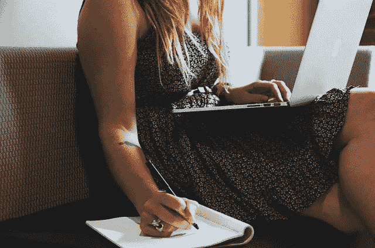

# 没有人谈论在家工作的 11 个好处

> 原文：<https://betterprogramming.pub/11-benefits-of-working-from-home-nobody-talks-about-fb0e6d0f1a7b>

## 这些是人们很少谈论的事情

*图片由*[*StartupStockPhotos*](https://pixabay.com/users/startupstockphotos-690514/?utm_source=link-attribution&utm_medium=referral&utm_campaign=image&utm_content=593357)*从* [*Pixabay*](https://pixabay.com/?utm_source=link-attribution&utm_medium=referral&utm_campaign=image&utm_content=593357)

这些是人们很少谈论的事情。

我已经在家工作了 13 年，除了为一家百货公司回复客户服务邮件和几个月的酒吧招待之外，我一直都是全职工作。

当 2020 年到来，各地的办公室都关门大吉时，我告诉妻子，这是我们生来就该有的时刻:她是全职妈妈，我是在家工作的爸爸。从专业角度来说，我们一整年都没有错过任何一个节拍。

当然，网上的话题很快就转移到了在家工作的技巧、在家工作的优势等等。等。等。

我被许多这样的事情逗乐了，仅仅因为这一代工人第一次发现了我从 2008 年春天——在我拿到大学文凭的前一个月——就开始喜欢在家工作的事情。

但最让我开心的是，所有这些 WFH 的文章都大同小异。“不用通勤！”“没有着装要求！”“白天健身的自由！”

这些都是在家工作的巨大好处，不要误会我的意思。

但是拍摄…有这么多。

事实上，我认为我最喜欢的在家工作的好处并不典型。例如，我不介意通勤。

所以，让我们来谈谈在家办公的好处，因为在家办公不会受到太多的压力…

# 我可以随时换衣服

在我坐下之前，我就这样做了。

我住在威斯康星州。这里的天气变化比我们换裤子还频繁。在寒冷的早晨醒来，到了下午却变得闷热，这种情况并不少见。或者潮湿的一天在一个小时内变成了寒冷多雨的下午。

今天早上醒来的时候，我有点冷。不是一吨，但足以让我光着膀子不舒服。我穿了短裤，但在上面穿了一件连帽衫。工作了几分钟后，我穿上了薄袜子，以消除脚趾上的寒意。

但是午饭后，我煮了一杯咖啡，发现自己正在热身。我漫不经心地走进我的卧室，打开我的梳妆台抽屉，把帽衫放好，抓起一件 t 恤换上。

我脱下袜子，把它们放在我桌子旁边的地板上。

在办公室工作需要你了解天气，并据此制定计划。“我应该穿多层吗？或许在办公室放一件运动衫，以防万一？如果我今天穿这件衬衫会太热怎么办？我应该换个时间穿，对吗？”

我不会花太多时间去考虑当天该穿什么，因为如果有必要的话，我会花 30 秒去大厅换衣服。

# 没有鞋子

你知道在漫长的一天结束时，当你脱掉鞋子和袜子放松时，当你让脚呼吸时，你会有什么感觉吗？

我没必要那么做。

在家工作没有着装要求的优势是众所周知的，我也赞成这一点。我也不介意打扮，所以着装规范不是我想死在上面的一座大山。

但是，鞋袜是另一回事。

我更喜欢尽可能赤脚。我想要舒适，我想要我的脚能呼吸。

不用穿鞋是世界上最棒的事情。

# 家庭浴室

我们都是成年人了。我将涉及一个敏感的话题，对此我们需要坦诚。

我们都喜欢用家里的厕所。

事实就是如此。我们在这里很舒服。我们不必担心某个恶心的同事把酒吧弄得臭气熏天。

每当你走进家里的浴室，即使你身边有配偶和孩子，你也知道会发生什么。

我在家里的马桶上很舒服。我不用担心会不会有别人走进来。我不必对廉价的卫生纸畏缩不前。我不必担心我会从一个表面上染上什么东西，因为我在下班后会把它托付给一个清洁工。

它是我的。

从幼儿园开始，我就对公共浴室有一种健康的厌恶。现在我几乎再也不用担心这个了。

# 家常菜

这是这个列表中最接近“典型”利益的东西，但是我会用它来运行。

能够在家做午餐——新鲜的——太棒了。

你知道什么比用微波炉加热热狗更好吗？在烤架上加热的热狗。

或者有什么比在锅里快速搅拌一些炒饭更好的呢？

或者在午休前往速食锅里扔些鸡肉？

当然，很多天我仍然在加热剩菜或者做三明治。这没什么不对。

但是，在午休时间选择做一顿真正的饭，几乎肯定比不得不考虑以后如何打包和加热午餐更健康，压力也更小。

# 有什么东西坏了吗

我在大学期间工作过的一个办公室，我有固定的休息时间:早上 15 分钟，中午 30 分钟吃午饭，下午 15 分钟。

这后来演变成了中午一次 60 分钟的休息。

这很束缚人，很难决定该做什么。你看了几篇博客，去了趟洗手间，你的休息时间已经结束了。

在家工作是一个不同的故事，因为我可以随时随地休息。

是的，这可以被滥用。我明白了。

但更多的时候，这种能力让我能够做得更好。

如果现在是上午 9:30，我正在努力集中精力工作，我可能会在手表上设置一个计时器，躺在桌子下面的地板上，小睡 15 分钟。

或者对我来说，这种情况并不少见，我会停止一切，跑上几英里。

这是在家工作的真正优势，但却没有被充分讨论。我可以好好休息一下。

# 扬声器播放音乐

这里有一个简单的。

一周中有很多天，我妻子会带着我们的三个孩子出门去办些事情或者去看望她的母亲。

这时，我会丢掉降噪耳机，用扬声器播放我的音乐。

是的，戴上耳机更容易集中注意力。

但是有时候你就是不想戴耳机，但是你确实希望能够把东西塞到耳朵里。

如果你在小隔间里工作，你就不能在户外播放音乐。在这里，你可以。

# 当我需要新鲜空气时

利用这些休息时间，我甚至可以利用我的位置，走出后门，在车道上走上走下。

没有什么能像在户外一样让你头脑清醒，充满能量。

上午 10 点左右，当邮车经过时，我会很兴奋，因为这给了我一个借口跑到外面去享受一两分钟的阳光和新鲜空气。

# 我可以准备晚餐

如此多的订阅餐盒都附带提醒“你没有时间从头开始做饭！”

如果你在家工作，你会的。

我可以在早上 9 点前把食物放进慢炖锅，如果食谱要求烹饪时间更短，甚至可以在中午前。

我可以在下午 2 点决定我们晚餐应该吃什么，跑到地下室把肉从冰箱里拿出来，然后把它放在一大碗水中解冻，等我准备好以后再用它工作。

烹饪是我的爱好之一，所以我喜欢在完成工作后能马上下厨。我们可以在不被强迫方便的情况下享用美食。

# 完全控制我的环境

当我写这篇文章时，我办公室的窗户关着，吊扇开着。

后来，我可能会打开窗户，关掉风扇。

或者我可以插上暖气。

没关系。我不用和任何人争论这个房间的恒温器。我不必准备，因为我的老板喜欢太冷的。我可以随心所欲地设置环境。

有时我希望我的桌子上点着一支蜡烛。

其他时候，我只想在阳光下工作。

其他日子，我整天开着台灯。

不需要妥协。

# 生病时我可以工作

这听起来是个缺点，其实不是。

当我写这篇文章时，我患了严重的胸部感冒。越来越好了，但我听起来仍然像巴里·怀特，我觉得像一头大象正坐在我的胸部。

不管怎样，我至少在做我今天计划要做的最少量的工作。

我可以根据需要休息。我可以停下来喝点液体。我可以控制自己的速度。

另外，我也不用担心会传染给任何人。

像这样生病时还能工作是一个很大的奖励，因为我可以让我的客户高兴，保持资金流动，而不必因为生病而放弃我的日子。如果我能保持直立和集中注意力，我仍然可以工作。

# 我想怎么工作就怎么工作

把事情做好真的很难。在家工作，感觉不可能。

我一定看过成千上万的博客帖子和文章，他们谈论如何战胜拖延症。

我可以随时应用我学到的任何东西。

我可以在早上 5 点开始工作

我中午可以开始工作。

我可以取消下午 3 点的工作

我可以用番茄定时器工作。

我可以优先考虑我的深层工作任务和我的浅层任务。

你明白了。在家工作给了我其他工作安排所没有的选择。

是的，我可以穿着睡衣工作。但是做美味佳肴，适应千变万化的一天，坐在自己的马桶上的能力？

这些就是我在这里的优势。

*最初发表于*[*【http://tommeitner.com】*](http://tommeitner.com/11-benefits-of-working-from-home-nobody-talks-about/)*。*