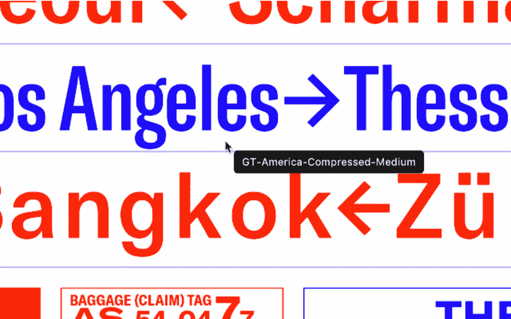
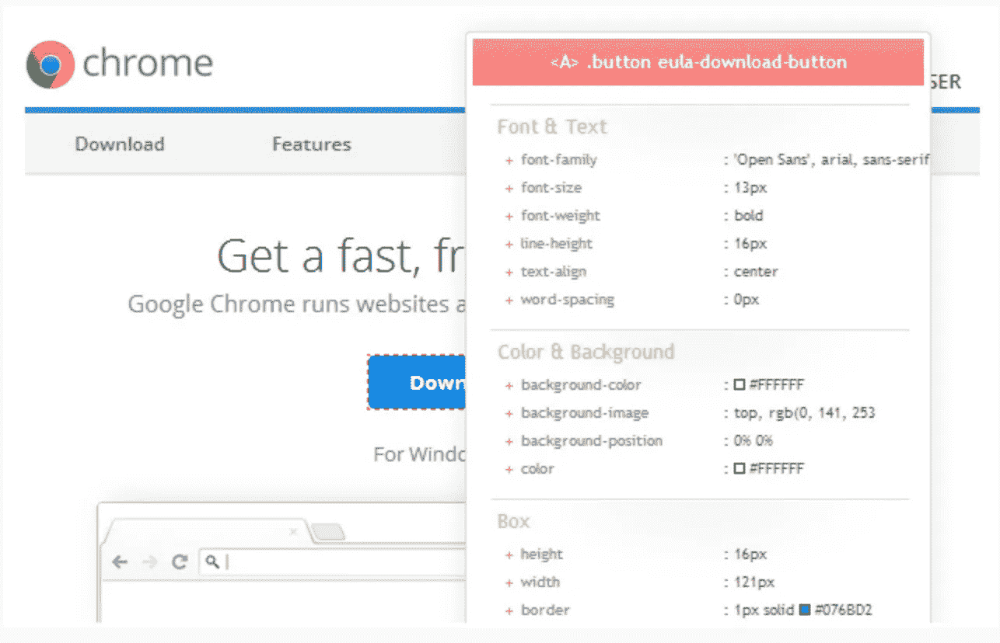
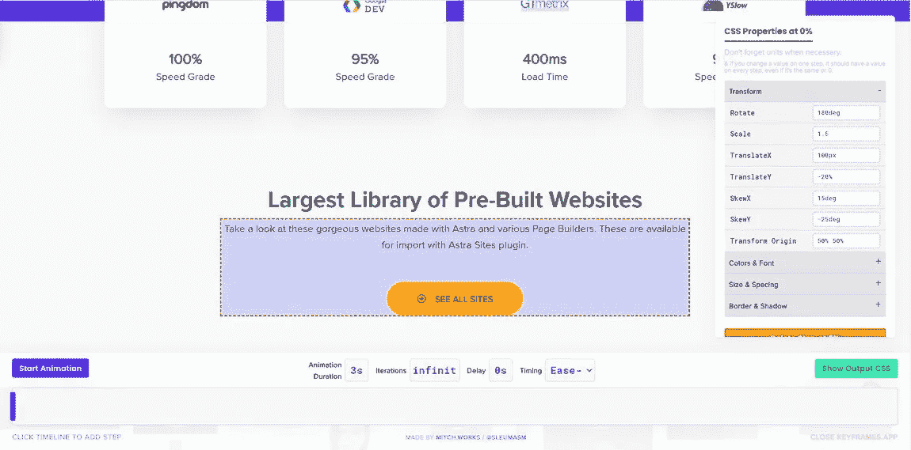
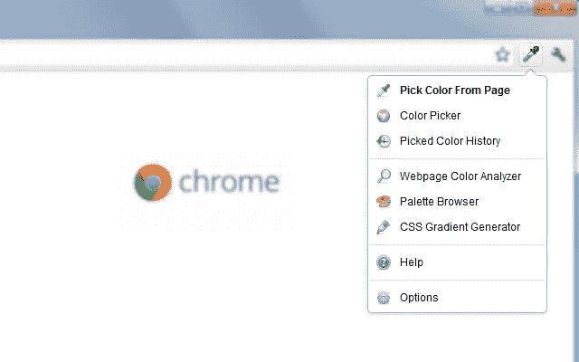
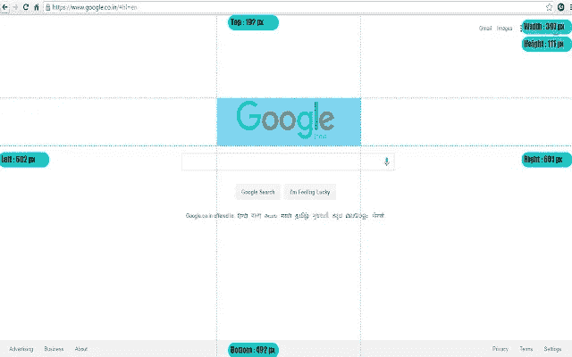
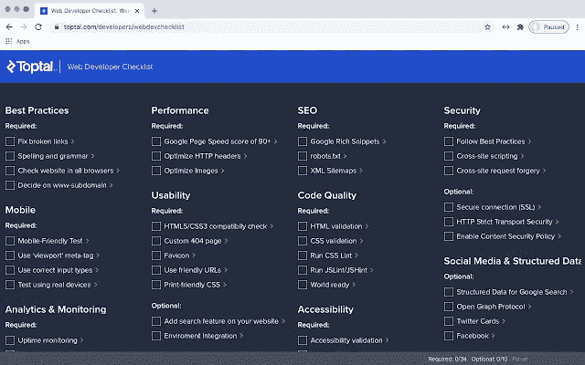

# 网站开发者和设计者必备的 11 个 Chrome 扩展

> 原文：<https://betterprogramming.pub/11-must-have-chrome-extensions-web-developers-and-designers-3482a1ca6349>

## 使您的任务更简单的有用扩展。

图片提供:[法扎德·纳兹菲](https://unsplash.com/@euwars)

谷歌 Chrome 是当今最受欢迎、使用最广泛的网络浏览器，这是理所当然的。其中一个主要原因是它的可扩展性。

Chrome 提供了一系列扩展来帮助你完成各种任务，作为一名 web 开发人员，你可以利用它们来提高你的工作效率，并使基本任务变得不那么繁琐。

尽管有很多其他的扩展可以用于类似下面列出的目的，但是我已经尝试和测试了其中的每一个，并且发现它们在可用性和 UI 方面都是最有效的。

因此，这里列出了 11 个必备的 Chrome 扩展，让你的 web 开发者生活更轻松！

# 1.字体标识符—什么字体

[截屏](https://chrome.google.com/webstore/detail/whatfont/jabopobgcpjmedljpbcaablpmlmfcogm)

对于开发者来说，识别网页上使用的字体是最简单的方法。它快速、有效，可以在几秒钟内识别页面中的单个字体，以及字体系列、大小、粗细和颜色，只需将鼠标悬停在字体上即可。如果您喜欢收集将来可能想要模拟的网页，这个扩展非常适合您。

# 2.技术堆栈—运行什么

[来源](https://chrome.google.com/webstore/detail/whatruns/cmkdbmfndkfgebldhnkbfhlneefdaaip)

[WhatRuns](https://chrome.google.com/webstore/detail/whatruns/cmkdbmfndkfgebldhnkbfhlneefdaaip) 是一个强大的扩展，可以帮助你识别网页使用的所有工具和技术，从框架、web 技术、CMS、主题到字体。它还会在页面开始或停止使用特定工具时通知您。

# 3.响应式布局—窗口大小调整器

当使用响应式设计时， [Window Resizer](https://chrome.google.com/webstore/detail/window-resizer/kkelicaakdanhinjdeammmilcgefonfh/) 是一个很好的扩展，可以帮助您将屏幕尺寸模拟成一系列流行的屏幕尺寸，包括手机、平板电脑和桌面。它甚至提供了一个选项，将新尺寸应用于整个窗口或仅应用于视口。

# 4.CSS 属性查看器— CSS 查看器

让你能够查看任何网页上任何元素的 CSS 属性， [CSS Viewer](https://chrome.google.com/webstore/detail/cssviewer/ggfgijbpiheegefliciemofobhmofgce) 是我个人最喜欢和最常用的 Chrome 扩展。只需将鼠标悬停在所需的元素上，瞧，一个窗口就会出现，向您显示它所包含的 CSS 数据。这使得识别关键 CSS 属性的任务只需点击一下鼠标即可完成。

# 5.动画—关键帧

[关键帧](https://keyframes.app/)对于想要在浏览器中创建 CSS 动画的 web 开发者来说是最好的插件之一。它帮助你在一个简单的弹出窗口中创建基本的动画。只需安装关键帧，打开一个页面，选择红色和蓝色的图标，并突出显示一个 CSS 元素，你想动画。编辑侧框中元素，将您自己的动画添加到页面中。简单不费力！

# 6.SEO 测试—全栈优化现场测试

[全栈优化 Live Test](https://chrome.google.com/webstore/detail/franz-enzenhofer-seo-live/jbnaibigcohjfefpfocphcjeliohhold) 是一个沙箱化的、可扩展的网页测试框架，允许你根据预定义的最佳实践(如 SEO 或 web 性能)测试所有页面。您可以获得直接的视觉反馈，并看到在页面加载和渲染生命周期期间浏览器中发生了什么。

# 7.颜色选择器— ColorZilla

ColorZilla 是一个简单但高度可利用的 Chrome 扩展，正如它所说的那样。缩放吸管和颜色选择器工具允许您从网页中选择颜色值，然后可以快速调整并粘贴到另一个程序中。不仅如此，它还包括一个 CSS 渐变生成器和网页颜色分析器，帮助您获得任何网站的调色板！

# 8.占位符文本— Lorem Ipsum 生成器

[Lorem Ipsum Generator](https://chrome.google.com/webstore/detail/lorem-ipsum-generator-def/mcdcbjjoakogbcopinefncmkcamnfkdb?hl=en%20) 提供了一种简单高效的方法来生成可用作占位符的默认文本。它针对速度进行了优化，但也可以定制。每个句子都是随机生成的，模拟真实文本。

# 9.页面/元素尺寸—页面标尺

[页面标尺](https://chrome.google.com/webstore/detail/page-ruler/idhjfgkakeliobkfbijghiaklmiaheag?hl=en) Chrome 扩展在网页上呈现一个标尺，为您提供想要测量的任何页面元素的宽度、高度和位置(上、下、左、右)。您可以拖移标尺的边缘来调整其大小，或者使用箭头键来移动或调整其大小。

# 10.最佳实践审核— Web 开发人员清单

Web Developer Chrome extension 是对开发人员最有帮助的工具之一，它可以分析和检查您的网页是否在搜索引擎优化、可用性、可访问性和性能等方面违反了 Web 设计最佳实践。它帮助 web 开发人员轻松地发现网站中的问题区域，以便他们可以相应地进行纠正或优化。

# 11.每天保持更新。偏差

最后但并非最不重要的，而[日报。实际开发网站时，Dev](https://chrome.google.com/webstore/detail/dailydev-all-in-one-codin/jlmpjdjjbgclbocgajdjefcidcncaied) 不会直接帮你，但会帮你做好准备。这个以开发为中心的新闻聚合器为您带来从 CSS-Tricks 到 Web 开发的所有最新新闻和博客，所有这些都在一个地方，节省了您在网上寻找高质量文章的时间！

另请参阅:

 [## 初学者在学习编程时应该避免的 5 个错误

### 犯错是旅程的一部分。重要的是尽快识别并纠正它们

better 编程. pub](/5-mistakes-youre-making-as-a-beginner-in-programming-and-how-to-avoid-them-ef6bbfa919a0)