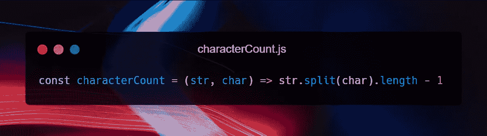
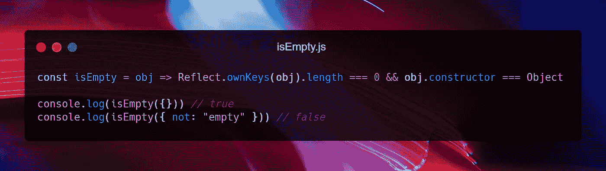
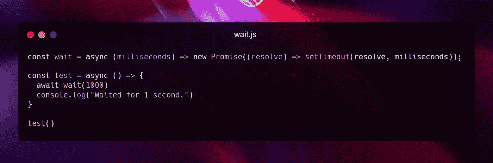
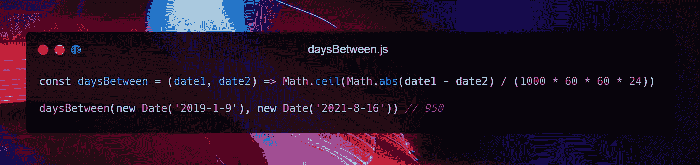
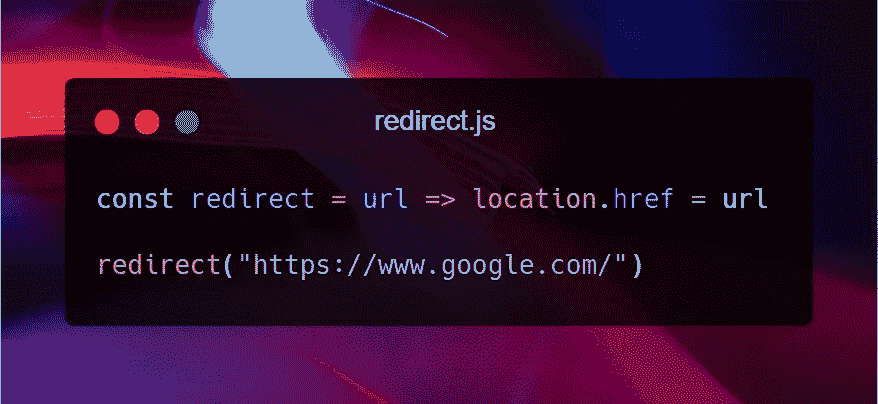
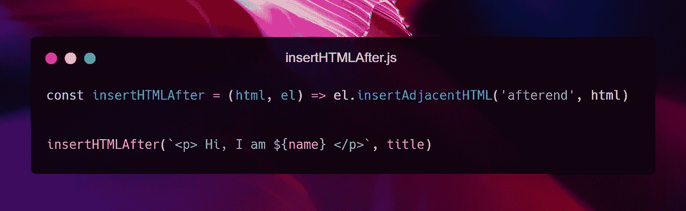
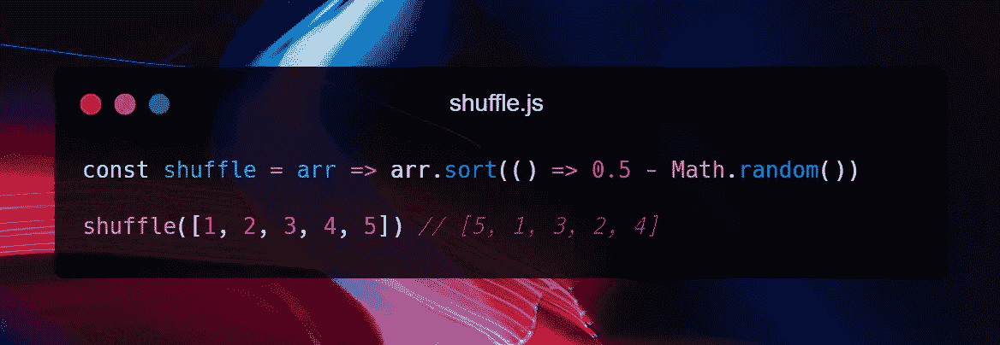
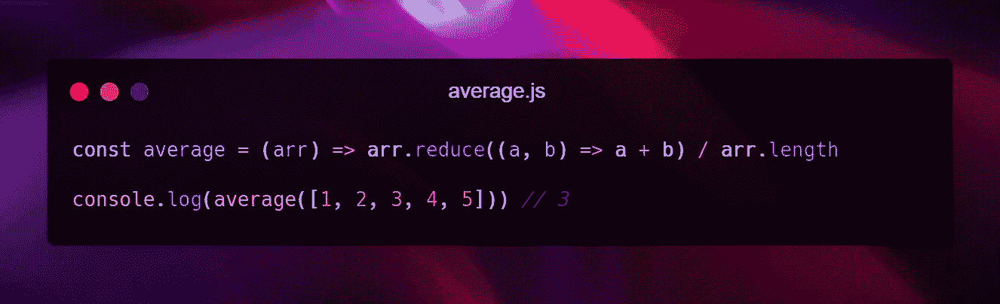

# 11 个罕见的 JavaScript 一行程序会让你大吃一惊

> 原文：<https://betterprogramming.pub/11-rare-javascript-one-liners-that-will-amaze-you-331659832301>

## 因为谁不喜欢只用一条线来建造东西呢


来源:[像素](https://www.pexels.com/photo/blue-eyed-man-staring-at-the-mirror-54377/)

如果你想给专业开发人员留下深刻印象，你应该做什么？很简单:用简单的逻辑和尽可能少的代码行解决一个复杂的问题。随着 ES6 arrow 函数的引入，可以创建看起来优雅而简单的一行程序。

在这篇文章中，你将学到 11 个非常罕见却非常强大的一行程序。然后，准备好，我们从第一个开始！

# 1.获取字符串中的字符数

获取字符数是一个有用的工具，在很多情况下都很有用。你可以用它来计算空格数和单词数，也可以用它来计算字符串中某个分隔符的个数。



```
const characterCount = (str, char) => str.split(char).length - 1
```

这个想法非常简单。我们使用传递的参数`char`分割字符串，并获得返回数组的长度。由于每一次拆弦，都会比拆弦者多一块；减去 1，我们就有了一个`characterCount`一行程序。

# 2.检查对象是否为空

检查一个物体的空性实际上比看起来要困难得多。每次检查一个对象是否等于`{}`都会返回 false，即使这个对象是空的。

幸运的是，下面的一行程序正是我们想要的。



```
const isEmpty = obj => Reflect.ownKeys(obj).length === 0 && obj.constructor === Object
```

在这个一行程序中，我们检查对象的键的长度是否等于零，以及传递的参数是否是一个实际的对象。

# 3.在执行前等待一段时间

在这个一行程序中，我们将尝试一些异步编程。这个想法很简单。在运行代码时，如果您想等待一定的时间，这里是`wait`一行程序:



```
const wait = async (milliseconds) => new Promise((resolve) => setTimeout(resolve, milliseconds));
```

在`wait`一行程序中，我们创建一个承诺，并在给定时间后使用`setTimeout`函数解决它。

# 4.获取两个日期之间的时差

在开发 web 应用程序时，日期通常是最难实现的部分，因为有许多概念很容易被误算。

这里有一个强大的一行程序来计算两个日期之间的时差。但是还有更多的事情要做。正如我所做的，您可以创建自己的一行程序来计算月、年差异等。



```
const daysBetween = (date1, date2) => Math.ceil(Math.abs(date1 - date2) / (1000 * 60 * 60 * 24))
```

这个一行程序背后的逻辑非常容易理解。当两个日期相减时，返回值是以毫秒计的差值。要把毫秒转换成天，我们得把它一个一个地除以毫秒、秒、分、小时。

# 5.重定向到另一个 URL

如果您曾经创建过现实生活中的网站，我敢肯定您遇到过认证逻辑。例如，非管理员用户不应该能够访问`/admin`路线。如果用户尝试，那么你必须将其重定向到另一个网址。

这个一行程序正是针对我上面提到的情况，但是我认为您可以找到更多的用例。



```
const redirect = url => location.href = url
```

`location`是全局`window`对象上的方法，设置`href`属性的行为与用户点击链接相同。

# 6.检查设备上的触摸支持

随着可以连接到互联网的设备越来越多，创建响应性网站的必要性也在增加。20 年前，开发者应该考虑网站的桌面版本，但今天超过 50%的网络流量来自触摸设备。因此，基于设备的触摸支持采取一些行动是一个非常重要的概念。


```
const touchSupported = () => ('ontouchstart' in window || DocumentTouch && document instanceof DocumentTouch)
```

在这个一行程序中，我们检查文档是否支持`touchstart`事件。

# 7.在元素后插入一个 HTML 字符串

开发 web 应用程序时，使用 JavaScript 更新 DOM 是很常见的事情。有一些基本的方法来完成事情，但当情况变得复杂时，就很难克服了。

这是一个在 HTML 元素后插入 HTML 字符串的一行程序。经过几分钟的思考和谷歌搜索，我确信你可以在这个一行程序的版本之前找到*。*



```
const insertHTMLAfter = (html, el) => el.insertAdjacentHTML('afterend', html)
```

# 8.打乱数组

在开发中混洗一组数据是您随时都会遇到的常见情况，不幸的是，JavaScript 中没有内置数组的`shuffle`方法。

然而，这里有一个你可以日常使用的`shuffle`一行程序:



```
const shuffle = arr => arr.sort(() => 0.5 - Math.random())
```

它利用数组的`sort`方法，在数组的前一个元素之前或之后随机排序。

# 9.获取网页上的选定文本

浏览器在全局`windows`对象上有一个名为`getSelection`的内置方法。使用这种方法，您可以创建一个返回网页上高亮显示或选定文本的单行程序。


```
const getSelectedText = () => window.getSelection().toString()
```

# 10.获取随机布尔值

在编程的时候，尤其是当你在编写游戏代码的时候，有时候你会想随机地采取行动。在这种情况下，下面的一行程序非常有用。


```
const getRandomBoolean = () => Math.random() >= 0.5
```

上面的一行程序有 50%的机会返回`true`或`false`。因为生成的随机数大于 0.5 的概率等于更小的概率。

然而，举例来说，如果你想得到一个概率为 70% `false`的随机布尔值，那么你可以简单地将 0.5 改为 0.7，以此类推。

# 11.计算数组的平均值

数组的平均值可以用多种方法计算。但是所有人的逻辑都是一样的。你必须得到数组和它的长度；然后除法给出平均值。



```
const average = (arr) => arr.reduce((a, b) => a + b) / arr.length
```

在`average`一行代码中，我们使用 reduce 在一行中获得数组的和，而不是使用循环。然后，我们把它除以数组长度，这是数组的平均值。

就是这样，各位！现在你知道了 11 个简单而强大的 JavaScript 一行程序。我试着选择那些不太受欢迎和知名的，这样你可以学到新的东西。我每天都在使用它们，我想你也会的。

[](https://mailchi.mp/a45f8fb96cc9/subscribe)

订阅获得你的**免费*订户专属*故事。**

感谢您的阅读。如果你喜欢它，一定要鼓掌，如果你对这篇文章有什么要说的，请留下回应。下一篇文章再见。

***延伸阅读***

[](/7-must-know-websites-to-boost-your-frontends-b3ea0bb282e6) [## 7 个必须知道的网站来提升你的前端

### 简单而有用的网站，你会每天使用

better 编程. pub](/7-must-know-websites-to-boost-your-frontends-b3ea0bb282e6) [](/3-marvelous-javascript-tips-to-speed-up-the-development-process-ba1bb8e3fb7a) [## 加速开发过程的 3 个奇妙的 JavaScript 技巧

### 下面是我最喜欢的节省时间的 JavaScript 技巧

better 编程. pub](/3-marvelous-javascript-tips-to-speed-up-the-development-process-ba1bb8e3fb7a) [](https://medium.com/nerd-for-tech/3-extremely-useful-react-tips-to-speed-up-the-development-process-c4c966814c52) [## 3 个非常有用的 React 技巧来加速开发过程

### 如今，React 已经慢慢成为了 web 应用程序的新标准，而且看起来它不会有任何发展…

medium.com](https://medium.com/nerd-for-tech/3-extremely-useful-react-tips-to-speed-up-the-development-process-c4c966814c52)