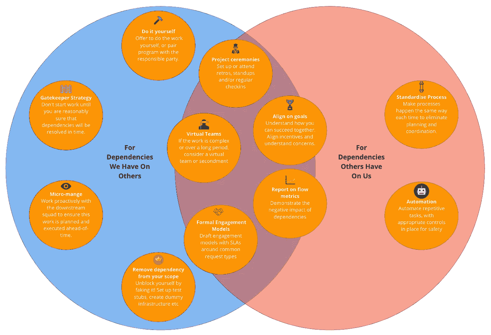

# 管理敏捷团队之间依赖关系的 11 个策略

> 原文：<https://betterprogramming.pub/11-strategies-for-managing-dependencies-between-agile-squads-aac11e3c1f11>

## 更好的敏捷

帮助管理敏捷团队之间依赖关系的策略(图片来源:作者)

敏捷团队应该是跨职能的、原子的，并且能够完全独立地向最终用户交付产品。然而，随着一个组织的扩展和产品变得更加复杂，团队合作交付增值往往是必要的。

因为团队是为独立而设的，让他们互相依赖会导致摩擦，最终会延误项目。几个月前，和我一起工作的团队注意到了这个问题。我们发现，在过去 29 周我们错过的 sprint 目标中，有三分之一是由于外部依赖性。

因此，本着持续改进的精神，我们承诺尽快揭示已知或可能的依赖关系，并在出现依赖关系时制定应对策略。到目前为止，在接下来的 13 周内，由于外部依赖性，我们没有达到 sprint 目标，实际完成的 sprint 目标比以前多了 35.2%。本文详细介绍了我们用来实现这一目标的策略。

请随意跳过并立即阅读这些策略，或者继续阅读以首先了解什么是依赖关系，您可以在组织中的什么地方看到它们，以及您应该如何进行长期规划以从根源上消除它们。

# 我们所说的依赖是什么意思？

依赖是敏捷团队完成价值增值所必需的，但这不能单靠团队来实现。依赖性，如果处理不当，会导致任务执行受阻。

在 scrum 中，产品积压是用来通知团队方向的主要计划工具。广义而言，产品积压包括具有明确验收标准的任务(通常称为*故事*或*用户故事*)。一个好的用户故事的范围和写作遵循 INVEST(独立的、可协商的、有价值的、可评估的、小的和可测试的)。

独立性的概念是管理外部依赖关系的关键。如果一件作品是完全独立的，它就没有任何依赖性。虽然这是我们应该努力争取的，但并不总是可以实现的。跨职能、跨垂直的计划是有价值的，所以我们必须计划和管理依赖性。

# 依赖项的类型

1.  **需求依赖关系**——当团队对某个需求不清楚时，以及有领域知识的人(产品所有者、利益相关者、项目经理等。)不能立即提供
2.  **专业知识依赖关系**——当需要拥有特定专业知识的人提供帮助以完成某件事时，例如，从数据库管理员处获得关于模式更改的指导
3.  **活动依赖** —当一项工作在外部活动完成之前无法取得进展时，例如，在工作开始之前等待开发环境被提供
4.  **业务流程依赖** —当一些现有的业务流程影响您的团队完成工作的能力时，例如变更审查委员会(CRB)批准或合规性审查
5.  **技术依赖**——当工作需要在团队控制之外的系统领域进行技术更改时，例如，当您需要更改由另一个团队管理的 API 时。这可以通过紧耦合来复合。假设 API 没有严格的版本控制——现在您请求的更改可能也需要对其他下游消费者进行更改，这意味着更多的依赖性。

# 为什么我们要消除依赖性？

简单地说，一个特性涉及的依赖越多，在冲刺、季度等结束时完成的机会就越小。这是一个问题，因为你总是想最小化特性开发的周期时间，以尽快交付给你的用户。它还会影响你对不断变化的市场环境做出敏捷反应的能力。周期时间的增加和敏捷性的丧失表现为组织压力。

对这种压力的自然反应是“分而治之”；将组织拆分成小组，这些小组可以提供我们现在需要的功能。虽然这在短期内消除了依赖性，但对未来的依赖性没有帮助。此外，等待他人完成工作或被迫为他人完成工作对组织士气是有害的。由于这些原因，在理想的世界中，scrum 团队应该没有依赖关系。

> “跨职能团队拥有完成工作所需的所有能力，无需依赖团队以外的其他人。Scrum 中的团队模型旨在优化灵活性、创造性和生产力。—《Scrum 指南 2017》

# 为什么会产生依赖性？

我们希望从源头上解决依赖问题。团队之间依赖的一些常见根本原因是:

*   **组织结构**—Android 团队、测试团队等。显然这不是跨职能的。如果 Android 团队不能改变他们所依赖的 API，他们就会被屏蔽。
*   **不完整的交叉功能** —如果一个小队缺少一项或多项技能，必须依靠另一个小队来提供
*   **不合理的复杂架构** —这些阻碍了跨组件和跨职能团队的创建。每样东西都有一个微服务，每个微服务归不同的团队所有，这导致可能的依赖关系数量呈指数级增长。
*   **提前做大设计(BDUF)** —当计划改变时(它们将会改变)，你可能会发现你的团队与项目的需求不一致。
*   **遗留的系统和流程**——这些通常集中了知识，抑制了跨职能团队的创建。
*   **法规要求** —当只有特定团队或团队成员有权访问特定数据或系统时，就会产生依赖性。
*   抵制变革——依赖常常证明一个团队的存在是合理的。对于威胁这一点的流程或组织变革，存在一种天然的阻力。

# 长期计划:消除依赖性

敏捷假设团队拥有交付增值所需的一切。在一个理想的世界中，我们应该拥有跨职能团队，他们拥有构建、测试和部署端到端产品的所有知识和权限，并且他们之间的交互最少。然而，这并不总是可能的，至少不是马上。监管要求、组织结构、知识仓库和对变革的抵制经常阻止团队完全打破依赖。

从长远来看，解决方案在于应用精益思想、看板和跨团队的约束理论来管理工作流程，并围绕价值流而不是职能领域重新调整人员和团队。

从短期来看，我们可以通过在发现依赖性时立即将其指出来减轻依赖性，并使用下面的策略来管理它们。

# 短期内减轻依赖性的 11 种策略

这些策略可以分为两类，大多数都属于这两类。

*   减轻对团队依赖性的策略:
*   减轻**对**其他小队依赖性的策略:

## 减少对团队依赖的策略:

**1。自动化**

在可能的情况下，通过适当的安全控制，将重复性任务自动化。像持续集成/部署(CI/CD)或自动化重复性支持任务这样的事情就是消除或减轻依赖性的自动化的例子。

**2。标准化流程**

如果自动化不可行，让流程每次都以同样的方式发生，以消除计划和协调。

## 减少对其他小队依赖的策略:

**3。看门人策略**

通过阻止有依赖关系的故事进入 sprint，防止依赖关系影响团队的生产量，直到你合理地确定依赖关系将被及时解决。

**4。微观管理**

如果你的依赖需要大量的工作来解决，主动与下游团队合作，以确保这项工作提前计划和执行。

**5。自己动手**

在可能的情况下，主动提出自己完成所需的下游工作，或与负责方结对编程，以推动其完成。

**6。从您的作用域**中移除依赖关系

装装样子解封自己！设置测试桩或创建虚拟基础设施来完成您这方面的工作。通过交付您的承诺，您已经将自己从部署依赖项的需求中分离出来。只要团队保持一致，这与正式的交战模型配合得很好。

## 减轻对**小队内外依赖性的策略**:

**7。** **利用敏捷仪式**

*   **检入** —与你所依赖的团队或依赖你的团队召开定期检入会议，将共同的需求放在心上。
*   **单口相声**——在有意义的时候，在他们允许的情况下参加他们的单口相声。或者让他们参加你的。考虑一场混乱的混乱。
*   **项目回顾**——批判性地评估你的协作努力中哪些地方可以改进。这对于促进长期或经常性的合作尤其有价值。

**8。在共同目标上保持一致**

邀请相关团队参加设计审查、项目规划会议、签到或回顾，让他们深入了解您所做的工作，为什么它很重要，以及它如何与公司的顶层目标保持一致。感兴趣，了解他们的动机和关注点。

**9。使用虚拟团队**

如果需要的工作很复杂或者和每个小队的系统紧密相连，那么你应该考虑组建一个虚拟小队一段时间的好处。你也可以在项目期间借调某人或让某人帮忙。

**10。流量指标报告**

表面燃尽和速度图，显示了依赖的影响(进入和离开队伍)。这可以成为变革的强大动力。考虑将这些结果提交给风险承担者进行评审，以共同解决依赖性。

11。采用正式的参与模式

团队应起草包含常见请求类型的服务级别协议(SLA)的项目模型。在一个具有足够规模的组织中，这通常是有意义的，因为起草这些模型的开销被它们的使用频率所抵消。

希望在与其他敏捷团队合作为您的客户交付价值时，应用这些策略并尽早发现依赖关系会让您的生活更加轻松。