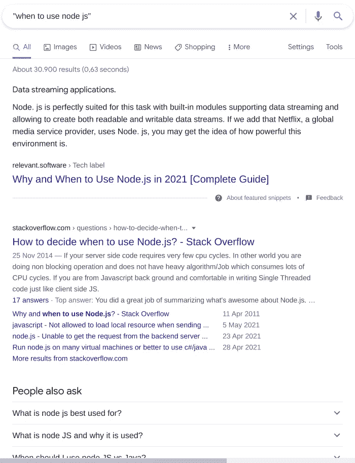
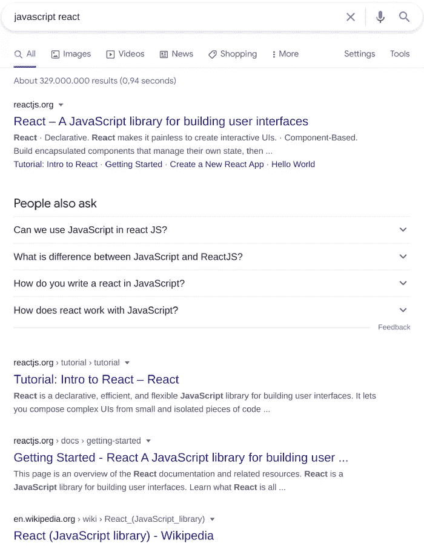
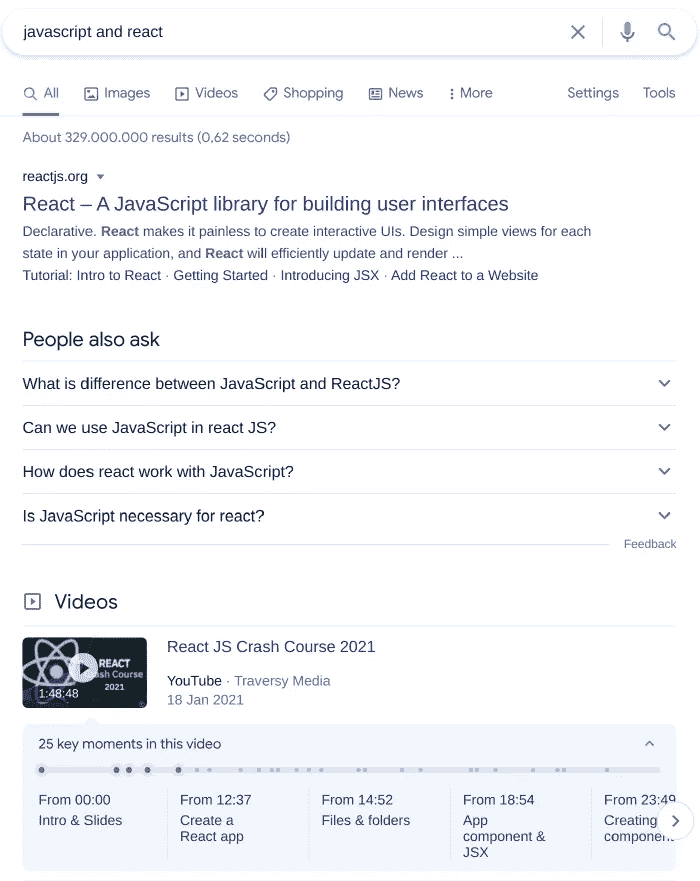
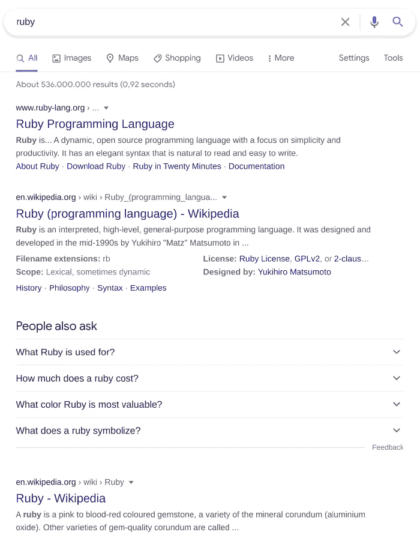
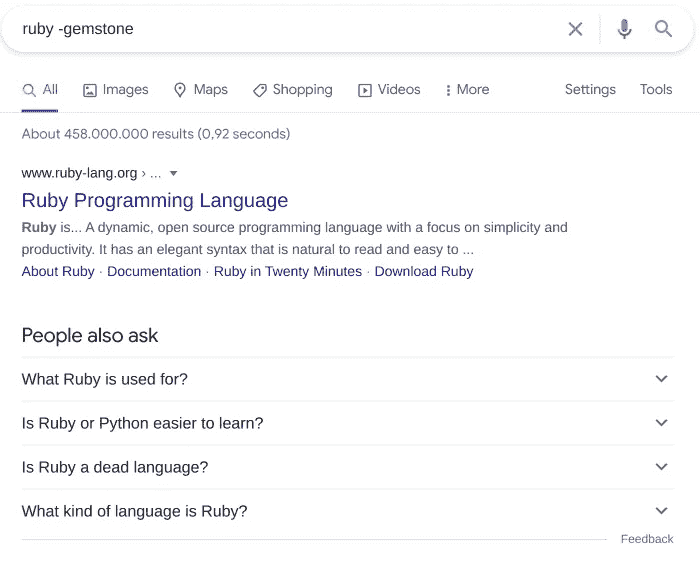
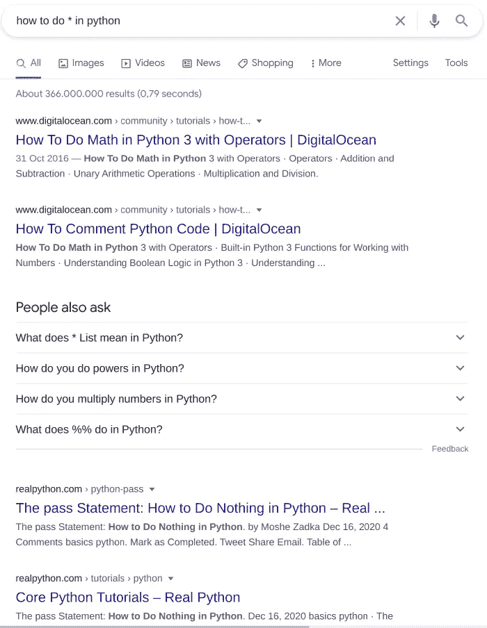
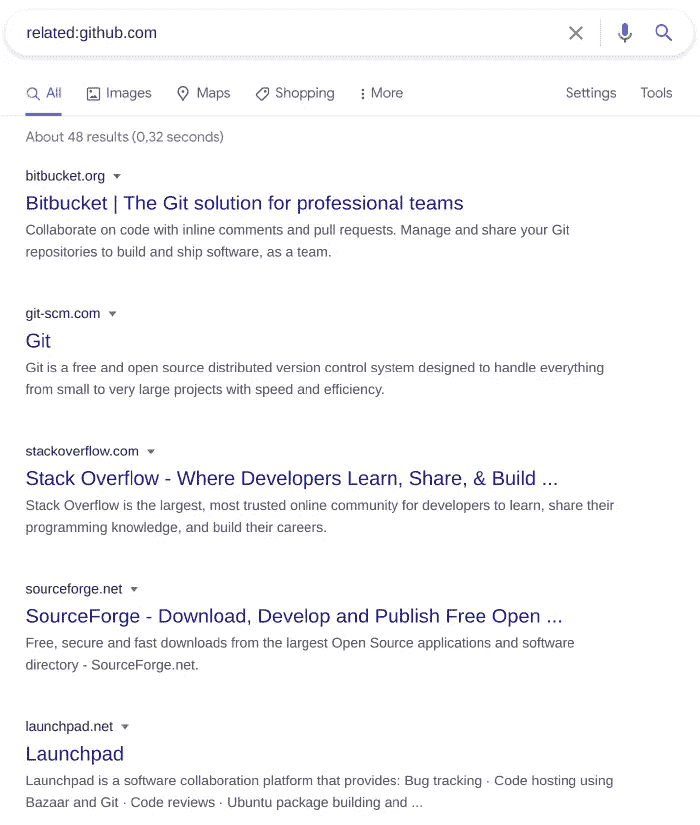
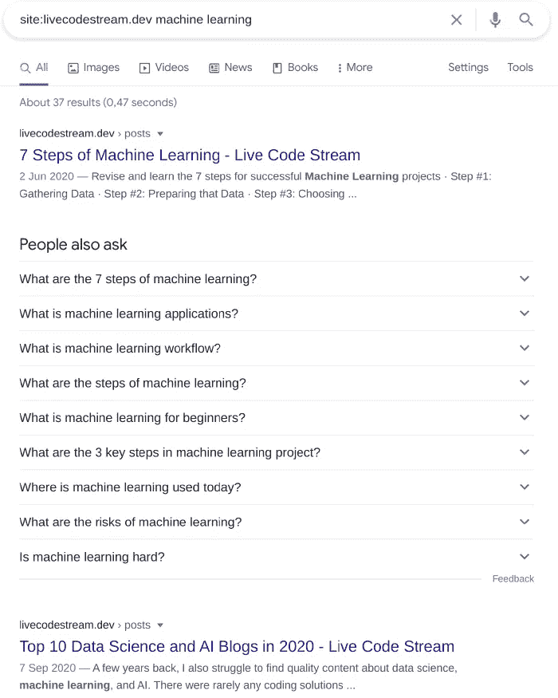
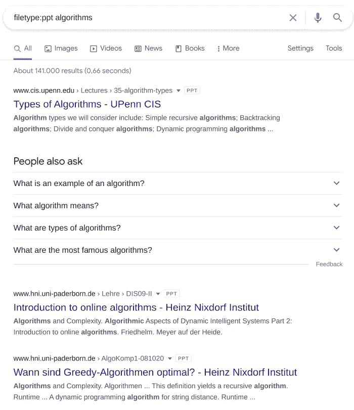
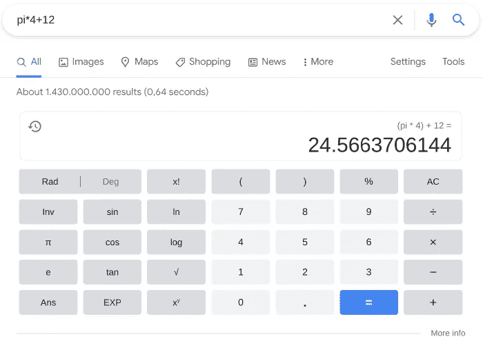

# 作为软件开发人员掌握谷歌搜索艺术的 11 个技巧

> 原文：<https://betterprogramming.pub/11-tricks-to-master-the-art-of-googling-as-a-software-developer-2e00b7568b7d>

## **根据这些提示提升你的谷歌搜索技能**


图片由作者提供。

谷歌已经成为我们生活中不可或缺的一部分，以至于我们现在用动词“谷歌”来指代使用这个搜索引擎巨头的行为。使用一些选择的关键字，你可以找到从最近的杂货店到世界上最新发展的一切。

然而，有时谷歌的魔力并不能给我们想要的结果。你尝试不同的关键字组合，深入搜索结果，但仍然无法找到你想要的。

但是你知道吗，谷歌提供选项来优化你的搜索，从成千上万的匹配中筛选出你想要的东西。

在这篇文章中，我们将向你介绍这些谷歌搜索的技巧和窍门，它们将使你成为一个高效的谷歌用户。你可能已经知道其中的一些，但是继续读下去，找到你可能还不知道的隐藏的宝石。

# 1.使用引号来匹配精确的短语

```
"search query"
```

您可以使用双引号将您在搜索框中输入的单词或短语括起来，以获得包含此精确搜索词的结果列表。

如果您搜索“何时使用 Node.js”(不带双引号)，Google 会返回一组结果，其中包含所有四个或更少的任意顺序的单词。


常规搜索

但是如果你使用双引号并搜索“何时使用 node . js ”, Google 会优先搜索内容中包含这个短语的结果。



搜索精确短语

# 2.使用 AND/OR 运算符

当在谷歌搜索框中输入一个包含两个或更多单词的搜索词时，它有时会返回只包含几个单词的结果。



不带运算符的搜索

```
keyword1 and keyword2
```

如果您想要搜索包含这两个词的页面，您可以在两个词之间使用“AND”运算符来指定这两个词都应该出现在搜索结果中。



使用 AND 运算符进行搜索

```
keyword1 or keyword2
```

类似地，您可以使用“OR”操作符来指定何时希望结果只包含其中一个单词。


使用 OR 运算符进行搜索

正如您在图片中看到的，无论您使用小写还是大写的操作符都没有关系。

# 3.使用减号排除某些术语

```
keyword1 -ignore
```

如果您想从搜索结果中排除包含特定短语的网页，请在搜索词中使用减号来表示这一点。

当你在谷歌上搜索“Ruby”这个词时，你会得到与 Ruby 编程语言和宝石相关的结果。



双重意义的词

为了排除关于宝石的结果，我们可以搜索“红宝石”现在，我们得到了一个只与编程语言有关的结果列表。



搜索排除的单词以减少查询的上下文

这将有助于你搜索含糊不清和有多重含义的术语。

# 4.在搜索词中使用通配符

```
phrase * phrase
```

当你不确定你在找什么，或者当你想知道你能在谷歌算法的兔子洞里走多远时，这个技巧对发现信息很有帮助。

当您在搜索词中使用星号(*)时，这是一个占位符，Google 会在提供结果之前自动填充。

让我们试试搜索词“如何用 Python 做*”，看看谷歌决定向我们展示什么。正如您在下图中看到的，前三个搜索结果集中在我们可以用 Python 做的三件不同的事情上:做数学、评论和学习 Python。



使用通配符搜索

当你不确定该走哪条路时，让谷歌领路是一种有趣的方式。

# 5.查找与另一个网站相似的网站

这是一种一旦你发现就会成为你谷歌习惯的方法。

你有多少次想知道是否有办法找到另一个与你最喜欢的网站相似的网站？如果你的答案不是零，那么你会瞬间爱上这个技巧。

要搜索与另一个网站相似的网站，只需使用如下搜索语法:

```
related:[website_url]
```

例如，让我们使用以下语法搜索与 GitHub 相似的网站:



搜索相关网站

我们可以在结果页面上看到 Bitbucket、Git、Stack Overflow 和 SourceForge。我们看到这些结果是因为它们服务于与 GitHub 相似的目的:存储库管理和开发者社区。

# 6.使用谷歌搜索网站

```
keyword1 site:[website_url]
```

你知道你可以用谷歌搜索网站吗？有了这个功能，您可以找到某个特定站点上发布的文章、博客帖子和页面，尤其是在它没有内置搜索功能的情况下。

让我们在直播码流网站搜索一下关键词“机器学习”:



在站点内搜索

# 7.查找特定文件类型中的内容

```
keyword1 filetype:[file type]
```

假设您想要查找针对特定主题准备的 pdf 或 PowerPoint 幻灯片。那么，你是幸运的，因为谷歌允许你只搜索这种文件类型的内容。

让我们用这种方法搜索算法主题的 PowerPoint 幻灯片:



搜索特定的文件类型

# 8.使用“之前”和“之后”运算符

当您想要查找在特定日期之前发布的内容时，应该使用“before”运算符。您可以为此搜索词提供特定年份或完整日期(格式为 yyyy-mm-dd)。

```
keyword1 before:[date]
```


在特定日期前搜索

```
keyword1 after:[date]
```

类似地，如果您想要搜索在某个特定日期之后发布的页面，请使用带有特定年份或日期的“after”操作符。


在特定日期后搜索

# 9.使用谷歌作为你的计算器

```
[mathematical operation]
```

你知道你可以用谷歌的搜索框作为计算器吗？当你懒得抓起你的计算器(或计算器应用程序)做一些简单的数学运算时，迅速转向谷歌寻求支持。


使用谷歌作为一个简单的计算器



使用谷歌作为高级计算器

# 10.逐渐增加你的搜索词的字数

Google 建议您只使用基本搜索词开始搜索。例如，如果您正在尝试查找学习 Javascript 的课程，请从最基本的短语开始，逐渐增加搜索词的字数，直到找到您要找的内容:

*   JavaScript 课程
*   面向初学者的 JavaScript 课程
*   初学 JavaScript 课程 Udemy

遵循这个搜索策略有一些好处。首先使用一个更广泛的搜索词，让你有机会看到主题的全貌和不同的途径。它还可以确保你不会错过任何重要的信息，直接进入一个精炼的，集中的搜索词。当你在搜索词中添加更多的词时，你会看到更符合你特定需求的结果。

# 11.在搜索词中使用网站语言

当你在谷歌搜索框中输入搜索词时，尽量使用网站使用的语言。不要使用搜索词“我的图像不在网页上居中”，想想网站使用的语言，搜索“用 CSS 居中图像”

这里的诀窍是不要搜索你会使用的术语，而是专业网站会使用的术语。尤其是当你在深入一个话题时，在搜索词中使用网站语言会给你带来更好的结果。

# 摘要

谷歌搜索是一种开发者必须掌握的技术，以便有效地找到他们想要的信息。在这篇文章中，我们给你带来了一些关于如何提高谷歌搜索技能的技巧和诀窍。当你开始正确地使用这些技巧时，你可以减少花在谷歌搜索网页上的时间来找到你的问题的正确答案。

下次当你开始在谷歌搜索框中输入一些东西时，想想这些提示和技巧，看看哪些可以用来找到你想要的东西而不浪费时间。

感谢阅读！