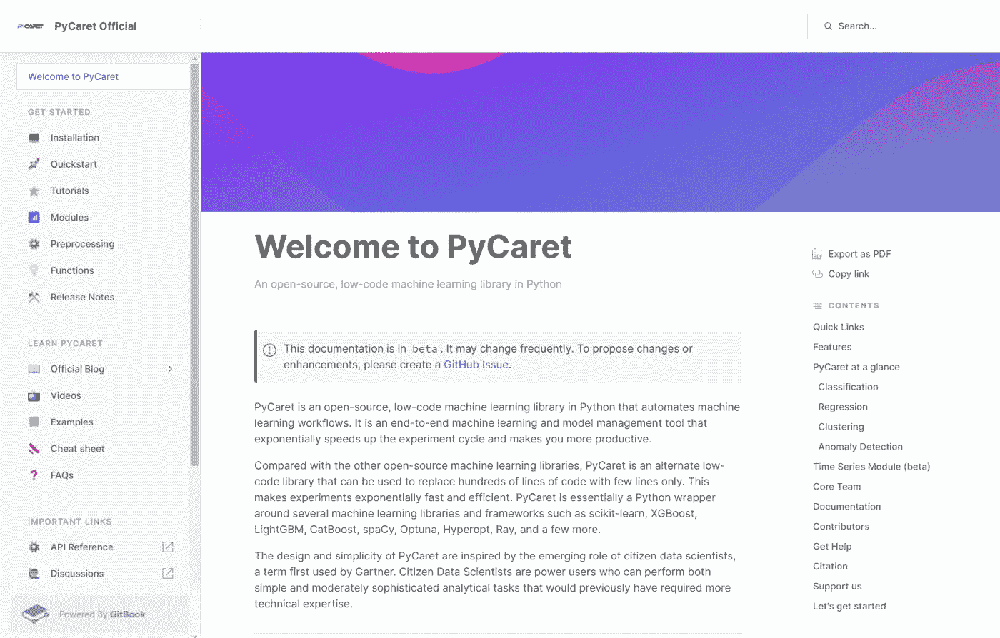

# 111 篇精选自 Medium 的编程文章(2022 年 1 月)

> 原文：<https://betterprogramming.pub/111-hand-picked-programming-articles-on-medium-january-2022-c35fc29ccf6>

## 上个月我们最喜欢的读物

嘿大家好，

我们希望你的 2022 年有一个好的开始。我们已经从上个月获得了大量有见地的故事，一些帮助你入门的 Web3 指南，Wordle 实现的实践，以及大量的工作经验。

# 📸每月精选词汇故事

图片由 [wayhomestudio](https://www.freepik.com/wayhomestudio) 通过 [Freepik](https://www.freepik.com/) 提供——由 [Javier Frias](https://medium.com/u/e44e80063f4d?source=post_page-----c35fc29ccf6--------------------------------) 编辑 [Wepik](https://wepik.com/)

*   [忘记运气:优化的 Wordle 策略](/forget-luck-optimized-wordle-strategy-using-bigquery-c676771e316f)(使用 Google BigQuery)作者 [Javier Frias](https://medium.com/u/e44e80063f4d?source=post_page-----c35fc29ccf6--------------------------------)
*   [Wordle 最好的第一个词是什么？](/whats-the-best-first-word-for-wordle-bb94db15ad2e)作者[安娜·阿扎姆](https://medium.com/u/8e7d2b0e2483?source=post_page-----c35fc29ccf6--------------------------------)
*   [逆向工程 word](https://medium.com/@timhinz16/reverse-engineering-wordle-4674c3ae700d)作者[蒂姆·欣茨](https://medium.com/u/b82ad41a1ef1?source=post_page-----c35fc29ccf6--------------------------------)
*   [马特·道奇](/building-a-wordle-bot-in-under-100-lines-of-python-9b980539defb)[用不到 100 行的 Python](https://medium.com/u/274d35118c90?source=post_page-----c35fc29ccf6--------------------------------) 构建一个 Wordle Bot
*   深入了解 Wordle，新疫情的谜题热潮
*   [被](https://conor-aspell.medium.com/beating-wordle-with-python-1e338a43dfd1)[康纳·阿斯佩尔](https://medium.com/u/fcfc270499a7?source=post_page-----c35fc29ccf6--------------------------------)用蟒蛇殴打沃尔多
*   [由](/python-wordle-helper-b81aa05680aa)[约翰·克拉克·克雷格](https://medium.com/u/667cfc1401ea?source=post_page-----c35fc29ccf6--------------------------------)设计一个 Wordle Python 助手
*   [我玩了一百多万个 barrysmyth](https://towardsdatascience.com/what-i-learned-from-playing-more-than-a-million-games-of-wordle-7b69a40dbfdb) 的 Wordle 游戏后学到了什么
*   [为什么你有可能解决 Wordle(根据 100，000 次模拟)](/why-youre-likely-to-solve-wordle-according-to-100-000-simulations-7725b462e533)作者[丹尼尔·汤普金斯](https://medium.com/u/73618337c6a4?source=post_page-----c35fc29ccf6--------------------------------)
*   沃尔多·UX:有时候一款游戏感觉很好

# 编程；编排

*   [谷歌的一位高级工程师揭示了“2022 年最值得学习的编程语言”](/the-best-programming-language-to-learn-in-2022-senior-engineer-at-google-explains-5abcbc5f6556)
*   [Http server performance NodeJS vs Go](/http-server-performance-nodejs-vs-go-397751e8d275)作者 [Jan Sunavec](https://medium.com/u/e1ac4edd2c86?source=post_page-----c35fc29ccf6--------------------------------)
*   玛丽安·贝洛蒂编写一门编程语言
*   [由](https://medium.com/@zackbunch/simplifying-single-responsibility-principle-9b57051477b3)[扎克·邦奇](https://medium.com/u/ac5ca15cbe98?source=post_page-----c35fc29ccf6--------------------------------)简化单责任原则
*   [为什么春天比 Vert.x 快？](/why-spring-is-faster-than-vert-x-bc09b436021d)作者[阿列克谢·索申](https://medium.com/u/c2859b77a925?source=post_page-----c35fc29ccf6--------------------------------)
*   [4 个 Python 包来美化和格式化你的代码库](/simple-hacks-to-automate-python-code-beautification-5ad934cf5a29) by [TAPAS DAS](https://medium.com/u/f387b9dead96?source=post_page-----c35fc29ccf6--------------------------------)
*   [Berke Soysal](/solid-principles-with-almost-real-life-examples-in-java-b292a4e2c18b)[撰写的《坚实的原理与(几乎)真实的 Java 实例](https://medium.com/u/2c2834517eb2?source=post_page-----c35fc29ccf6--------------------------------)
*   [M1 Mac 的 Docker 桌面替代品](https://alex-moss.medium.com/docker-desktop-alternatives-for-m1-mac-918a2dcda10)作者 [Alex Moss](https://medium.com/u/75d735bef60b?source=post_page-----c35fc29ccf6--------------------------------)
*   [在 Java 中检查空值？通过](/checking-for-nulls-in-java-minimize-using-if-else-edae27016474)[itr Ege deer](https://medium.com/u/fc0fbc7da6cc?source=post_page-----c35fc29ccf6--------------------------------)最小化使用“If Else”
*   字节码语言的生命(漫画)作者[安迪](https://medium.com/u/5fa30a3e12cb?source=post_page-----c35fc29ccf6--------------------------------)
*   [Haseeb Kamal](/writing-robust-and-error-free-python-code-using-pydantic-151a135a9ff0)使用 Pydantic 编写健壮且无错误的 Python 代码
*   两个工程师发现水晶编程语言的故事
*   [懒得写文档？让人工智能为你写吧](/too-lazy-to-write-documentation-let-the-ai-write-it-for-you-8574f7cd11b2)作者[哈恩比·李](https://medium.com/u/888dfa574016?source=post_page-----c35fc29ccf6--------------------------------)

# 数据科学

官方文档—[https://py caret . git book . io](https://pycaret.gitbook.io/)

*   [PyCaret 2.3.6 来了！了解新内容？](https://towardsdatascience.com/pycaret-2-3-6-is-here-learn-whats-new-1479c8bab8ad)作者 [Moez Ali](https://medium.com/u/fba05660b60f?source=post_page-----c35fc29ccf6--------------------------------)
*   [贝克德尔测试:比较电影中的女性表现指标](https://towardsdatascience.com/bechdel-test-comparing-female-representation-metrics-in-movies-6cbade15010f)作者[艾莉森·韩愈·姚](https://medium.com/u/17016fd04e22?source=post_page-----c35fc29ccf6--------------------------------)
*   [6 Julia 框架创建桌面 GUI 和 Web 应用](https://towardsdatascience.com/6-julia-frameworks-to-create-desktop-guis-and-web-apps-9ae1a941f115)由 [Logan Kilpatrick](https://medium.com/u/2c8aac9051d3?source=post_page-----c35fc29ccf6--------------------------------)
*   [Gleb Vazhenin](https://medium.com/bumble-tech/evaluation-of-classification-models-on-unbalanced-production-data-ae5735229410)对不平衡生产数据分类模型的评价
*   [我的十大熊猫功能准备数据](/my-top-10-pandas-functions-for-preparing-data-3ec7a1451a84)由 [Holly Dalligan](https://medium.com/u/19d0fc7fc960?source=post_page-----c35fc29ccf6--------------------------------)
*   [高级 SQL 窗口函数简易指南](https://towardsdatascience.com/a-guide-to-advanced-sql-window-functions-f63f2642cbf9)作者 [Julia Kho](https://medium.com/u/75b5f5a46f52?source=post_page-----c35fc29ccf6--------------------------------)
*   [探索微软 PowerPoint 人工智能，使用 Python](https://towardsdatascience.com/exploring-powerpoint-ai-using-python-75f94d55f8f4) 作者[皮耶罗·派阿隆加](https://medium.com/u/254e653181d2?source=post_page-----c35fc29ccf6--------------------------------)
*   [OpenAI GPT-3 文本嵌入——真的是密集文本嵌入的新技术吗？](https://medium.com/@nils_reimers/openai-gpt-3-text-embeddings-really-a-new-state-of-the-art-in-dense-text-embeddings-6571fe3ec9d9)由[尼尔斯·雷默斯](https://medium.com/u/51ad6744291b?source=post_page-----c35fc29ccf6--------------------------------)
*   [由](/the-data-scientists-guide-to-creating-an-nft-collection-in-python-de1b98163875) [Rohith Teja](https://medium.com/u/d66134dd9f0d?source=post_page-----c35fc29ccf6--------------------------------) 撰写的数据科学家用 Python 创建 NFT 集合指南
*   [试试米托 Python 包:数据科学家的电子表格](/try-mito-python-package-the-data-scientists-spreadsheet-69f1f4160810)作者[罗曼 Orac](https://medium.com/u/68bf0657a0cd?source=post_page-----c35fc29ccf6--------------------------------)

# 软件工程

未着色图像

*   [Abdul QA deer](https://medium.com/paypal-tech/scaling-kubernetes-to-over-4k-nodes-and-200k-pods-29988fad6ed)将 Kubernetes 扩展到超过 4k 个节点和 20 万个 pod
*   [Terraform 重构的噩梦](https://tomharrisonjr.medium.com/terraform-refactoring-nightmare-232790fcdb12)作者[汤姆·哈里森](https://medium.com/u/1fba4038dcff?source=post_page-----c35fc29ccf6--------------------------------)
*   [我们如何通过](https://medium.com/@DorIndivo/how-we-migrated-from-python-multithreading-to-asyncio-128b0c8e4ec5) [Dor Indivo](https://medium.com/u/b1b178533834?source=post_page-----c35fc29ccf6--------------------------------) 从 Python 多线程迁移到 Asyncio
*   [由](https://engineering.salesforce.com/scaling-cross-team-contributions-to-a-native-mobile-app-79c4ec9669e5)[@ sales forceng](https://medium.com/u/41ea9b1cdc2b?source=post_page-----c35fc29ccf6--------------------------------)对原生移动应用进行跨团队贡献
*   [我们为什么要用 Kubernetes 呢？](/why-do-we-use-kubernetes-anyway-644544082f43)由[李梦颖](https://medium.com/u/dbd909ab7ead?source=post_page-----c35fc29ccf6--------------------------------)
*   [为服务而设计；非微服务](/design-for-services-not-microservices-e339883946d7)由 [Gav Grayston](https://medium.com/u/9d6e9d66f369?source=post_page-----c35fc29ccf6--------------------------------)
*   [Genevieve L ' esperance](https://medium.com/@genlesperance/splitting-compilation-execution-in-v8go-a913761a9b1f)[在 v8go](https://medium.com/u/de241747fd6c?source=post_page-----c35fc29ccf6--------------------------------) 中拆分编译+执行
*   [我们的 Slack 应用受到了威胁——以下是你如何通过](/our-slack-app-got-compromised-heres-how-you-can-secure-redis-instances-bf6be1503dce) [Denny](https://medium.com/u/9d0f2c37880b?source=post_page-----c35fc29ccf6--------------------------------) 保护 Redis 实例的方法
*   [为什么我们为了一个叫做史蒂夫](https://engineering.klarna.com/why-we-strayed-from-our-middleware-stack-for-a-micro-services-framework-called-steve-62fdebde197c)的微服务框架而偏离了我们的中间件堆栈 [Taavi Laanemaa](https://medium.com/u/c5c942a4ef87?source=post_page-----c35fc29ccf6--------------------------------)
*   [Ryan Perry](/continuous-profiling-go-applications-8cdbdfdfc5ab)[为 Go 应用](https://medium.com/u/d8171ba3761?source=post_page-----c35fc29ccf6--------------------------------)提供的连续分析
*   [CQRS 软件架构模式:好的、坏的、丑陋的](/cqrs-software-architecture-pattern-the-good-the-bad-and-the-ugly-e9d6e7a34daf)作者[贾瓦德·马吉](https://medium.com/u/5b74ba5e5726?source=post_page-----c35fc29ccf6--------------------------------)
*   [洁净的建筑——初学者指南](/the-clean-architecture-beginners-guide-e4b7058c1165)作者[巴拉思](https://medium.com/u/a78bd0833de8?source=post_page-----c35fc29ccf6--------------------------------)

# JavaScript 和 Web 开发

*   [Next.js vs. Remix:分析关键方面和差异](/next-js-vs-remix-analyzing-key-aspects-and-differences-8674beaba695)作者 [Jose Granja](https://medium.com/u/8ae6a5b70ece?source=post_page-----c35fc29ccf6--------------------------------)
*   [不要使用 CRUD 风格的 API，考虑基于意图的 Rest API](/intent-based-rest-apis-or-an-alternative-to-crud-based-rest-apis-1815599db60a)
*   [10+ React VS 代码扩展用于在 2022 年提高生产率](/vc-code-extensions-for-javascript-and-react-developers-in-2022-f0828b9ea00)Inna Sinicka
*   [我用 RemixJS 建了一个博客，所以你不必(不客气)](https://medium.com/stackanatomy/i-built-a-blog-with-remixjs-so-you-dont-have-to-you-re-welcome-143c51aee8f9)作者 [Fernando Doglio](https://medium.com/u/d55832d5b3b1?source=post_page-----c35fc29ccf6--------------------------------)
*   [逆向工程打字](/reverse-engineering-typescript-types-21196a97a0f6)由 [Amy Blankenship](https://medium.com/u/4ca6a60d91c0?source=post_page-----c35fc29ccf6--------------------------------)
*   [由](/writing-unit-tests-for-your-nodejs-api-13257bd0e46b)[阿克谢·库玛尔](https://medium.com/u/cb3118e5eb15?source=post_page-----c35fc29ccf6--------------------------------)为你的 Node.js API 编写单元测试
*   [由](/an-in-depth-guide-for-create-react-app-5-cra-5-b94b03c233f2) [Jennifer Fu](https://medium.com/u/faf2e58f3d28?source=post_page-----c35fc29ccf6--------------------------------) 撰写的 React App 5 (CRA 5) 的深度指南
*   [为 TypeScript 和 VS 代码创建开发容器—第 1 部分](https://manfredmlange.medium.com/creating-a-dev-container-for-typescript-and-vs-code-part-1-e653bb95c27f)
*   [通过](https://medium.com/serverlesscloud/build-a-serverless-async-csv-parser-9ef8e5273c41) [Ben](https://medium.com/u/7e19fe9822d0?source=post_page-----c35fc29ccf6--------------------------------) 构建一个无服务器的异步 CSV 解析器
*   [bytefish](/a-complete-guide-of-file-uploading-in-javascript-2c29c61336f5)用 JavaScript 上传文件的完整指南
*   [通过](https://medium.com/better-programming/lazy-loading-in-next-js-simplified-435681afb18a) [Kithma Marindagoda](https://medium.com/u/41c4219534d4?source=post_page-----c35fc29ccf6--------------------------------) 简化 Next.js 中的延迟加载
*   [通过](https://colum-ferry.medium.com/component-first-state-management-for-angular-standalone-components-5c0b67f8c5c1)[列摆渡](https://medium.com/u/3ba2fddcf7aa?source=post_page-----c35fc29ccf6--------------------------------)对角度独立组件进行组件优先状态管理
*   [由](/driving-typescript-adoption-with-automated-reports-dee725298302) [Juro Uhlar](https://medium.com/u/ac650b30cf52?source=post_page-----c35fc29ccf6--------------------------------) 驾驶打字稿采用自动报告

# iOS 开发

资料来源:Undraw

*   [iOS 中依赖太多？使用由](/ios-architecture-is-not-mvc-mvvm-m-5b34a04beb98) [Ethan Keiser](https://medium.com/u/2d65d03cee96?source=post_page-----c35fc29ccf6--------------------------------) 编写的复合根模式
*   [由](/animations-inside-a-scrollview-with-swiftui-3b550c18a442)[莎拉](https://medium.com/u/267e16a7c893?source=post_page-----c35fc29ccf6--------------------------------)制作的带有 SwiftUI 的 ScrollView 中的动画
*   [通过](/colorizing-xcode-logs-to-improve-log-tracing-e67fbc727fd6) [Furkan Kaplan](https://medium.com/u/28751859258f?source=post_page-----c35fc29ccf6--------------------------------) 为 Xcode 日志着色以改善日志追踪
*   [与 Combine 和 SwiftUI 联网](/networking-with-combine-and-swiftui-fdf8182f7360)由 [Peter Friese](https://medium.com/u/ea0b1eb1f5d2?source=post_page-----c35fc29ccf6--------------------------------)
*   [如何制作带有徽章的动态 swift ui tab view](/networking-with-combine-and-swiftui-fdf8182f7360)作者 [Debra Kerman](https://medium.com/u/679d8738dbb4?source=post_page-----c35fc29ccf6--------------------------------)
*   [如何使用 Swift 函数进行依赖注入](/introducing-alignments-in-swiftui-10d4f4ba252)作者 [Pablo Manuelli](https://medium.com/u/bc346811239d?source=post_page-----c35fc29ccf6--------------------------------)
*   [由](/train-lstm-with-mlcompute-on-ios-macos-8e9326ce948f) [Dmytro Hrebeniuk](https://medium.com/u/96a43b4fc41a?source=post_page-----c35fc29ccf6--------------------------------) 在 iOS 或 macOS 上用 MLCompute 训练 LSTM 模型
*   [Emilio peláez](/building-a-responder-chain-using-the-swiftui-view-hierarchy-2a08df23689c)[使用 SwiftUI 视图层次结构](https://medium.com/u/aff864e8163?source=post_page-----c35fc29ccf6--------------------------------)构建响应者链
*   [SwiftUI 流协调器模式，通过](https://medium.com/macoclock/swiftui-flow-coordinator-pattern-to-coordinate-navigation-between-views-8fa6ac487585)[micha Ziobro](https://medium.com/u/d440e6d6899a?source=post_page-----c35fc29ccf6--------------------------------)协调视图之间的导航
*   [将我们的建造时间减少了 50%](https://medium.com/gojekengineering/reducing-our-build-time-by-50-835b54c99588) 由[三聚纳伊克](https://medium.com/u/5da485909a35?source=post_page-----c35fc29ccf6--------------------------------)
*   [可以在 SwiftUI](https://story.tomasen.org/watchtabview-that-can-work-inside-navigationview-in-swiftui-f7b7f4b3fe40) 中导航视图内工作的 WatchTabView】申生
*   [练习 SwiftUI 技能:通过](/practice-swiftui-skills-api-calls-and-programming-practice-6efbf6914db3) [Samjproctor](https://medium.com/u/ac87e5d30b2a?source=post_page-----c35fc29ccf6--------------------------------) 在 iPad 上练习 API 调用和编码
*   [由](/swiftui-preview-provider-for-uikit-3dd089d77915)[艾玛德·贝拉米](https://medium.com/u/c2d2d5a10465?source=post_page-----c35fc29ccf6--------------------------------)为 UIKit 视图构建一个 SwiftUI PreviewProvider
*   [通过](/handling-core-image-filter-processing-with-concurrency-in-swift-a016396c3a07) [Mark Lucking](https://medium.com/u/cad7f7bef2a?source=post_page-----c35fc29ccf6--------------------------------) 在 Swift 中并发处理岩心图像滤波处理
*   [Baha ABI Sheva](/adding-a-watch-app-to-your-existing-ios-application-xcode-13-d229dd9422c5)[为现有的 iOS 应用](https://medium.com/u/3a9c66959e30?source=post_page-----c35fc29ccf6--------------------------------)开发 SwiftUI watchOS 天气应用

# Android 开发

图片由[达内什·卡特拍摄](https://medium.com/u/317abb4f7762?source=post_page-----c35fc29ccf6--------------------------------)

*   [如何使用 Hilt 在 Android](/using-hilt-at-its-full-potential-our-success-story-be4445ef799d) 中建立一个稳固的架构
*   [Jetnews for every screen](https://medium.com/androiddevelopers/jetnews-for-every-screen-4d8e7927752) 由 [Alex Vanyo](https://medium.com/u/e4ae3ec302ba?source=post_page-----c35fc29ccf6--------------------------------)
*   [我们的安卓应用](https://medium.com/@avazpar/feature-flags-inside-our-android-app-7c9fa1f4c946)中的特色标志由[Á·安吉尔斯副总裁](https://medium.com/u/545fcf6f1868?source=post_page-----c35fc29ccf6--------------------------------)制作
*   [Jetpack 中的导航使用 ViewModel 状态](https://medium.com/@ffvanderlaan/navigation-in-jetpack-compose-using-viewmodel-state-3b2517c24dde)由 [Frank](https://medium.com/u/e7afb7329437?source=post_page-----c35fc29ccf6--------------------------------)
*   [Jetpack 中的路线&参数构成导航](https://medium.com/@kevinskrei/routes-arguments-in-jetpack-compose-navigation-4b19db5cf76e)作者 [Kevin Skrei](https://medium.com/u/d39a01aa72f0?source=post_page-----c35fc29ccf6--------------------------------)
*   [Mario Pepe](https://medium.com/@mario.pepe/functional-error-handling-in-flutter-ac6fcf8ae22b)[在颤振](https://medium.com/u/7e42b4b980b6?source=post_page-----c35fc29ccf6--------------------------------)中的功能错误处理
*   [使用应用程序快捷方式导航](https://medium.com/@umarauna/navigating-with-app-shortcuts-e0533cb6b010)由 [Umar Saidu Auna](https://medium.com/u/6bd8f468c0ac?source=post_page-----c35fc29ccf6--------------------------------)
*   [由](https://medium.com/google-developer-experts/grouping-semantics-in-jetpack-compose-ui-93fa47e615db) [Ataul Munim](https://medium.com/u/c09b24c8e7b2?source=post_page-----c35fc29ccf6--------------------------------) 编写的 Jetpack 组合 UI 中的分组语义
*   [向 Jetpack Compose 中的屏幕传递参数](https://fvilarino.medium.com/passing-arguments-to-screens-in-jetpack-compose-e01c2c51e73f)作者 [Francesc Vilarino Guell](https://medium.com/u/d814f16b5155?source=post_page-----c35fc29ccf6--------------------------------)
*   [由](https://medium.com/@sebaslogen/blazing-fast-compose-tests-with-robolectric-b059f5471495)[塞巴斯蒂安·洛巴托·詹科](https://medium.com/u/d5596a6fa49c?source=post_page-----c35fc29ccf6--------------------------------)用机器人电子进行超快的合成测试
*   [Kotlin 多平台移动和如何共享 ViewModel:架构提案](https://proandroiddev.com/kotlin-multiplatform-mobile-and-how-share-viewmodel-an-architecture-proposal-b6f86b61abf9)作者 [Federico Torres](https://medium.com/u/fda3ab4e57cf?source=post_page-----c35fc29ccf6--------------------------------)
*   [Jetpack 中的动画由 Jimmy Sanghani](https://blog.canopas.com/animations-in-jetpack-compose-with-examples-48307ba9dff1) 创作的示例
*   [由](https://medium.com/mobile-app-development-publication/speed-up-mandelbrot-drawing-on-android-jetpack-compose-59e90b7f352b) [Elye](https://medium.com/u/5742b4fcf89e?source=post_page-----c35fc29ccf6--------------------------------) 在 Android Jetpack Compose 上加速 Mandelbrot 绘图

# 区块链

*   [防止对以太坊的智能合约攻击——Abhishek Chauhan](/preventing-smart-contract-attacks-on-ethereum-a-code-analysis-bf95519b403a)[的代码分析](https://medium.com/u/2f9c93482971?source=post_page-----c35fc29ccf6--------------------------------)
*   [解析百事智能合约](/nft-beginner-tutorial-pepsi-nft-smart-contract-explained-962721b7361a)作者[赵思聪](https://medium.com/u/8e6bcf52156c?source=post_page-----c35fc29ccf6--------------------------------)
*   [2022 年你需要的十大智能合同开发工具](/top-10-smart-contract-developer-tools-you-need-for-2022-b763f5df689a)作者 [Patrick Collins](https://medium.com/u/589c510eb216?source=post_page-----c35fc29ccf6--------------------------------)
*   [由](https://jcmacur.medium.com/generate-random-nfts-with-node-js-sourcecode-b93a2ab411fe)[胡安](https://medium.com/u/2355dcc4d3de?source=post_page-----c35fc29ccf6--------------------------------)用 Node.js + Sourcecode 生成随机 NFTs
*   [未经许可:多链利用](https://medium.com/zengo/without-permit-multichains-exploit-explained-8417e8c1639b) [Tal Be'ery](https://medium.com/u/aca00f3d57dc?source=post_page-----c35fc29ccf6--------------------------------) 解释
*   [使用固体](https://knekvasil.medium.com/mint-an-nft-using-solidity-1ea416c86092)制造 NFT[卡尔朱·杰克·内克瓦西尔](https://medium.com/u/e239df745beb?source=post_page-----c35fc29ccf6--------------------------------)
*   [EVM 开发入门套件](https://freddycoen.medium.com/evm-starter-kit-1790bcc992ef)由 [FreddyCoen](https://medium.com/u/4bb73ddafed4?source=post_page-----c35fc29ccf6--------------------------------) 提供
*   [web 3](https://uxdesign.cc/designing-for-web-3-0-53ea939ac66)的设计原则 [Angela Ching](https://medium.com/u/53f0fe2d14cb?source=post_page-----c35fc29ccf6--------------------------------)
*   如何创建一个以太坊机器人🤖作者[罗德里戈·埃雷拉本人](https://medium.com/u/25fc5577e294?source=post_page-----c35fc29ccf6--------------------------------)
*   [Petros Demetrakopoulos](/storing-data-on-ethereum-blockchain-with-node-js-643cb2961ebc)用 Node.js 在以太坊区块链上存储数据
*   [Truffle * React * mono repo With type script:Build a ether eum dApp](/truffle-react-monorepo-with-typescript-4421039d4ba8)作者 [Michael Seemann](https://medium.com/u/e98ee43541c0?source=post_page-----c35fc29ccf6--------------------------------)
*   预备，集合，索拉纳！让你的 M1 Mac 为 Solana 和 Rust 的 Web3 开发做好准备
*   [通过](/solidity-contracts-for-an-nft-marketplace-5a706bb94486) [Patric](https://medium.com/u/b1afabf2359d?source=post_page-----c35fc29ccf6--------------------------------) 提供的价格，在 NFT 市场部署 Solidity 合同

# 工作

*   [从软件工程师到 CTO](/from-software-engineer-to-cto-c0da5f8d0bfd) 由 [Katia Gil Guzman](https://medium.com/u/eb0a3e13b95e?source=post_page-----c35fc29ccf6--------------------------------)
*   [在雇佣另一位高级软件工程师](https://lauratacho.medium.com/read-this-before-hiring-another-senior-software-engineer-ab436afc2447)之前，请阅读这篇文章
*   [为什么开源开发者正在耗尽精力](/why-open-source-developers-are-burning-out-1a860854884c)Clive Thompson
*   让你的 Scrum 团队像正义联盟一样
*   [面试——解码行为问题](https://razvan-cirlugea.medium.com/the-interview-decoding-behavioral-questions-7c92660f5583)作者 [Razvan Cirlugea](https://medium.com/u/64bb7221dc1b?source=post_page-----c35fc29ccf6--------------------------------)
*   [由](/improving-sprint-predictability-in-agile-scrum-611e2d1081ad) [Glamredhel](https://medium.com/u/30da00d739b7?source=post_page-----c35fc29ccf6--------------------------------) 在敏捷 Scrum 中提高冲刺的可预测性
*   [敏捷宣言的第一条原则真的像听起来那么简单吗？](/have-you-read-the-agile-manifesto-9785ce876078)作者[安迪·瓦特](https://medium.com/u/9ed13eb13fe1?source=post_page-----c35fc29ccf6--------------------------------)
*   [由](https://medium.com/serious-scrum/resolving-the-one-product-owner-per-product-conundrum-a6b59b0e121a)[马腾·达尔米恩](https://medium.com/u/b40569a4ce51?source=post_page-----c35fc29ccf6--------------------------------)解决每个产品只有一个产品负责人的难题
*   [撰写有效代码评审的 10 个技巧](/10-tips-to-write-effective-code-reviews-c25c25aa22c5)[梅里克·耶尔马兹](https://medium.com/u/cdd4a7a16b9e?source=post_page-----c35fc29ccf6--------------------------------)
*   [如何过渡到产品管理角色](/how-to-transition-to-a-product-management-role-8eebd71b566)由 [Olaseni Adeniji](https://medium.com/u/b985a5a5dccd?source=post_page-----c35fc29ccf6--------------------------------)
*   工作压力是否让你不堪重负？这里有 5 个策略来减少由 [Vinita](https://medium.com/u/b892e7626234?source=post_page-----c35fc29ccf6--------------------------------)
*   [获得计算机科学学位；成为一名开发者。对吗？](/get-a-computer-science-degree-become-a-developer-right-437a0e3bcf90)作者[玛丽莎·霍尼格](https://medium.com/u/3f117654a175?source=post_page-----c35fc29ccf6--------------------------------)

这星期到此为止！感谢阅读。直到下一次，

[Anupam](https://medium.com/u/9833cc01f515?source=post_page-----c35fc29ccf6--------------------------------) 以及更好的编程团队。