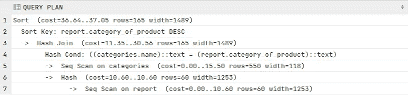
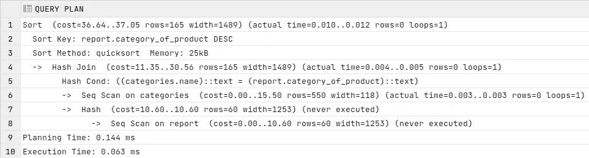

# 提高数据库性能的 12 个最佳实践

> 原文：<https://betterprogramming.pub/12-best-practices-for-increasing-the-database-performance-ca9dae8161a7>

## 提高数据库性能的 SQL 技巧

照片由来自 [Pexels](https://www.pexels.com/photo/set-of-modern-cables-and-connectors-on-shelf-4330788/?utm_content=attributionCopyText&utm_medium=referral&utm_source=pexels) 的 [Brett Sayles](https://www.pexels.com/@brett-sayles?utm_content=attributionCopyText&utm_medium=referral&utm_source=pexels) 拍摄

当我们开发时，一个重要的部分是知道如何正确地与我们的数据库交互。但是，我们往往只看数据库的配置参数和运行它的服务器的能力。虽然这很重要，但更重要的是知道如何正确使用 SQL 语言与数据库进行交互。因此，在这篇文章中，我们将看到一系列提高数据库性能的 SQL 查询技巧。

这些示例可以应用于不同的关系数据库。

我们开始吧。

# 一般提示

## 1.分析执行计划

当我们执行 SQL 语句时，我们的数据库引擎首先分析没有语法错误。然后，它确定执行语句的最佳方式；也就是说，它创建自己的执行计划。

我们可以使用这个 SQL 执行计划来分析 SQL 语句是如何执行的，并搜索性能问题。

做这件事的方法很简单。例如，在 Oracle 中，我们可以使用以下命令:

解释 Oracle 中的计划语法。

或者在 PostgreSQL 中:

解释 Postgres 中的计划语法。

前一个查询的执行计划。

成本元组中的第一个数字(36.04..37.05)一是*启动成本*，二是*总成本*。*总成本*是组件从读入数据到写入输出的整个执行时间。

之前的结果是估计值，因为我使用了"*解释。"*如果我们想要真实的度量，我们可以用代替*“解释分析”*

解释 Postgres 中的计划分析语法。

前一个查询的执行计划。

通过分析结果，我们可以检查 SQL 语句的哪一部分需要更多的优化。

## 2.避免编码循环

使用循环在表中进行插入是一个坏主意，因为我们不让数据库引擎优化*插入*。我经常在代码中看到循环插入数百行，而不是使用其他更优化的方式。

使用 for 循环:

使用 Java 循环插入

我们可以通过使用具有多行和值的唯一的 *INSERT* 或 *BATCH* 语句来转换上面的代码片段:

用 Java 批量插入。

## 3.避免相关的 SQL 子查询

相关子查询是使用父查询中的值的查询。除非 SQL 引擎优化器使用联接重写相关子查询，否则这种 SQL 查询会对外部查询返回的每一行运行一次，从而降低 SQL 查询的整体性能。

相关子查询。

正如我们在这里看到的，问题是内部查询(SELECT c.name…)对外部查询(SELECT r.id，..)并对外部查询处理的每一行重复同样的操作。

我们可以通过如下重写语句来解决这个问题:

使用左连接代替相关子查询。

## 4.分割

SQL 中的表分区是将大型数据表划分为称为分区的小型可管理表的过程。使用这种技术，我们可以提高查询性能，并使管理和查询数据变得更加容易。

我们主要有两种类型的分区:

**垂直分区**

垂直分区是垂直拆分表，并且是在列上完成的。因此，一组列放在一个数据存储中，另一组放在另一个数据存储中。

**水平分区**

水平分区是水平分割表，并且在行上进行。一组行进入一个数据存储，另一组进入不同的数据存储。

表分区通常用于包含历史数据的表。例如，在这些情况下，我们可以按年份进行水平分区，这将提供对包含当前年份数据的表的快速访问，这些数据通常是被咨询最多的数据。

## 5.检查索引

如果使用得好的话，索引将会给我们的数据库迭代带来更快的速度。

建议我们在 WHERE 和 JOINS 子句中使用的字段上创建索引，如果可能的话，在具有数字值而不是字符值的列上创建索引。

## 6.删除未使用的索引

为所有东西创建索引而不担心它会使我们的表空间耗尽，特别是当我们在其上创建索引的表非常大的时候。为此，建议不时清理一下，看看我们拥有的所有索引是否都有必要。

## 7.选择合适的数据类型

并不是所有的类型都占据相同的位置，当我们使用一个具体的数据类型时，我们也可以根据我们存储的内容来限制它的大小。例如，VARCHAR(4000)与 VARCHAR(40)不同。我们总是必须调整我们将存储在字段中的内容，以免占用数据库中不必要的空间。

## 8.处理

保持较小的事务，因为事务会锁定正在处理的表数据，并可能导致死锁。

# 语法提示

## 9.用 EXISTS-NO EXISTS 代替 IN-NOT IN

如果我们想确认特定表中某个值的存在，推荐的方法是使用 *EXIST* 子句。

这是因为执行 *EXISTS* 子句的进程一旦在表中找到所需的值就会停止。但是，另一方面，在子句中使用*的查询会扫描所有内容，即使是在找到必要的值之后。*

## 10.仅在必要时使用 LIKE 运算符

要搜索一个字符串，我们可以使用 LIKE 操作符或“=”操作符。

LIKE 操作符和“=”操作符之间的主要区别在于，我们可以通过 LIKE 操作符使用通配符来搜索部分字符串。相反，使用“=”操作符，我们搜索精确匹配。

如果我们执行精确搜索，使用“=”操作符总是更好，因为它使用索引列，速度更快。

## 11.仅选择您需要的字段

SELECT *查询返回表中所有列的记录。虽然在某些情况下很有帮助，但在许多其他情况下，这是不必要的。

为我们带来所有专栏的一些问题是:

1.  带宽过度消耗。
2.  可以添加或删除列，或者修改表中的列名。因此，对于 SELECT *我们可能会得到意外的结果
3.  SELECT *返回的列的顺序可能不同。

## 12.使用连接代替子查询

子查询是嵌入在另一个 SQL 语句的子句中的 SELECT 语句。它更容易编写，但是连接通常针对数据库引擎进行了更好的优化。

在某些情况下，使用子查询可能比使用连接更好。例如，当连接大型表时。在这些情况下，首选方法是从那个大表中进行子选择(限制行数)，然后连接它们。

# 最后的想法

SQL(结构化查询语言)是一种强大的领域特定语言，它允许我们轻松地管理和检索关系数据库中的信息。

问题是，如果您不知道如何正确使用它，您的数据库的性能将会显著下降。这就是为什么有必要考虑我在这篇小文章中写的基本建议，并且作为一个好的实践，在编写 SQL 时使用一个好的风格指南。

有许多关于 [SQL](https://www.sqlstyle.guide/) 的风格指南，但是选择一个并在我们所有的开发中使用它是很重要的。

最后，我们不要忘记，我们必须做的第一件事是**了解我们的数据**，它的类型，以及它如何相互关联，以便在与我们的数据库交互时做出最佳决策。

我希望这篇文章对你有所帮助，如果你有任何问题，请随时联系我。我会尽量尽快回答。

如果你喜欢这篇文章，考虑通过我的[个人资料](https://kesk.medium.com/membership)订阅 Medium。谢谢大家！