# 12 个在样式化组件中使用&符号的编码示例

> 原文：<https://betterprogramming.pub/12-coding-examples-of-ampersand-usages-in-styled-components-78ce9bec4d09>

## CSS 类、伪类、伪元素和元素的&符号用法

照片由 [TJ 阿诺德](https://unsplash.com/@missinformed?utm_source=medium&utm_medium=referral)在 [Unsplash](https://unsplash.com?utm_source=medium&utm_medium=referral) 上拍摄

是一个流行的库，用来设计 React 应用程序。我们已经介绍了[是什么以及如何使用它](/styled-components-a-css-in-js-approach-755f6a196c42)，并提供了 [7 种使用样式化组件](https://medium.com/p/69debaad97e3)继承样式的方法。

在这篇文章中，我们将讨论与号的用法。在 styled-components 中，`&`(与号)用于指代组件的所有实例。在预处理器的支持下， [stylis](https://github.com/thysultan/stylis.js) ，`&`用于编写嵌套的干净代码。`&`源于 [Sass](https://sass-lang.com/) 和 [Less](https://lesscss.org/) ，是 CSS 扩展。

在上一篇文章中，我们重用了[Create React App 工作环境来探索&符号的用法。以下软件包已安装在环境中:](https://medium.com/p/69debaad97e3#16d6)

*   `styled-components`

以下是一些例子:

*   CSS 类
    –[示例中的](#46c2) `[.green](#46c2)` [选择器](#46c2)
    –[示例中的](#3e0f) `[Container](#3e0f)` [组件](#3e0f)
    –[示例中的](#613b) `[&.green](#613b)` [选择器](#613b)
    –[示例中的](#b997) `[& .green](#b997)` [选择器](#b997)
    –[示例中的](#1d33) `[&&&&& .green](#1d33)` [选择器](#1d33)
*   伪类
    –[示例](#2f28) `[&:hover](#2f28)` [选择器](#2f28)
    –[示例](#13b7) `[& :hover](#13b7)` [选择器](#13b7)
    –[示例](#5b85) `[& :is(div):hover](#5b85)` [选择器](#5b85)
*   伪元素
    –[示例](#486d) `[&::first-line](#486d)` [选择器](#486d)
    –[示例](#8c81) `[& ::before](#8c81)` [和](#8c81) `[& ::first-line](#8c81)` [选择器](#8c81)
*   元素
    –[示例](#2d3f) `[& div](#2d3f)` [选择器](#2d3f)
    –[示例](#4611) `[span &](#4611)` [选择器](#4611)

# CSS 类

在 HTML 中，`class`属性用于指定元素的类。它可以设置为任何类型的元素，并且可以接受多个由空格分隔的类名。一个类可以被多个元素使用，类名区分大小写。

## 的示例。绿色选择器

在 CSS 中，类名通常用于设计元素的样式。

我们创建了一个将`className`设置为`container`的元素。下面是`src/App.js`:

在第 1 行，`./App.css`被导入。

在第 4 行，`div`元素将`className`设置为`container`。

下面是由`src/App.css`中的`container`类选择器定义的 CSS 规则:

执行`npm start`，我们会看到以下蓝色背景的界面:

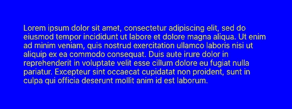

作者图片

这是检查窗口:

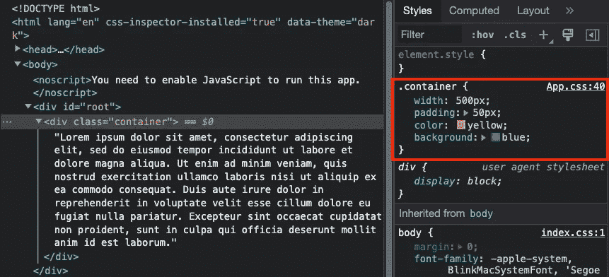

作者图片

显示`div`应用了`App.css`中定义的`.container` CSS 规则。

## 容器组件的示例

与类相关的选择器可以用`styled-components` —定制的 React 组件来代替。在编译期间，很容易跟踪哪些组件是未使用的或未定义的。它通过比较类名或其他方式来提高代码的可管理性。因为它是 JavaScript 中的 CSS，所以它支持具有编程能力的动态样式。

我们创建一个样式化的组件，`Container`。以下是`src/App.js`中`Container`组件的一个例子:

在第 1 行，导入的是`styled`，而不是`./App.css`。

在第 3–8 行，样式化组件`Container`扩展了`div`的样式。它包含了在`src/App.css`中定义的 CSS 属性。

执行`npm start`，有效。

作者图片

这是检查窗口:

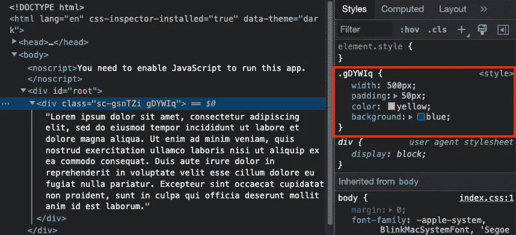

作者图片

在内部，`styled-components`为每个组件生成两个类——一个是静态的，一个是动态的。类名由 [MurmurHash 算法](https://en.wikipedia.org/wiki/MurmurHash)生成。它根据组件 id 和计算的样式字符串生成一个唯一的标识符，然后将散列值转换为字母类名。

静态类名是`sc-<hashedStringName>`。它用于标识样式化的组件，并且没有附加到它的样式。所有实例的名称都相同。在这个例子中，静态类是`sc-gsnTZi`。

根据插值的结果，每个实例的动态类名可能不同。在示例中，动态类是`gDYWIg`，它定义了样式。

## &的例子。绿色选择器

对于`styled-components`的所有好处，建议用`styled-components`来造型。然而，我们可能无法避免使用类。比如我们用第三方库，比如[蚂蚁设计系统](/understanding-the-ant-design-system-a-ui-design-for-enterprises-39afdb188b06)，就会有库定义的类。

`&`对处理多个/嵌套类有效。CSS 选择器`.class1.class2`选择 class 设置为`class1`和`class2`的所有元素。同样地，`&.class`选择 class 设置为`class`的样式化组件本身。

下面是`src/App.js`中`&.green`的一个例子:

在第 8–10 行，选择器`&.green`将 CSS 属性设置为绿色背景。这个选择器由第 14 行的元素匹配。

执行`npm start`，我们看到绿色背景。

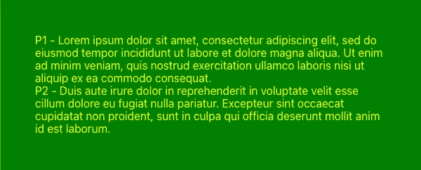

作者图片

这是检查窗口:

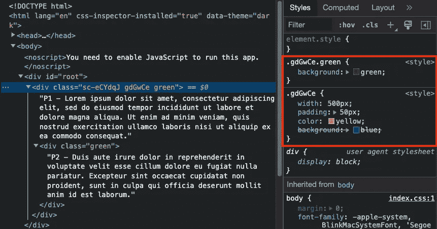

作者图片

在内部，`styled-components`为`Container`生成类`sc-eCYdqJ`和`gdGwCe`。`.gdGwCe.green`和`.gdGwCe`是生成 CSS 规则。

## &的例子。绿色选择器

CSS 选择器`.class1 .class2`(中间有一个空格)，选择作为`class1`元素的后代的所有`class2`元素。同样，`&. class`选择特定样式组件中的所有`class`元素。

下面是`src/App.js`中`&. green`的一个例子:

在第 8–10 行，选择器`&. green`将 CSS 属性设置为绿色背景。该选择器将与第 19 行的元素匹配。

执行`npm start`，我们看到 P2 的绿色背景。

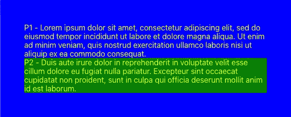

作者图片

这是检查窗口:

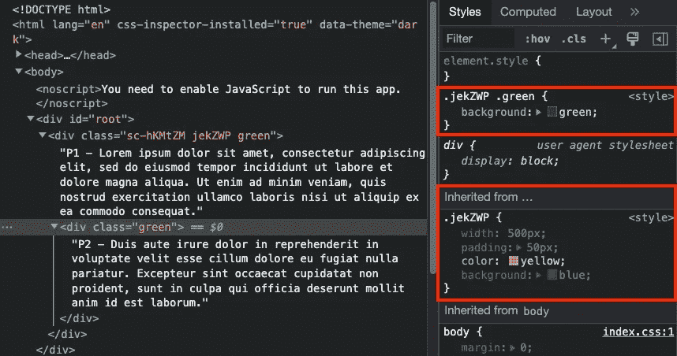

作者图片

在内部，`styled-components`为`Container`生成类`sc-hKMtZM`和`jekZWP`。`.jekZWP .green`和`.jekZWP`是生成的 CSS 规则。

## & & & & & &的例子。绿色选择器

特异性是浏览器使用的算法，用于确定与元素最相关的 CSS 规则，进而确定应用于元素的属性值。`!important`规则可以用来增加属性/值的重要性，但是这很容易出错，通常不是一个好主意。

覆盖高特异性样式的更好方法是增加指定的样式。由于每个`&`都被替换为生成的动态类，所以通过重复`&`可以实现高特异性。

下面是`src/App.js`中`&&&&& .green`的一个例子:

在第 8–10 行，选择器`&&&&&. green`将 CSS 属性设置为绿色背景。该选择器将与第 19 行的元素匹配。

执行`npm start`，我们会看到 P2 的绿色背景。UI 看起来和选择器`&. green`一样。

作者图片

但是,“检查”窗口显示了不同之处:

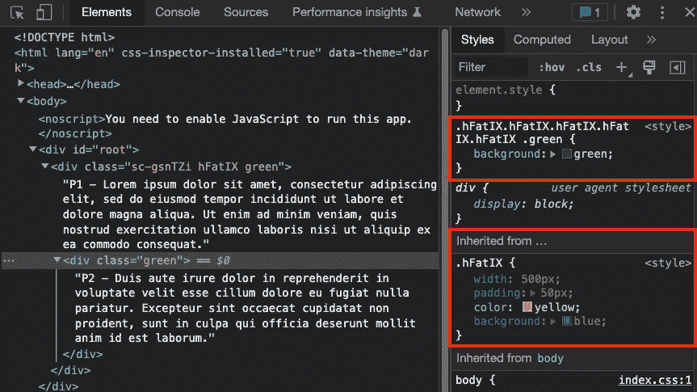

作者图片

在内部，`styled-components`为`Container`生成类`sc-gsnTZi`和`hFatIX`。`.hFatIX.hFatIX.hFatIX.hFatIX.hFatIX .green`和`.hFatIX`是生成的 CSS 规则。

这足够具体了吗？

# 伪类

伪类是添加到选择器中的关键字，它指定所选元素的特殊状态。例如，`:hover`通常用于当用户的指针悬停在元素上时选择元素。以下是伪类列表:`:active`、`:any-link`、`:autofill`、`:blank` 、`:checked`、`:current`、【实验】、`:default`、`:defined`、`:dir()`、【实验】、`:disabled`、`:empty`、`:enabled`、`:first`、`:first-child`、`:first-of-type`、`:fullscreen`、`:future`、`:focus`、`:focus-visible`、`:focus-within`、`:has()`、【实验】、`:host`、`:host()`、`:host()`。 `:nth-child()`、`:nth-col()`、`:nth-last-child()`、`:nth-last-col()`、`:nth-last-of-type()`、`:nth-of-type()`、`:only-child`、`:only-of-type`、`:optional`、`:out-of-range`、`:past`、【实验】、`:picture-in-picture`、`:placeholder-shown`、`:paused`、`:playing`、`:read-only`、`:read-write`、`:required`、`:right`、`:root`、`:scope`、`:state()`、【实验】、`:target`、`:target-within`。

## &:悬停选择器的示例

`&`可用于伪类。`&:hover`选择样式组件本身，其状态在`:hover`上。

下面是`src/App.js`中`&:hover`的一个例子:

在第 8–10 行，选择器`&:hover`将 CSS 属性设置为绿色背景。当指针悬停在`Container`中的任何内容上时，该选择器将被匹配。

执行`npm start`，当指针悬停在`Container`上方时，我们看到绿色背景。

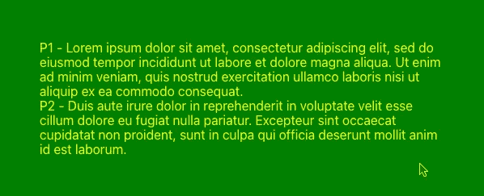

作者图片

这是检查窗口:

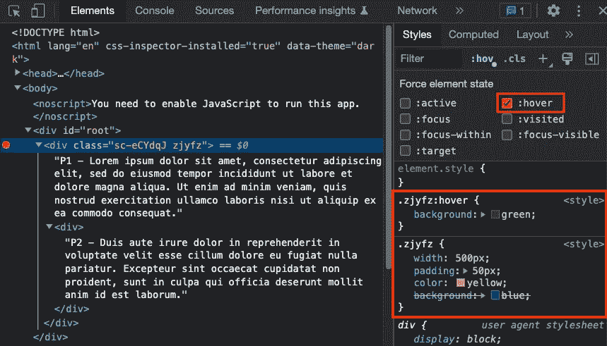

作者图片

在内部，`styled-components`为`Container`生成类`sc-eCYdqJ`和`zjyfz`。当选择悬停状态时，`.zjyfz:hover`和`.zjyfz`是生成的 CSS 规则。

## &:悬停选择器的示例

`&: hover`选择状态为`:hover`的样式化组件后代。

下面是`src/App.js`中`& :hover`的一个例子:

在第 8–10 行，选择器`& :hover`将 CSS 属性设置为绿色背景。当指针悬停在`Container`的后代内容上时，这个选择器将被匹配。

执行`npm start`，当指针悬停在 P2 上方时，我们会看到绿色背景。

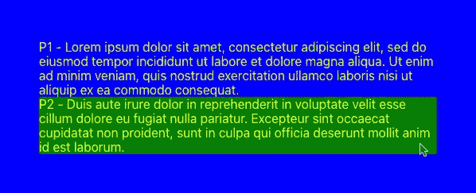

作者图片

这是检查窗口:

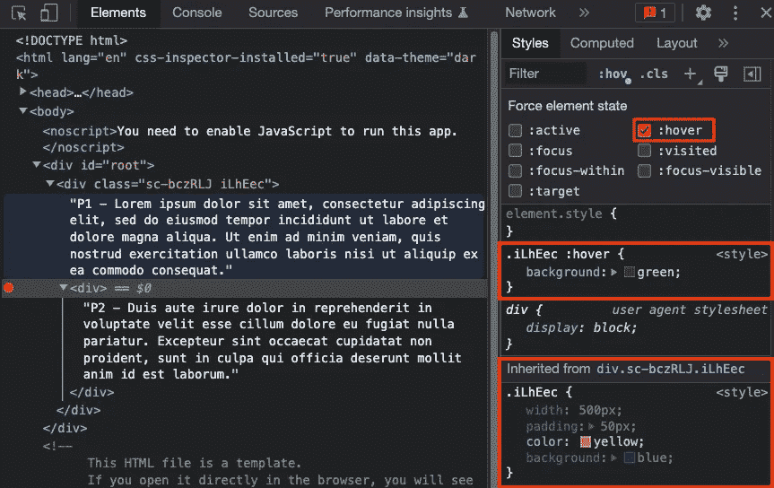

作者图片

在内部，`styled-components`为`Container`生成类`sc-bczRLJ`和`iLhEec`。当选择悬停状态时，`.iLhEec :hover`和`.iLhEec`是生成的 CSS 规则。

## & is(div):悬停选择器的示例

选择器中的任何地方都可以使用多个伪类。`& :is(div):hover` 选择状态为`:hover`的`div`样式组件后代。

下面是`src/App.js`中`& :is(div):hover`的一个例子:

在第 8–10 行，选择器`& :is(div):hover`将 CSS 属性设置为绿色背景。当指针悬停在`Container`的后代`div`上时，这个选择器将被匹配。

执行`npm start`，当指针悬停在 P1 上方时，我们会看到绿色背景。

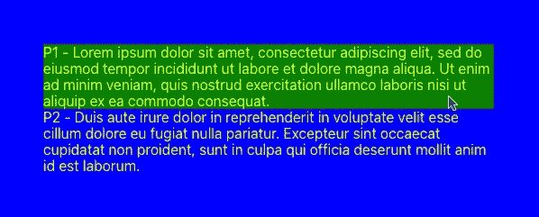

作者图片

这是检查窗口:

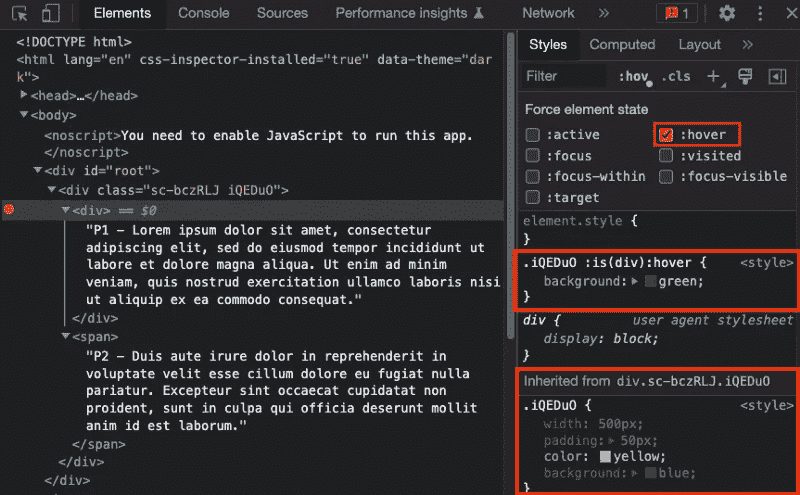

在内部，`styled-components`为`Container`生成类`sc-bczRLJ`和`iQEDuO`。当`div`的悬停状态被选中时，`.iQEDuO is(div):hover`和`.iQEDuO`是生成的 CSS 规则。

# 伪元素

CSS 伪元素是添加到选择器中的关键字，可用于设置所选元素的特定部分的样式。例如，`::first-line`可以用来改变段落首行的背景。伪元素附加在选择器的最后一个简单选择器之后。

通常，应该使用双冒号(`::`)而不是单冒号(`:`)。这将伪类与伪元素区分开来。然而，由于这种区别在 W3C 规范的旧版本中并不存在，所以大多数浏览器都支持原始伪元素的两种语法。

以下是伪元素列表:`::after` ( `:after`)，`::backdrop`，`::before` ( `:before`)，`::cue`，`::cue-region`，`::first-letter` ( `:first-letter`)，`::first-line` ( `:first-line`)，`::file-selector-button`，`::grammar-error` (实验用)，`::marker`，`::part()`，`::placeholder`，`::selection`，`::slotted()`，`::spelling-error`(实验用)，以及`::target-text`(实验用)。

伪类可以针对处于特定状态的元素，就像我们在 DOM 中添加了一个处于该状态的 CSS 类一样。伪元素的行为就好像我们在 DOM 中添加了一个全新的元素，它可以被样式化。

## & *第一行选择器的示例

`::first-line`伪元素将样式应用于块级元素的第一行。

下面是`src/App.js`中`&::first-line`的一个例子:

在第 8–10 行，选择器`&::first-line`将 CSS 属性设置为绿色背景。该选择器适用于`Container`的第一行。

执行`npm start`，我们看到第一行的绿色背景。

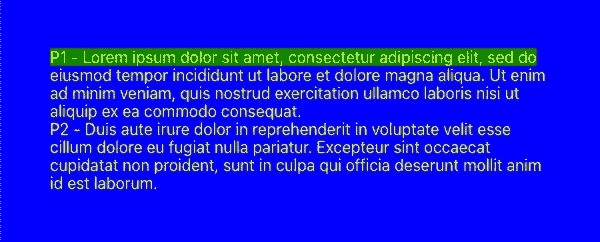

作者图片

这是检查窗口:

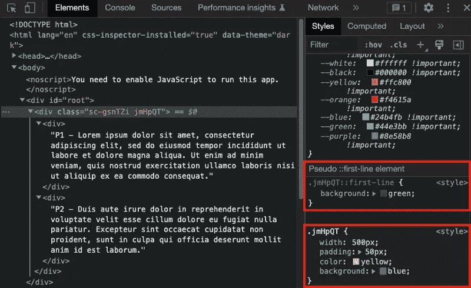

作者图片

在内部，`styled-components`为`Container`生成类`sc-gsnTZi`和`jmHpQT`。`.jmHpQT::first-line`和`.jmHpQT`是生成的 CSS 规则。

## & before 和& first line 选择器的示例

`::before`伪元素创建所选元素的第一个子元素。它通常用于向具有`content`属性的元素添加修饰内容。默认情况下，它是内联的。

以下是`src/App.js`中`& ::before`和`&::first-line`的例子:

在第 8–10 行，选择器`& ::before`创建`Container`后代的第一个孩子，作为`*` 查看。该选择器适用于第 18–23 行和第 24–28 行的`div`元素。

在第 11–13 行，选择器`& ::first-line`将 CSS 属性设置为绿色背景。该选择器应用于第 18–23 行和第 24–28 行的`Container`的后代— `div`元素的第一行文本。

执行`npm start`，我们看到第一行的`before`内容和绿色背景。

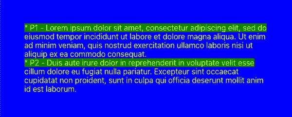

作者图片

这是检查窗口:

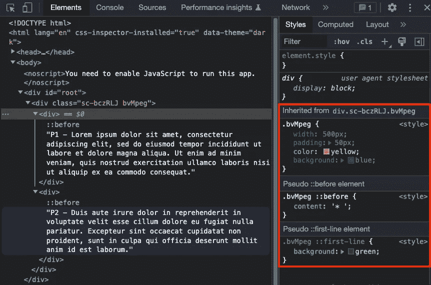

作者图片

在内部，`styled-components`为`Container`生成类`sc-bczRLJ`和`bvMpeg`。`.bvMpeg`、`.bvMpeg ::before`、`.bvMpeg ::first-line`是生成的 CSS 规则。

# 元素

`&`用来指一个样式化组件的所有实例。它的行为类似于 CSS 选择器中的元素。元素的所有 CSS 规则都适用于`&`。

## & div 选择器的示例

CSS 选择器`element1 element2`，选择`element1`内的所有`element2`。同样，`& div`选择样式组件的所有后代`div`。

下面是`src/App.js`中`& div`的一个例子:

在第 8–10 行，选择器`& div`将 CSS 属性设置为绿色背景。该选择器将与第 19 行的元素匹配。

执行`npm start`，我们看到 P2 的绿色背景。

作者图片

这是检查窗口:

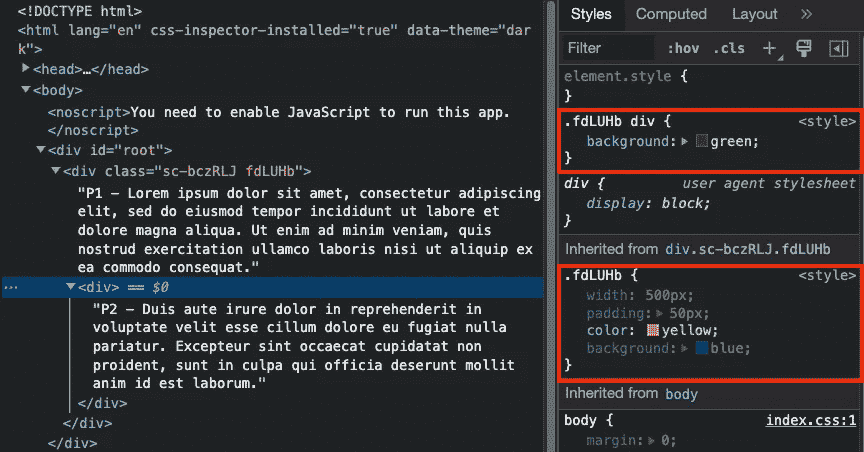

作者图片

在内部，`styled-components`为`Container`生成类`sc-bczRLJ`和`fdLUHb`。`.fdLUHb div`和`.fdLUHb`是生成的 CSS 规则。

## 跨度选择器示例

`span &`选择属于`span`后代的样式组件。

下面是`src/App.js`中`span &` 的一个例子:

在第 8–10 行，选择器`span &`将 CSS 属性设置为绿色背景。该选择器将与第 27–29 行的元素匹配。

执行`npm start`，我们看到第一段的绿色背景。

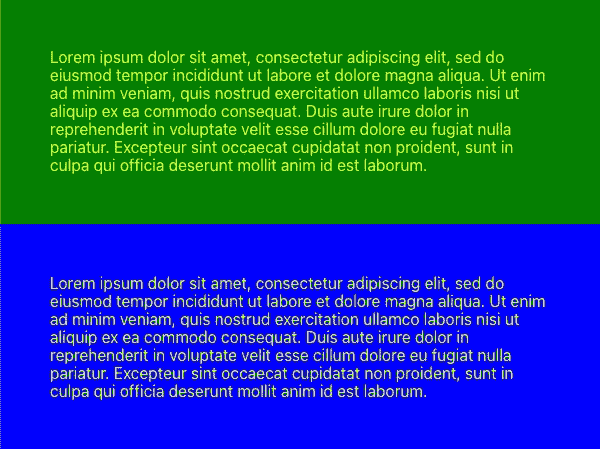

作者图片

这是检查窗口:

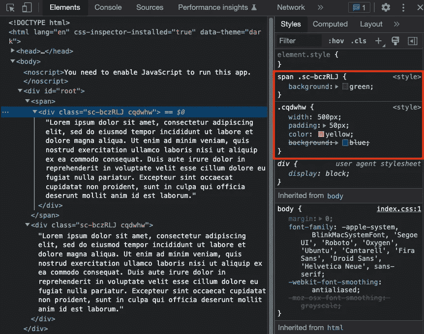

作者图片

在内部，`styled-components`为`Container`生成类`sc-bczRLJ`和`cqdwhw`。`span .sc-bczRLJ`和`.cqdwhw`是生成的 CSS 规则。

## & + &选择器的示例

CSS 选择器`element1 + element2`选择紧随`element1`之后的第一个`element2`。同样，`& + &`选择紧跟在同一样式组件之后的样式组件。

下面是`src/App.js`中`& + &`的一个例子:

在第 8–10 行，选择器`& + &`将 CSS 属性设置为绿色背景。该选择器将由第 28 行的`Paragraph`元素匹配。

执行`npm start`，我们看到第二段的绿色背景。

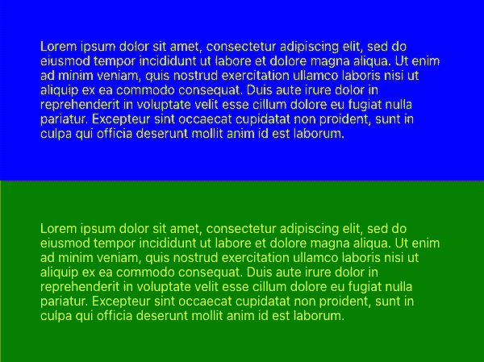

作者图片

这是检查窗口:

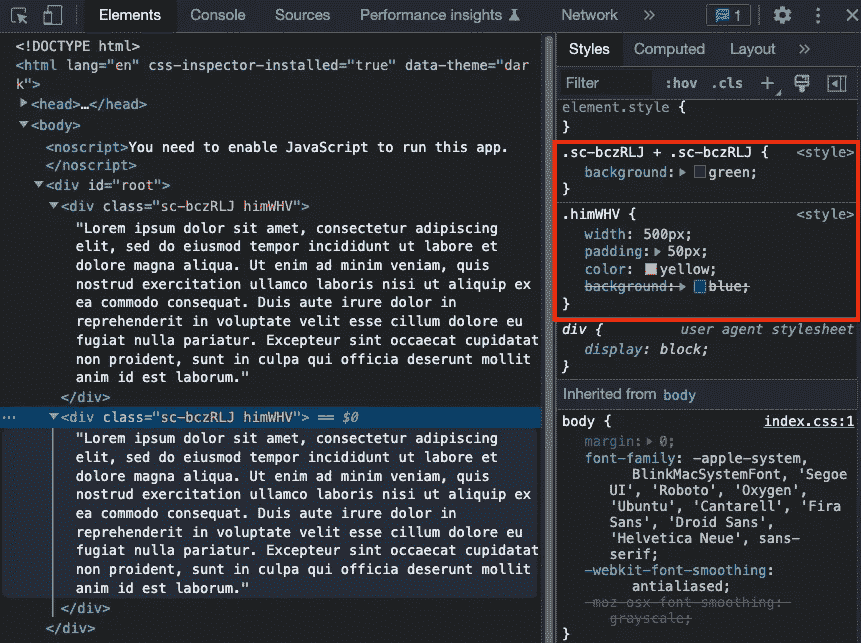

作者图片

在内部，`styled-components`为`Container`生成类`sc-bczRLJ`和`himWHV`。`.sc-bczRLJ .sc-bczRLJ`和`.himWHV`是生成的 CSS 规则。

# 结论

`styled-components`是一个流行的库，用于设计 React 应用程序。它被 React 项目广泛采用。我们已经展示了 12 个符号用法的编码示例。希望它能让你的代码干净有效。

感谢阅读。

如果你有兴趣，可以看看[其他风格的组件文章](https://jenniferfubook.medium.com/jennifer-fus-web-development-publications-1a887e4454af#266e)。