# 12 个前端 CSS 网站书签

> 原文：<https://betterprogramming.pub/12-front-end-css-generator-websites-to-bookmark-cc557079b0ac>

## 使用精心策划的网络工具列表提高您的工作效率


[由 rawpixel.com/弗里皮克设计](http://www.freepik.com/)

当使用 CSS 的时候，有很多任务是具有挑战性的，并且很难正确完成。这不是因为它们的难度，而是因为缺乏 UI 工具。幸运的是，我们可以在网上找到一些工具。这些将填补空白，帮助我们更快、更有效地工作。

在这篇文章中，我们将检查一个网站的精选列表，它可以帮助你毫不费力地生成完美的 CSS。

确保你将它们加入书签，这样它们就很容易找到了。

# 1.汉堡包

链接:[https://jonsuh.com/hamburgers](https://jonsuh.com/hamburgers/)|免费

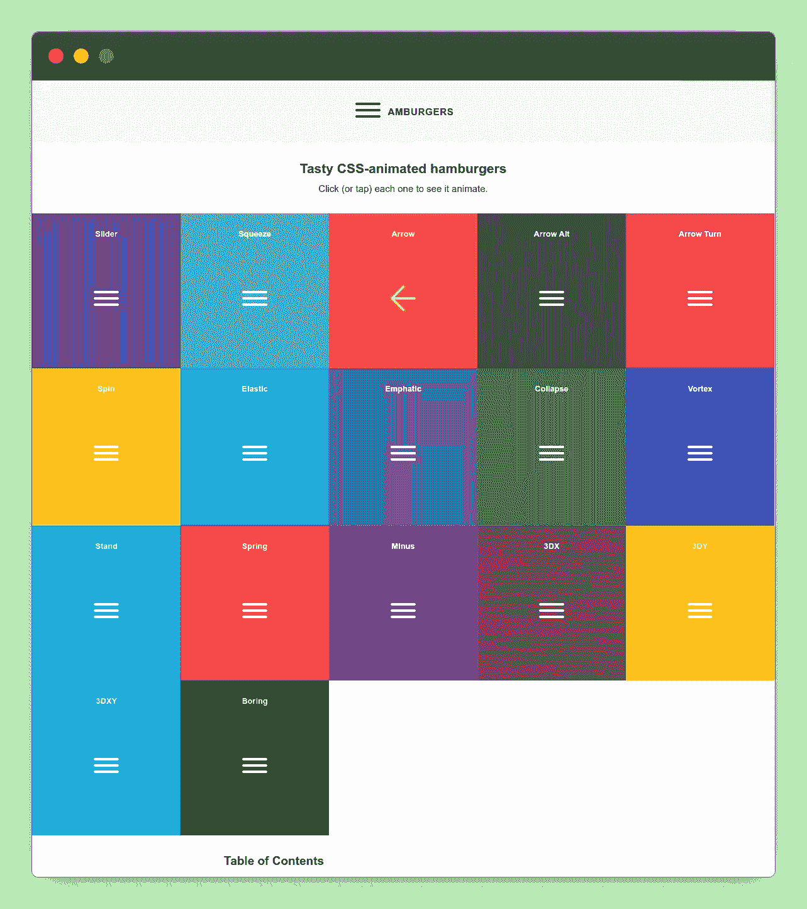

作者对网站的捕获

## 特点:

*   动画组件
*   GitHub 中可用的项目[此处](https://github.com/jonsuh/hamburgers)
*   支持 95.43%的浏览器
*   友好的咏叹调
*   高度可定制
*   可用的`Sass`文件

在构建移动响应应用程序时，汉堡包图标已经成为一种广泛使用的模式。它通常放置在图形界面的顶角。它的目标是切换导航菜单。

在这个网站上，我们将能够从各种汉堡包图标过渡中进行选择。它们都配备了过渡，为导航带来了进一步的背景。

用法非常简单:

1.  下载 CSS 并将其包含在`<head>`标签中
2.  添加标记
3.  使用`css`类`hamburger--collapse`来切换状态。

# 2.SVG 发生器

链接: [https://haikei.app](https://haikei.app/) |暂时免费

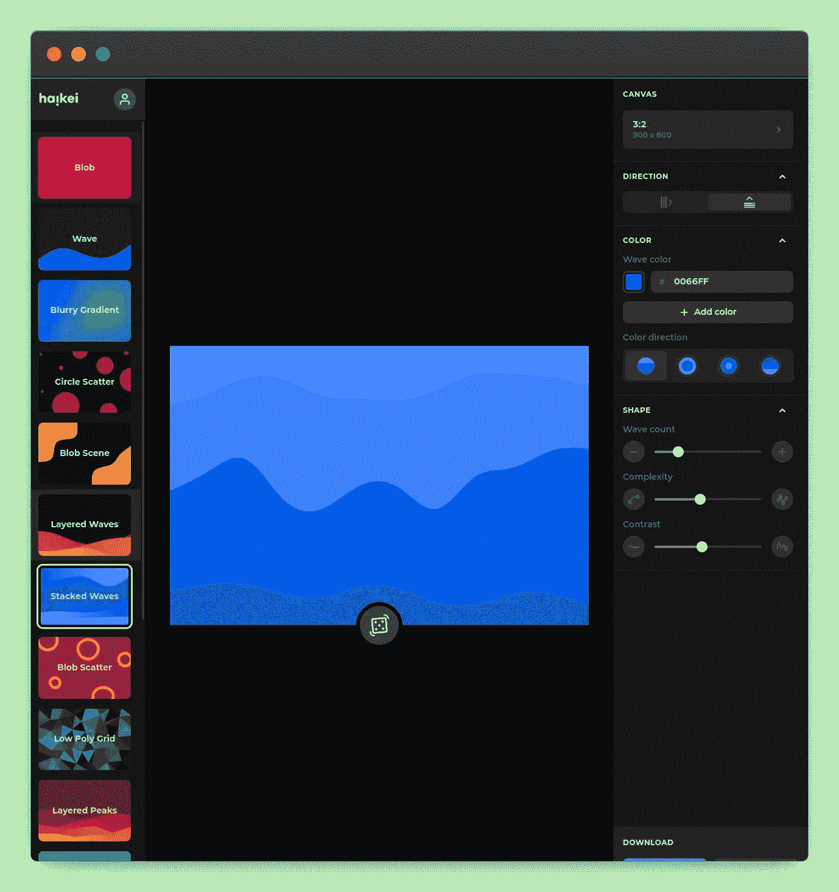

作者对网站的捕获

## 特点:

*   独特的设计
*   可供选择的不断增长的模板库

这是一个生成独特的`svg`形状、背景和图案的工具。它生成一个`svg`对象或图像，可以在您的站点上使用。首选的导出格式应该是`svg`，因为它比传统的`png`有更大的优势。

它是如何工作的？它是围绕发电机建立的。它整合了一些已经流行的发电机，如 T21 波发电机。

# 3.电网发电机

链接:[https://CSS grid-generator . net lify . app](https://cssgrid-generator.netlify.app/)|免费

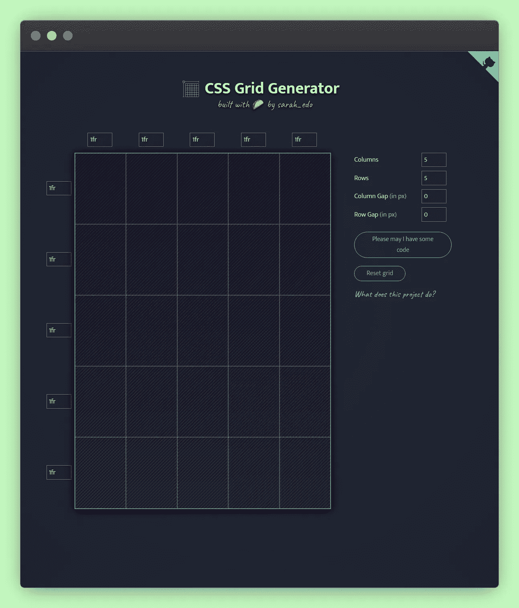

作者对网站的捕获

## 特点:

*   直观的界面
*   代码生成

`CSS Grid`的布局前段时间已经到了很好的支撑。越来越多的 Web 开发人员每天都在使用它。然而，确定确切的细节可能会很繁琐。特别是在开始的时候，我们不知道所有的属性。

有了这个网站，我们可以探索和创建您定制的`CSS Grid`布局。这将有助于加快这一进程。进一步理解这个 CSS 特性也很方便。

该网站的输出是一个 CSS 剪贴，我们可以粘贴到我们的 CSS 表文件。

# 4.布局生成器

链接:[https://layout . bradwoods . io](https://layout.bradwoods.io/)|免费

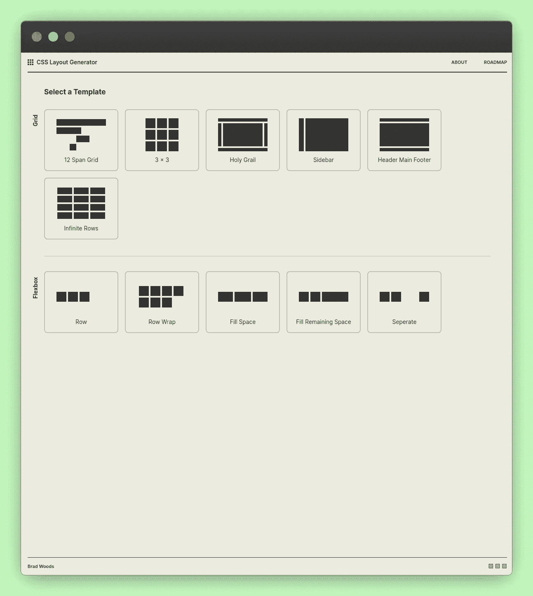

作者对网站的捕获

## 特点:

*   多种选择
*   代码生成
*   响应工具
*   基本/高级界面

CSS 布局生成器是一个为布局组件创建 CSS 和 HTML 的工具。

创建新布局时，我们可以将此网站用作模板指南。我们将很快确定我们的布局是最适合网格还是 Flex 实现。

一旦我们选择了模板，我们可以进一步定制我们的布局。因此，我们可以获取生成的 CSS 并将其粘贴到我们的站点中。

# 5.布局模式

链接:[https://web.dev/patterns/layout](https://web.dev/patterns/layout/)|免费

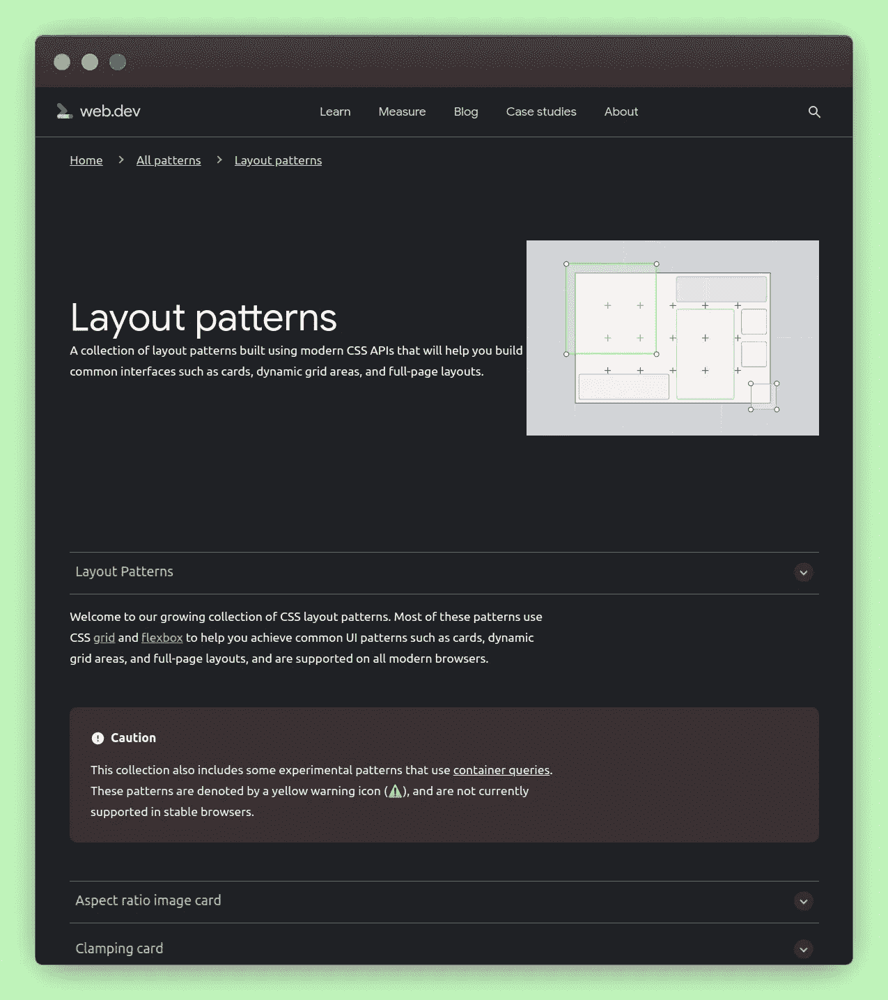

作者对网站的捕获

## 特点:

*   由谷歌支持
*   现代 CSS
*   包含最先进的 CSS 功能，如容器查询

这是谷歌打造的一个工具。他们相信一个开放的、可访问的、私有的和安全的网络。这就是为什么他们向 Web 开发人员提供了一些像这样的工具。

大多数模式在内部使用 Grid 和 Flex。这不是一个静态的列表，因为它将在未来不断增长。这是值得书签这一点，并定期检查。

# 6.剪辑路径生成器

链接:[https://bennettfeely.com/clippy/](https://bennettfeely.com/clippy/)|免费

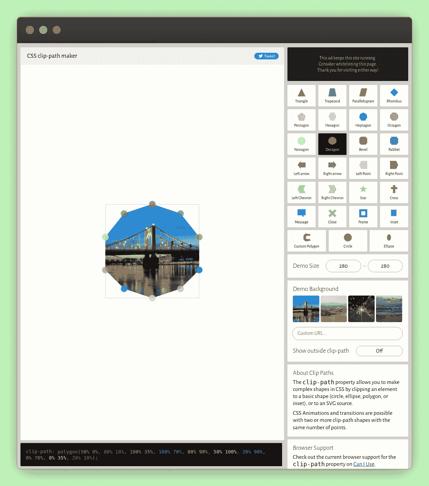

作者对网站的捕获

## 特点:

*   高度可定制
*   直观的界面
*   易于使用的代码输出

`CSS cli-path`功能允许我们构建复杂的形状。它的工作原理是用多边形遮蔽内容。不过，构建这个多边形可能很有挑战性。

有了这个站点，您可以以一种简单方式交互式地构建多边形。输出代码很简单，很容易集成到我们的 CSS 表单中。

```
**clip-path**: polygon(25% 0%, 75% 0%, 100% 53%, 25% 100%, 0% 50%);
```

# 7.过渡动画生成器

链接:[https://www . transition . style](https://www.transition.style/)|免费

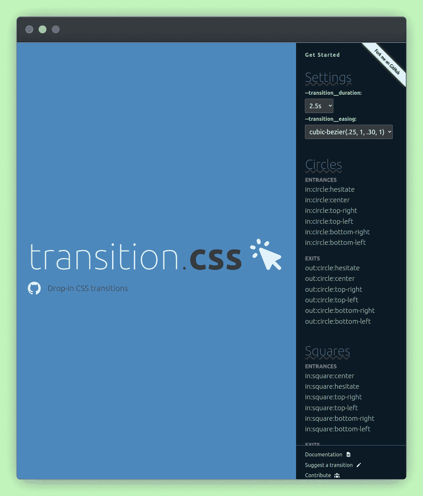

作者对网站的捕获

## 特点:

*   高度可定制
*   有状态可共享链接

`CSS transitions`提供了一种精确控制属性动画速度的方法。我们也可以牺牲性能来使用 JavaScript 制作动画。所以在可能的情况下，我们希望使用`CSS transitions`。

```
*// syntax* **transition:** <property> <duration> <timing-function> <delay>;
```

该网站提供了一组预定义的动画供选择。它将`CSS transitions`与`clip-path`功能相结合，创造出卓越的效果。它们很微妙，但可以极大地影响任何网站的 UX。

以下是生成的输出示例:

# 8.动画等待

链接:[https://wait animate . ws tone . uk](https://waitanimate.wstone.uk/)|免费

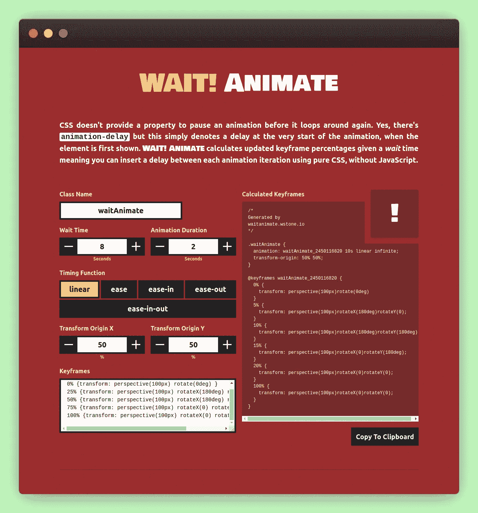

作者对网站的捕获

## 特点:

*   使用方便

目前没有办法在动画再次循环之前暂停它们。这个工具就是为了这个目标而构建的。它会计算动画关键帧时间的百分比来创建该效果。

手动完成这项工作需要付出很大的努力，还要不断尝试。

# 9.三次贝塞尔生成器

链接:[https://cubic-bezier.com](https://cubic-bezier.com/#.17,.67,.83,.67)|免费

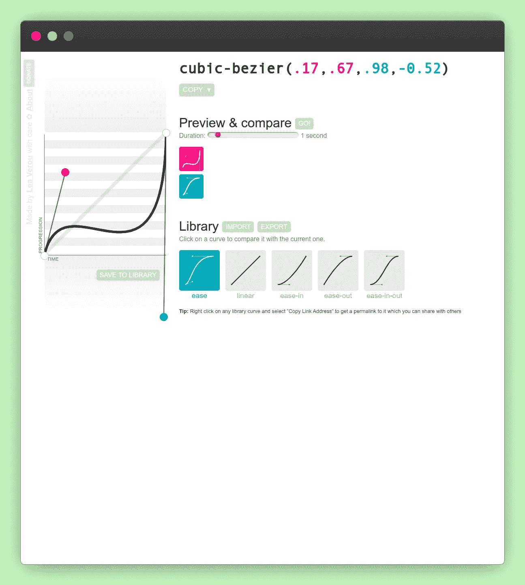

作者对网站的捕获

## 特点:

*   交互式界面
*   简单输出
*   有状态可共享链接

三次贝塞尔函数可以用来定义动画计时函数。它由四个点`P0`、`P1`、`P2`、`P3`组成。它有助于微调我们的动画时间(慢启动，快启动，渐进等)

使用这个网站，我们将能够轻松地生成自定义贝塞尔曲线。剩下的就是在我们的动画中使用输出代码:

```
animation: x 0.3s **cubic-bezier(0,4,1,4)** infinite;
```

# 10.类型标度发生器

链接:[https://maximeroudier.com/typeScaleClampGenerator](https://maximeroudier.com/typeScaleClampGenerator/)|免费

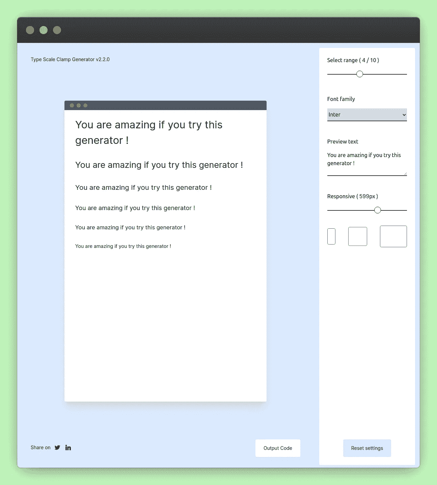

作者对网站的捕获

## 特点:

*   模拟不同的分辨率
*   波段开关

字体是任何网站的一个重要方面。当设计一个网站时，了解不同的字体大小如何搭配是很重要的。有了这个 web 应用程序，创建一致的字体比例变得非常简单。

由于这将使用`rem`单元生成字体，因此查看不同基本尺寸字体的外观也很方便。默认为`16px`，它匹配任何浏览器的默认根字体。

# 11.梯度发生器

链接:[https://CSS gradient . io](https://cssgradient.io/)|免费

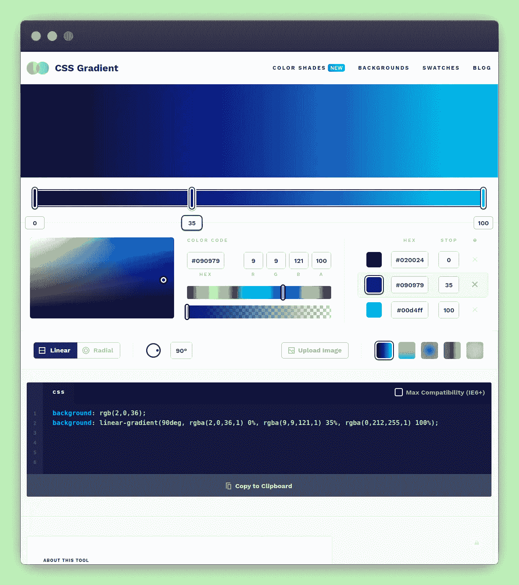

作者对网站的捕获

## 特点:

*   使用方便
*   高度可定制

`CSS Gradient`的生成是 web 开发领域中最琐碎的任务之一。有了这个工具，我们可以用直观的界面创建漂亮的渐变。

我们可以组合形状、颜色，甚至使用图像。我们可以获取输出并将其粘贴到我们的代码库中。

# 12.调色板生成器

链接:【https://mybrandnewlogo.com/color-palette-generator】T2|免费

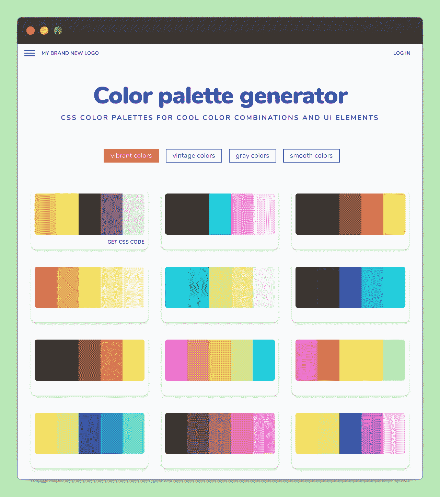

作者对网站的捕获

## 特点:

*   预定义的选择
*   使用方便

设计项目时，创建一致的配色方案非常重要。并不是所有的颜色都很协调。他们应该和谐地工作，传递正确的信息。手动完成这项工作既麻烦又困难。

`Color Palette Generate`工具帮助我们选择正确的颜色。你可以浏览精心设计的列表。我们可以使用按钮按主题导航到我们想要的调色板。

# 奖励:实用 CSS 生成器

链接:【https://html-css-js.com/css/generator/box-shadow】T4|免费

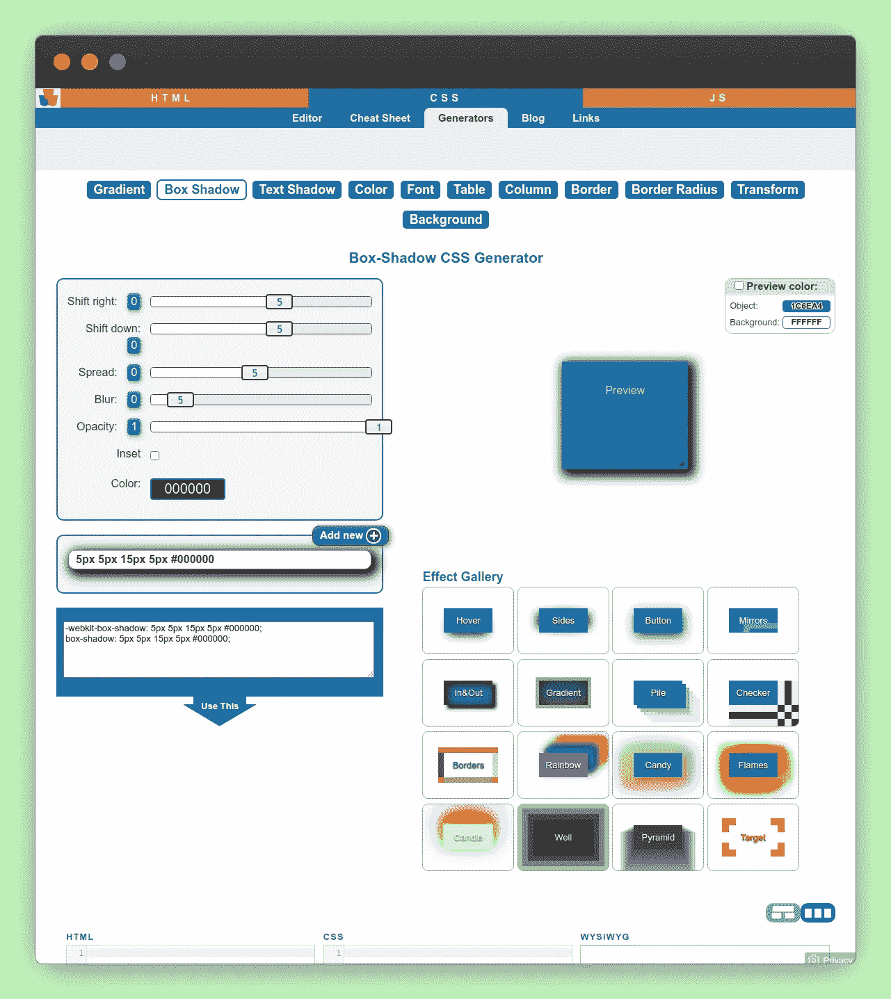

他们也看到标识

## 特点:

*   多才多艺的
*   使用方便

我保存了这个网站作为奖励。这是一个旨在解决前端开发人员最常见任务的工具。

我们可以创建渐变、框阴影、文本阴影、边框、边框半径…它没有其他的那么花哨，但是拥有你需要的大部分便捷的工具。

以上是我处理 CSS 任务时的常用工具。它们有助于改进我的工作流程，并以交互方式完善我的用户交互。

你呢？你有没有觉得缺少的工具？

[](/12-front-end-developer-websites-to-bookmark-294634734a02) [## 要加入书签的 12 个前端开发人员网站

### 使用精心策划的网络工具列表提高您的工作效率

better 编程. pub](/12-front-end-developer-websites-to-bookmark-294634734a02)