# 要加入书签的 12 个前端开发人员网站

> 原文：<https://betterprogramming.pub/12-front-end-developer-websites-to-bookmark-294634734a02>

## 使用精心策划的网络工具列表提高您的工作效率

[由 rawpixel.com/弗里皮克设计](http://www.freepik.com)

作为一名网站开发人员，我们每天都要做一些特定的工作。有些变得乏味和重复。

幸运的是，一些 web 开发人员构建了大量的 web 工具来帮助解决这个问题。通过了解正确的方法，我们可以节省大量的时间和挫折。

在本文中，我们将检查一个您可以日常使用的 web 工具的精选列表。确保你将它们加入书签，这样它们就很容易找到了。

# 1 个小型开发工具

链接:[https://smalldev.tools/](https://smalldev.tools/)|免费

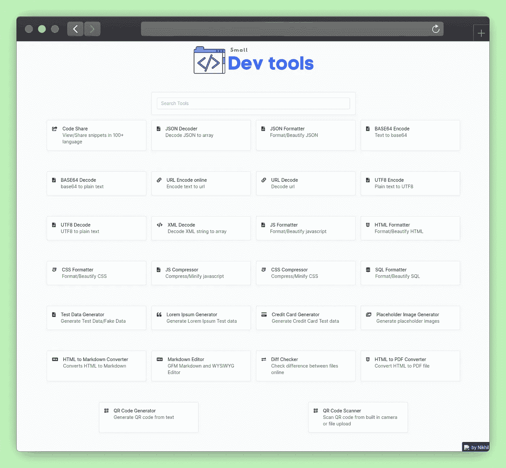

这个网站就像一把网络实用工具的瑞士小刀。这是很多我们日常需要的公用设施。

以下是它可以为您提供的功能列表:

*   代码共享
*   生成/扫描二维码
*   编码/解码 base64 字符串
*   编码/解码 JSON
*   生成随机文本

它超级简单直观。你只需要搜索你感兴趣的功能，然后点击它。然后，您将看到一些输入参数，并生成所需的输出。

这就像一个魔咒，而不是总是谷歌这些频繁的任务。

# 2.元标签

链接:[https://meta tags . io](https://metatags.io/)T11|免费

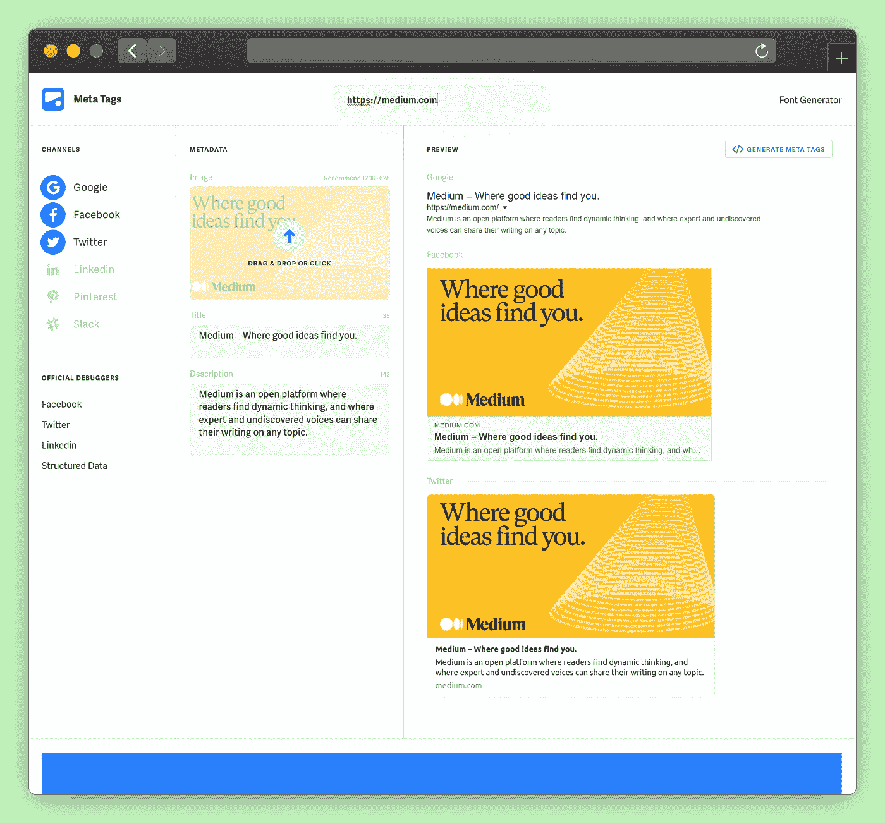

使用元标签可能很有挑战性。许多开发者发现自己试图在社交媒体上预览他们的帖子。对于不同的提供商来说，可视化你的内容将会是什么样子是很重要的。

Meta 标签有一个干净的用户界面，并支持许多提供者:`Google`、`Facebook`、`Linkedin`、`Pinterest`和`Slack`。它让我们可以即时定制和编辑标签。当我们改变参数时，我们可以交互地看到变化。

它不是唯一的工具。公开图表([https://www.opengraph.xyz/](https://www.opengraph.xyz/))one 也做得很好。它没有那么多的供应商，但也很简洁。它有相同的功能，但有一个黑暗的外观。

无论你选择使用哪一个都会有很大的帮助。

# 3.网页测试

链接:[https://www.webpagetest.org](https://www.webpagetest.org/)|免费

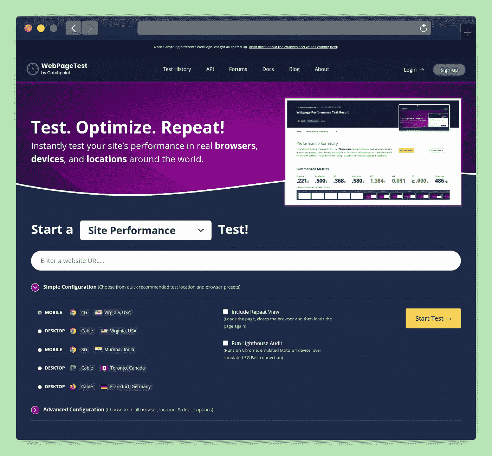

任何一个网站的表现一直都是热门话题。为你的网站提供更慢的服务可能会导致销量大幅下降或者 SEO 评分降低。

web 页面测试工具将帮助您了解您的 Web 应用程序是由谁提供给用户浏览器的。它是技术性的和详细的。所有这些见解将帮助你了解你可以优化你的网站。

您可以测试任何网站的以下内容:

*   现场性能
*   谷歌网络生命
*   Traceroute
*   灯塔
*   视觉比较

对中等文章运行它的示例

# 4.配色方案

链接:【https://www.schemecolor.com】T2|免费

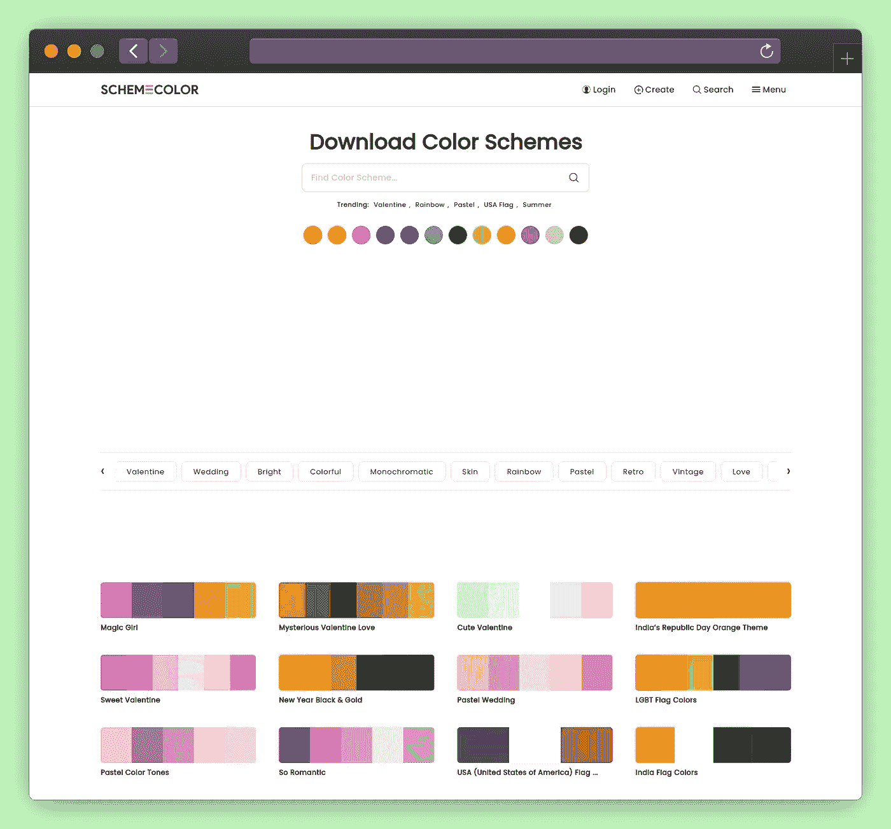

设计项目时，创建一致的配色方案非常重要。并不是所有的颜色都很协调。他们应该和谐地工作，传递正确的信息。手动完成这项工作既麻烦又困难。

配色工具可以帮助你选择合适的主题。你可以浏览精心设计的列表。您可以使用过滤器来搜索所需的颜色。然后它将显示所有的方案组合。也可以按主题浏览。比如情人节，婚礼，五彩缤纷…

这是一个必不可少的工具，它将帮助我们形象化并为我们的网站选择正确的颜色。

一旦你选择了一个调色板，你就可以把它收藏起来，需要的时候再回来。我经常在我所有的媒体文章中使用它。

# 5.响应字体计算器

链接:【https://websemantics.uk/tools/responsive-font-calculator】T4|免费

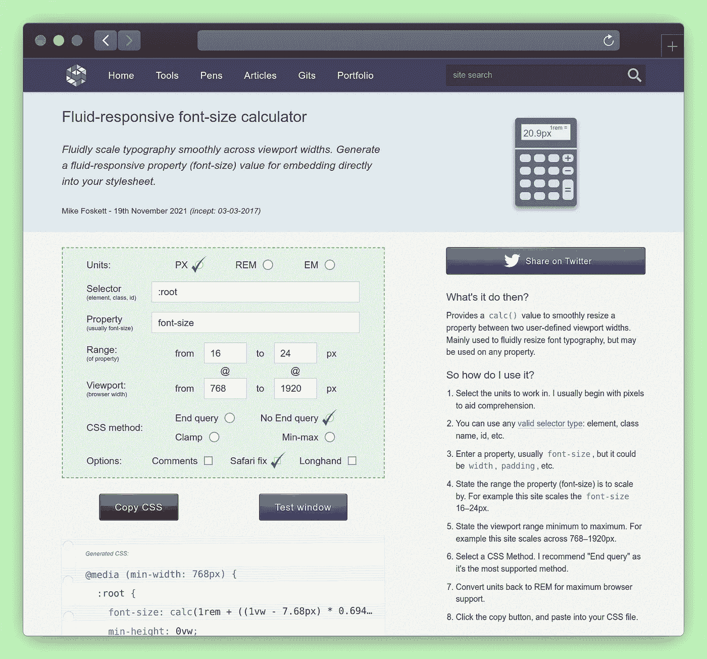

我们可以很容易地创造出流畅的排版体验。它有更广泛的支持，并且可以用几行 CSS 代码实现。这种体验是通过使用视口宽度和/或高度来平滑缩放根字体大小而创建的。您可以避免仅使用媒体查询所产生的跳转。

这个网络工具可以让你微调和设计一个流畅的用户体验。你所要做的就是配置选项，你会得到一个 CSS 输出，你可以粘贴到你的身边。

生成的 CSS 示例:

# 6.类型标度

链接:[https://type-scale.com](https://type-scale.com/)|免费

字体是任何网站的一个重要方面。因此，我们有另一个有用的网络应用程序来帮助这一点。当设计一个网站时，了解不同的字体大小如何搭配是很重要的。有了这个 web 应用程序，创建一致的字体比例变得非常简单。

我们可以选择 8 个不同的预定规模或建立我们的自定义之一。我们只需要定义一个增长因子，剩下的就交给工具了。

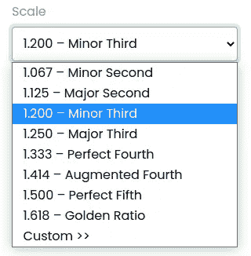

来自 type-scale.com 的说明

因为这将使用`rem`单元生成字体，所以查看不同基本尺寸字体的外观也很方便。默认为`16px`，它匹配任何浏览器的默认根字体。

一旦一切正常，我们就可以复制生成的 CSS 或在 codepen 实例中查看结果。我们可以生成一个链接，与一个对等体共享我们的配置，或者只是在以后访问它。这里找个例子[。](https://type-scale.com/?size=16&scale=1.200&text=A%20Visual%20Type%20Scale&font=Poppins&fontweight=400&bodyfont=body_font_default&bodyfontweight=400&lineheight=1.75&backgroundcolor=%23ffffff&fontcolor=%23000000&preview=false)

# 7.Regex101

链接:[https://regex101.com](https://regex101.com/)|免费

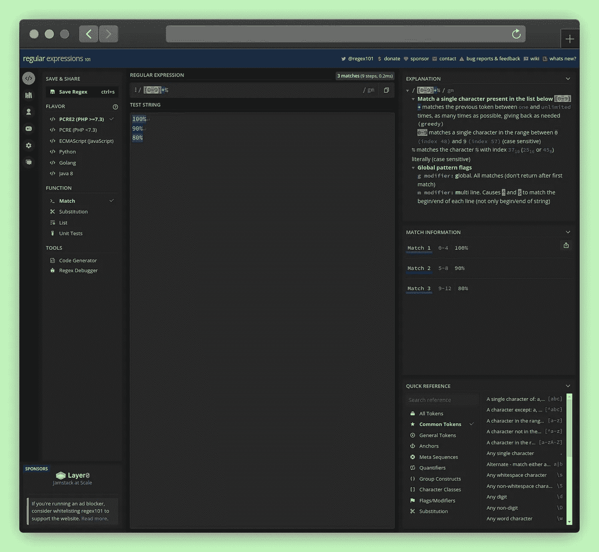

构建正则表达式总是很困难。有很多要考虑的因素，并提出我们应该关注的关键案例。有许多工具试图帮助我们。综上所述，我认为 Regex101 做得更好。

它提供了全面的反馈，并详细解释了我们的正则表达式正在做什么。我们可以试着立即检查我们的正则表达式是否处于良好状态。

# 8.虚拟代码开发

链接: [https://vscode.dev](https://vscode.dev/) |免费

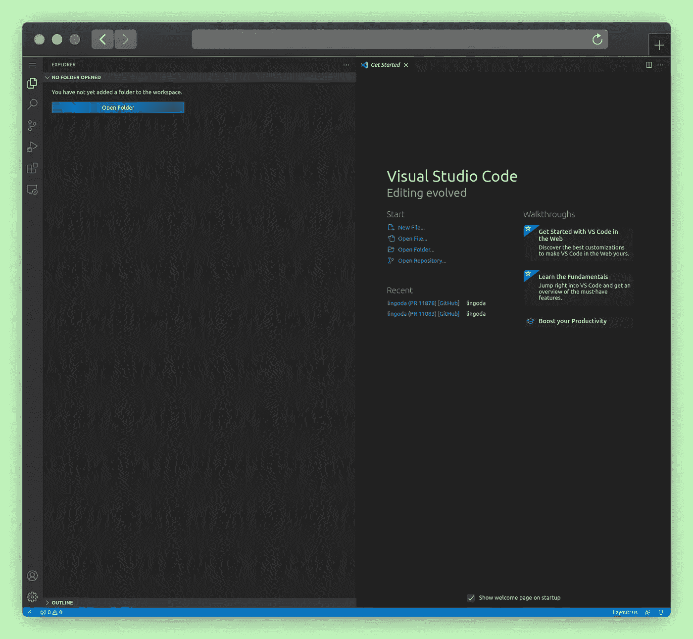

代码审查是开发人员应该面对的日常任务。当使用 GitHub 时，通过其 Web 界面查看代码是一项挑战。

相反，我们可以利用运行在 Web nature 上的 VSCode。VSCode 团队已经开发了一个浏览器，我们可以通过它访问远程 GitHub 库。这与 GitHub 插件相结合，是进行代码审查的好伙伴。

你不必在当地签下任何公关。你可以在网络上完成这一切。

# 9.泛灵论者

链接:[animista.net](https://animista.net/)|免费

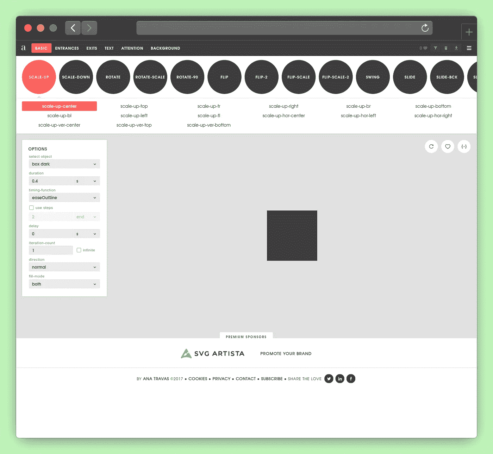

CSS 动画可能会变得乏味。通过使用 Animista，我们能够交互式地玩动画。

*   **1。**选择想要的效果:`Scale-up`、`Scale-down`、`Rotate`、`Rotate-90`、`Flip`、…
*   **2。**选择一个建议的效果变体
*   **3。**配置所有动画属性计时-功能、步骤、迭代-计数，…
*   **4。**复制生成的 CSS

下面是一个输出示例:

# 10.我能用吗

链接:【https://caniuse.com】T21|免费

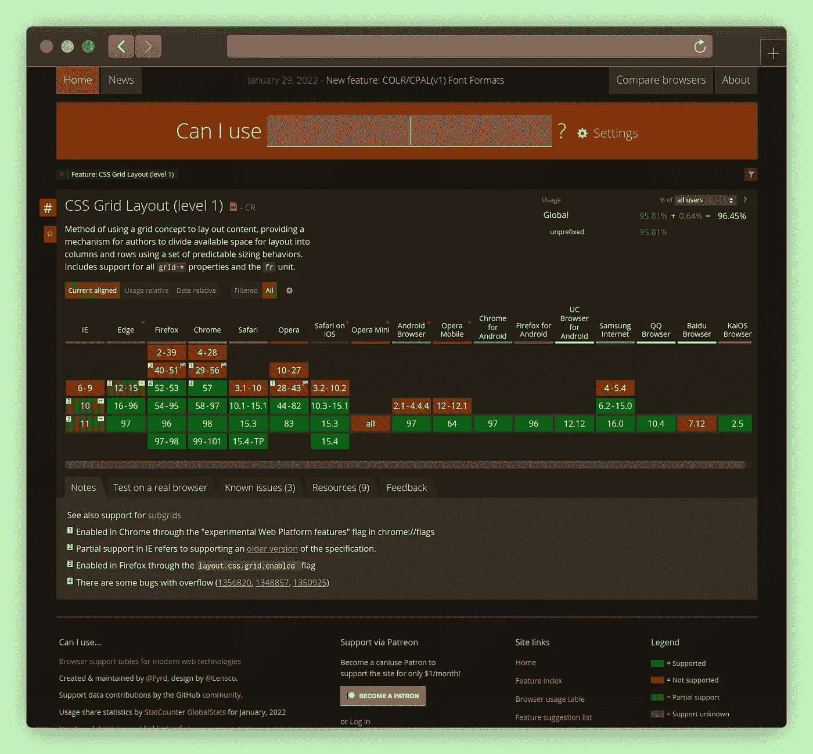

将代码交付到生产环境时，了解您所依赖的本机浏览器功能的支持是非常重要的。该工具将帮助您了解它的整体浏览器支持。

然后，您可以决定是否需要添加聚合填充或回退。这完全取决于你的目标受众。

# 11.浏览器框架

链接:[https://browserframe.com](https://browserframe.com/)|免费

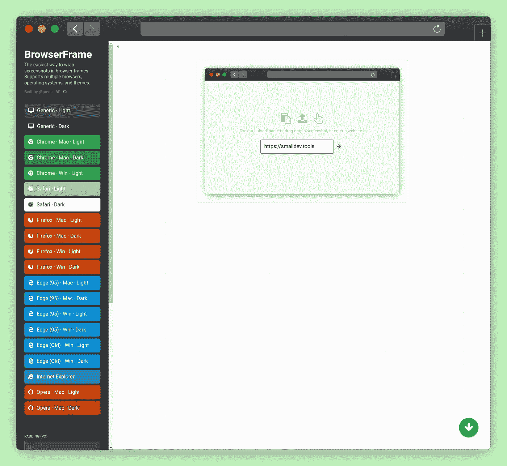

您是否正在寻找一种快速创建快速浏览器模型的方法？浏览器框架让你不需要 Photoshop 就能做到。

将您的内容嵌入到他们的模拟中，以创建高质量的内容。这是本文中创建这些引人注目的截图的工具。

# 12.打字游戏场

链接:【https://www.typescriptlang.org/ 

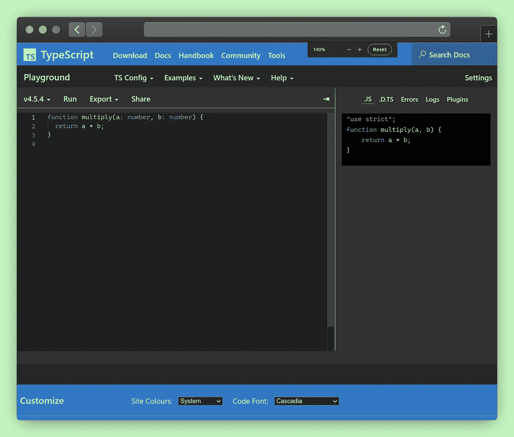

我把我最喜欢的工具留到了最后。这是一个简单而轻量级的 TypeScript 游乐场。尽管界面看起来很简单，但它包含了许多功能。

*   运行特定的类型脚本版本
*   试用最新的测试版本
*   配置 TSC 编译器
*   检查 JavaScript 输出
*   与您的同龄人分享片段

它是为高级或初学者准备的。理解和分享 TypeScript 如何工作的好方法。

# 奖金

链接:【http://latentflip.com/loupe】T4|免费

你想了解 JavaScript 引擎是如何工作的吗？菲利普·罗伯茨有一个很棒的演讲，叫做“到底什么是事件循环”。它拥有超过 2M 的视野。对于 JavaScript 视频来说，这是非常出色的。

放大镜是他为那次演讲创造的工具。任何人都可以尝试并学习更多关于 JavaScript 的见解。

它将帮助您正确理解代码如何在您的浏览器上执行，以及引擎如何处理回调、微任务和任务。

以上是我提高生产力的秘密工具。我倾向于每天使用它们。一旦您依赖它们，您将会看到您的工作流程是如何简化的。

你呢？有什么值得分享的工具吗？

# 有关系的

 [## 8 VS 代码插件，提高您的工作效率

### 帮助你日常工作的必备插件

better 编程. pub](/8-vs-code-plugins-to-improve-your-productivity-ee4497cebefa)  [## 高效开发人员的 7 个习惯

### 建立正确的习惯来保持每天的工作效率

better 编程. pub](/7-habits-of-productive-developers-bce60d880907)