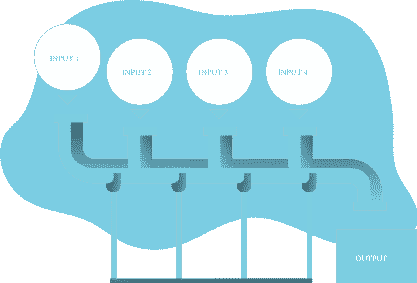

# 人们将使用的 12 个编程项目的好主意

> 原文：<https://betterprogramming.pub/12-ideas-for-programming-projects-too-dangerous-not-to-build-514e3212ab77>

## 学习，建造，享受，重复

照片由[戴恩·托普金](https://unsplash.com/@dtopkin1?utm_source=medium&utm_medium=referral)在 [Unsplash](https://unsplash.com?utm_source=medium&utm_medium=referral) 上拍摄

你会开始造一个吗？

这是我的兼职项目三部曲的第二部分。在第一部分，我谈到了 [**如何选择你的下一个副业**](https://medium.com/better-programming/how-to-choose-your-next-side-project-9dbe429e6f86) ，这样你就有可能从副业中获得最大收益。

 [## 如何选择你的下一个副业

### 帮助你有目的地选择附带项目想法的指南

medium.com](https://medium.com/better-programming/how-to-choose-your-next-side-project-9dbe429e6f86) 

在第三部分，我们用一系列技巧和策略来结束这个三部曲，以增加你从你的兼职项目中获得最大收益的机会。

 [## 给你的副业项目额外助力的 8 个可行策略

### 不要让你的副业半途而废

medium.com](https://medium.com/better-programming/8-actionable-strategies-to-boost-your-side-projects-19f3d1f92486) 

事不宜迟，这里收集了一些精心挑选的项目点子，灵感来自于此前的其他文章、我的经验以及我对如何打造优秀编程项目的思考。

# 1.最喜欢的 Twitter 账户摘要

大多数社交媒体平台有两个共同点:

*   给你展示他们认为你想看的东西的算法
*   你真正想看的帖子，隐藏在无趣的内容之下

为什么不把你的顶级 Twitter 账户的贡献转化成每日/每周摘要呢？这样你就保证了你永远不会失去那些有见地的帖子，而且额外的好处是由你自己决定你什么时候能看到它们。也许你可以采取下一步措施，自动发送到你的电子邮件。或者让其他用户管理和分享他们的列表。Twitter 只是一个例子——你可以在 Instagram、脸书，甚至是你最喜欢的 subreddits 的置顶帖上这么做。

**后端技能:** ⭐⭐⭐

**前端技能:** ⭐⭐

**行动技能:** ⭐⭐⭐

**复杂程度:**🤯🤯🤯

**盈利机会:**💳💳

# 2.作品集网站

一个有复利的项目——你将在项目完成期间和结束后获得收益。作为一名程序员，你可以磨练你的前端技能，也许可以尝试一个新的 CSS 或 JS 框架。你可以使用一个模板或者尝试设计，把你的个性融入其中。一旦完成，它就是你自己在互联网上展示你在做什么，世界上有什么有趣的事情，以及你如何帮助人们和组织的地方。你甚至会有一个特别的地方来展示你的项目！

关于这个想法，我最喜欢的一点是它是如何递增的。继续，创建一个登录页面并将其部署到某个地方。是直播，已经算了。下周加个“从这里开始”；一个月后，也许是你的简历；每当你完成另一个兼职项目，你就可以打开那个画廊，我刚刚提到过。就像我说的，越来越好了。

**后端技能:** ⭐⭐

**前端技能:** ⭐⭐⭐

**作战技能:** ⭐

**复杂度:**🤯

**盈利机会:**💳

# 3.天气应用程序

每个人都有一个喜欢的天气应用程序。你将要建造的将会有你独特的风格，我敢打赌，将会是其他人的最爱。天气数据在几个 API 中广泛可用，但我认为这里的秘密将是你如何选择呈现它；这是你能做出最大改变的地方。

根据你的目标，你可以把它变成一个移动应用或者只是一个网络应用，但我要说的是，挑战的一部分将是，不管你选择如何开始，都要为在这些方向中的一个方向上发展留有余地。

**后端技能:** ⭐⭐⭐

**前端技能:** ⭐⭐⭐⭐⭐

**行动技能:** ⭐⭐

**复杂程度:**🤯🤯🤯

**盈利机会:**💳💳💳

**灵感:** [过干天气](https://play.google.com/store/apps/details?id=widget.dd.com.overdrop.free)[今日天气](https://play.google.com/store/apps/details?id=mobi.lockdown.weather)[有风](https://filipesilva.me/blog/12-ideas-for-programming-projects-too-dangerous-not-to-build/www.windy.com)

# 4.自动化某事

什么，在 2020 年，仍然需要你的人工干预？无论您的编程技能如何，您都可以构建一个自动化来匹配您的技能，并提出一个有价值的挑战。从 Al Sweigart 精彩的 [*中获得灵感，用 Python*](https://automatetheboringstuff.com/) 将枯燥的东西自动化。选择一个你最感兴趣的章节——无论是在主题上还是因为你在研究相关技术——并在结束时完成其中一个项目。

当你的愿望清单上的东西打折时，设置短信提醒。自动备份您的知识库。从一个命令中生成最常见的项目文件结构。跟踪您最喜欢的作家，并自动将他们的新文章添加到您的阅读列表中。我认为你会想出比这些更好的主意，但原则很简单:找到一些花你时间的事情，让机器去做。

**后端技能:** ⭐⭐⭐

**前端技能:** ⭐

**作战技能:** ⭐⭐⭐

**复杂度:**🤯🤯

**盈利机会:**💳💳💳

**灵感:** [我如何在纽约用 Python、自动化、人工智能、Instagram 免费吃饭](https://medium.com/@chrisbuetti/how-i-eat-for-free-in-nyc-using-python-automation-artificial-intelligence-and-instagram-a5ed8a1e2a10)

# 5.推特机器人

像“摘要”的想法，这可以适用于大多数的社交网络，有价值的贡献可以为你赢得互联网积分。申请一个 Twitter 开发者账户，在 Twitter API 中漫游，找到允许你发送推文的端点，并将其与一系列有趣的事实、引用或安东尼·杰塞尔尼克笑话联系起来。

也有反应型的机器人。当它被提及或某些词被发布时，你的机器人可以跳出来，为第一个发布推文的人提供一些有用的东西。也许你可以每种都做一个，让他们在流行度上竞争。

**后端技能:** ⭐⭐

**前端技能:** ⭐

**行动技能:** ⭐⭐⭐⭐

复杂程度:🤯🤯

**盈利机会:**💳

**灵感:** [纳西姆·尼古拉斯·塔勒布 Bot](https://twitter.com/nntalebbot) (主动型 Bot)[线程阅读器 App](https://twitter.com/threadreaderapp) (反应型 Bot)

# 6.利基求职板

这是你帮助公司联系求职者的一种方式，这些求职者所在的领域可能没有被现有的求职公告板很好地覆盖。专注于一个利基将为这个副业项目提供两个好处:

*   缩小您所服务的域的范围，以及
*   让识别和理解你产品的潜在客户变得更加容易。

这个想法的另一个方面，比这个列表中的任何其他方面都更重要，就是你必须如何处理使用你的产品的两种不同的*人物角色*:招聘人员和候选人。这将给 UX 设计带来一些有趣的挑战，例如，在后端，你如何决定管理不同的角色和权限。

我也喜欢这个，因为它可以很清楚地货币化。我并不是说这很容易，但是这条路似乎比大多数路都要明显。

**后端技能:** ⭐⭐⭐

**前端技能:** ⭐⭐⭐⭐

**行动技能:** ⭐⭐

**复杂程度:**🤯🤯🤯

**盈利机会:**💳💳💳

**灵感:** [键值](https://www.keyvalues.com/)，[数字无障碍作业板](https://www.a11yjobs.com/)，[理想主义者](https://www.idealist.org/)

# 7.一个关于最喜欢的话题的问答游戏

这是列表中两个与游戏相关的想法中的第一个。谁不喜欢考验自己的琐事技巧呢？是的，你可能知道有人不知道，但其他人仍然对这种游戏充满乐趣。再次，我鼓励你专注于一个利基。会更容易找到问题和答案，也更容易为你选择的话题找到公众。

你还会有其他种类的决定要做，这些决定不会出现在我建议的其他想法中。如果你想玩单人和/或多人游戏，是同步还是异步？奖励呢？如何管理排行榜以及如何让问题保持新鲜？可能性是无穷的——不要让它们淹没你。

**后端技能:** ⭐⭐⭐

**前端技能:** ⭐⭐⭐⭐

**行动技能:** ⭐⭐

**复杂程度:**🤯🤯🤯

**盈利机会:**💳💳

**灵感:** [安卓问答游戏(GitHub)](https://github.com/sarveshchavan7/Quiz-Game)

# 8.交易寻找者

我对这类产品有一种特殊的感情。我最近的副业项目[双赢](https://itswinwinboardgames.com/)就是这样。我喜欢桌游，也喜欢在上面找到划算的交易。我连接上了 Boardgamegeek API，现在我可以获取我感兴趣的游戏的所有价格。然后它只是简单的数学，并找到低于平均价格的项目。在发布后几分钟内，扑向一款低于中值价格 70%的游戏的感觉令人难以置信。我最大的动力是希望别人也能这么想。

想想你使用的其他市场或可以通过 API 访问的产品类型，并使用它们。即使没有复杂的数学，你也可以比较同类商品的最大折扣或最低单价。

**后端技能:** ⭐⭐⭐⭐

**前端技能:** ⭐⭐

**作战技能:** ⭐⭐

**复杂程度:**🤯🤯🤯

**盈利机会:**💳💳💳💳💳

**灵感:**UnitPrice.orgT2，[diskprices.com](https://diskprices.com/)，[斯科特的廉价航班](https://scottscheapflights.com/)

# 9.推荐系统

上一次你不得不在一个你不擅长的领域中做出选择是什么时候？就像上次你在你最喜欢的爱好商店，你的另一半，你一无所知？是的，我们都经历过。

专注于一个领域，确定您可以推荐哪些有意义的项目，然后从一个基本规则开始，该规则根据输入返回其中的一些项目。随后，您可以改进您的系统来排序推荐，接受不同类型的输入，甚至让用户根据推荐的成功通知您的模型。

**后端技能:** ⭐⭐⭐⭐⭐

**前端技能:** ⭐⭐⭐

**行动技能:** ⭐⭐

**复杂程度:**🤯🤯🤯🤯🤯

**盈利机会:**💳💳💳

**灵感:** [推荐。游戏](http://recommend.games/)，[电影推荐系统(GitHub)](https://github.com/javascript-machine-learning/movielens-recommender-system-javascript)

# 10.游戏化的习惯追踪器

习惯跟踪器是这些文章中的常客。仅次于待办事项应用和聊天应用，众所周知，法律要求它们在所有列表中出现。检查检查。

在这里，你给它一个额外的转折，具有如下特征:

*   给完成的条纹奖励和成就。
*   条纹增多时解锁应用功能。
*   创建一个 *Battle Royale* 风格的竞赛，所有想做 X 的用户(比如一天读 20 页)，直到只剩下一个。
*   创建用户必须遵循既定习惯形成过程的任务。

我们的应用程序必须在用户可能已经拥有的所有其他激励之上提供一层激励，以采纳他们的新习惯。这是它区别于大多数其他习惯追踪器的地方。

**后端技能:** ⭐⭐⭐

**前端技能:** ⭐⭐⭐⭐

**作战技能:** ⭐⭐

**复杂程度:**🤯🤯🤯

**盈利机会:**💳💳💳

# 11.“克隆”一个你最常用的应用程序，但是添加一个你最想念的东西

我不是说要侵犯某种商标，或者只是另一个没有灵魂的模仿者。你添加到你的解决方案中的东西必须足以使它独一无二，值得独立存在。不要只是克隆一个看板，让它在每次你选择新看板时扮演“老虎的眼睛”……等等。这是一个很棒的主意！

现在，说真的，在你最喜欢/最常用的应用程序中，你可能有五个或十个让你抓狂的东西。让这个特性成为你项目的理由。如果痛苦大到因为它而创建一个新的项目，这也会让你成为正确的人，明白应该为此做些什么。

不要忘记查看这些产品的支持论坛、子主题和 Twitter。这些地方是建议、难题和特性需求最丰富的地方。有人可以提供你所需要的第一个火花，有人可能愿意为此付钱。

**后端技能:** ⭐⭐⭐⭐

**前端技能:** ⭐⭐⭐⭐

**作战技能:** ⭐⭐⭐

**复杂度:**🤯🤯🤯🤯

**盈利机会:**💳💳💳

灵感:这是你的😄

# 12.选择你自己的冒险游戏

如果你也想锻炼你的写作肌肉，这是一个绝妙的主意。梦想一个故事，不要让幻想类型的刻板印象限制你这种类型的游戏，并准备好向玩家扔一切。作为回报，玩家会把所有东西都扔给你，所以一定要净化这些输入。你会允许通过按键、单词或完整的文本来发出命令吗？同样，需要应对不同级别的挑战和技术。您将如何存储事件的文本？它会有什么艺术吗？

对于玩家来说，你能个性化它的属性吗？这些属性会影响游戏还是仅仅起到装饰效果？游戏之间用同一个角色怎么样？还是分享给其他玩家？

**后端技能:** ⭐⭐⭐⭐⭐

**前端技能:** ⭐⭐⭐

**行动技能:** ⭐⭐

**复杂程度:**🤯🤯🤯🤯

盈利机会:💳

# 包裹

首先，我想澄清一下我对每个想法的评价。尽管它们是我作为开发人员的经验和我如何想象最终结果的主观因素，但我试图让它们更像是不同想法之间的比较标准。的复杂程度🤯🤯🤯仅意味着考虑到本文中的所有想法，该项目应该是中等复杂程度。

这样一来，我当然希望你不要接受这是 12 个想法的事实，在一年中的每个月建立一个。那太疯狂了。也很棒。不知道是否比疯狂更可怕，但是，绝对值得我钦佩。即使你只是开始其中的一个，它会让我一天听到它。

所以，我再次向你挑战。你会开始吗？

> 无论你能做什么或梦想什么，开始吧；大胆有天才、力量和魔力在里面。”—歌德

迈出第一小步。你完全准备好了。

*这个帖子上的插图棒极了，免费的* [*多像素*](https://www.manypixels.co) *。*