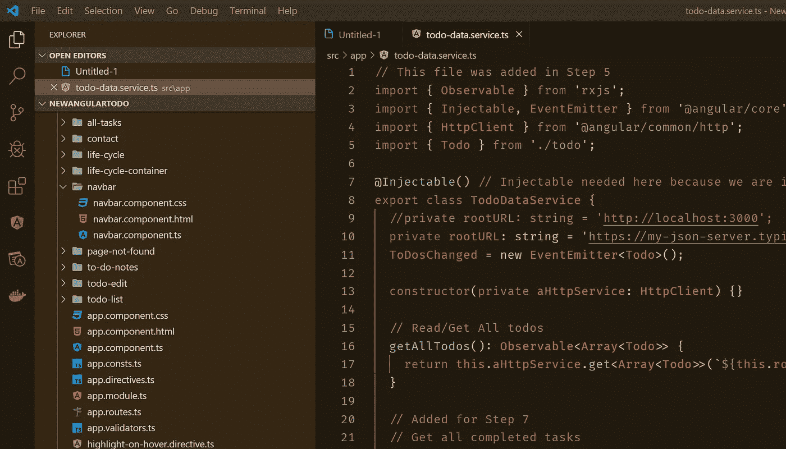

# 关于 TypeScript 的 12 件趣事

> 原文：<https://betterprogramming.pub/12-interesting-things-about-typescript-6341e4895d1e>

## TypeScript 提供了 JavaScript 的所有功能和 C#的所有强类型

照片由[阿诺·弗朗西斯卡](https://unsplash.com/@clark_fransa)在 [Unsplash](https://unsplash.com/) 拍摄

关于[打字稿](http://www.typescriptlang.org/)有很多议论。一些 JavaScript 纯粹主义者似乎抵制它。来自其他语言的新手，比如 Java 和 C#，似乎很喜欢它。不管是什么观点，它都很有趣——至少在 12 个不同的方面。

Visual Studio 代码中 Angular 项目的 TypeScript(作者)

# 1.TypeScript 是 JavaScript 的超集

TypeScript 的卖点之一是它是 JavaScript 的超集，这意味着所有 JavaScript 都是有效的 TypeScript。这个事实允许您将一个`*.js`文件转换成一个`*.ts`文件，并在 TypeScript 中使用它。这也让您逐渐转换到 TypeScript。您可以从纯 JavaScript 开始，逐步迁移您的代码以使用 TypeScript 的特性。

反正理论上是这样。事实上，99.9%都是真的。[关于这句话是否 100%准确还有一些争论，但是底线是你可以用 TypeScript 编译器编译所有的 JavaScript。编译器可能会抱怨一些小细节，但它会编译并发出代码。](https://smellegantcode.wordpress.com/2015/07/11/is-typescript-really-a-superset-of-javascript-and-does-it-even-matter/)

# 2.TypeScript 编译成您想要的任何版本的 JavaScript

TypeScript 编译(或者更准确地说，转换文件)成 JavaScript。最酷的部分是您可以选择 TypeScript 编译器将生成的 JavaScript 版本。您可以通过`--target`编译器选项选择任何版本的 JavaScript，从 ECMAScript 3 标准开始。您甚至可以选择`ESNext`，它将针对 ECMAScript 委员会最新提出的语言特性。

这样做的好处是，您可以在应用程序中使用 TypeScript 的所有现代语言功能，但您仍然可以针对并支持较旧的浏览器。那很酷。

# 3.打字稿很受欢迎

许多开发人员正在利用 TypeScript 的特性，包括 T2 开发人员和许多使用 StackOverflow 的人。在最近的 [StackOverflow 开发者调查](https://insights.stackoverflow.com/survey/2019#technology)中，TypeScript 跻身前 10 名，比前一年有所上升。它现在是 Github 上第七大常用语言。TypeScript 被广泛使用，不断发展，并将继续存在。

# 4.TypeScript 是开源的

TypeScript 编译器和附带的代码是 GitHub 上的一个项目。这个项目有 7300 多个分支。超过 53，000 名开发人员在上面打了星号，超过 140 万个项目在使用它。(所有这些都证明了上述关于受欢迎程度的观点。)[它是在 Apache 2.0 许可下发布的](https://github.com/microsoft/TypeScript/blob/master/LICENSE.txt)。

想看看编译器到底是怎么工作的吗？想要分叉项目并修复一个 bug？你可以。拉取请求处于打开状态。它已经是开源的了。

由于所有的社区支持，TypeScript 可以快速支持所有最新的语言特性和趋势。

# 5.TypeScript 由安德斯·海尔斯伯格领导，微软提供支持

对于像我这样已经存在了一段时间的人来说，这可能是所有要点中最奇妙的一点。微软已经接受了开源文化，TypeScript 只是这种趋势的一种表现。

对于像我这样的老 Delphi 开发者来说，很高兴看到安德斯·海尔斯伯格在另一个有趣的语言项目上工作。(安德斯是 Turbo Pascal 和 Delphi 的最初设计者)。他因几个大型项目而闻名，包括 C#语言和早期的许多。Net 框架。Anders 领导 TypeScript 项目，是开源过程的积极参与者。看到他[评论和批准拉动请求之类的](https://github.com/microsoft/TypeScript/commits?author=ahejlsberg)很有趣。

# 6.TypeScript 使 JavaScript 能够伸缩

JavaScript 已经超越了它卑微的起点。它原本是一种简单的脚本语言，旨在让网页看起来更好，但后来却成了网络的通用语。现在，它被用来通过 [node.js](https://nodejs.org) 构建大规模的 web 应用甚至服务器端应用。

然而，JavaScript 的早期版本缺乏构建企业级应用程序所需的东西，如对象、模块、组件和其他语言特性，这些东西使开发人员能够正确地设计和构建这样的项目。TypeScript 的主要目的之一就是提供这些功能，从而简化复杂应用程序的设计和开发。

# 7.TypeScript 是强类型的

TypeScript 提供类型和实施这些类型的编译器。打字可以让你把所有东西都放在该放的地方，防止东西被不恰当地分配。不再从弱类型赋值中追踪 bug。不再传递不正确键入的参数。TypeScript 可以提供编码时和编译时错误检查。关于强类型与弱类型的争论是真实的，但至少对于 TypeScript，您可以选择。

# 8.TypeScript 提供了完整的工具体验

创建 TypeScript 的另一个重要原因是提供打字所允许的强大的代码时体验。强类型允许代码编辑器轻松提供类似 IntelliSense 的功能、重构和其他基于代码的功能。所有这些工具意味着编辑器可以立即向您指出编码错误，他们甚至可以为这些问题提供修复。所有这些编辑器特性可以极大地提高编码效率和代码的整洁度。

# 9.TypeScript 提供了所有现代语言功能

TypeScript 拥有所有现代语言特性，如泛型、枚举、OOP、接口、条件类型、装饰器、模块等。它允许你在支持旧浏览器的同时使用这些语言特性。当然，ECMAScript 的当前版本具有与 TypeScript 几乎相同的功能，但是 TypeScript 允许您灵活地选择支持的 JavaScript 级别，同时仍然允许使用所有的现代语言功能。

# 10.TypeScript 是久经考验的

TypeScript 已经在许多大型项目中证明了自己的价值。当然，TypeScript 编译器本身是用 TypeScript 编写的。web 框架 [Angular](https://angular.io) 是用打字稿写的。许多面向公众的大型 Google 属性都是用 Angular 编写的(Google 发起了开源 Angular 项目)。 [Visual Studio 代码](https://code.visualstudio.com/)是用 TypeScript 写的。[懈怠](https://slack.com/)也是。TypeScript 能够应对挑战。

# 11.TypeScript 可以自由创新

虽然 TypeScript 紧密支持最新的 ECMAScript 标准，但它仍然可以自由创新并添加您今天可以使用的新的有趣的语言功能。TypeScript 是现代的、最新的 JavaScript，能够在构思时添加特性。请记住，如果您愿意，它可以编译成 ECMAScript3。

# 12.TypeScript 对于 C#和 Java 开发人员来说很容易理解

对于静态类型语言的用户来说，像 JavaScript 这样的动态类型语言有时很难理解。TypeScript 很大程度上受 C#的启发，因此对于希望开始前端工作的 C#和 Java 开发人员来说，这是更容易的一步。

# 结论

TypeScript 是一种有趣且令人兴奋的语言。它做 JavaScript 做的一切，甚至更多。它越来越受欢迎，能力也越来越强。越来越多的前端开发框架和节点都支持它。总的来说，你的下一个项目值得一看。