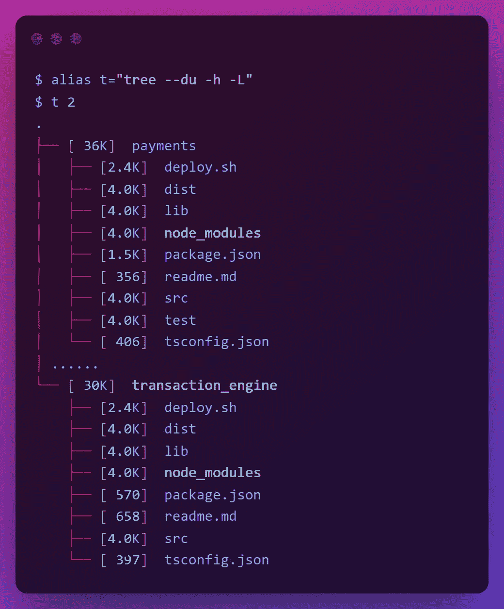

# 对于日志文件操作，值得记住的 12 个 Linux 命令(带示例)

> 原文：<https://betterprogramming.pub/12-linux-commands-worth-remembering-for-log-file-operations-with-examples-4a861b6faaa3>

## 系统管理员和支持工程师喜欢的工具列表



本文包括一组工具，您可以使用这些工具来提高在 Linux 环境中处理文件操作(尤其是日志文件)的效率。如果你有更多的建议，请在评论中提及。享受阅读吧！

先稍微介绍一下`tree`(见上图)。是一个很棒的工具，用于在 Linux 环境下快速列出文件、文件夹和子文件夹。有很多工具可以用来进行文件操作，比如`du`、`split`、`shred`、`tail`、`head`、`less`、`cat`、`tac`、`nl`、`sort`、`uniq`、`column`。让我们在本帖中讨论它们吧！

# 1.du 和树-du(估计深度水平的空间使用)

`du`是一个流行的工具，可以快速列出特定深度的文件、文件夹和子文件夹(使用`--max-depth=N`或`-d N`)，包括它们的大小和其他信息。这里，`-a`可以用来包括文件和文件夹。`-h`将大小转换为更易于阅读的格式(例如，`M`兆字节，`K`千字节)。

```
$ du -ah --max-depth=2
7.5M    ./payments/dist
64K     ./payments/lib
74M     ./payments/node_modules
28K     ./payments/src
60K     ./payments/test
82M     ./payments
...
108K    ./transaction_engine/dist
44K     ./transaction_engine/lib
62M     ./transaction_engine/node_modules
16K     ./transaction_engine/src
0       ./transaction_engine/test
62M     ./transaction_engine
```

然而，我个人觉得`du`的输出有些杂乱，我更喜欢使用修改过的`tree`命令和`--du`和`-h`来查看更有组织的树状结构中的相同信息。这里，深度也可以用`-L N`表示:

```
$ tree -L 2 --du -h
.
├── [ 36K]  payments
│   ├── [2.4K]  deploy.sh
│   ├── [4.0K]  dist
│   ├── [4.0K]  lib
│   ├── [4.0K]  node_modules
│   ├── [1.5K]  package.json
│   ├── [ 356]  readme.md
│   ├── [4.0K]  src
│   ├── [4.0K]  test
│   └── [ 406]  tsconfig.json
│ ......
└── [ 30K]  transaction_engine
    ├── [2.4K]  deploy.sh
    ├── [4.0K]  dist
    ├── [4.0K]  lib
    ├── [4.0K]  node_modules
    ├── [ 570]  package.json
    ├── [ 658]  readme.md
    ├── [4.0K]  src
    └── [ 397]  tsconfig.json
```

> 提示:在`. bashrc `文件中使用自定义别名来简化``tree``。

```
$ alias t="tree --du -h -L"
$ t 2
.
├── [ 36K]  payments
│   ├── [2.4K]  deploy.sh
│   ├── [4.0K]  dist
│   ├── [4.0K]  lib
│   ├── [4.0K]  node_modules
│   ├── [1.5K]  package.json
│   ├── [ 356]  readme.md
│   ├── [4.0K]  src
│   ├── [4.0K]  test
│   └── [ 406]  tsconfig.json
│ ......
└── [ 30K]  transaction_engine
    ├── [2.4K]  deploy.sh
    ├── [4.0K]  dist
    ├── [4.0K]  lib
    ├── [4.0K]  node_modules
    ├── [ 570]  package.json
    ├── [ 658]  readme.md
    ├── [4.0K]  src
    └── [ 397]  tsconfig.json
```

# 2.(将文件分割成碎片)

`split`允许您根据不同的标准将文件分割成多个部分，例如块的数量(`-n`)、每个块的行数(`-l`)等。当您需要快速减小大型日志文件的大小时，这非常有用。

```
*// Split by number of equal chunks*$ split -n 2 test test_copy_$ nl test_copy_aa
     1  Hello
$ nl test_copy_ab
     1  World*// Split by number of lines per chunk*$ split -l 100 logFileWith250Lines log_$ nl log_aa | tail -n 1
     100  I'm Log Line #100
$ nl log_ab | tail -n 1
     100  I'm Log Line #200
$ nl log_ac | tail -n 1
     50  I'm Log Line #250
$ nl log_aa log_ab | tail -n 1
     200  I'm Log Line #200
$ nl log_aa log_ab log_ac | tail -n 1
     250  I'm Log Line #250
```

# 3.` shred '(` RM '的安全替代)

当你要在 Linux 上删除一个文件时，首先想到的是`rm`(或者如果你有 GUI 访问，按下`DELETE`按钮)。

然而，问题是，当使用`rm`(或`DELETE`)时，它更新了对操作系统知道的文件的引用，因此，该文件将从当前位置消失，使其对用户隐藏。但是该文件仍将在硬盘上驻留一段时间，高级用户将能够非常容易地恢复和访问这些数据。

如果您希望您删除的文件以不可恢复的方式从您的系统中完全删除，特别是当它们包含敏感信息时，您可以使用`shred`，这是一个可以覆盖您的文件以隐藏其内容的工具，也可以选择删除它(`-u`删除文件)。

```
*// Commonly-used approach (not recommended)*
$ rm passwords.txt*// Basic usage - shred*
$ shred -u passwords.txt*// Useful options - shred*
$ shred -zvu -n 5 passwords.txt-z: add a final overwrite with zeros to hide shredding
-v: show progress (i.e. verbose)
-u: truncate and remove file after overwriting
-n: overwrite N times instead of the default (3)
```

***注意:*** `*shred*` *是一个漂亮简单的快速删除敏感文件的工具。此外，在特殊情况下，您可能需要使用其他高级工具。*

*(请在使用前做一些研究，看看它们是否符合您的需求)*

*例如* `*wipe*` *(用于从磁性存储器中安全擦除文件)* `*srm (secure-delete)*` *(使用高级选项删除)*

# 4.`> file.txt `(刷新文件中的内容)

需要保存一个终端输出还是重复登录同一个文件？您可以使用`> log.txt`而不是运行非常基本的`rm log.txt && touch log.txt`。这个命令会刷新文件中的所有内容，并为您提供一个新的副本。

```
$ cat user_logins.csv
user_A,8.19AM,US North
user_B,8.22AM,UK
user_C,8.32AM,Australia$ > user_logins.csv$ cat user_logins.csv
// ... file is empty now ...
```

# 5.` cat `(连接文件和打印)和` tac `(逆序` cat `)

`cat`广泛用于连接文件并在标准输出上打印内容。现在，如果你想改变`cat`的输出顺序，那么你可以使用`tac`。

```
$ cat user_logins.csv
user_A,8.19AM,US North
user_B,8.22AM,UK
user_C,8.32AM,Australia$ tac user_logins.csv
user_C,8.32AM,Australia
user_B,8.22AM,UK
user_A,8.19AM,US North
```

# 6.` nl `(带编号行的标准输出)

为了在`cat`命令的输出中有编号的行，您可以使用`cat -n`或简单地说— `nl`，它更短并且专用于确切的目的。

```
$ cat test.txt
Hello
World$ cat -n test.txt 
     1  Hello
     2  World$ nl test.txt
     1  Hello
     2  World$ nl .bash_history | grep netstat
  1577  netstat -tulnp | grep 1383
  1915  netstat -tulnp | grep 1383
  1916  netstat -tulnp | grep 6379
```

***注:*** *如果需要用* `*less*` *编号的行，可以简单使用* `*less -N <fileName>*` *。要用* `*vi*` *编辑编号行，先用* `*vi*` *(* `*vi <fileName>*` *)打开文件，用* `*:set nu*` *。*

*如果你在打开文件前知道行号，只要在文件打开时输入* `*vi +12 <fileName>*` *就可以直接跳转到那一行(如* `*12*` *)。*

## 7.` sort `(对文件中的内容进行排序)

如果您想对文件中的行进行排序，这个工具正好可以做到这一点。

```
$ cat zip_codes.txt
94801 Richmond
94112 San Francisco
90210 Beverly Hills
94102 San Francisco 
95812 Sacramento
94112 San Francisco$ sort zip_codes.txt
90210 Beverly Hills
94102 San Francisco
94112 San Francisco
94112 San Francisco
94801 Richmond
95812 Sacramento
```

# 8.` uniq `(省略重复内容，仅显示唯一的行)

如果您对将输出减少到唯一的行或者只获得副本感兴趣(`-d` ), `uniq`为此提供了许多选项。这里，`-c`提供每个重复行的出现次数。

```
$ sort zip_codes.txt | uniq -c
1 90210 Beverly Hills
1 94102 San Francisco
2 94112 San Francisco
1 94801 Richmond
1 95812 Sacramento$ sort zip_codes.txt | uniq -c -d
2 94112 San Francisco
```

# 9.` head `(显示文件的开头)和` tail `(显示文件的结尾)

您想从文件的开头/结尾看到一定数量的行吗？`head`和`tail`用于此目的。您可以使用`-n`指定首选行数，使用`-f`显示文件动态增长时的附加数据(即，不停止打印，也称为跟随)。

```
$ head -n 2 user_logins.csv
user_A,8.19AM,US North
user_B,8.22AM,UK$ tail -n 2 user_logins.csv
user_B,8.22AM,UK
user_C,8.32AM,Australia
```

# 10.` column -t` [将内容格式化为列]

当您有一组行，每一行都由空白或某种分隔符(例如`,`、`|`、`_`)分隔成某种顺序时，您可以使用`column -t`将它们打印到带有列的标准输出中——就像一个表格(`-t`)。在这种情况下，默认分隔符是空白(例如`mount | column -t`)，但是您可以使用`-s`指定任何其他字符(例如`cat user_logins.csv | column -t -s,`)。

```
// with delimiter$ cat user_logins.csv
user_A,8.19AM,US North
user_B,8.22AM,UK
user_C,8.32AM,Australia$ cat user_logins.csv | column -t -s,
user_A     8.19AM     US North
user_B     8.22AM     UK
user_C     8.32AM     Australia// without delimiter (default to whitespace)$ mount
/dev/sdb on / type ext4 (rw,relatime,discard,errors=remount-ro,data=ordered)
tmpfs on /mnt/wsl type tmpfs (rw,relatime)
tools on /init type 9p (ro,relatime,dirsync,aname=tools;fmask=022,loose,access=client,trans=fd,rfd=6,wfd=6)
...$ mount | column -t
/dev/sdb     on  /                          type  ext4         (rw,relatime,discard,errors=remount-ro,data=ordered)
tmpfs        on  /mnt/wsl                   type  tmpfs        (rw,relatime)
tools        on  /init                      type  9p           (ro,relatime,dirsync,aname=tools;fmask=022,loose,access=client,trans=fd,rfd=6,wfd=6)
....
```

# 11.` less `(显示文件内容)

是一个非常广泛使用的工具，以可滚动和可过滤的方式显示大文件的内容。它有如此多的模式搜索和高级导航功能。以下是您可以开始使用的一些最常用的选项。

```
$ less -N file.txt
-N - Show line numbers
&pattern - display only lines with pattern? - search a pattern backward e.g. ?/src/payments/
/ - search a pattern forward e.g. /\/src\/payments\/
n - jump to the next match forward
N - jump to the previous match backward
G – jump to the end of file
g - jump to the start of file
10j – jump 10 lines forward
10k – jump 10 lines backward
```

# 12.用于文件操作的其他有用的 Linux 命令

```
**pwd** =  print working directory**cd** **<directory>** = change directories and navigate the file system (e.g. cd ~/logs/)
**cd** =jump to user's home directory **
cd ..** = jump to upper directory level 
**cd ../../..** = jump 3 directory levels up
**cd -** = jump back to the previous directory**ls** = list files and folders in current directory
**ls -alh** = -a: include hidden (e.g. .ssh), -l: log listing detailed info, -h: size in human-readable format (e.g. MB, KB)
**ls -s** = -s: sort by size
**ls -t** = -t: sort by time**touch <file1>** = create an empty file (e.g. touch file.txt)**mv <location1/file1> <location2/>** = move file between locations (file1 goes inside location2)
**mv <location1/file1> <location2/file2>** = move file between locations and rename (file1 goes inside location2 and becomes file2)
**mv <location1/file1> .** = move file to current directory (file1 goes inside current directory location)
**mv <location1/*> <location2/>** = move all content inside one location to another location (content inside location1 goes inside location2)
**mv <existing_folder1/> <existing_folder2/>** = move folder location (existing_folder1 goes inside existing_folder2)
**mv <existing_folder1/> <new_folder/>** = rename folders (existing_folder1 becomes new_folder) **mv <existing_file1> <new_file>** = rename files (existing_file1 becomes new_file)
**mv <location1/file1> <location2/>** = copy file between locations (a copy of file1 goes inside location2)**mkdir folder1** = create a folder in current directory
**mkdir -p folder1/folder2/folder3** = create entire folder path if it doesn't exist**rm file1** = remove a file
**rm -rf folder1** = remove an entire folder**find -name file1** = search files inside current folder and its subfolders by file name
**find <location1> -name file1** = search files inside some location by file name
**find -size +100M** = search files inside current folder and its subfolders by file size
**find -user root** = search files inside current folder and its subfolders by file owner**locate file1** = search files across the entire system**sudo !!** - rerun the last command as root**<cmd1> | xargs <cmd2>** = pass output from one command to arguments of another
**<cmd1> | tee file1** = send output of a command/script to both standard output on terminal and a specific file
**<cmd1> > file1** = send output of a command only to a specific file**ln** **<location1/file1> link** = create a symbolic link from on file to current location (link goes inside current directory)**df** = display size of free disk space
```

# 快捷键

```
CTRL + L = clear the currently-typing screen and get a fresh terminal (similar to typing `clear`)
CTRL + U = clear the currently-typing command and get a fresh line
CTRL + R = reverse-search the past commands recorded in bash history
```

> 提示:使用 [man-db](http://man-db.nongnu.org/) (或类似工具)来探索上述工具的所有可用选项。

```
$ sudo apt install man-db$ man du
$ man tree
$ man tail
$ man sort 
$ man less
```

*敬请关注下一个编程技巧。在那之前，祝你黑客生涯愉快！*

## 如果你喜欢这篇文章，你可能也会喜欢读这些:

[](/application-logging-best-practices-a-support-engineers-perspective-b17d0ef1c5df) [## 企业应用程序日志记录最佳实践(支持工程师的视角)

### 大家来写点大家都爱的有意义的日志吧！

better 编程. pub](/application-logging-best-practices-a-support-engineers-perspective-b17d0ef1c5df) [](/23-linux-server-security-tips-and-best-practices-b8c59b9b9e3e) [## 23 个 Linux 服务器安全提示和最佳实践

### 系统管理员应该遵循的清单

better 编程. pub](/23-linux-server-security-tips-and-best-practices-b8c59b9b9e3e) [](https://medium.com/platform-engineer/microservices-design-guide-eca0b799a7e8) [## 微服务设计指南

### 大家都听说过微服务。但是你知道怎么设计一个吗？

medium.com](https://medium.com/platform-engineer/microservices-design-guide-eca0b799a7e8)