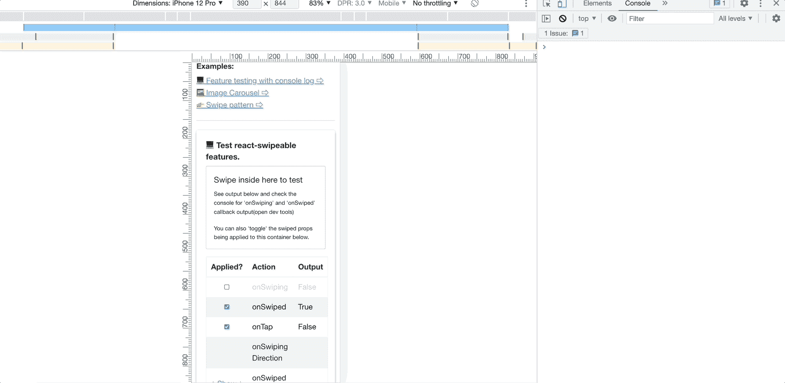
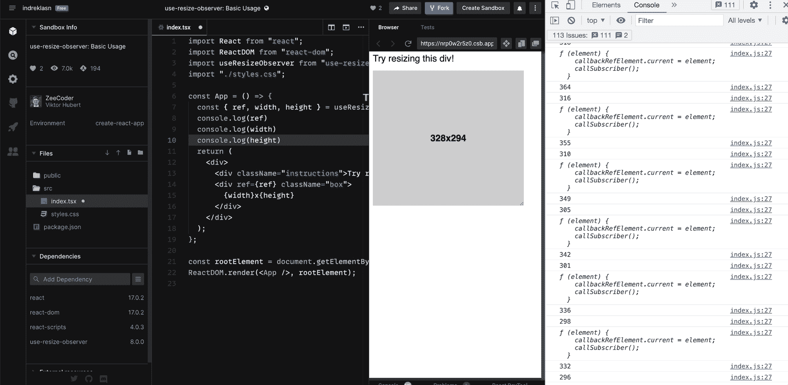
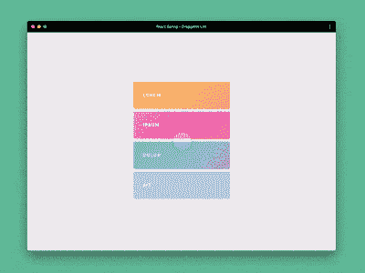
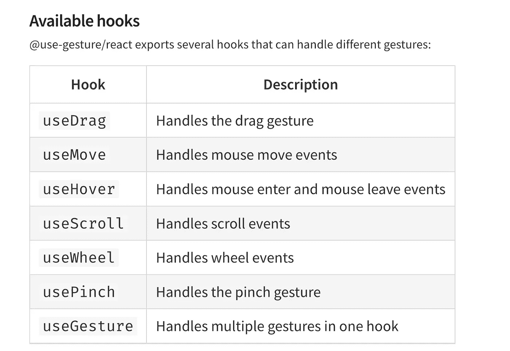
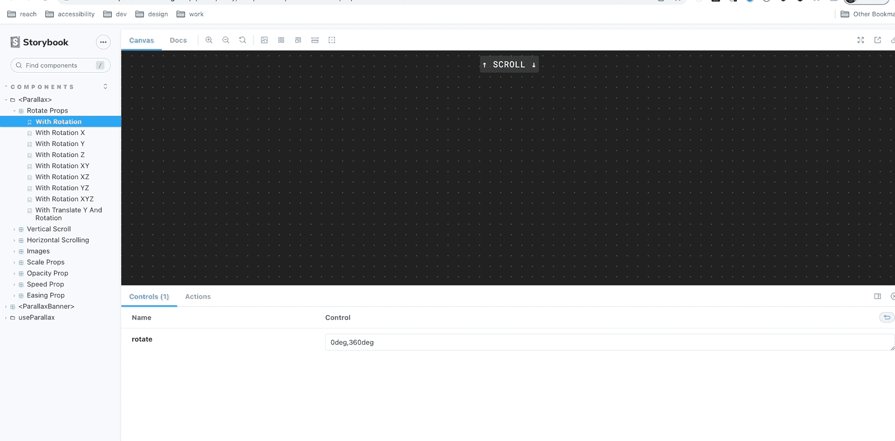
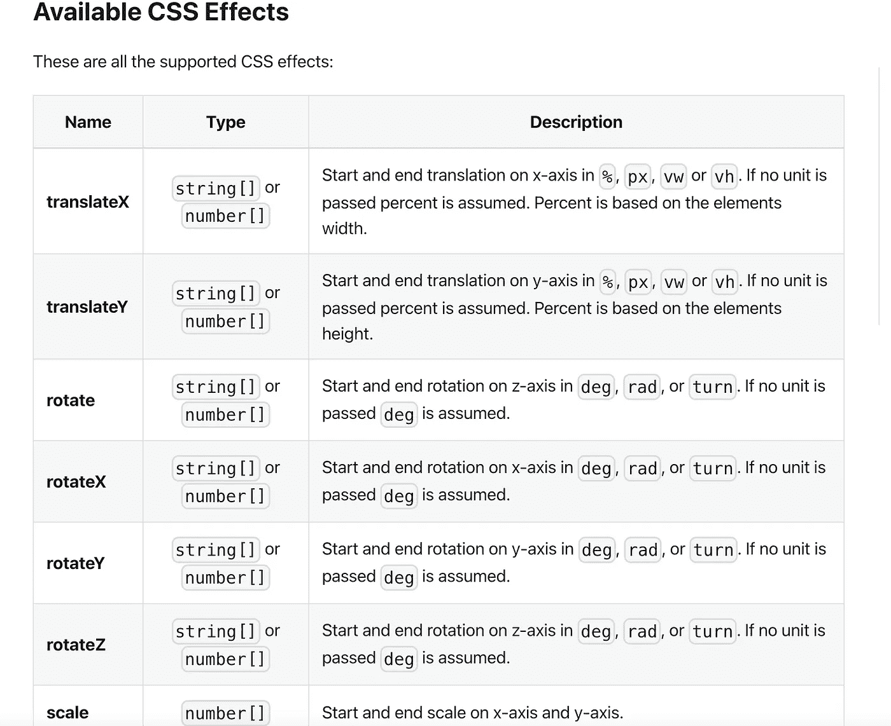

# 每个 React 开发者都应该知道的 12 个 React 挂钩

> 原文：<https://betterprogramming.pub/12-react-hooks-every-react-developer-should-know-9c6352b81329>

## 使用这些挂钩可以节省时间，提高效率。他们中的一些人是游戏规则的改变者


由[拉胡尔·米什拉](https://unsplash.com/@rahuulmiishra?utm_source=medium&utm_medium=referral)在 [Unsplash](https://unsplash.com?utm_source=medium&utm_medium=referral) 拍摄的照片

React 挂钩是功能中高度可重用的部分。钩子让我们封装副作用，组合和重用逻辑。

对于大多数用例，都有一个 react 挂钩。当我们今天可以开始使用如此大量的开源钩子时，为什么要重新发明轮子呢？

如果你是新手或者对钩子不确定，请看我以前的文章，我在那里揭开了 React 钩子的神秘面纱。

[通过使用我的推荐链接](https://trevorlasn.medium.com/membership)，您可以随时成为中级会员。你的会员费直接支持我和你看的其他作家。你也可以在媒体上看到所有的故事。

# 1.反应-可交换

React Swipeable 是一个 react swipe 事件处理程序挂钩。在某些情况下，React Swipeable 是构建移动优先 React 应用程序的必备工具。



[演示](http://formidablelabs.github.io/react-swipeable/)

假设你正在开发一个电子商务商店。您将希望在您的 web 应用程序上启用“本地”移动行为。

移动用户与应用程序的交互方式与网络用户大不相同。手机有触摸手势、滑动、放大和缩小等功能。为什么不为您的网络移动应用程序启用所有这些功能呢？

## 它是如何工作的

```
const handlers = useSwipeable({
  onSwiped: (eventData) => console.log("User Swiped", eventData),
  ...config,
});return <div {...handlers}> swipe here </div>;
```

以下是处理事件时可以使用的所有道具。

```
{
  onSwiped,       // After any swipe   (SwipeEventData) => void
  onSwipedLeft,   // After LEFT swipe  (SwipeEventData) => void
  onSwipedRight,  // After RIGHT swipe (SwipeEventData) => void
  onSwipedUp,     // After UP swipe    (SwipeEventData) => void
  onSwipedDown,   // After DOWN swipe  (SwipeEventData) => void
  onSwipeStart,   // Start of swipe    (SwipeEventData) => void *see details*
  onSwiping,      // During swiping    (SwipeEventData) => void
  onTap,          // After a tap       ({ event }) => void// Pass through callbacks, event provided: ({ event }) => void
  onTouchStartOrOnMouseDown, // Called for `touchstart` and `mousedown`
  onTouchEndOrOnMouseUp,     // Called for `touchend` and `mouseup`
}
```

有关集成和使用的信息，请参见 [react-swipeable](https://www.npmjs.com/package/react-swipeable) NPM 页面。

# 2.使用-调整大小-观察点

是一个 React 钩子，允许你测量一个元素的宽度和高度。



[CodeSandbox 演示](https://codesandbox.io/s/nrp0w2r5z0)

当处理图像裁剪、编辑、处理等时，这个钩子非常方便。

## 如何使用

[请参见 NPM 页面了解更多说明。](https://www.npmjs.com/package/use-resize-observer)

# 3.福米克

谈到表单，Formik 处理重复和乏味的部分。

它跟踪值、错误、访问过的字段、编排验证和处理提交——这些事情你再也不用处理了。花更少的时间连接状态和更改处理程序。

## 它是如何工作的

假设我们想为一个博客添加一个时事通讯注册表单。首先，我们的表单只有一个名为`email`的字段。对于 Formik，这只是几行代码。

[示例来源。](https://formik.org/docs/tutorial#a-simple-newsletter-signup-form)

有关集成和使用的信息，请参见 [Formik 文档](https://formik.org/docs/overview)页。

# 4.使用-去抖

JavaScript 中的去抖是一种用于提高浏览器性能的模式。

网页中可能存在一些需要耗时计算的功能。比如图片上传，多个 API 调用等等。

如果过于频繁地调用这些方法，将会极大地影响浏览器的性能。

去抖动是一种编程实践，可以确保耗时的任务不会频繁触发。

## 它是如何工作的

更多信息参见[使用去抖 NPM 页面](https://www.npmjs.com/package/use-debounce)。

# 5.使用-同构-布局-效果

React 有一堆现成的钩子。其中一个是`useLayoutEffect`

React 文档中提到了`useLayoutEffect`:

`useLayoutEffect` signature 与`useEffect`钩子相同——但是在所有 DOM 突变之后同步触发。

这意味着您只能使用`useLayoutEffect` hook 浏览器。如果您在服务器端呈现 react 代码，这是一个问题。例如，使用 [NextJS](https://nextjs.org/) ，您将得到以下错误消息:

警告:useLayoutEffect 在服务器上不执行任何操作，因为其效果无法编码为服务器渲染器的输出格式。

为了避免这种错误消息，应该只在客户端渲染的组件中使用`useLayoutEffect`。

`useIsomorphicLayoutEffect`通过根据执行环境在`useEffect`和`useLayoutEffect`之间切换来解决问题。

## 如何使用

```
+ import useIsomorphicLayoutEffect from 'use-isomorphic-layout-effect';- import { useLayoutEffect } from 'react';const YourComponent = () => {+  useIsomorphicLayoutEffect(() => {
   // your implementation
}, []);-  useLayoutEffect(() => {
    // your implementation
  }, []);};
```

更多信息见 [NPM 包页面](https://www.npmjs.com/package/use-isomorphic-layout-effect)。

# 6.swr

SWR 是一个用于数据获取的 React 钩子库。“SWR”这个名字来源于`stale-while-revalidate`

`stale-while-revalidate`是由 [HTTP RFC 5861](https://tools.ietf.org/html/rfc5861) 推广的一种缓存失效策略。

## 如何使用

```
import useSWR from 'swr'function Profile() {
  const { data, error } = useSWR('/api/user', fetcher)if (error) return <div>failed to load</div>
  if (!data) return <div>loading...</div>return <div>hello {data.name}!</div>}
```

SWR 首先从缓存返回数据(陈旧的)，发送请求(重新验证)，最后再次返回最新的数据。

显著简化项目中的数据提取逻辑。它还涵盖了速度、正确性和稳定性的所有方面，以帮助您构建更好的应用程序。

有了 SWR，所有组件将不断自动获得一系列数据更新。用户界面将是快速和反应性的。

在 [swr.vercel.app](https://swr.vercel.app/) 上查看完整文档和示例。

# 7.反应-热键-挂钩

`react-hotkeys-hook`用于在组件中使用键盘快捷键。钩子允许以声明的方式监听热键，并在用户按下给定的热键时执行回调函数。

它是如何工作的

```
import { useHotkeys } from 'react-hotkeys-hook';function ExampleComponent() {
  useHotkeys('a', () => alert('Key a was pressed'))return (
    <span>Press the a key to see it work.</span>
  )
```

`react-hotkeys-hook` 也听击键。击键是用户执行回调时必须按下的组合键。让我们想象我们的应用程序有功能的快捷方式。例如通过按下`shift+c`来创建吉拉机票。

[更多示例参见官方文档](https://react-hotkeys-hook.vercel.app/docs/documentation/useHotkeys/basic-usage)

# 8.@使用-手势/反应

@use-gesture 是一个库，允许您将更丰富的鼠标和触摸事件绑定到任何组件或视图。用得到的道具设置手势很简单。



一些应用程序默认需要手势，这是意料之中的。例如，如果你正在构建一个类似看板的应用程序，手势是必须的。

# 可用挂钩

@use-gesture/react 导出了几个可以处理不同手势的钩子。一定要把它们都检查一遍，以便深入了解。



[更多信息请访问完整文档网站](https://use-gesture.netlify.app/)

P.S .你可以独立使用它，但要充分利用它，你应该把它和一个像 [react-spring](https://github.com/pmndrs/react-spring) 这样的动画库结合起来。虽然你可以使用任何其他的。

# 9.反应脚本挂钩

`react-script-hook`是一个钩子，用于动态加载外部脚本并知道它何时被加载。非常适合使用第三方 API，如 Stripe、Twilio 等。

假设您正在使用 Stripe API 接受付款。我们不想在 API 还没有完全加载的情况下，让用户与支付交互，从而破坏我们的应用。这个钩子解决了前面提到的问题。

## 如何使用

当脚本已经从另一个钩子实例加载(或开始加载)时，钩子会自动处理。

您可以安全地将相同的`useScript`挂钩添加到依赖于相同外部脚本的多个组件，它们将正确地阻止只加载一个副本。

更多说明见 [NPM 包装文件](https://www.npmjs.com/package/react-script-hook)。

# 10. `react-scroll-parallax`

`react-scroll-parallax`是一个钩子，可以让你轻松地为横幅、图片或任何其他 DOM 元素设置视差滚动效果。



试玩来源:[https://react-scroll-parallax-v3.surge.sh/?path =/story/components-parallax-rotate-props-with-rotation](https://react-scroll-parallax-v3.surge.sh/?path=/story/components-parallax-rotate-props--with-rotation)

*视差滚动提供了理想的设置，以引人入胜和互动的方式讲述您的故事。让你的访问者掌握主动权，按照他们自己的节奏讲述你的故事。* — [来源](https://www.getfeedback.com/resources/ux/15-reasons-why-parallax-scrolling-in-web-design-is-awesome/#:~:text=Parallax%20scrolling%20offers%20the%20ideal,story%20in%20their%20own%20pace.)

## 如何使用

当元素滚动经过视区时，基于原始元素相对于视区的位置应用 CSS 翻译效果。

```
import { useParallax } from 'react-scroll-parallax';function Component() {
  const parallax = useParallax({
    speed: -10,
  });
  return <div ref={parallax.ref} />;
}
```

使用速度将自动应用 translateY CSS 样式(如果滚动轴是水平的，则应用 translate y CSS 样式)。

您可以使用[旋转道具](https://react-scroll-parallax.damnthat.tv/docs/usage/parallax-props#available-css-effects)围绕其轴旋转元素。使用`rotate`道具围绕 z 轴旋转一个元素。

```
const Component = () => {
  const parallax = useParallax<HTMLDivElement>({
    rotate: [0, 360],
  });
  return (
    <div ref={parallax.ref} className="spinner">
      😵‍💫
      <div className="diamond">💎</div>
      <div className="clown">🤡</div>
      <div className="money">💰</div>
      <div className="hand">👌🏻</div>
    </div>
  );
};[​](https://react-scroll-parallax.damnthat.tv/docs/usage/parallax-props#available-css-effects)
```



来源:[https://react-scroll-parallax . damn that . TV/docs/usage/parallax-props # available-CSS-effects](https://react-scroll-parallax.damnthat.tv/docs/usage/parallax-props#available-css-effects)

如需深入了解，请参见[其工作原理部分。](https://react-scroll-parallax.damnthat.tv/docs/examples/how-it-works)

# 11.反应-存储-挂钩

`react-storage-hooks` 用于保持应用状态与 localStorage 或 sessionStorage 同步。

这个库中包含的`useStorageState`和`useStorageReducer`钩子的工作方式类似于`[useState](https://reactjs.org/docs/hooks-reference.html#usestate)`和`[useReducer](https://reactjs.org/docs/hooks-reference.html#usereducer)`。不过，还是有一些不同之处。[请参见“操作方法”部分，进一步深入了解。](https://github.com/soyguijarro/react-storage-hooks#usage)

## 如何使用

# 12.@ chakra-ui/颜色模式

`@chakra-ui/color-mode`是一个 React 组件+钩子，使用`localStorage`和`matchMedia`增加了对亮模式和暗模式的支持。

我是黑暗主题的忠实粉丝。这个挂钩让用户可以很容易地在深色或浅色主题之间进行选择。

## 如何使用

将您的应用程序包装在`ThemeProvider`下面的`ColorModeProvider`中

```
import * as React from "react"
import { ColorModeProvider } from "@chakra-ui/color-mode"
import theme from "./theme"function App({ children }) {
  return (
    <ThemeProvider theme={theme}>
      <ColorModeProvider>{children}</ColorModeProvider>
    </ThemeProvider>
  )
}
```

接下来，在应用程序中使用钩子`useColorMode`。

```
function Example() {
  const { colorMode, toggleColorMode } = useColorMode()
  return (
    <header>
      <Button onClick={toggleColorMode}>
        Toggle {colorMode === "light" ? "Dark" : "Light"}
      </Button>
    </header>
  )
}
```

[参见本页了解更多说明。](https://www.npmjs.com/package/@chakra-ui/color-mode)

感谢阅读。你知道这里没有提到的很棒的钩子吗？请把你的知识写在评论里。我一定会偷看的！

[使用我的推荐链接](https://trevorlasn.medium.com/membership)随时成为中级会员。你的会员费直接支持我和你看的其他作家。你也可以在媒体上看到所有的故事。