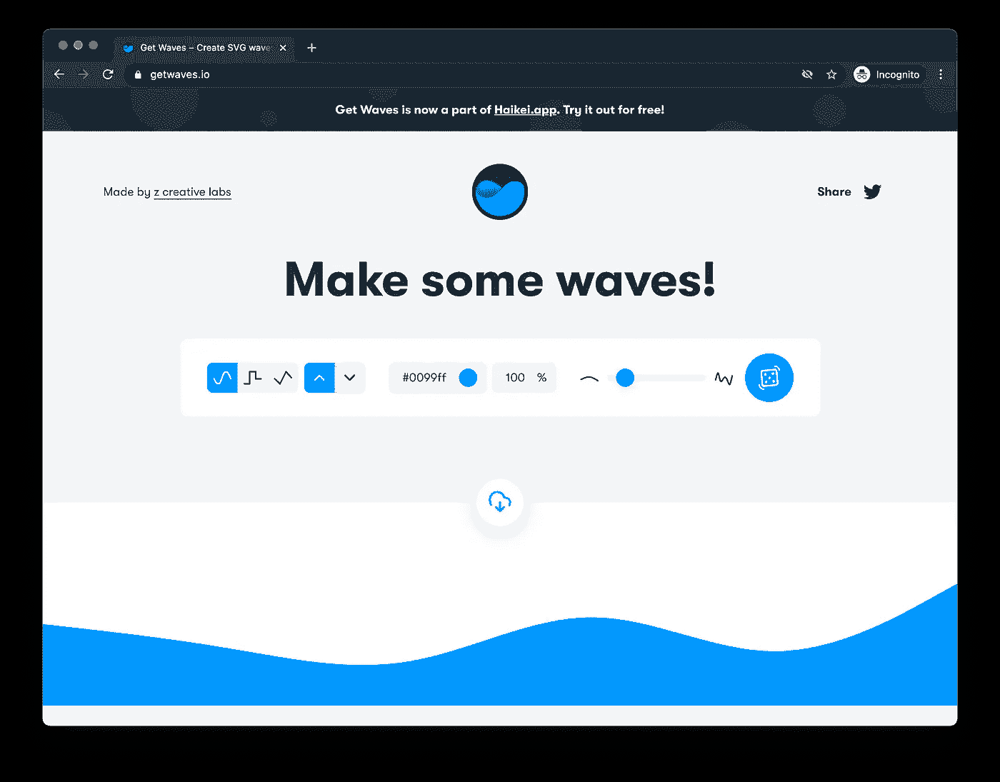
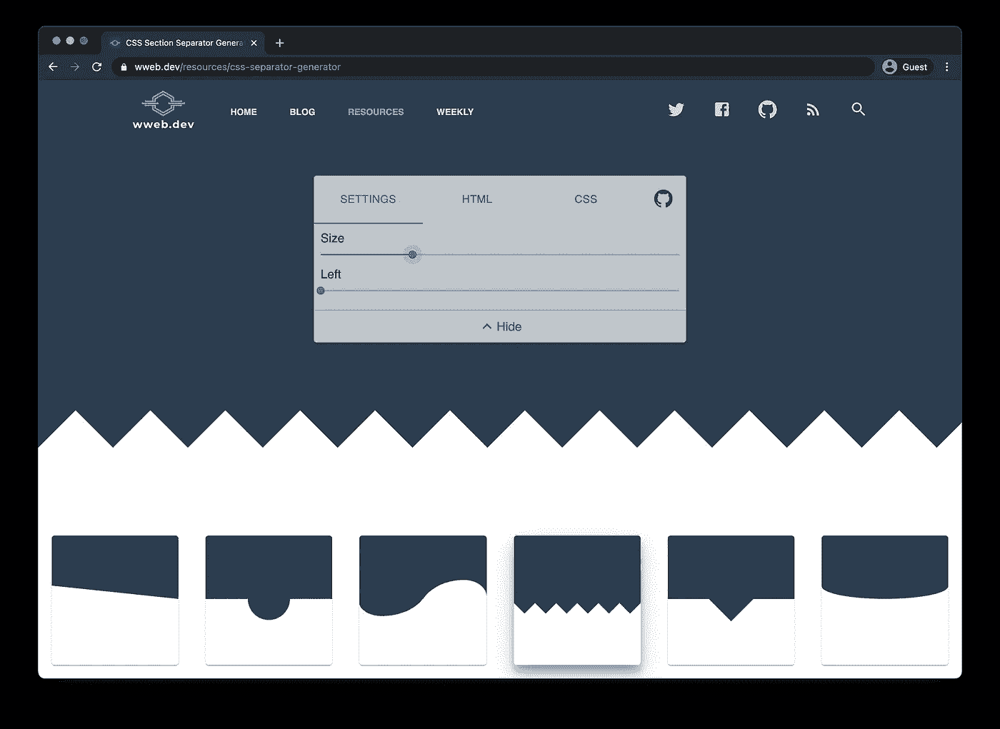
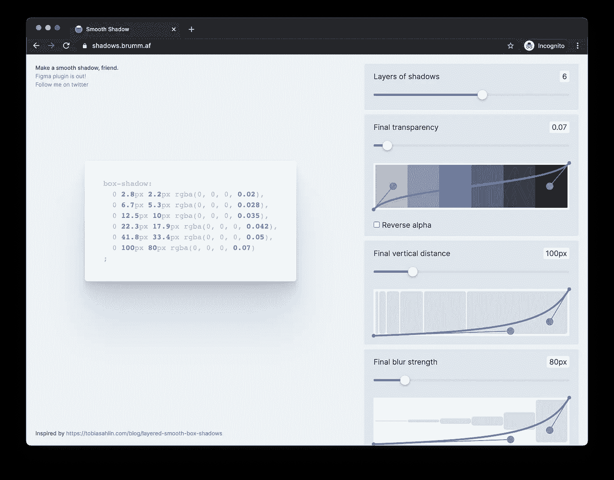
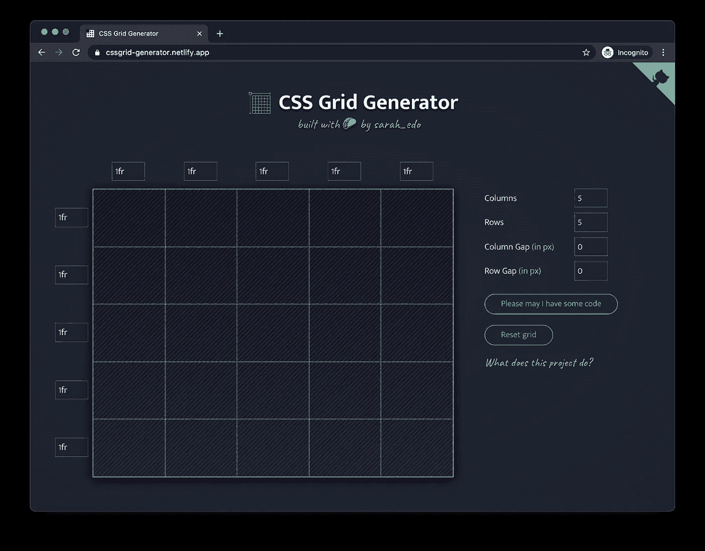
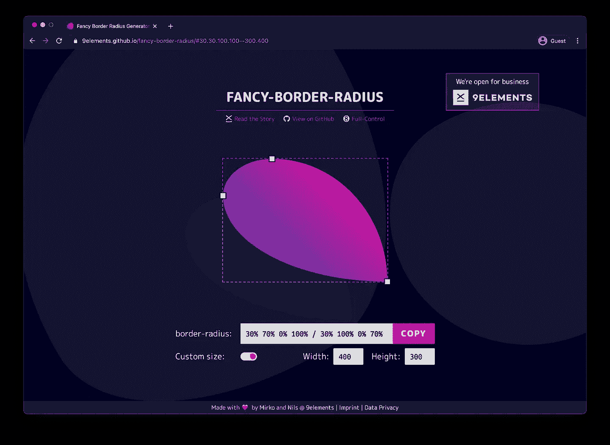
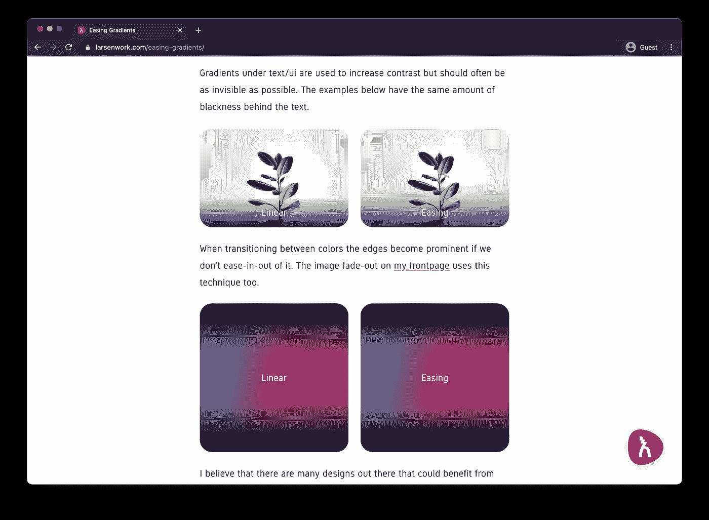

# 增强你的 CSS 技能和加速开发的 12 种资源

> 原文：<https://betterprogramming.pub/12-resources-to-enhance-your-css-skills-and-speed-up-development-eed08f24bed0>

## 帮助您提高 CSS 技能和节省时间的资源


[KOBU 社](https://unsplash.com/@kobuagency?utm_source=medium&utm_medium=referral)在 [Unsplash](https://unsplash.com?utm_source=medium&utm_medium=referral) 上的照片。

在这篇文章中，你会发现一个包含 12 种资源的列表，它将帮助你提高你的 CSS 技能并加速 CSS 开发。

其中一些是学习资源，可以帮助你理解 CSS 的基本原理，而另一些是生成器，可以帮助你节省时间！事不宜迟，我们开始吧！

# 1.超棒的 CSS 学习

[Awesome CSS Learning](https://github.com/micromata/awesome-css-learning) 是一个 GitHub 资源库，包含了令人惊叹的 CSS 学习资源的链接。这个资源主要是关于语言和它的模块。

您可以找到学习概念的链接，例如:

*   基本概念
*   CSS 单位
*   选择器
*   自定义属性(又名 CSS 变量)
*   布局
*   动画
*   有关系的

如果您正在寻找学习 CSS 基础知识的资源，这个资源库非常棒！

# 2.CSS 波发生器

这个 CSS 生成器允许你创建 SVG 波，你可以以任何方式使用它。

您可以选择:

*   波浪的形状。
*   方向。
*   颜色。
*   不透明。
*   “曲线”



照片来自 [Get Waves](https://getwaves.io/) 。

这是一个很好的、方便的工具，你可以用它来为你的网站生成一些分隔线或图片。

# 3.CSS 的魔力

[这个 GitHub 仓库](https://github.com/adamschwartz/magic-of-css)就是 CSS 网站的[魔法背后的仓库。根据 GitHub 的描述，这是一门为想成为“魔术师”的 web 开发人员开设的 CSS 课程。](https://adamschwartz.co/magic-of-css/)

CSS 的魔力课程分为六章:

*   第一章:盒子
*   第 2 章:布局
*   第 3 章:表格
*   第四章:颜色
*   第五章:字体设计
*   第 6 章:过渡

本质上，这个课程教你 CSS 的基础知识。这门课最大的好处之一是它包含了更多材料的链接。例如，如果你想了解更多的概念，你可以使用链接资源。

# 4.CSS 分隔符生成器

用风格分割你的网站部分！[这个 CSS 生成器](https://wweb.dev/resources/css-separator-generator)允许你生成漂亮的分段分隔符。

你可以定制分离器，并看到实时预览。一旦你决定使用什么分隔符，网站就会给你 HTML 和 CSS。



图片来自 [wweb.dev](https://wweb.dev/resources/css-separator-generator) 。

上面的截屏显示了运行中的生成器。这是一个超级方便的工具，可以改善你的网站设计！

# 5.旋转套件

SpinKit 是一个 CSS 包，允许你使用简单的动画加载微调器。它只使用`transform`和`opacity`来创建流畅、好看、易于定制的动画。

要使用 SpinKit，你必须通过`bower`或`npm`安装它。之后，你要做的就是为你的动画使用你想要的类。例如，如果你希望使用“脉冲”动画，你需要使用`sk-pulse`类:

```
<div class="sk-pulse">
.... your code
</div>
```

是一个很好用的 CSS 包，在 [SpinKit 官网](https://tobiasahlin.com/spinkit/)可以看到所有的动画。在使用之前，您可以测试所有的动画，看看它们看起来如何。

# 6.阴影发生器

[这个阴影生成器](https://shadows.brumm.af/)应用程序允许你创建和定制阴影(`box-shadow`)。下面看一张有发电机的图！



阴影生成器的屏幕截图。

您可以自定义:

*   层层阴影。
*   最终透明度。
*   最终垂直距离。
*   最终模糊强度。
*   传播

这是一个很好的资源，因为你可以实时看到阴影的样子。如果你想创造美丽的阴影，我推荐使用这个生成器。

# 7.CSS 悬停

CSS Hover 包是你在链接、按钮、徽标、SVG 等等上使用的悬停效果的集合。你可以随意使用和修改它们！

您可以通过三种方式使用该软件包:

*   通过 npm 安装。
*   通过鲍尔安装。
*   直接下载 CSS 文件。

如果你不想安装它或添加所有的动画到你的项目，只需打开 CSS 文件，只复制你想要的效果。你可以在[官网](http://ianlunn.github.io/Hover/)上查看每一个悬停效果。

# 8.CSS 网格生成器



照片来自 [CSS 网格生成器](https://cssgrid-generator.netlify.app/)。

CSS 网格生成器允许你创建一个定制的 CSS 网格。您可以指定列数和行数。此外，您可以以像素为单位设置列间距和行间距。

除了说它太棒了之外，没有什么可说的了。见上图应用。

# 9.超赞的 CSS

Awesome CSS 库是 CSS 资源的精选列表。根据它的描述，这是一个“令人敬畏的框架、风格指南和其他用于编写惊人的 CSS 的酷金块”的列表

需要注意的是，它不包括学习 CSS 的材料。该资源推荐给已经了解 CSS(至少是基本知识)的人。

您可以在该存储库中找到有关以下主题的信息:

*   分析器
*   预处理器
*   结构
*   工具包
*   CSS 结构

…以及更多。值得一查！

# 10.CSS 剪辑路径生成器

> 通过 clip-path 属性，您可以将元素剪辑为基本形状(圆形、椭圆形、多边形或插图)或 SVG 源，从而在 CSS 中制作复杂的形状— [CSS 裁剪路径生成器](https://bennettfeely.com/clippy/)

因此， [CSS 剪辑路径生成器](https://bennettfeely.com/clippy/)允许你生成剪辑路径值来增加你的网站的趣味！您可以在下面看到运行中的生成器:


图片来自 [CSS 剪辑路径生成器](https://bennettfeely.com/clippy/)。

# 11.花式边框生成器

告别无聊的边框。从现在开始，你可以使用[这个边框生成器](https://9elements.github.io/fancy-border-radius/)来创建一些漂亮的边框！



图片来自[花式边框半径生成器](https://9elements.github.io/fancy-border-radius/)。

你可能会问，“这怎么可能？”这是可能的，因为通过为`border-radius`属性指定八个值，您可以构建看起来有机的形状。发电机太牛了！

# 12.梯度发生器

通常的线性梯度在其开始和/或结束处具有硬边缘。然而，你可以通过[放松它们](https://larsenwork.com/easing-gradients/)使它们看起来更平滑。

下图说明了线性渐变和已缓和渐变之间的差异。你可以看到，缓和线性梯度，使它看起来更好！



照片来自[渐变](https://larsenwork.com/easing-gradients/)。

需要注意的是，它还不是一个 CSS 特性。你可以使用 PostCSS/Figma 插件或者网站上的编辑器。

# 结论

我希望这些 CSS 资源对你有用。还有，如果你有其他建议，在下面的评论里留下吧！

*如果对 JavaScript 教程感兴趣，我推荐* [*前端高手*](https://catalins.tech/frontend-masters-membership-is-it-worth-it) *！*

*如果你想用技术写作赚钱，就去查查* [*那些付钱让你写*](https://catalins.tech/websites-that-pay-you-to-write-technical-articles) *技术文章的网站吧！*

*如果你想学习 JavaScript，我推荐这些* [*5 资源作为初学者学习 JavaScript*](https://catalins.tech/5-best-resources-to-learn-javascript-as-a-beginner)*！*

*谈判你的工资是必不可少的——学习* [*作为一名开发者如何谈判你的工资*](https://catalins.tech/how-to-negotiate-your-salary-as-a-developer) *！*

*用* [*Git 别名*](https://catalins.tech/git-aliases-what-are-they-and-how-to-use-them) *加速你的开发。*

*如果你想* [*以开发者身份开博客*](https://catalins.tech/how-to-start-your-blog-as-a-developer) *，我推荐你阅读《* [*如何以开发者身份开博客*](https://catalins.tech/how-to-start-your-blog-as-a-developer) *》一文！*

你是否很难跟上科技领域的最新消息？参见 [*作为开发者保持最新状态的一种方法*](https://catalins.tech/one-way-to-stay-up-to-date-as-developer) *！*

*学习* [*如何在 JavaScript*](https://catalins.tech/how-to-use-asyncawait-in-javascript) *中使用 Async/Await！*

GitHub 简介目前风靡一时。了解 [*如何创建 GitHub 个人资料页面*](https://catalins.tech/how-to-create-a-kickass-github-profile-page) *！*

*查看这 7 个* [*资源，帮你通过求职面试*](https://catalins.tech/7-github-repositories-to-help-you-crush-your-job-interviews) *！*

*查看* [*新特性 JavaScript ECMAScript 2021 es 2021*](https://catalins.tech/javascript-es2021-you-need-to-see-these-ecmascript-2021-features)*！*

*你是初学程序员吗？查看这些* [*编程项目思路*](https://catalins.tech/10-programming-project-ideas-for-beginners) *！*

你是在学习编码还是打算做编码？查看 [*免费学习编程的最佳地点*](https://catalins.tech/20-best-places-to-learn-programming-for-free) *！*

[*用这 9 个浏览器扩展提高你的开发者生产力*](https://catalins.tech/my-9-must-have-browser-extensions-for-increased-developer-productivity) *！*

*如果你是 Node.js 的开发者，我建议你去 Node.js* *查看一下这些* [*4 个创造性的设计模式！*](https://catalins.tech/the-4-creational-design-patterns-in-nodejs-you-should-know)

*查看这些惊人的*[*JavaScript ECMAScript 2020 特性*](https://catalins.tech/javascript-es2020-the-features-you-should-know) *！*