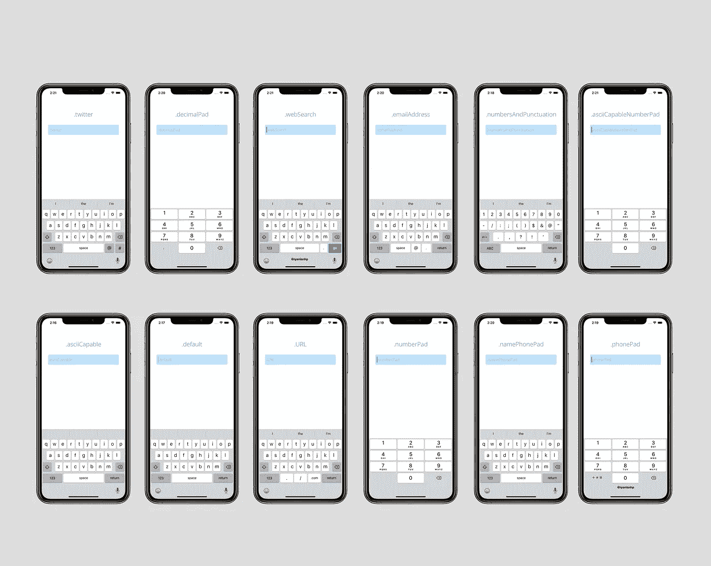
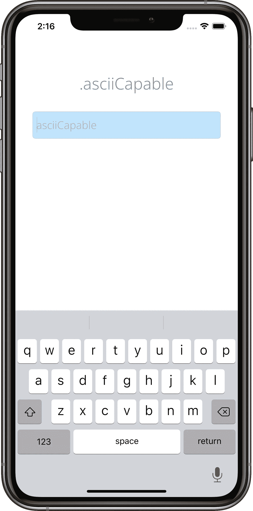
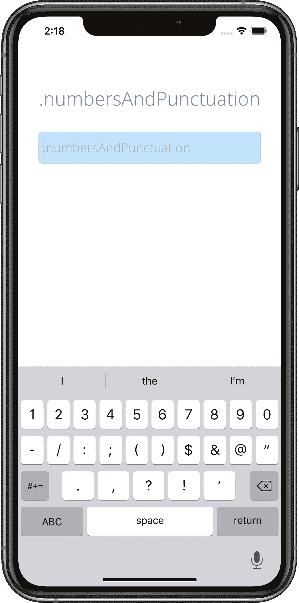
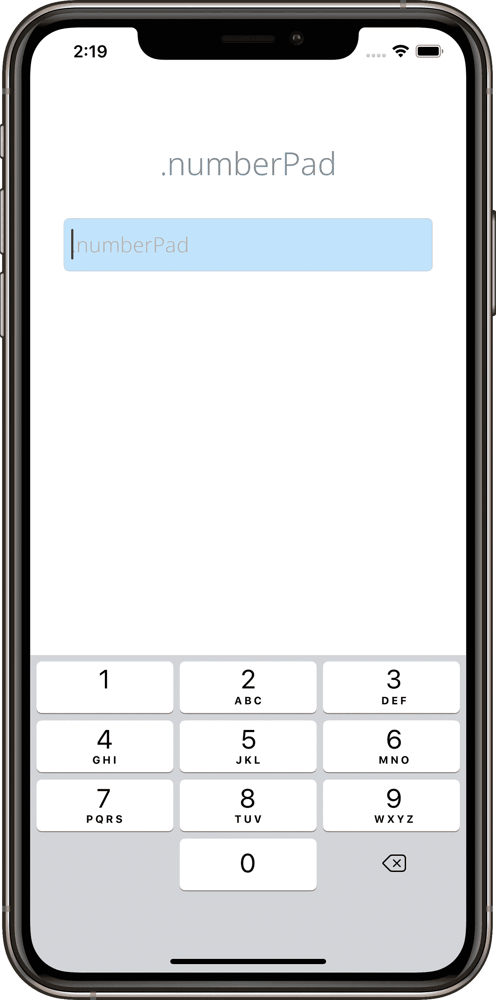
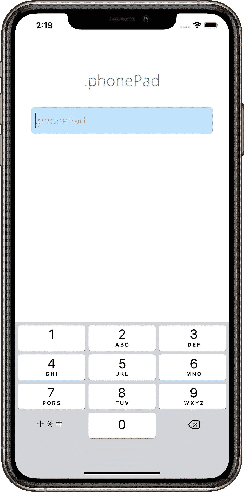
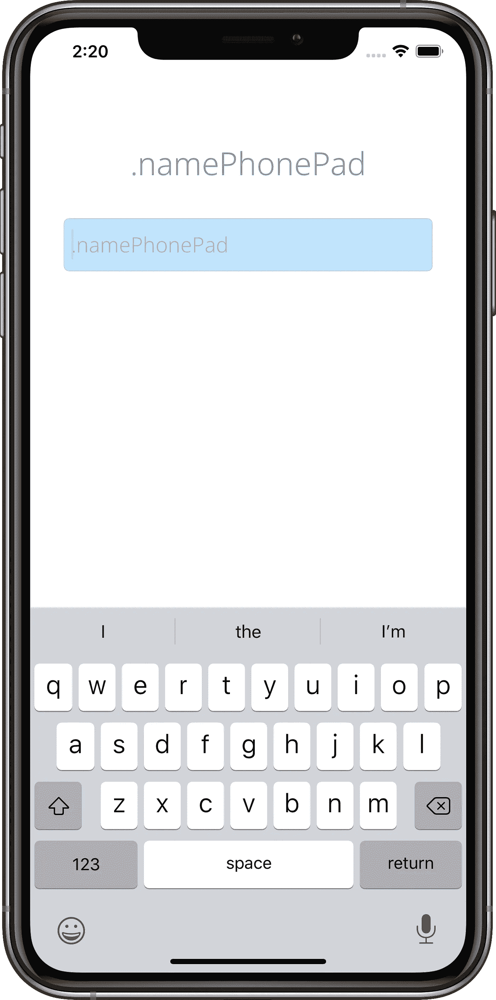
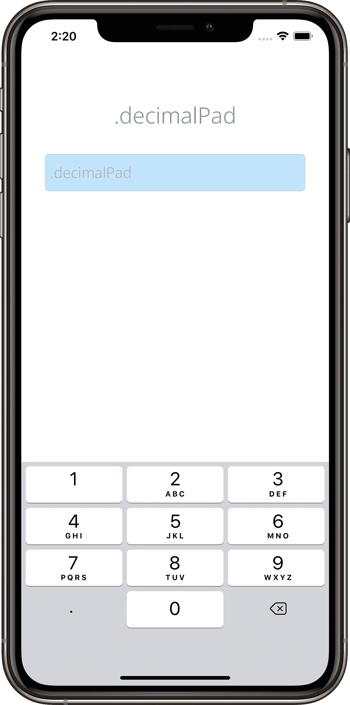
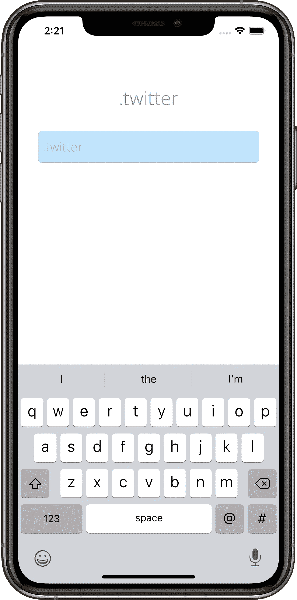
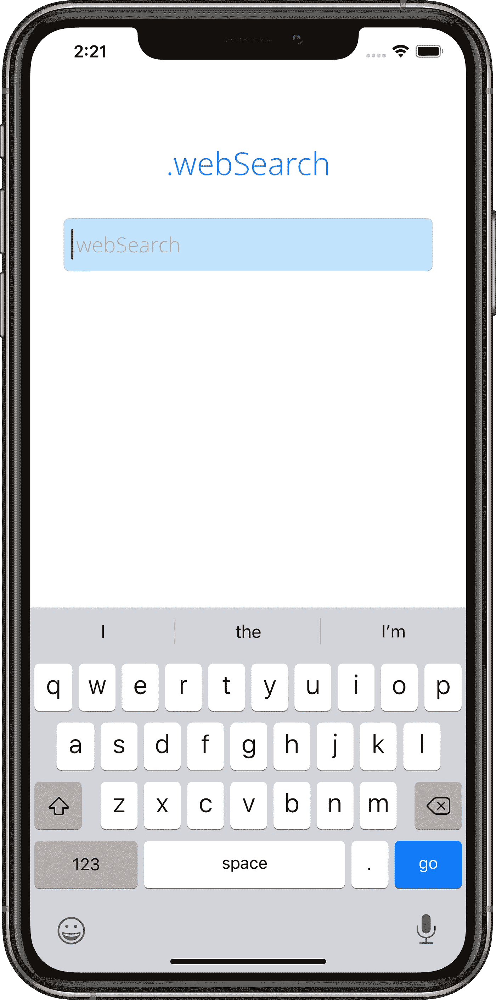
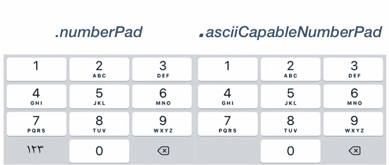

# iOS 中的 12 种键盘类型

> 原文：<https://betterprogramming.pub/12-shades-of-keyboard-types-in-ios-a413cf93bf4f>

## 所有 iOS 键盘类型都在一个地方

根据苹果的[文档](https://developer.apple.com/documentation/uikit/uikeyboardtype)，我们有 12 种 iOS 键盘。现在，让我们看一下所有的，我已经用截图把它们记下来了，以便于理解。

# **1。。默认**

指定当前输入法的默认键盘。

# `2\. .asciiCapable`

指定显示标准 ASCII 字符的键盘。

您不能使用此键盘类型输入表情符号。

# 3.。数字和标点符号

指定数字和标点键盘。

# 4.。统一资源定位器

指定为 URL 输入优化的键盘。这种键盘类型突出了句号(。)和斜杠(/)字符以及*。com* 字符串。

# 5.。**数字键盘**

指定为 PIN 输入而设计的数字键盘。这种键盘的突出特点是数字 0 到 9。这种键盘类型不支持自动大写。

# 6.。电话本

指定为输入电话号码而设计的键盘。这种键盘类型的突出特点是数字 0 到 9 以及*和#字符。这种键盘类型不支持自动大写。

# 7.。姓名电话本

指定为输入人名或电话号码而设计的键盘。这种键盘类型不支持自动大写。

# 8.。电子邮件地址

指定为输入电子邮件地址而优化的键盘。这种键盘类型的突出特点是 at (@)、句点(。)，以及空格字符。

# 9.。十进制帕德

指定带有数字和小数点的键盘。

# 10.。推特

指定一个针对 Twitter 文本输入优化的键盘，可以轻松访问at (@)和 hash (#)字符。

# 11.。网络搜索

指定为 web 搜索词和 URL 输入优化的键盘。这种键盘类型突出了空格和句号(.)人物。

您还可以将*转到*按钮作为返回按钮。

# 12.。asciiCapableNumberPad

指定仅输出 ASCII 数字的数字键盘。

注意:这仅在 iOS 10.0 或更新版本中可用。

如果你看看。*数字键盘*和。 *asciiCapableNumberPad* ，你可能会明白两者是一样的，但是当你使用阿拉伯语键盘、卡纳达语键盘、康卡尼语键盘时，你会看到它们的区别，如下图所示。

除了这些之外，我们还有第 13 种类型，即`**.**alphabet`，但它已被弃用，所以我不打算介绍它。

感谢阅读！

# **参考文献**

 [## UIKeyboardType

### 指定为输入电话号码而设计的键盘。这种键盘类型突出了数字到…

developer.apple.com](https://developer.apple.com/documentation/uikit/uikeyboardtype)